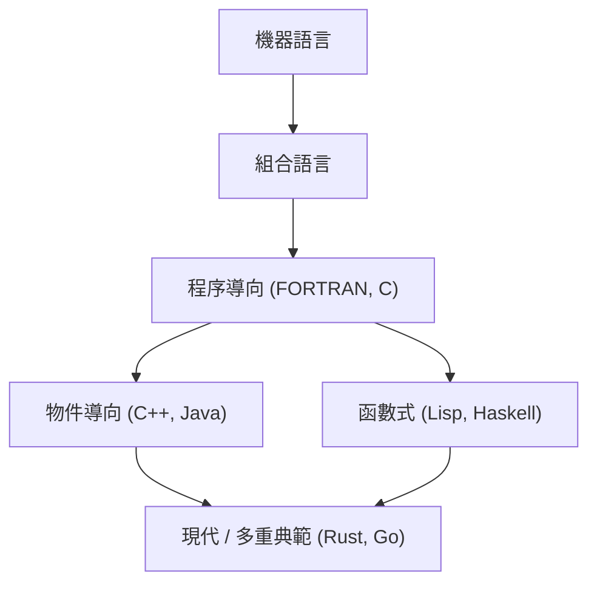
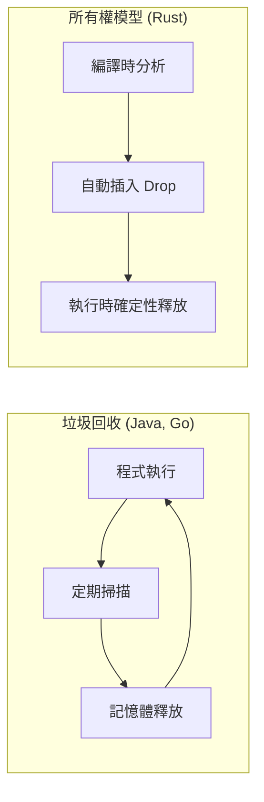

程式語言的歷史，就是人類如何與計算機這個魔法盒子對話，以及如何馴服複雜性的歷史。
本文將從組合語言開始，歷經 C 語言、Java，直到引領現代系統程式設計的 Rust 與 Go，極其詳細且有系統地解說程式語言的歷史及其根基中 **典範** 的演進。

## 1. 程式語言的黎明期：從機器語言到組合語言

在電腦誕生的初期，程式設計師使用 **機器語言（Machine Code）** 直接對硬體下達指令。機器語言是由「0」與「1」組成的位元字串，對人類來說過於艱澀難懂且難以直接撰寫，非常容易引發錯誤。

因此，**組合語言（Assembly Language）** 應運而生。組合語言是將機器語言的指令（運算碼）分配給人類容易記憶的簡短字串（助憶碼）。例如，將移動資料的指令命名為 `MOV`，將加法的指令命名為 `ADD`。

```assembly
; 組合語言範例 (x86)
section .text
global _start

_start:
    mov edx, len    ; 指定訊息的長度
    mov ecx, msg    ; 指定訊息的位址
    mov ebx, 1      ; 指定標準輸出
    mov eax, 4      ; sys_write 的系統呼叫號碼
    int 0x80        ; 呼叫核心

    mov eax, 1      ; sys_exit 的系統呼叫號碼
    int 0x80        ; 呼叫核心

section .data
msg db 'Hello, World!', 0xa
len equ $ - msg
```

組合語言的出現使程式設計師的生產力得到了戲劇性的提升，但依然存在強烈依賴硬體架構（CPU 指令集）的問題。為了在不同的 CPU 上執行，必須從頭開始重新撰寫程式碼。


## 2. 結構化程式設計與程序導向語言：C 語言的誕生

為了實現與硬體無關的程式設計，高階語言隨之登場。FORTRAN 與 COBOL 等便是其中的先驅。然而，隨著程式規模的擴大，被稱為「義大利麵條式程式碼」這種難以追蹤控制流程的程式碼開始蔓延。這主要是因為過度且無序地使用 `GOTO` 陳述式所導致的。

解決這個問題的是 **結構化程式設計** 的典範。Edsger W. Dijkstra 等人提倡，程式只需使用「循序」、「選擇（if）」、「重複（while/for）」這三種基本的控制結構即可撰寫。

體現了這種結構化程式設計典範，並進一步為系統程式設計帶來革命的，是 1972 年由 Dennis Ritchie 所開發的 **C 語言**。

C 語言是為了撰寫 UNIX 作業系統而誕生的。它具備接近組合語言的低階記憶體存取能力（如指標等），同時又擁有不依賴硬體的可攜性。

```c
#include <stdio.h>

// 結構化程式設計範例：計算階乘
int factorial(int n) {
    int result = 1;
    for (int i = 1; i <= n; i++) {
        result *= i;
    }
    return result;
}

int main() {
    int num = 5;
    printf("Factorial of %d is %d\n", num, factorial(num));
    return 0;
}
```

C 語言的成功，讓「程序導向程式設計」長久以來成為了程式設計的標準典範。然而，隨著系統進一步變得巨大且複雜，資料與操作它的程序（函式）分離所導致的可維護性下降，成為了新的課題。


## 3. 物件導向的崛起：應對複雜性與 Java 的出現

將資料與程序整合在一起，將程式塑造為「物件」之間互動的模型的 **物件導向程式設計（[OOP](https://kenji.blog/zh-tw/p/object-oriented-programming-oop-solid-principles/)）** 典範開始受到矚目。

Simula 與 Smalltalk 等語言奠定了 OOP 的概念，而在 C 語言中加入 OOP 功能的 **C++** 則得到了廣泛的普及。然而，C++ 抱有複雜的語言規格，以及使用指標管理記憶體的困難性（如記憶體流失與記憶體區段錯誤等）等問題。

1995 年，昇陽電腦（現為 Oracle）發布了 **Java**。Java 標榜「Write Once, Run Anywhere（一次編寫，到處執行）」的口號，透過在 Java 虛擬機（JVM）上執行，實現了完全的平台無關性。

Java 最大的特色在於，它剔除了 C++ 複雜的功能，被設計為一種純粹的物件導向語言，並且引入了 **垃圾回收（GC）** 機制。這使得程式設計師從繁瑣的記憶體釋放工作中解放出來。

```java
// Java 中的物件導向範例
public class Animal {
    private String name;

    public Animal(String name) {
        this.name = name;
    }

    public void speak() {
        System.out.println(this.name + " makes a sound.");
    }
}

public class Dog extends Animal {
    public Dog(String name) {
        super(name);
    }

    @Override
    public void speak() {
        System.out.println("Woof!");
    }

    public static void main(String[] args) {
        Animal myDog = new Dog("Buddy");
        myDog.speak(); // 將輸出 "Woof!"
    }
}
```

Java 的出現，使物件導向在企業級系統的大規模開發中成為了絕對的主流典範。

在此，我們來將程式語言的演進視覺化。




## 4. 網際網路時代與典範的多樣化

2000 年代以後，隨著 Web 的普及，腳本語言（Python、Ruby、JavaScript 等）開始崛起。這些語言重視開發速度，提供了動態型別以及豐富的內建資料結構。
同時，將計算塑造為對無狀態函數之評估的 **函數式程式設計** 典範（如 Haskell 與 Scala 等），也因為易於進行平行處理而重新受到肯定。

函數式程式設計中 Lambda 演算的基礎理論，是建立在以下數學算式所表示的函數套用與抽象化之上的。

$$
\text{Lambda 運算式： } e ::= x \mid \lambda x.e \mid e\ e
$$

具備數學嚴謹性的函數式語言，是圍繞著無副作用的純函數所建構的，具有容易撰寫出不易產生 Bug 且堅固的程式碼的優勢。

## 5. 現代的系統程式設計：Rust 與 Go 的登場

隨著雲端運算與多核心 CPU 的普及，現代的程式語言開始被同時要求具備「高效能」、「平行處理的容易性」以及「記憶體安全性」。為了回應這項需求而出現的，便是 **Go** 與 **Rust**。

### 5.1. Go 語言：簡潔性與強大的平行處理

由 Google 所開發的 **Go**，雖然是一種系統程式語言，卻兼具了如 C 語言般的簡潔性與如動態語言般的易寫性。
Go 最大的特色，在於採用了由 **Goroutine** 與 **Channel** 組成的 CSP（Communicating Sequential Processes）模型來進行平行處理。

```go
package main

import (
	"fmt"
	"time"
)

// 工作者函式
func worker(id int, jobs <-chan int, results chan<- int) {
	for j := range jobs {
		fmt.Printf("Worker %d started job %d\n", id, j)
		time.Sleep(time.Second) // 模擬處理過程
		fmt.Printf("Worker %d finished job %d\n", id, j)
		results <- j * 2
	}
}

func main() {
	jobs := make(chan int, 100)
	results := make(chan int, 100)

	// 啟動 3 個工作者（Goroutine）
	for w := 1; w <= 3; w++ {
		go worker(w, jobs, results)
	}

	// 傳送 5 個工作
	for j := 1; j <= 5; j++ {
		jobs <- j
	}
	close(jobs)

	// 接收結果
	for a := 1; a <= 5; a++ {
		<-results
	}
}
```

Go 擁有垃圾回收機制，自動化了記憶體的管理，但其執行速度依然非常快速，在微服務與雲端基礎設施（如 Kubernetes 與 Docker 等）的開發中已經成為了事實上的標準語言。

### 5.2. Rust：基於所有權系統的極致記憶體安全性

由 Mozilla 主導開發的 **Rust**，是一種兼顧了「與 C 或 C++ 同等的效能」與「完全的記憶體安全性」的劃時代語言。Rust 沒有垃圾回收機制，而是透過在編譯時驗證 **「所有權（Ownership）」、「借用（Borrowing）」、「生命週期（Lifetime）」** 等獨特概念，來防患資料競爭與記憶體流失等 Bug 於未然。

```rust
fn main() {
    let s1 = String::from("hello");
    // 當 s1 的所有權移動（Move）到函式 calculate_length 後，之後就無法再使用 s1 了。
    // 因此，我們傳遞參考（借用）。
    let len = calculate_length(&s1);

    println!("The length of '{}' is {}.", s1, len);
}

// 接收參考（不奪取所有權）
fn calculate_length(s: &String) -> usize {
    s.len()
}
```

Rust 的記憶體管理模型與垃圾回收（GC）的比較顯示在下圖中。



Rust 因為其安全性，在 OS 核心的開發（導入至 Linux 核心）、瀏覽器引擎、區塊鏈技術等極度要求高可靠性的領域中正被迅速地採用。

## 6. 典範的融合與未來的展望

現代的程式語言不再受限於單一典範，而是朝向汲取多種典範優秀功能的 **多重典範** 化發展。

例如，Rust 與 Go 引入了函數式程式設計的元素（如閉包、高階函數等），而 Java 與 C++ 也在後續版本中加入了函數式的功能（如 Lambda 運算式等）。

程式設計典範的演進，強烈地受到了計算機硬體演進（如從單核心轉變為多核心等）以及待解決問題性質（如從單機應用程式轉變為分散式系統等）的影響。

正如阿姆達爾定律（Amdahl's Law）所指出的，透過平行化來提升效能是有極限的。

$$
\text{加速比} = \frac{1}{(1 - P) + \frac{P}{N}}
$$
（其中，$P$ 為可平行化處理的比例，$N$ 為處理器數量）

為了突破這項極限，並將多核心的效能發揮到極致，提供安全且高效率的平行處理模型的 Rust 與 Go 成為了主流。

## 7. 結論

從使用組合語言直接與硬體對話開始，歷經 C 語言帶來的結構化與可攜性、Java 帶來的物件導向與記憶體管理抽象化，直到 Rust 與 Go 對平行處理與安全性的追求，程式語言不斷地在進化。

**學習新的語言，就是學習新的思考框架（典範）。** 透過理解 Rust 的所有權系統或 Go 的 CSP 模型，在撰寫 C 語言或 Java 時，也能設計出更安全且平行度更高的架構吧。

回顧歷史，將成為預測未來技術潮流的最佳指南針。程式語言的旅程，今後也將永不停止。
