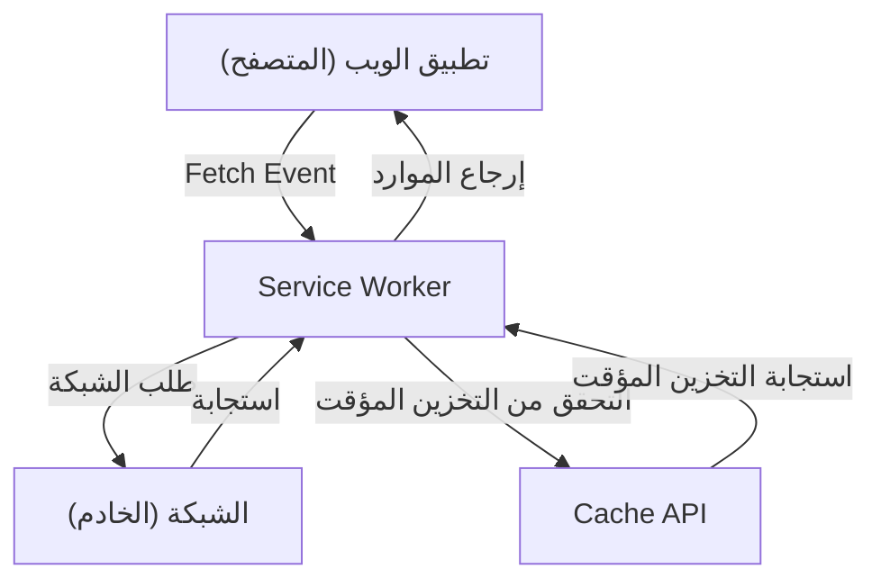

## 1. مقدمة: تطور تطبيقات الويب

بدأت تطبيقات الويب بتقديم صفحات HTML ثابتة في البداية، وتطورت مع تقدم JavaScript لتقدم تجربة مستخدم ديناميكية وغنية (UX) من خلال تطبيقات الصفحة الواحدة (SPA). ومع ذلك، لفترة طويلة، كانت هناك فجوة كبيرة بين تطبيقات الويب والتطبيقات الأصلية (تطبيقات iOS و Android)، حيث كانت تطبيقات الويب "لا تعمل في وضع عدم الاتصال"، و"لا تحتوي على إشعارات الدفع مثل التطبيقات الأصلية"، و"لا يمكن إضافتها إلى الشاشة الرئيسية".

لردم هذه الفجوة وتقديم ميزات قوية وتجربة مستخدم ممتازة لتطبيقات الويب مشابهة للتطبيقات الأصلية، ظهرت تقنية **تطبيقات الويب التقدمية (Progressive Web Apps - PWA)**. في هذا المقال، سنشرح بالتفصيل مفهوم PWA، بالإضافة إلى التقنية الأساسية وراءها وهي **Service Worker**، ودورة حياتها، واستراتيجيات التخزين المؤقت المتنوعة.

## 2. الفجوة بين التطبيقات الأصلية وتطبيقات الويب

كانت هناك ثلاث فجوات رئيسية بين التطبيقات الأصلية وتطبيقات الويب التقليدية:

1.  **الاعتماد على الشبكة (العمل بدون اتصال)**: بمجرد تثبيت التطبيق الأصلي، حتى في حالة عدم وجود شبكة (وضع عدم الاتصال)، يمكنك على الأقل فتح التطبيق وعرض البيانات المخزنة مؤقتًا. من ناحية أخرى، في تطبيقات الويب التقليدية، إذا لم تتمكن من الاتصال بالشبكة، فسترى فقط أيقونة الديناصور في المتصفح (خطأ في عدم الاتصال).
2.  **التفاعل (إشعارات الدفع، إلخ)**: يمكن للتطبيقات الأصلية استخدام ميزات نظام التشغيل لإرسال إشعارات الدفع وتشجيع المستخدمين على العودة للتطبيق.
3.  **تجربة مستخدم متكاملة (UX)**: التطبيقات الأصلية موجودة كأيقونات على الشاشة الرئيسية، ويمكن فتحها بملء الشاشة، وتتمتع بوصول عميق إلى ميزات أجهزة الجهاز (مثل الكاميرا ونظام تحديد المواقع العالمي GPS).

تهدف تطبيقات الويب التقدمية PWA إلى سد هذه الفجوات باستخدام تقنيات الويب القياسية.

## 3. العناصر الثلاثة المكونة لـ PWA

تطبيقات الويب التقدمية PWA ليست تقنية واحدة، بل تتحقق من خلال مزيج من العناصر الثلاثة الرئيسية التالية (أفضل الممارسات).

### 3.1. HTTPS (الاتصال الآمن)

تم تصميم الميزات القوية لـ PWA (خاصة Service Worker) لتعمل فقط في بيئات آمنة لمنع هجمات الوسيط وما إلى ذلك. لذلك، لكي تعمل كـ PWA، يجب أن يتم تقديم الموقع بالكامل عبر HTTPS (يُسمح استثنائياً بـ `localhost` كبيئة تطوير محلية).

### 3.2. Web App Manifest (بيان تطبيق الويب)

بيان تطبيق الويب (Web App Manifest) هو ملف JSON (عادةً `manifest.json`) يصف البيانات الوصفية لتطبيق الويب. من خلال هذا الملف، يمكن إعداد ما يلي:
-   **الإضافة إلى الشاشة الرئيسية**: يمكنك تحديد أيقونة التطبيق واسمه.
-   **وضع العرض**: يمكنك إخفاء واجهة مستخدم المتصفح (مثل شريط URL) وتعيين الشاشة بملء الشاشة (`standalone` أو `fullscreen`).
-   **شاشة الترحيب**: يمكنك تعيين لون الخلفية والأيقونة عند بدء تشغيل التطبيق.

### 3.3. Service Worker (عامل الخدمة)

التقنية الأكثر أهمية التي تجعل PWA تطبيقًا تقدميًا بحق هي **Service Worker**. إن Service Worker عبارة عن بيئة JavaScript (عامل) يقوم المتصفح بتنفيذها في الخلفية بشكل منفصل عن صفحة الويب. لا يمكنه الوصول إلى DOM بشكل مباشر، ولكنه يمكنه اعتراض طلبات الشبكة (interception) وتلقي إشعارات الدفع.

## 4. آلية عمل Service Worker ودوره

يعمل Service Worker مثل "خادم وكيل (proxy server)" يقع بين المتصفح والشبكة. يتيح ذلك لتطبيقات الويب التحكم في حالة الشبكة وتوفير الوظائف حتى في وضع عدم الاتصال.



أدواره الرئيسية هي كما يلي:
-   **اعتراض طلبات الشبكة**: يراقب جميع الطلبات من الصفحة (مثل الصور، CSS، طلبات API) ويعيد الاستجابة من ذاكرة التخزين المؤقت إذا لزم الأمر، أو يعيد توجيه الطلب إلى الشبكة.
-   **المزامنة في الخلفية**: يسجل الإجراءات التي يقوم بها المستخدم أثناء عدم الاتصال (مثل إرسال رسالة) ويرسلها تلقائيًا إلى الخادم بمجرد عودة الاتصال بالإنترنت.
-   **إشعارات الدفع**: حتى إذا كان المتصفح مغلقًا، يمكنه تلقي إشعارات الدفع من الخادم وعرضها للمستخدم.

## 5. دورة حياة Service Worker

يتمتع Service Worker بدورة حياة فريدة ومستقلة عن دورة حياة صفحات الويب العادية. يتم تفعيله بشكل أساسي عبر الخطوات الثلاث التالية.

### 5.1. Install (التثبيت)

عندما تقوم صفحة الويب بتسجيل البرنامج النصي لـ Service Worker (باستخدام `navigator.serviceWorker.register()`)، يقوم المتصفح بتنزيل البرنامج النصي وبدء التثبيت.
في هذه المرحلة، يتم عادةً التخزين المؤقت المسبق (Pre-caching) للأصول الثابتة (مثل HTML و CSS و JavaScript والصور) اللازمة للعمل بدون اتصال باستخدام **Cache API**.

```javascript
self.addEventListener('install', (event) => {
  event.waitUntil(
    caches.open('v1-static-cache').then((cache) => {
      return cache.addAll([
        '/',
        '/index.html',
        '/styles/main.css',
        '/scripts/app.js',
        '/images/logo.png'
      ]);
    })
  );
});
```

### 5.2. Activate (التفعيل)

بمجرد اكتمال التثبيت، ينتقل Service Worker إلى مرحلة التفعيل (Activate). ومع ذلك، إذا كانت الصفحة لا تزال مفتوحة وتتحكم فيها Service Worker قديم، فلن يتم تفعيل Service Worker الجديد فورًا وسيكون في حالة "انتظار" (سينتظر حتى يغلق المستخدم جميع الصفحات أو يقوم بتحديثها).
هذه المرحلة مناسبة لمهام التنظيف، مثل حذف ذاكرة التخزين المؤقت القديمة.

```javascript
self.addEventListener('activate', (event) => {
  const cacheWhitelist = ['v1-static-cache'];
  event.waitUntil(
    caches.keys().then((cacheNames) => {
      return Promise.all(
        cacheNames.map((cacheName) => {
          if (cacheWhitelist.indexOf(cacheName) === -1) {
            return caches.delete(cacheName); // حذف التخزين المؤقت القديم
          }
        })
      );
    })
  );
});
```

### 5.3. Fetch (الجلب / معالجة الأحداث)

بمجرد تفعيله، يمكن لـ Service Worker التحكم في جميع الطلبات داخل الصفحة. من خلال الاستماع إلى حدث `fetch`، يمكنه إرجاع استجابة مخصصة للطلبات.

## 6. استراتيجيات التخزين المؤقت المتنوعة

تكمن قوة Service Worker في القدرة على تنفيذ استراتيجيات تخزين مؤقت مرنة (Cache Strategies) مخصصة لأنواع الطلبات والمتطلبات. نقدم هنا بعض الاستراتيجيات النموذجية.

### 6.1. Cache First (الأولوية للتخزين المؤقت)

يتحقق أولاً من ذاكرة التخزين المؤقت، وإذا كانت موجودة يعيدها. إذا لم تكن في الذاكرة، فإنه يطلبها من الشبكة. هذه الاستراتيجية مثالية للموارد الثابتة التي لا تتغير كثيرًا مثل الصور وملفات CSS.

```javascript
self.addEventListener('fetch', (event) => {
  event.respondWith(
    caches.match(event.request).then((response) => {
      return response || fetch(event.request);
    })
  );
});
```

### 6.2. Network First (الأولوية للشبكة)

يحاول دائمًا الحصول على أحدث البيانات من الشبكة. في حالة فشل الشبكة (مثل عدم الاتصال)، فإنه يعود لتقديم البيانات من ذاكرة التخزين المؤقت كخيار احتياطي. إنها مناسبة للمقالات الإخبارية والجداول الزمنية لوسائل التواصل الاجتماعي حيث يلزم عرض أحدث المعلومات دائمًا.

### 6.3. Stale-While-Revalidate (استخدام البيانات القديمة مع التحديث في الخلفية)

تعيد هذه الاستراتيجية أولاً ذاكرة التخزين المؤقت الفورية (البيانات القديمة: Stale) لعرض الصفحة بسرعة، وفي نفس الوقت ترسل طلبًا للشبكة في الخلفية (إعادة التحقق: Revalidate) لتحديث ذاكرة التخزين المؤقت لتصبح بأحدث حالة. في المرة القادمة التي يزور فيها المستخدم الموقع، سيتم عرض البيانات المحدثة. توفر توازنًا جيدًا بين سرعة العرض وحداثة البيانات، وهي استراتيجية مستخدمة بكثرة.

### 6.4. Network Only / Cache Only

-   **Network Only**: لا يستخدم ذاكرة التخزين المؤقت أبدًا، ودائمًا ما يجلب من الشبكة.
-   **Cache Only**: لا يستخدم الشبكة أبدًا، ودائمًا ما يجلب من ذاكرة التخزين المؤقت فقط.

## 7. المزامنة في الخلفية وإشعارات الدفع

فوائد Service Worker لا تقتصر على التخزين المؤقت فقط.

### المزامنة في الخلفية (Background Sync)

عندما يحاول المستخدم إرسال بيانات أثناء كونه غير متصل بالإنترنت، يمكنك استخدام واجهة برمجة تطبيقات Background Sync في Service Worker لحفظ المهمة في قائمة الانتظار. عندما يعود الجهاز للاتصال بالإنترنت، يقوم المتصفح تلقائيًا بتشغيل Service Worker في الخلفية وتنفيذ المهام المحفوظة في قائمة الانتظار (إرسال البيانات). هذا يسمح للمستخدم بمواصلة التشغيل بسلاسة دون القلق بشأن انقطاع الاتصال.

### إشعارات الدفع (Push Notifications)

من خلال العمل مع Web Push API، يمكن لتطبيقات الويب تقديم إشعارات دفع تعادل تلك الموجودة في التطبيقات الأصلية. يتلقى Service Worker أحداث الدفع من الخادم ويمكنه عرض الإشعارات حتى إذا كان المتصفح مغلقًا، مما يزيد من إعادة تفاعل المستخدمين مع التطبيق.

## 8. الخاتمة

تعتبر تطبيقات الويب التقدمية (PWA) والـ Service Worker الذي يدعمها تقنية مبتكرة توسع حدود تطبيقات الويب، وتقدم أداءً وتجربة مستخدم تنافس التطبيقات الأصلية.
من خلال الجمع بين أمان HTTPS، وتجربة التثبيت من خلال Manifest، والدعم دون اتصال بالإنترنت والتحكم المتقدم في التخزين المؤقت بواسطة Service Worker، يمكن للمطورين بناء تطبيقات ويب قوية توفر قيمة حقيقية للمستخدمين.

في تطوير الويب المستقبلي، سيصبح تبني نهج PWA خيارًا قياسيًا لتقديم تجربة مستخدم أفضل.
