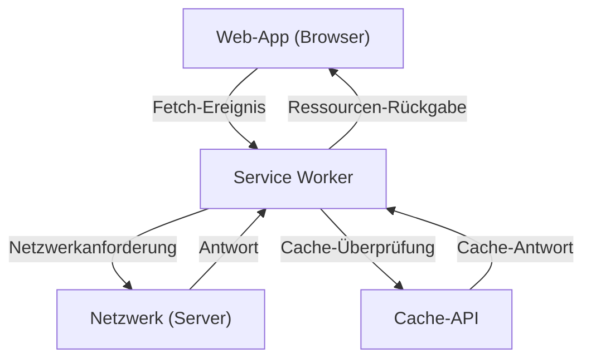

## 1. Einleitung: Die Evolution von Webanwendungen

Webanwendungen haben sich ausgehend von der Bereitstellung früher statischer HTML-Seiten durch die Weiterentwicklung von JavaScript zu Single Page Applications (SPA) entwickelt, die ein dynamisches und reichhaltiges Benutzererlebnis (UX) bieten. Lange Zeit gab es jedoch eine große Lücke zwischen Webanwendungen und nativen Apps (iOS- oder Android-Apps), da Web-Apps beispielsweise "offline nicht funktionieren", "keine Push-Benachrichtigungen wie native Apps haben" und "nicht zum Startbildschirm hinzugefügt werden können".

Die Technologie, die diese Lücke schließt und Webanwendungen mit leistungsstarken Funktionen und einem hervorragenden Benutzererlebnis ähnlich wie bei nativen Apps ausstattet, sind die **Progressive Web Apps (PWA)**. In diesem Artikel werden wir das Konzept von PWA sowie die Mechanismen, den Lebenszyklus und die vielfältigen Caching-Strategien der Kerntechnologie **Service Worker** sehr detailliert erläutern.

## 2. Die Lücke zwischen nativen Apps und Web-Apps

Zwischen nativen Apps und herkömmlichen Web-Apps bestanden hauptsächlich die folgenden drei großen Lücken:

1.  **Netzwerkabhängigkeit (Offline-Betrieb)**: Sobald eine native App installiert ist, kann sie auch im Offline-Zustand ohne Netzwerkverbindung gestartet werden und zumindest zwischengespeicherte Daten anzeigen. Herkömmliche Web-Apps zeigten hingegen ohne Netzwerkverbindung lediglich das Dinosaurier-Symbol (Offline-Fehler) des Browsers an.
2.  **Engagement (Push-Benachrichtigungen etc.)**: Native Apps können die Funktionen des Betriebssystems nutzen, um Push-Benachrichtigungen zu senden und die Nutzer zur Rückkehr zu bewegen.
3.  **Integrierte UX**: Native Apps sind als Symbole auf dem Startbildschirm präsent, können im Vollbildmodus gestartet werden und haben tiefgreifenden Zugriff auf die Hardwarefunktionen des Geräts (Kamera, GPS etc.).

PWA zielt darauf ab, diese Lücken mithilfe von Web-Standardtechnologien zu schließen.

## 3. Die drei Komponenten einer PWA

PWA ist keine einzelne Technologie, sondern wird durch die Kombination der folgenden drei Hauptelemente (Best Practices) realisiert.

### 3.1. HTTPS (Sichere Kommunikation)

Die leistungsstarken Funktionen einer PWA (insbesondere Service Worker) sind so konzipiert, dass sie nur in einer sicheren Umgebung ausgeführt werden können, um Man-in-the-Middle-Angriffe zu verhindern. Daher muss die gesamte Website über HTTPS bereitgestellt werden, um als PWA zu funktionieren (die lokale Entwicklungsumgebung `localhost` ist als Ausnahme zulässig).

### 3.2. Web App Manifest

Das Web App Manifest ist eine JSON-Datei (normalerweise `manifest.json`), die Metadaten über die Web-App enthält. Diese Datei ermöglicht die folgenden Einstellungen:
-   **Zum Startbildschirm hinzufügen**: Sie können das Symbol und den Namen der App angeben.
-   **Anzeigemodus**: Sie können die App so einstellen, dass sie im Vollbildmodus (`standalone` oder `fullscreen`) angezeigt wird, wobei die Browser-Benutzeroberfläche (z. B. die URL-Leiste) ausgeblendet wird.
-   **Splash-Screen**: Sie können die Hintergrundfarbe und das Symbol beim Starten der App festlegen.

### 3.3. Service Worker

Die wichtigste Technologie, die eine PWA ausmacht, ist der **Service Worker**. Ein Service Worker ist eine JavaScript-Umgebung (Worker), die der Browser im Hintergrund, getrennt von der Webseite, ausführt. Er hat keinen direkten Zugriff auf das DOM, kann aber Netzwerkanfragen abfangen (intercept) und Push-Benachrichtigungen empfangen.

## 4. Funktionsweise und Rolle des Service Workers

Der Service Worker fungiert als eine Art "Proxy-Server" zwischen dem Browser und dem Netzwerk. Dadurch kann die Web-App den Netzwerkstatus steuern und auch offline Funktionen bereitstellen.



Die Hauptaufgaben sind wie folgt:
-   **Abfangen von Netzwerkanfragen**: Er überwacht alle Anfragen von der Seite (Bilder, CSS, API-Anfragen etc.) und gibt bei Bedarf eine Antwort aus dem Cache zurück oder leitet die Anfrage an das Netzwerk weiter.
-   **Hintergrundsynchronisation**: Aktionen des Benutzers, die offline durchgeführt wurden (z. B. das Senden von Nachrichten), werden aufgezeichnet und automatisch an den Server gesendet, sobald die Online-Verbindung wiederhergestellt ist.
-   **Push-Benachrichtigungen**: Auch wenn der Browser geschlossen ist, können Push-Benachrichtigungen vom Server empfangen und dem Benutzer angezeigt werden.

## 5. Lebenszyklus des Service Workers

Der Service Worker hat einen eigenen Lebenszyklus, der unabhängig vom Lebenszyklus einer normalen Webseite ist. Er wird hauptsächlich über die folgenden drei Schritte aktiviert.

### 5.1. Install (Installieren)

Wenn die Webseite das Service-Worker-Skript registriert (`navigator.serviceWorker.register()`), lädt der Browser das Skript herunter und beginnt mit der Installation.
In dieser Phase werden statische Assets, die für den Offline-Betrieb erforderlich sind (HTML, CSS, JavaScript, Bilder etc.), in der Regel mithilfe der **Cache-API** vorab zwischengespeichert (Pre-caching).

```javascript
self.addEventListener('install', (event) => {
  event.waitUntil(
    caches.open('v1-static-cache').then((cache) => {
      return cache.addAll([
        '/',
        '/index.html',
        '/styles/main.css',
        '/scripts/app.js',
        '/images/logo.png'
      ]);
    })
  );
});
```

### 5.2. Activate (Aktivieren)

Nach Abschluss der Installation wechselt der Service Worker in die Phase Activate (Aktivieren). Wenn jedoch bereits eine Seite geöffnet ist, die von einem alten Service Worker gesteuert wird, wird der neue Service Worker nicht sofort aktiv, sondern geht in den Status "waiting" (wartend) über (er wartet, bis der Benutzer alle Seiten schließt oder neu lädt).
Diese Phase eignet sich für Bereinigungsarbeiten, wie das Löschen alter Caches.

```javascript
self.addEventListener('activate', (event) => {
  const cacheWhitelist = ['v1-static-cache'];
  event.waitUntil(
    caches.keys().then((cacheNames) => {
      return Promise.all(
        cacheNames.map((cacheName) => {
          if (cacheWhitelist.indexOf(cacheName) === -1) {
            return caches.delete(cacheName); // Alten Cache löschen
          }
        })
      );
    })
  );
});
```

### 5.3. Fetch (Abrufen / Ereignisverarbeitung)

Sobald der Service Worker aktiviert ist, kann er alle Anfragen innerhalb der Seite steuern. Durch das Abhören des `fetch`-Ereignisses kann er benutzerdefinierte Antworten auf Anfragen zurückgeben.

## 6. Vielfältige Caching-Strategien

Die Stärke von Service Workern liegt in der Möglichkeit, flexible Caching-Strategien (Cache Strategies) zu implementieren, die auf die Art der Anfrage und die Anforderungen zugeschnitten sind. Hier sind einige typische Strategien:

### 6.1. Cache First (Cache-Priorität)

Zunächst wird der Cache überprüft, und falls vorhanden, wird die Antwort aus dem Cache zurückgegeben. Wenn sie nicht im Cache ist, wird die Anfrage an das Netzwerk gesendet. Ideal für statische Ressourcen, die sich nicht oft ändern, wie Bilder und CSS.

```javascript
self.addEventListener('fetch', (event) => {
  event.respondWith(
    caches.match(event.request).then((response) => {
      return response || fetch(event.request);
    })
  );
});
```

### 6.2. Network First (Netzwerk-Priorität)

Es wird immer versucht, die neuesten Daten aus dem Netzwerk abzurufen. Nur wenn das Netzwerk fehlschlägt (z. B. offline), werden die Daten als Fallback aus dem Cache zurückgegeben. Geeignet für Nachrichtenartikel oder Social-Media-Timelines, bei denen immer die neuesten Informationen angezeigt werden müssen.

### 6.3. Stale-While-Revalidate (Cache zurückgeben, während im Hintergrund aktualisiert wird)

Zunächst wird sofort der Cache (Stale: alte Daten) zurückgegeben, um eine schnelle Anzeige zu ermöglichen. Gleichzeitig wird im Hintergrund eine Anfrage an das Netzwerk gesendet (Revalidate: neu validieren), um den Cache auf den neuesten Stand zu bringen. Wenn der Benutzer das nächste Mal darauf zugreift, werden die aktualisierten Daten angezeigt. Dies bietet ein gutes Gleichgewicht zwischen Anzeigegeschwindigkeit und Aktualität und ist eine häufig genutzte Strategie.

### 6.4. Network Only / Cache Only

-   **Network Only**: Verwendet den Cache überhaupt nicht und ruft immer aus dem Netzwerk ab.
-   **Cache Only**: Verwendet das Netzwerk nicht und ruft immer nur aus dem Cache ab.

## 7. Hintergrundsynchronisation und Push-Benachrichtigungen

Die Vorteile von Service Workern beschränken sich nicht nur auf das Caching.

### Hintergrundsynchronisation (Background Sync)

Wenn ein Benutzer versucht, Daten zu senden, während er offline ist, können Sie die Hintergrundsynchronisations-API des Service Workers verwenden, um die Aufgabe in einer Warteschlange zu speichern. Sobald das Gerät wieder online ist, startet der Browser automatisch den Service Worker im Hintergrund und führt die in der Warteschlange gespeicherten Aufgaben (Senden der Daten) aus. Dadurch kann der Benutzer nahtlos weiterarbeiten, ohne sich seiner Offline-Situation bewusst zu sein.

### Push-Benachrichtigungen (Push Notifications)

In Zusammenarbeit mit der Web Push API können Web-Apps Push-Benachrichtigungen realisieren, die denen nativer Apps entsprechen. Push-Ereignisse vom Server werden vom Service Worker empfangen und können Benachrichtigungen anzeigen, selbst wenn der Browser geschlossen ist, um das erneute Engagement der Benutzer zu erhöhen.

## 8. Fazit

Progressive Web Apps (PWA) und die zugrunde liegenden Service Worker sind innovative Technologien, die die Grenzen von Webanwendungen verschieben und Leistung sowie Benutzererlebnisse bieten, die mit denen nativer Apps vergleichbar sind.
Durch die Kombination der Sicherheit von HTTPS, dem Installationserlebnis über das Manifest sowie der Offline-Unterstützung und der fortschrittlichen Cache-Steuerung durch Service Worker können Entwickler robuste Webanwendungen erstellen, die für die Benutzer wirklich wertvoll sind.

In der zukünftigen Webentwicklung wird die Übernahme des PWA-Ansatzes eine Standardwahl werden, um eine bessere UX zu bieten.
