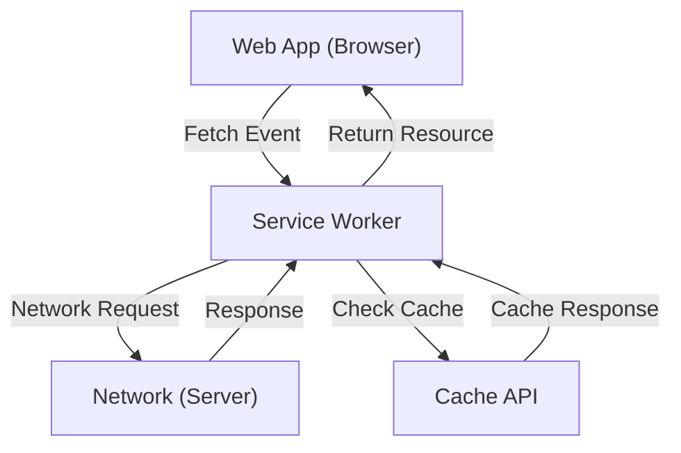

## 1. Introduction: The Evolution of Web Applications

Web applications have evolved from delivering basic static HTML pages to providing dynamic, rich user experiences (UX) known as Single Page Applications (SPA) driven by advancements in JavaScript. However, for a long time, web applications suffered from significant gaps compared to native apps (iOS and Android apps), such as "not working offline", "lacking push notifications like native apps", and "inability to be added to the home screen".

The technology designed to bridge this gap and bring native-app-like powerful features and superior user experiences to web applications is **Progressive Web Apps (PWA)**. In this article, we will provide an in-depth explanation of PWA concepts, how its core technology **Service Worker** works, its lifecycle, and various caching strategies.

## 2. The Gap Between Native Apps and Web Apps

Historically, there were three major gaps between native apps and traditional web apps:

1.  **Network Dependency (Offline Operation)**: Once installed, native apps can typically launch and display cached data even when offline without a network connection. On the other hand, traditional web apps would simply display the browser's dinosaur icon (offline error) if they couldn't connect to the network.
2.  **Engagement (Push Notifications, etc.)**: Native apps can leverage OS features to send push notifications, prompting users to revisit the app.
3.  **Integrated UX**: Native apps exist as icons on the home screen, can launch in full screen, and have deep access to device hardware features (camera, GPS, etc.).

PWAs aim to bridge these gaps using standard web technologies.

## 3. The Three Key Elements of PWA

PWA is not a single technology, but rather achieved through a combination of the following three core elements (best practices).

### 3.1. HTTPS (Secure Communication)

The powerful features of PWAs (especially Service Workers) are designed to run only in secure environments to prevent man-in-the-middle attacks. Therefore, for a PWA to function, the entire site must be served over HTTPS (with the exception of `localhost` for local development environments).

### 3.2. Web App Manifest

The Web App Manifest is a JSON file (typically `manifest.json`) that describes metadata about the web app. This file allows for the following configurations:
-   **Add to Home Screen**: You can specify the app's icon and name.
-   **Display Mode**: You can configure settings to hide the browser UI (such as the URL bar) and display it in full screen (`standalone` or `fullscreen`).
-   **Splash Screen**: You can set the background color and icon for when the app is launched.

### 3.3. Service Worker

The most crucial technology that makes a PWA a PWA is the **Service Worker**. A Service Worker is a JavaScript environment (worker) that the browser runs in the background, separate from the web page. While it cannot access the DOM directly, it can intercept network requests and receive push notifications.

## 4. How Service Workers Work and Their Role

A Service Worker acts as a "proxy server" sitting between the browser and the network. This allows the web app to control network states and provide functionality even when offline.



Its primary roles are as follows:
-   **Intercepting Network Requests**: It monitors all requests from the page (images, CSS, API requests, etc.) and responds from the cache or forwards the request to the network as needed.
-   **Background Sync**: It records actions taken by the user while offline (such as sending messages) and automatically sends them to the server once online again.
-   **Push Notifications**: It can receive push notifications from the server and display them to the user, even when the browser is closed.

## 5. Service Worker Lifecycle

Service Workers have their own unique lifecycle, independent of the typical web page lifecycle. They primarily go through the following three steps to become active.

### 5.1. Install

When a web page registers the Service Worker script (`navigator.serviceWorker.register()`), the browser downloads the script and begins the installation process.
During this phase, static assets required for offline operation (HTML, CSS, JavaScript, images, etc.) are typically pre-cached using the **Cache API**.

```javascript
self.addEventListener('install', (event) => {
  event.waitUntil(
    caches.open('v1-static-cache').then((cache) => {
      return cache.addAll([
        '/',
        '/index.html',
        '/styles/main.css',
        '/scripts/app.js',
        '/images/logo.png'
      ]);
    })
  );
});
```

### 5.2. Activate

Once installation is complete, the Service Worker moves to the Activate phase. However, if a page controlled by an old Service Worker is already open, the new Service Worker will not become active immediately and will go into a "waiting" state (it waits until the user closes all pages or reloads).
This phase is ideal for performing cleanup tasks, such as deleting old caches.

```javascript
self.addEventListener('activate', (event) => {
  const cacheWhitelist = ['v1-static-cache'];
  event.waitUntil(
    caches.keys().then((cacheNames) => {
      return Promise.all(
        cacheNames.map((cacheName) => {
          if (cacheWhitelist.indexOf(cacheName) === -1) {
            return caches.delete(cacheName); // Delete old caches
          }
        })
      );
    })
  );
});
```

### 5.3. Fetch (Handling Events)

Once active, the Service Worker gains control over all requests within the page. By listening for `fetch` events, it can return custom responses to requests.

## 6. Various Caching Strategies

The powerful aspect of Service Workers is the ability to implement flexible caching strategies tailored to the type and requirements of requests. Here are a few representative strategies.

### 6.1. Cache First

It first checks the cache, and if the data exists, it returns it. If it is not in the cache, it makes a request to the network. This is ideal for static resources that do not change frequently, such as images or CSS.

```javascript
self.addEventListener('fetch', (event) => {
  event.respondWith(
    caches.match(event.request).then((response) => {
      return response || fetch(event.request);
    })
  );
});
```

### 6.2. Network First

It always attempts to fetch the latest data from the network first. Only if the network fails (such as when offline), does it fall back to returning data from the cache. This is suitable for news articles or social media timelines where displaying the latest information is always necessary.

### 6.3. Stale-While-Revalidate

It first immediately returns the cache (Stale data) for fast rendering, while simultaneously making a network request (Revalidate) in the background to update the cache to the latest state. The next time the user accesses the page, the updated data will be displayed. This strategy provides a good balance between speed and freshness and is frequently used.

### 6.4. Network Only / Cache Only

-   **Network Only**: It never uses the cache and always fetches from the network.
-   **Cache Only**: It never uses the network and always fetches exclusively from the cache.

## 7. Background Sync and Push Notifications

The benefits of Service Workers extend beyond just caching.

### Background Sync

If a user attempts to send data while offline, utilizing the Service Worker's Background Sync API allows you to save the task in a queue. When the device returns online, the browser automatically launches the Service Worker in the background and executes the queued tasks (sending data). This allows users to continue their actions seamlessly without being aware they are offline.

### Push Notifications

By integrating with the Web Push API, web apps can deliver push notifications on par with native apps. Push events from the server are received by the Service Worker, allowing notifications to be displayed even when the browser is closed, thereby increasing user re-engagement.

## 8. Conclusion

Progressive Web Apps (PWA) and the Service Workers that power them are innovative technologies that push the boundaries of web applications, bringing performance and user experiences that rival native apps.
By combining the security of HTTPS, the installation experience of Manifests, and the offline capabilities and advanced cache control of Service Workers, developers can build robust web applications that are truly valuable to users.

Incorporating the PWA approach will likely become a standard choice for providing better UX in future web development.
