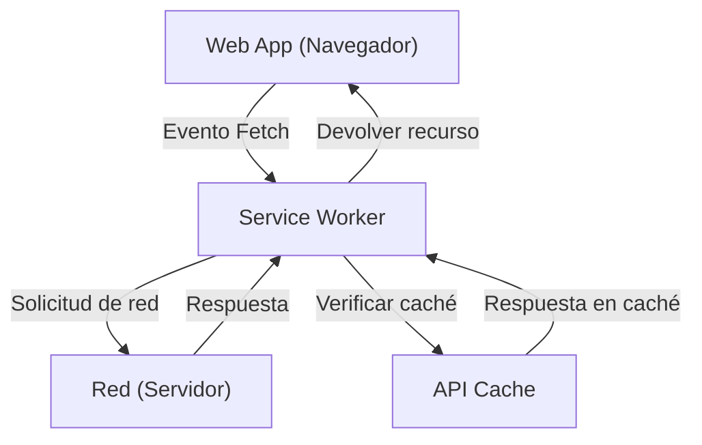

## 1. Introducción: La evolución de las aplicaciones web

Las aplicaciones web comenzaron con la entrega de páginas HTML estáticas y han evolucionado con el desarrollo de JavaScript hacia las Single Page Applications (SPA), ofreciendo experiencias de usuario (UX) dinámicas y ricas. Sin embargo, durante mucho tiempo, las aplicaciones web han tenido una gran brecha en comparación con las aplicaciones nativas (aplicaciones de iOS o Android), como el "no funcionar sin conexión", "carecer de notificaciones push como las aplicaciones nativas" o el "no poder agregarse a la pantalla de inicio".

La tecnología que cierra esta brecha y aporta a las aplicaciones web funciones potentes y una excelente experiencia de usuario, similar a la de las aplicaciones nativas, son las **Progressive Web Apps (PWA)** o Aplicaciones Web Progresivas. En este artículo, explicaremos en gran detalle desde el concepto de PWA hasta el funcionamiento de su tecnología central, el **Service Worker**, su ciclo de vida y diversas estrategias de caché.

## 2. La brecha entre las aplicaciones nativas y las aplicaciones web

Principalmente, existían tres grandes brechas entre las aplicaciones nativas y las aplicaciones web tradicionales.

1.  **Dependencia de la red (funcionamiento sin conexión)**: Una vez instaladas, las aplicaciones nativas pueden iniciar y mostrar datos en caché incluso en estado sin conexión, sin entorno de red. Por el contrario, las aplicaciones web tradicionales solo mostraban el ícono de dinosaurio del navegador (error sin conexión) si no se podían conectar a la red.
2.  **Interacción (notificaciones push, etc.)**: Las aplicaciones nativas pueden utilizar las funciones del sistema operativo para enviar notificaciones push e incitar a los usuarios a volver a visitar la aplicación.
3.  **UX integrada**: Las aplicaciones nativas existen como un ícono en la pantalla de inicio, se pueden iniciar a pantalla completa y tienen un acceso profundo a las funciones de hardware del dispositivo (cámara, GPS, etc.).

Las PWA tienen como objetivo cerrar estas brechas utilizando tecnologías web estándar.

## 3. Los 3 elementos que componen una PWA

Una PWA no es una tecnología única, sino que se logra mediante la combinación de los siguientes tres elementos principales (mejores prácticas).

### 3.1. HTTPS (Comunicación segura)

Las potentes funciones de las PWA (especialmente Service Worker) están diseñadas para funcionar únicamente en entornos seguros para prevenir ataques de intermediario (Man-in-the-Middle). Por lo tanto, para funcionar como PWA, todo el sitio debe ser servido bajo HTTPS (con la excepción del entorno de desarrollo local `localhost`, que está permitido).

### 3.2. Web App Manifest (Manifiesto de la aplicación web)

El Web App Manifest es un archivo JSON (normalmente `manifest.json`) que describe los metadatos sobre la aplicación web. Este archivo permite configuraciones como las siguientes:
-   **Agregar a la pantalla de inicio**: Permite especificar el ícono y el nombre de la aplicación.
-   **Modo de visualización**: Se puede configurar para ocultar la interfaz de usuario del navegador (como la barra de URL) y mostrarla a pantalla completa (`standalone` o `fullscreen`).
-   **Pantalla de bienvenida (Splash screen)**: Permite configurar el color de fondo y el ícono al iniciar la aplicación.

### 3.3. Service Worker

Y la tecnología más importante que hace de una PWA lo que es, es el **Service Worker**. Un Service Worker es un entorno de ejecución de JavaScript (worker) que el navegador ejecuta en segundo plano, separado de la página web. No puede acceder directamente al DOM, pero puede interceptar solicitudes de red o recibir notificaciones push.

## 4. Funcionamiento y rol del Service Worker

El Service Worker actúa como un "servidor proxy" que se interpone entre el navegador y la red. Esto permite a la aplicación web controlar el estado de la red y proporcionar funciones incluso cuando está sin conexión.



Sus funciones principales son las siguientes:
-   **Intercepción de solicitudes de red**: Supervisa todas las solicitudes desde la página (imágenes, CSS, solicitudes a la API, etc.) y, según sea necesario, devuelve una respuesta desde la caché o reenvía la solicitud a la red.
-   **Sincronización en segundo plano**: Registra las acciones realizadas por el usuario mientras está sin conexión (como enviar un mensaje) y las envía automáticamente al servidor cuando vuelve a estar en línea.
-   **Notificaciones push**: Incluso si el navegador está cerrado, puede recibir notificaciones push del servidor y mostrarlas al usuario.

## 5. Ciclo de vida del Service Worker

El Service Worker tiene su propio ciclo de vida independiente del ciclo de vida habitual de las páginas web. Se activa principalmente a través de los siguientes tres pasos.

### 5.1. Install (Instalación)

Cuando la página web registra el script del Service Worker (`navigator.serviceWorker.register()`), el navegador descarga el script e inicia la instalación.
En esta fase, normalmente se precachean (Pre-caching) los activos estáticos necesarios para el funcionamiento sin conexión (HTML, CSS, JavaScript, imágenes, etc.) utilizando la **Cache API**.

```javascript
self.addEventListener('install', (event) => {
  event.waitUntil(
    caches.open('v1-static-cache').then((cache) => {
      return cache.addAll([
        '/',
        '/index.html',
        '/styles/main.css',
        '/scripts/app.js',
        '/images/logo.png'
      ]);
    })
  );
});
```

### 5.2. Activate (Activación)

Una vez completada la instalación, el Service Worker pasa a la fase de Activación (Activate). Sin embargo, si ya hay una página abierta controlada por un Service Worker antiguo, el nuevo Service Worker no se activa de inmediato, sino que entra en estado de espera o "waiting" (espera hasta que el usuario cierre todas las páginas o recargue).
Esta fase es ideal para realizar tareas de limpieza, como la eliminación de cachés antiguas.

```javascript
self.addEventListener('activate', (event) => {
  const cacheWhitelist = ['v1-static-cache'];
  event.waitUntil(
    caches.keys().then((cacheNames) => {
      return Promise.all(
        cacheNames.map((cacheName) => {
          if (cacheWhitelist.indexOf(cacheName) === -1) {
            return caches.delete(cacheName); // Eliminar caché antigua
          }
        })
      );
    })
  );
});
```

### 5.3. Fetch (Recuperación / Procesamiento de eventos)

Una vez activado, el Service Worker puede controlar todas las solicitudes dentro de la página. Al escuchar el evento `fetch`, puede devolver una respuesta personalizada a la solicitud.

## 6. Diversas estrategias de caché

El punto fuerte del Service Worker es la capacidad de implementar estrategias de caché (Cache Strategies) flexibles que se adaptan al tipo de solicitud y a los requisitos. Presentaremos algunas estrategias típicas.

### 6.1. Cache First (Prioridad a la caché)

Primero verifica la caché y, si existe, la devuelve. Si no está en la caché, realiza la solicitud a la red. Es ideal para recursos estáticos que no cambian con frecuencia, como imágenes y CSS.

```javascript
self.addEventListener('fetch', (event) => {
  event.respondWith(
    caches.match(event.request).then((response) => {
      return response || fetch(event.request);
    })
  );
});
```

### 6.2. Network First (Prioridad a la red)

Siempre intenta obtener los datos más recientes de la red. Solo devuelve datos de la caché como respaldo si la red falla (por ejemplo, cuando no hay conexión). Es adecuado para artículos de noticias o cronologías de redes sociales que siempre necesitan mostrar la información más reciente.

### 6.3. Stale-While-Revalidate (Devolver caché mientras se actualiza en segundo plano)

Primero, devuelve inmediatamente la caché (Stale: datos antiguos) para mostrarla rápidamente y, al mismo tiempo, realiza una solicitud a la red en segundo plano (Revalidate: revalidar) para actualizar la caché a su estado más reciente. La próxima vez que el usuario acceda, se mostrarán los datos actualizados. Es una estrategia muy utilizada con un buen equilibrio entre velocidad de visualización y frescura.

### 6.4. Network Only / Cache Only

-   **Network Only (Solo red)**: No utiliza la caché en absoluto, siempre obtiene los datos de la red.
-   **Cache Only (Solo caché)**: No utiliza la red, siempre obtiene los datos solo de la caché.

## 7. Sincronización en segundo plano y notificaciones push

Los beneficios del Service Worker no se limitan a la caché.

### Sincronización en segundo plano (Background Sync)

Si el usuario intenta enviar datos cuando está sin conexión, mediante el uso de la API de sincronización en segundo plano del Service Worker, la tarea se puede guardar en una cola. Cuando el dispositivo vuelve a estar en línea, el navegador inicia automáticamente el Service Worker en segundo plano y ejecuta la tarea guardada en la cola (envío de datos). Esto permite a los usuarios continuar operando sin problemas y sin preocuparse por estar desconectados.

### Notificaciones push (Push Notifications)

Al integrarse con la API de Web Push, la aplicación web puede lograr notificaciones push equivalentes a las de las aplicaciones nativas. El Service Worker recibe los eventos push del servidor y puede mostrar notificaciones incluso si el navegador está cerrado, aumentando así la participación (re-engagement) del usuario.

## 8. Conclusión

Las Progressive Web Apps (PWA) y el Service Worker que las respalda son tecnologías innovadoras que empujan los límites de las aplicaciones web, brindando un rendimiento y una experiencia de usuario comparables a las aplicaciones nativas.
Al combinar la seguridad a través de HTTPS, la experiencia de instalación mediante el Manifiesto y el soporte sin conexión y el control de caché avanzado proporcionados por el Service Worker, los desarrolladores pueden construir aplicaciones web sólidas que son verdaderamente valiosas para los usuarios.

La adopción del enfoque PWA se convertirá en una opción estándar para proporcionar una mejor experiencia de usuario en el desarrollo web futuro.
