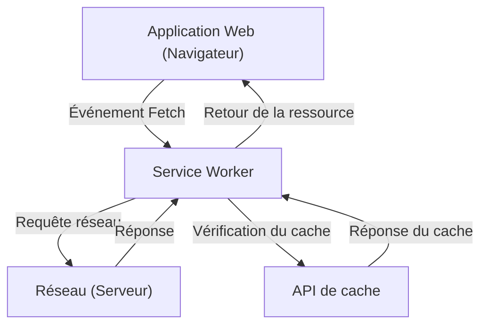

## 1. Introduction : L'évolution des applications Web

Les applications Web ont évolué, passant de la fourniture initiale de pages HTML statiques à des applications à page unique (SPA) offrant une expérience utilisateur (UX) dynamique et riche grâce à l'évolution de JavaScript. Cependant, pendant longtemps, les applications Web présentaient un décalage important par rapport aux applications natives (applications iOS et Android), notamment : "elles ne fonctionnent pas hors ligne", "il n'y a pas de notifications push comme les applications natives" et "elles ne peuvent pas être ajoutées à l'écran d'accueil".

La technologie qui comble ce décalage et apporte aux applications Web des fonctionnalités puissantes et une excellente expérience utilisateur, similaires à celles des applications natives, est **Progressive Web Apps (PWA)**. Dans cet article, nous expliquerons en détail le concept de PWA, du fonctionnement de sa technologie de base, le **Service Worker**, à son cycle de vie et à ses diverses stratégies de mise en cache.

## 2. L'écart entre les applications natives et les applications Web

Il y avait principalement trois grands écarts entre les applications natives et les applications Web traditionnelles :

1.  **Dépendance au réseau (fonctionnement hors ligne)** : Une fois installées, les applications natives peuvent au moins afficher les données mises en cache en ouvrant l'application, même hors ligne sans connexion réseau. En revanche, les applications Web traditionnelles affichaient simplement l'icône du dinosaure du navigateur (erreur hors ligne) si elles ne pouvaient pas se connecter au réseau.
2.  **Engagement (notifications push, etc.)** : Les applications natives peuvent utiliser les fonctionnalités de l'OS pour envoyer des notifications push et encourager les utilisateurs à revenir.
3.  **UX intégrée** : Les applications natives existent sous forme d'icône sur l'écran d'accueil, peuvent être lancées en plein écran et ont un accès profond aux fonctionnalités matérielles de l'appareil (caméra, GPS, etc.).

Les PWA visent à combler ces écarts en utilisant les technologies standard du Web.

## 3. Les trois éléments qui composent les PWA

Les PWA ne sont pas une technologie unique, mais sont réalisées par la combinaison des trois éléments principaux (meilleures pratiques) suivants.

### 3.1. HTTPS (Communication sécurisée)

Les fonctionnalités puissantes des PWA (en particulier les Service Workers) sont conçues pour fonctionner uniquement dans des environnements sécurisés afin de prévenir les attaques de l'homme du milieu, etc. Par conséquent, pour fonctionner comme une PWA, l'ensemble du site doit être servi via HTTPS (l'environnement de développement local `localhost` est exceptionnellement autorisé).

### 3.2. Web App Manifest (Manifeste de l'application Web)

Le Web App Manifest est un fichier JSON (généralement `manifest.json`) qui décrit les métadonnées concernant l'application Web. Ce fichier permet les configurations suivantes :
-   **Ajout à l'écran d'accueil** : Vous pouvez spécifier l'icône et le nom de l'application.
-   **Mode d'affichage** : Vous pouvez configurer pour masquer l'interface utilisateur du navigateur (comme la barre d'URL) et afficher en plein écran (`standalone` ou `fullscreen`).
-   **Écran de démarrage** : Vous pouvez définir la couleur de fond et l'icône au lancement de l'application.

### 3.3. Service Worker (Le travailleur de service)

Et la technologie la plus importante qui fait d'une PWA une PWA est le **Service Worker**. Un Service Worker est un environnement JavaScript (worker) que le navigateur exécute en arrière-plan, indépendamment de la page Web. Il n'a pas accès direct au DOM, mais il peut intercepter les requêtes réseau et recevoir des notifications push.

## 4. Le fonctionnement et le rôle du Service Worker

Le Service Worker agit comme un « serveur proxy » entre le navigateur et le réseau. Cela permet à l'application Web de contrôler l'état du réseau et de fournir des fonctionnalités même hors ligne.



Ses rôles principaux sont les suivants :
-   **Interception des requêtes réseau** : Surveille toutes les requêtes de la page (images, CSS, requêtes API, etc.) et, si nécessaire, renvoie une réponse du cache ou transfère la requête au réseau.
-   **Synchronisation en arrière-plan** : Enregistre les actions effectuées par l'utilisateur lorsqu'il est hors ligne (comme l'envoi d'un message) et les envoie automatiquement au serveur lorsqu'il se reconnecte en ligne.
-   **Notifications push** : Même si le navigateur est fermé, il peut recevoir des notifications push du serveur et les afficher à l'utilisateur.

## 5. Le cycle de vie du Service Worker

Le Service Worker possède un cycle de vie unique, indépendant du cycle de vie des pages Web classiques. Il devient principalement actif après les trois étapes suivantes.

### 5.1. Install (Installation)

Lorsque la page Web enregistre le script du Service Worker (`navigator.serviceWorker.register()`), le navigateur télécharge le script et commence l'installation.
Dans cette phase, les actifs statiques nécessaires au fonctionnement hors ligne (HTML, CSS, JavaScript, images, etc.) sont généralement pré-mis en cache (Pre-caching) à l'aide de l'**API de cache**.

```javascript
self.addEventListener('install', (event) => {
  event.waitUntil(
    caches.open('v1-static-cache').then((cache) => {
      return cache.addAll([
        '/',
        '/index.html',
        '/styles/main.css',
        '/scripts/app.js',
        '/images/logo.png'
      ]);
    })
  );
});
```

### 5.2. Activate (Activation)

Une fois l'installation terminée, le Service Worker passe à la phase d'activation (Activate). Cependant, si une page contrôlée par un ancien Service Worker est déjà ouverte, le nouveau Service Worker ne sera pas activé immédiatement et entrera dans un état « en attente » (waiting) (il attend que l'utilisateur ferme toutes les pages ou les actualise).
Cette phase est appropriée pour effectuer des tâches de nettoyage, telles que la suppression des anciens caches.

```javascript
self.addEventListener('activate', (event) => {
  const cacheWhitelist = ['v1-static-cache'];
  event.waitUntil(
    caches.keys().then((cacheNames) => {
      return Promise.all(
        cacheNames.map((cacheName) => {
          if (cacheWhitelist.indexOf(cacheName) === -1) {
            return caches.delete(cacheName); // Supprimer l'ancien cache
          }
        })
      );
    })
  );
});
```

### 5.3. Fetch (Récupération / Gestion des événements)

Une fois activé, le Service Worker peut contrôler toutes les requêtes dans la page. En écoutant l'événement `fetch`, vous pouvez renvoyer des réponses personnalisées aux requêtes.

## 6. Diverses stratégies de mise en cache

La force des Service Workers réside dans leur capacité à implémenter des stratégies de mise en cache flexibles (Cache Strategies) adaptées au type de requête et aux exigences. Voici quelques stratégies représentatives.

### 6.1. Cache First (Priorité au cache)

Vérifie d'abord le cache, et s'il existe, le renvoie. S'il n'est pas dans le cache, fait une requête au réseau. Idéal pour les ressources statiques qui ne changent pas fréquemment, comme les images et le CSS.

```javascript
self.addEventListener('fetch', (event) => {
  event.respondWith(
    caches.match(event.request).then((response) => {
      return response || fetch(event.request);
    })
  );
});
```

### 6.2. Network First (Priorité au réseau)

Essaie toujours d'obtenir les données les plus récentes à partir du réseau. Ce n'est que lorsque le réseau échoue (par exemple, hors ligne) qu'il renvoie les données du cache comme solution de repli (fallback). Convient aux articles d'actualité ou aux fils d'actualité des réseaux sociaux où les informations les plus récentes doivent toujours être affichées.

### 6.3. Stale-While-Revalidate (Renvoyer le cache tout en le mettant à jour en arrière-plan)

Renvoie d'abord immédiatement le cache (Stale : données obsolètes) pour un affichage rapide, et fait simultanément une requête au réseau en arrière-plan (Revalidate : revalidation) pour mettre à jour le cache à l'état le plus récent. La prochaine fois que l'utilisateur y accédera, les données mises à jour seront affichées. C'est une stratégie fréquemment utilisée qui offre un bon équilibre entre la vitesse d'affichage et la fraîcheur.

### 6.4. Network Only / Cache Only

-   **Network Only (Réseau uniquement)** : N'utilise pas du tout le cache et obtient toujours à partir du réseau.
-   **Cache Only (Cache uniquement)** : N'utilise pas le réseau et obtient toujours uniquement à partir du cache.

## 7. Synchronisation en arrière-plan et notifications push

Les avantages des Service Workers ne se limitent pas à la mise en cache.

### Synchronisation en arrière-plan (Background Sync)

Si un utilisateur tente d'envoyer des données alors qu'il est hors ligne, l'utilisation de l'API de synchronisation en arrière-plan du Service Worker permet d'enregistrer la tâche dans une file d'attente. Lorsque l'appareil se reconnecte, le navigateur démarre automatiquement le Service Worker en arrière-plan et exécute la tâche enregistrée dans la file d'attente (envoi des données). Cela permet à l'utilisateur de continuer à utiliser l'application de manière transparente sans se soucier d'être hors ligne.

### Notifications push (Push Notifications)

En s'intégrant à l'API Web Push, les applications Web peuvent réaliser des notifications push équivalentes à celles des applications natives. Les événements push du serveur sont reçus par le Service Worker, et même si le navigateur est fermé, il peut afficher des notifications pour augmenter le réengagement de l'utilisateur.

## 8. Conclusion

Les Progressive Web Apps (PWA) et les Service Workers qui les sous-tendent sont des technologies innovantes qui repoussent les limites des applications Web et offrent des performances et une expérience utilisateur comparables à celles des applications natives.
En combinant la sécurité via HTTPS, l'expérience d'installation via Manifest, et la prise en charge hors ligne et le contrôle de cache avancé via Service Worker, les développeurs peuvent créer des applications Web robustes et véritablement précieuses pour les utilisateurs.

Dans le développement Web futur, l'adoption de l'approche PWA deviendra une option standard pour offrir une meilleure UX.
