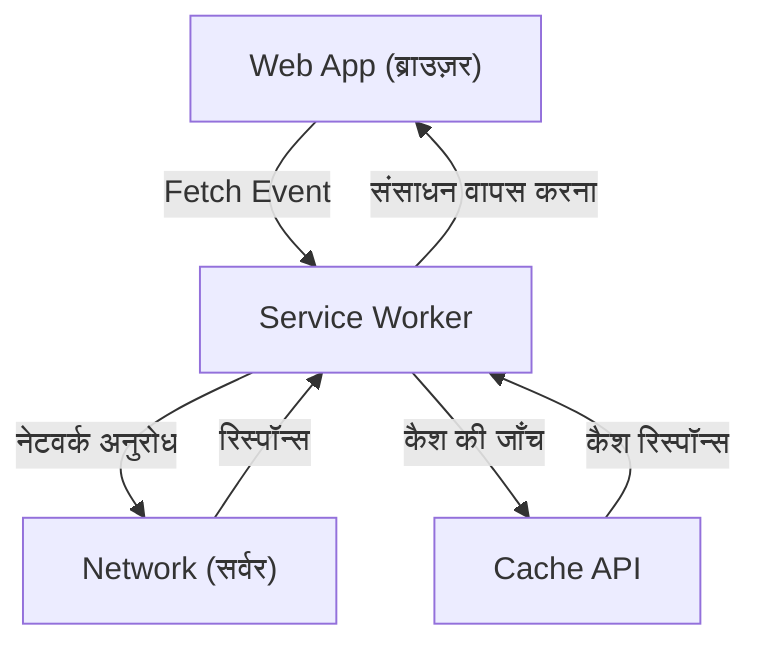

## 1. परिचय: वेब एप्लिकेशन का विकास

वेब एप्लिकेशन शुरुआती स्टैटिक HTML पेज परोसने से शुरू होकर, JavaScript के विकास के कारण डायनेमिक और रिच यूजर एक्सपीरियंस (UX) प्रदान करने वाले Single Page Application (SPA) में विकसित हो गए हैं। हालाँकि, लंबे समय तक, वेब एप्लिकेशनों में नेटिव ऐप्स (iOS या Android ऐप्स) की तुलना में एक बड़ा अंतर रहा है, जैसे कि "ऑफ़लाइन काम न करना", "नेटिव ऐप्स की तरह पुश नोटिफ़िकेशन का न होना", और "होम स्क्रीन में न जोड़े जा सकना"।

इस अंतर को पाटने और वेब एप्लिकेशन में नेटिव ऐप जैसे शक्तिशाली फीचर्स और शानदार यूजर एक्सपीरियंस लाने वाली तकनीक **Progressive Web Apps (PWA)** है। इस लेख में, हम PWA की अवधारणा से लेकर इसकी मुख्य तकनीक **Service Worker** के काम करने के तरीके, लाइफसाइकिल और विभिन्न कैश रणनीतियों तक विस्तार से समझाएंगे।

## 2. नेटिव ऐप्स और वेब ऐप्स के बीच का अंतर

नेटिव ऐप्स और पारंपरिक वेब ऐप्स के बीच मुख्य रूप से निम्नलिखित तीन बड़े अंतर मौजूद थे:

1.  **नेटवर्क निर्भरता (ऑफ़लाइन काम करना)**: नेटिव ऐप को एक बार इंस्टॉल करने के बाद, नेटवर्क न होने पर भी (ऑफ़लाइन स्थिति में), आप कम से कम ऐप को खोलकर कैश किया गया डेटा देख सकते हैं। दूसरी ओर, पारंपरिक वेब ऐप इंटरनेट से कनेक्ट न होने पर केवल ब्राउज़र का डायनासोर आइकन (ऑफ़लाइन एरर) दिखाते थे।
2.  **एंगेजमेंट (पुश नोटिफ़िकेशन आदि)**: नेटिव ऐप OS के फीचर्स का उपयोग करके पुश नोटिफ़िकेशन भेज सकते हैं, जिससे यूज़र को वापस आने के लिए प्रेरित किया जा सकता है।
3.  **एकीकृत UX**: नेटिव ऐप होम स्क्रीन पर एक आइकन के रूप में मौजूद होते हैं, जिन्हें फुल-स्क्रीन में खोला जा सकता है, और वे डिवाइस के हार्डवेयर (जैसे कैमरा, GPS आदि) तक गहराई से पहुँच सकते हैं।

PWA का उद्देश्य वेब की मानक तकनीकों का उपयोग करके इन अंतरों को पाटना है।

## 3. PWA को बनाने वाले 3 तत्व

PWA कोई एक तकनीक नहीं है, बल्कि यह निम्नलिखित तीन प्रमुख तत्वों (बेस्ट प्रैक्टिसेस) के संयोजन से साकार होता है।

### 3.1. HTTPS (सुरक्षित संचार)

PWA की शक्तिशाली कार्यक्षमता (विशेष रूप से Service Worker) को मैन-इन-द-मिडल हमलों आदि से बचाने के लिए केवल सुरक्षित वातावरण में काम करने के लिए डिज़ाइन किया गया है। इसलिए, PWA के रूप में काम करने के लिए, पूरी साइट को HTTPS पर सर्व किया जाना चाहिए (लोकल डेवलपमेंट एनवायरनमेंट `localhost` को अपवाद के रूप में अनुमति है)।

### 3.2. Web App Manifest (वेब ऐप मेनिफेस्ट)

Web App Manifest वेब ऐप से संबंधित मेटाडेटा का वर्णन करने वाली एक JSON फ़ाइल है (आमतौर पर `manifest.json`)। इस फ़ाइल के द्वारा, निम्नलिखित जैसी सेटिंग्स की जा सकती हैं:
-   **होम स्क्रीन में जोड़ें**: आप ऐप का आइकन और नाम निर्दिष्ट कर सकते हैं।
-   **डिस्प्ले मोड**: आप ब्राउज़र के UI (जैसे URL बार) को छिपाकर फुल-स्क्रीन मोड (`standalone` या `fullscreen`) सेट कर सकते हैं।
-   **स्प्लैश स्क्रीन**: आप ऐप शुरू होने पर बैकग्राउंड कलर और आइकन सेट कर सकते हैं।

### 3.3. Service Worker (सर्विस वर्कर)

और, जिस तकनीक के कारण PWA वास्तव में PWA बनता है, वह **Service Worker** है। Service Worker एक JavaScript एनवायरनमेंट (वर्कर) है जिसे ब्राउज़र वेब पेज से अलग बैकग्राउंड में चलाता है। यह सीधे DOM तक नहीं पहुँच सकता, लेकिन यह नेटवर्क अनुरोधों को इंटरसेप्ट कर सकता है और पुश नोटिफ़िकेशन प्राप्त कर सकता है।

## 4. Service Worker का काम और भूमिका

Service Worker ब्राउज़र और नेटवर्क के बीच एक "प्रॉक्सी सर्वर" की तरह काम करता है। इससे वेब ऐप नेटवर्क की स्थिति को नियंत्रित कर सकता है और ऑफ़लाइन होने पर भी काम कर सकता है।



मुख्य भूमिकाएँ इस प्रकार हैं:
-   **नेटवर्क अनुरोधों को इंटरसेप्ट करना**: यह पेज से सभी अनुरोधों (इमेज, CSS, API अनुरोध आदि) की निगरानी करता है, और आवश्यकतानुसार कैश से रिस्पॉन्स वापस करता है या नेटवर्क पर अनुरोध भेजता है।
-   **बैकग्राउंड सिंक**: यूज़र के ऑफ़लाइन होने पर किए गए कार्यों (जैसे मैसेज भेजना) को रिकॉर्ड करता है, और ऑनलाइन वापस आने पर स्वचालित रूप से सर्वर पर भेज देता है।
-   **पुश नोटिफ़िकेशन**: ब्राउज़र बंद होने पर भी सर्वर से पुश नोटिफ़िकेशन प्राप्त कर सकता है और यूज़र को दिखा सकता है।

## 5. Service Worker का लाइफसाइकिल

Service Worker का अपना एक लाइफसाइकिल होता है जो सामान्य वेब पेजों के लाइफसाइकिल से स्वतंत्र होता है। यह मुख्य रूप से निम्नलिखित तीन चरणों से होकर सक्रिय होता है।

### 5.1. Install (इंस्टॉल)

जब वेब पेज Service Worker स्क्रिप्ट रजिस्टर करता है (`navigator.serviceWorker.register()`), तो ब्राउज़र स्क्रिप्ट को डाउनलोड करता है और इंस्टॉलेशन शुरू करता है।
इस चरण में, आमतौर पर ऑफ़लाइन काम करने के लिए आवश्यक स्टैटिक एसेट्स (HTML, CSS, JavaScript, इमेज आदि) को **Cache API** का उपयोग करके प्री-कैश (Pre-caching) किया जाता है।

```javascript
self.addEventListener('install', (event) => {
  event.waitUntil(
    caches.open('v1-static-cache').then((cache) => {
      return cache.addAll([
        '/',
        '/index.html',
        '/styles/main.css',
        '/scripts/app.js',
        '/images/logo.png'
      ]);
    })
  );
});
```

### 5.2. Activate (सक्रियण)

इंस्टॉलेशन पूरा होने के बाद, Service Worker, Activate (सक्रियण) चरण में चला जाता है। हालाँकि, यदि कोई पुराना Service Worker पहले से ही उस पेज को नियंत्रित कर रहा है जो खुला है, तो नया Service Worker तुरंत सक्रिय नहीं होगा, बल्कि "waiting" अवस्था में रहेगा (जब तक कि यूज़र सभी पेज बंद न कर दे या रिलोड न कर दे)।
यह चरण पुराने कैश को हटाने जैसे क्लीनअप कार्यों को करने के लिए उपयुक्त है।

```javascript
self.addEventListener('activate', (event) => {
  const cacheWhitelist = ['v1-static-cache'];
  event.waitUntil(
    caches.keys().then((cacheNames) => {
      return Promise.all(
        cacheNames.map((cacheName) => {
          if (cacheWhitelist.indexOf(cacheName) === -1) {
            return caches.delete(cacheName); // पुराना कैश हटाना
          }
        })
      );
    })
  );
});
```

### 5.3. Fetch (फ़ेच / इवेंट हैंडलिंग)

एक बार सक्रिय होने के बाद, Service Worker पेज के सभी अनुरोधों को नियंत्रित कर सकता है। `fetch` इवेंट को सुनकर, यह अनुरोधों के लिए कस्टम रिस्पॉन्स वापस कर सकता है।

## 6. विविध कैश रणनीतियाँ

Service Worker की एक बड़ी खूबी यह है कि यह अनुरोधों के प्रकार और आवश्यकताओं के अनुसार लचीली कैश रणनीतियों (Cache Strategies) को लागू कर सकता है। यहाँ कुछ प्रमुख रणनीतियाँ दी गई हैं।

### 6.1. Cache First (कैश प्राथमिकता)

सबसे पहले कैश की जाँच करता है, और यदि यह मौजूद है, तो उसे वापस कर देता है। यदि कैश में नहीं है, तो नेटवर्क से अनुरोध करता है। यह इमेज और CSS जैसे स्टैटिक संसाधनों के लिए सबसे उपयुक्त है जो बार-बार नहीं बदलते हैं।

```javascript
self.addEventListener('fetch', (event) => {
  event.respondWith(
    caches.match(event.request).then((response) => {
      return response || fetch(event.request);
    })
  );
});
```

### 6.2. Network First (नेटवर्क प्राथमिकता)

यह हमेशा नेटवर्क से नवीनतम डेटा प्राप्त करने का प्रयास करता है। केवल तभी जब नेटवर्क विफल हो जाता है (जैसे ऑफ़लाइन होने पर), यह फ़ॉलबैक के रूप में कैश से डेटा लौटाता है। यह न्यूज़ आर्टिकल्स या SNS टाइमलाइन जैसी चीज़ों के लिए उपयुक्त है जहाँ हमेशा नवीनतम जानकारी दिखाना आवश्यक होता है।

### 6.3. Stale-While-Revalidate (कैश लौटाते हुए बैकग्राउंड में अपडेट करना)

सबसे पहले यह तेज़ी से डिस्प्ले के लिए तुरंत कैश (Stale: पुराना डेटा) लौटाता है, और साथ ही बैकग्राउंड में नेटवर्क से अनुरोध (Revalidate: पुनः सत्यापन) करके कैश को नवीनतम स्थिति में अपडेट करता है। अगली बार जब यूज़र एक्सेस करता है, तो अपडेट किया गया डेटा प्रदर्शित होता है। यह डिस्प्ले स्पीड और ताज़गी के बीच एक अच्छा संतुलन प्रदान करता है, और यह अक्सर इस्तेमाल की जाने वाली रणनीति है।

### 6.4. Network Only / Cache Only

-   **Network Only**: कैश का बिल्कुल भी उपयोग नहीं करता है और हमेशा नेटवर्क से प्राप्त करता है।
-   **Cache Only**: नेटवर्क का उपयोग नहीं करता है और हमेशा केवल कैश से प्राप्त करता है।

## 7. बैकग्राउंड सिंक और पुश नोटिफ़िकेशन

Service Worker के लाभ केवल कैश तक सीमित नहीं हैं।

### बैकग्राउंड सिंक (Background Sync)

जब यूज़र ऑफ़लाइन स्थिति में डेटा भेजने का प्रयास करता है, तो Service Worker का Background Sync API टास्क को कतार में सहेज सकता है। जब डिवाइस वापस ऑनलाइन आता है, तो ब्राउज़र स्वचालित रूप से बैकग्राउंड में Service Worker को शुरू करता है और कतार में सहेजे गए टास्क (डेटा भेजना) को निष्पादित करता है। इससे यूज़र बिना यह महसूस किए कि वे ऑफ़लाइन हैं, अपना काम जारी रख सकते हैं।

### पुश नोटिफ़िकेशन (Push Notifications)

Web Push API के साथ जुड़कर, वेब ऐप्स नेटिव ऐप्स के समान पुश नोटिफ़िकेशन प्रदान कर सकते हैं। सर्वर से पुश इवेंट Service Worker द्वारा प्राप्त किए जाते हैं, जो ब्राउज़र बंद होने पर भी नोटिफ़िकेशन प्रदर्शित कर सकते हैं और यूज़र का री-एंगेजमेंट बढ़ा सकते हैं।

## 8. निष्कर्ष

Progressive Web Apps (PWA) और इनका समर्थन करने वाला Service Worker, वेब एप्लिकेशन की सीमाओं को आगे बढ़ाने वाली और नेटिव ऐप्स के समान परफॉरमेंस तथा यूजर एक्सपीरियंस प्रदान करने वाली एक अभिनव तकनीक है।
HTTPS द्वारा सुरक्षा, Manifest द्वारा इंस्टॉलेशन का अनुभव, और Service Worker द्वारा ऑफ़लाइन समर्थन और उन्नत कैश नियंत्रण को मिलाकर, डेवलपर्स ऐसे मजबूत वेब एप्लिकेशन बना सकते हैं जो यूज़र्स के लिए वास्तव में मूल्यवान हैं।

भविष्य के वेब डेवलपमेंट में, PWA का दृष्टिकोण अपनाना बेहतर UX प्रदान करने के लिए एक मानक विकल्प बन जाएगा।
