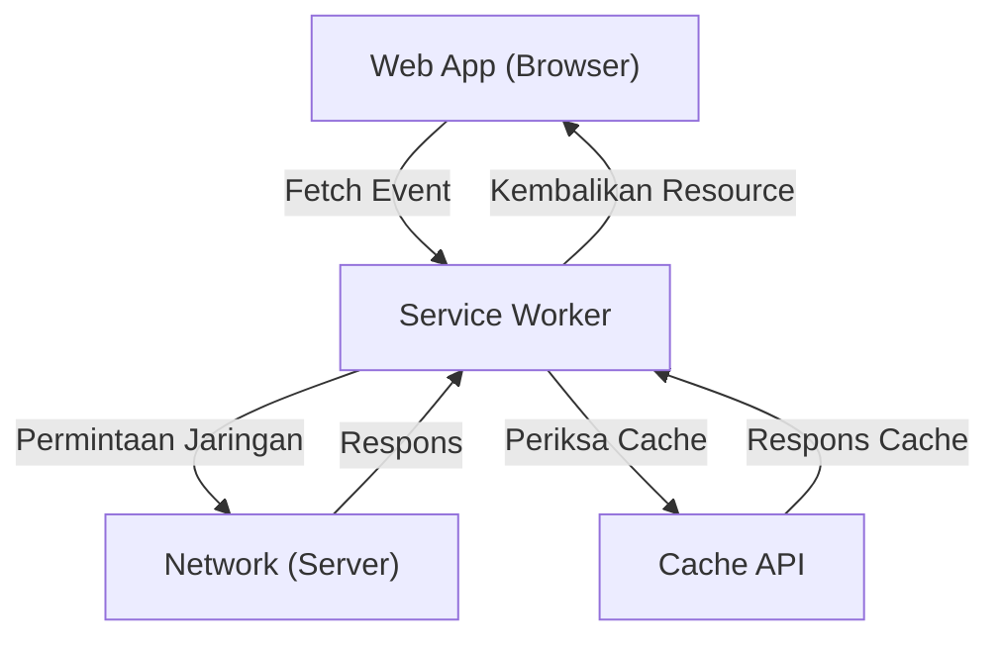

## 1. Pendahuluan: Evolusi Aplikasi Web

Aplikasi web telah berevolusi dari awalnya hanya menyediakan halaman HTML statis, lalu dengan perkembangan JavaScript, berevolusi menjadi Single Page Application (SPA) yang menawarkan pengalaman pengguna (UX) yang dinamis dan kaya. Namun, untuk waktu yang lama, terdapat kesenjangan besar antara aplikasi web dan aplikasi native (aplikasi iOS dan Android), seperti "tidak bisa beroperasi secara offline", "tidak ada notifikasi push seperti aplikasi native", dan "tidak bisa ditambahkan ke layar beranda".

Teknologi yang menjembatani kesenjangan ini dan membawa fitur canggih serta pengalaman pengguna yang luar biasa layaknya aplikasi native ke dalam aplikasi web adalah **Progressive Web Apps (PWA)**. Pada artikel ini, kita akan membahas secara sangat rinci mulai dari konsep PWA, hingga teknologi intinya yaitu cara kerja **Service Worker**, siklus hidupnya, dan berbagai strategi cache.

## 2. Kesenjangan antara Aplikasi Native dan Aplikasi Web

Ada tiga kesenjangan utama antara aplikasi native dan aplikasi web tradisional:

1.  **Ketergantungan Jaringan (Operasi Offline)**: Setelah diinstal, aplikasi native setidaknya dapat dibuka dan menampilkan data yang di-cache bahkan dalam keadaan offline tanpa koneksi jaringan. Di sisi lain, aplikasi web tradisional hanya akan menampilkan ikon dinosaurus peramban (kesalahan offline) jika tidak dapat terhubung ke jaringan.
2.  **Keterlibatan (Notifikasi Push, dll.)**: Aplikasi native dapat menggunakan fitur OS untuk mengirim notifikasi push dan mendorong pengguna untuk kembali membuka aplikasi.
3.  **UX yang Terintegrasi**: Aplikasi native hadir sebagai ikon di layar beranda, dapat dijalankan dalam layar penuh, dan memiliki akses mendalam ke fitur perangkat keras (kamera, GPS, dll.).

PWA bertujuan untuk menjembatani kesenjangan ini menggunakan teknologi web standar.

## 3. Tiga Elemen yang Membentuk PWA

PWA bukanlah sebuah teknologi tunggal, melainkan diwujudkan melalui kombinasi dari tiga elemen utama (praktik terbaik) berikut ini:

### 3.1. HTTPS (Komunikasi yang Aman)

Fungsi-fungsi canggih pada PWA (terutama Service Worker) dirancang agar hanya beroperasi di lingkungan yang aman untuk mencegah serangan man-in-the-middle. Oleh karena itu, agar dapat berfungsi sebagai PWA, seluruh situs harus disajikan melalui HTTPS (dengan pengecualian untuk lingkungan pengembangan lokal `localhost`).

### 3.2. Web App Manifest

Web App Manifest adalah file JSON (biasanya `manifest.json`) yang mendeskripsikan metadata tentang aplikasi web. File ini memungkinkan konfigurasi berikut:
-   **Tambahkan ke Layar Beranda**: Anda dapat menentukan ikon dan nama aplikasi.
-   **Mode Tampilan**: Anda dapat menyembunyikan UI peramban (seperti bilah URL) dan mengaturnya untuk tampil dalam layar penuh (`standalone` atau `fullscreen`).
-   **Layar Splash (Splash Screen)**: Anda dapat mengatur warna latar belakang dan ikon saat aplikasi diluncurkan.

### 3.3. Service Worker

Dan, teknologi paling penting yang membuat PWA menjadi PWA adalah **Service Worker**. Service Worker adalah lingkungan JavaScript (worker) yang dijalankan oleh peramban di latar belakang, terpisah dari halaman web. Ia tidak dapat mengakses DOM secara langsung, namun dapat mencegat (intercept) permintaan jaringan atau menerima notifikasi push.

## 4. Cara Kerja dan Peran Service Worker

Service Worker bertindak sebagai semacam "server proksi" yang berada di antara peramban dan jaringan. Hal ini memungkinkan aplikasi web untuk mengontrol status jaringan dan menyediakan fungsionalitas bahkan saat offline.



Peran utamanya adalah sebagai berikut:
-   **Mencegat Permintaan Jaringan**: Memantau semua permintaan dari halaman (gambar, CSS, permintaan API, dll.) dan, jika perlu, mengembalikan respons dari cache atau meneruskan permintaan ke jaringan.
-   **Sinkronisasi Latar Belakang (Background Sync)**: Merekam tindakan yang dilakukan pengguna saat offline (seperti mengirim pesan) dan secara otomatis mengirimkannya ke server saat kembali online.
-   **Notifikasi Push**: Dapat menerima notifikasi push dari server dan menampilkannya kepada pengguna meskipun peramban sedang ditutup.

## 5. Siklus Hidup Service Worker

Service Worker memiliki siklus hidupnya sendiri yang independen dari siklus hidup halaman web normal. Biasanya melewati tiga langkah berikut sebelum menjadi aktif.

### 5.1. Install (Instalasi)

Saat halaman web mendaftarkan skrip Service Worker (`navigator.serviceWorker.register()`), peramban akan mengunduh skrip tersebut dan memulai instalasi.
Pada fase ini, aset statis (HTML, CSS, JavaScript, gambar, dll.) yang diperlukan untuk operasi offline biasanya di-cache terlebih dahulu (pre-caching) menggunakan **Cache API**.

```javascript
self.addEventListener('install', (event) => {
  event.waitUntil(
    caches.open('v1-static-cache').then((cache) => {
      return cache.addAll([
        '/',
        '/index.html',
        '/styles/main.css',
        '/scripts/app.js',
        '/images/logo.png'
      ]);
    })
  );
});
```

### 5.2. Activate (Aktivasi)

Setelah instalasi selesai, Service Worker bertransisi ke fase Activate (Aktivasi). Namun, jika halaman yang sedang dibuka masih dikontrol oleh Service Worker yang lama, Service Worker yang baru tidak akan langsung aktif, melainkan masuk ke status "waiting" (menunggu hingga pengguna menutup semua halaman atau memuat ulang).
Fase ini cocok untuk melakukan tugas-tugas pembersihan, seperti menghapus cache yang sudah usang.

```javascript
self.addEventListener('activate', (event) => {
  const cacheWhitelist = ['v1-static-cache'];
  event.waitUntil(
    caches.keys().then((cacheNames) => {
      return Promise.all(
        cacheNames.map((cacheName) => {
          if (cacheWhitelist.indexOf(cacheName) === -1) {
            return caches.delete(cacheName); // Hapus cache usang
          }
        })
      );
    })
  );
});
```

### 5.3. Fetch (Pengambilan / Pemrosesan Event)

Setelah diaktifkan, Service Worker dapat mengontrol semua permintaan di dalam halaman. Dengan mendengarkan event `fetch`, ia dapat mengembalikan respons kustom terhadap permintaan.

## 6. Beragam Strategi Cache

Keunggulan Service Worker adalah kemampuannya untuk mengimplementasikan strategi cache (Cache Strategies) yang fleksibel yang disesuaikan dengan jenis permintaan dan kebutuhan. Berikut adalah beberapa strategi yang umum digunakan.

### 6.1. Cache First (Prioritas Cache)

Memeriksa cache terlebih dahulu, dan mengembalikannya jika ada. Jika tidak ada di cache, maka akan meminta ke jaringan. Ini ideal untuk sumber daya statis yang jarang berubah, seperti gambar dan CSS.

```javascript
self.addEventListener('fetch', (event) => {
  event.respondWith(
    caches.match(event.request).then((response) => {
      return response || fetch(event.request);
    })
  );
});
```

### 6.2. Network First (Prioritas Jaringan)

Selalu mencoba mengambil data terbaru dari jaringan. Hanya jika jaringan gagal (misalnya, saat offline), ia akan mengembalikan data dari cache sebagai fallback. Ini cocok untuk artikel berita atau linimasa media sosial yang selalu perlu menampilkan informasi terbaru.

### 6.3. Stale-While-Revalidate (Kembalikan Cache sembari Perbarui di Latar Belakang)

Pertama, segera kembalikan cache (Stale: data lama) untuk tampilan yang cepat, sementara pada saat yang sama meminta ke jaringan di latar belakang (Revalidate: validasi ulang) untuk memperbarui cache ke status terbaru. Saat pengguna mengaksesnya lagi, data yang diperbarui akan ditampilkan. Ini adalah strategi yang sering digunakan karena memberikan keseimbangan yang baik antara kecepatan tampilan dan kesegaran data.

### 6.4. Network Only / Cache Only

-   **Network Only**: Tidak menggunakan cache sama sekali, selalu mengambil dari jaringan.
-   **Cache Only**: Tidak menggunakan jaringan, selalu mengambil hanya dari cache.

## 7. Sinkronisasi Latar Belakang dan Notifikasi Push

Manfaat Service Worker tidak terbatas pada cache saja.

### Sinkronisasi Latar Belakang (Background Sync)

Jika pengguna mencoba mengirim data saat offline, API Sinkronisasi Latar Belakang pada Service Worker dapat digunakan untuk menyimpan tugas ke dalam antrean (queue). Ketika perangkat kembali online, peramban akan secara otomatis memulai Service Worker di latar belakang dan menjalankan tugas yang tersimpan di dalam antrean (pengiriman data). Ini memungkinkan pengguna untuk melanjutkan pengoperasian secara mulus tanpa menyadari bahwa mereka sedang offline.

### Notifikasi Push (Push Notifications)

Dengan berintegrasi bersama Web Push API, aplikasi web dapat mencapai notifikasi push yang setara dengan aplikasi native. Event push dari server diterima oleh Service Worker, memungkinkannya untuk menampilkan notifikasi bahkan saat peramban ditutup, yang mana dapat meningkatkan interaksi kembali dari pengguna (re-engagement).

## 8. Kesimpulan

Progressive Web Apps (PWA) dan Service Worker yang mendukungnya merupakan teknologi inovatif yang mendobrak batasan aplikasi web, menghadirkan kinerja dan pengalaman pengguna yang sebanding dengan aplikasi native.
Dengan menggabungkan keamanan melalui HTTPS, pengalaman instalasi dengan Manifest, serta dukungan offline dan kontrol cache tingkat lanjut menggunakan Service Worker, pengembang dapat membangun aplikasi web yang kuat dan benar-benar berharga bagi pengguna.

Dalam pengembangan web ke depannya, mengadopsi pendekatan PWA akan menjadi pilihan standar untuk memberikan UX yang lebih baik.
