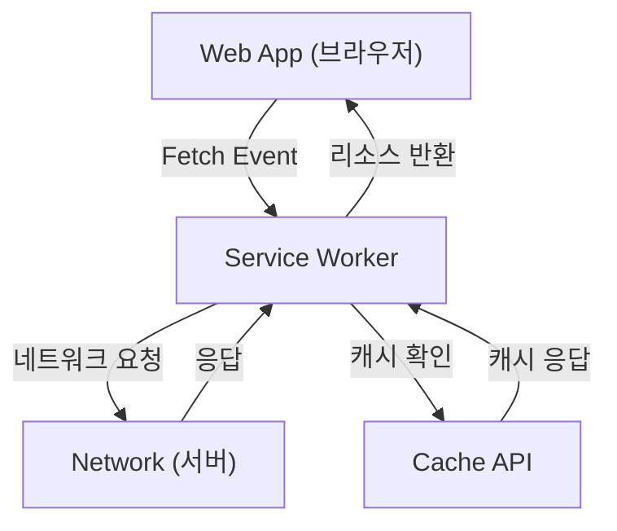

## 1. 시작하며: 웹 애플리케이션의 진화

웹 애플리케이션은 초기의 정적인 HTML 페이지 제공에서 시작하여, JavaScript의 진화에 따라 동적이고 풍부한 사용자 경험(UX)을 제공하는 싱글 페이지 애플리케이션(SPA)으로 진화해 왔습니다. 하지만 오랫동안 웹 애플리케이션에는 "오프라인에서는 동작하지 않는다", "네이티브 앱과 같은 푸시 알림이 없다", "홈 화면에 추가할 수 없다"와 같은, 네이티브 앱(iOS나 Android 앱)과 비교해 큰 격차가 존재했습니다.

이러한 격차를 줄이고, 웹 애플리케이션에 네이티브 앱과 같은 강력한 기능과 뛰어난 사용자 경험을 가져다주는 기술이 **프로그레시브 웹 앱(Progressive Web Apps, PWA)**입니다. 본 문서에서는 PWA의 개념부터 핵심 기술인 **서비스 워커(Service Worker)**의 원리, 수명 주기(Lifecycle), 그리고 다양한 캐시 전략까지 매우 상세하게 해설합니다.

## 2. 네이티브 앱과 웹 앱의 격차

네이티브 앱과 기존 웹 앱 사이에는 주로 다음 세 가지 큰 격차가 존재했습니다.

1.  **네트워크 의존성(오프라인 동작)**: 네이티브 앱은 한 번 설치하면 네트워크 환경이 없는 오프라인 상태라도 최소한 앱을 실행하여 캐시된 데이터를 표시할 수 있습니다. 반면, 기존 웹 앱은 네트워크에 연결할 수 없으면 브라우저의 공룡 아이콘(오프라인 에러)만 표시될 뿐이었습니다.
2.  **참여 유도(푸시 알림 등)**: 네이티브 앱은 OS의 기능을 이용하여 푸시 알림을 전송하고 사용자의 재방문을 유도할 수 있습니다.
3.  **통합된 UX**: 네이티브 앱은 홈 화면에 아이콘으로 존재하고 전체 화면으로 실행할 수 있으며, 기기의 하드웨어 기능(카메라, GPS 등)에 깊이 접근할 수 있습니다.

PWA는 웹의 표준 기술을 사용하여 이러한 격차를 줄이는 것을 목적으로 합니다.

## 3. PWA를 구성하는 3가지 요소

PWA는 단일 기술이 아니며, 다음 3가지 주요 요소(모범 사례)의 조합으로 구현됩니다.

### 3.1. HTTPS(안전한 통신)

PWA의 강력한 기능(특히 서비스 워커)은 중간자 공격 등을 방지하기 위해 안전한 환경에서만 동작하도록 설계되었습니다. 따라서 PWA로 기능하게 하려면 사이트 전체가 HTTPS로 제공되어야 합니다(로컬 개발 환경인 `localhost`는 예외적으로 허용됩니다).

### 3.2. 웹 앱 매니페스트(Web App Manifest)

웹 앱 매니페스트는 웹 앱에 관한 메타데이터를 작성한 JSON 파일(일반적으로 `manifest.json`)입니다. 이 파일을 통해 다음과 같은 설정이 가능합니다.
-   **홈 화면에 추가**: 앱의 아이콘이나 이름을 지정할 수 있습니다.
-   **표시 모드**: 브라우저의 UI(URL 표시줄 등)를 숨기고 전체 화면 표시(`standalone` 또는 `fullscreen`)를 설정할 수 있습니다.
-   **스플래시 화면**: 앱 실행 시의 배경색이나 아이콘을 설정할 수 있습니다.

### 3.3. 서비스 워커(Service Worker)

그리고 PWA를 진정한 PWA로 만드는 가장 중요한 기술이 **서비스 워커**입니다. 서비스 워커는 브라우저가 웹 페이지와는 별도로 백그라운드에서 실행하는 JavaScript 환경(워커)입니다. DOM에는 직접 접근할 수 없지만, 네트워크 요청을 가로채거나(인터셉트) 푸시 알림을 받을 수 있습니다.

## 4. 서비스 워커의 원리와 역할

서비스 워커는 브라우저와 네트워크 사이에 들어가는 "프록시 서버"와 같은 역할을 합니다. 이를 통해 웹 앱은 네트워크 상태를 제어하고 오프라인에서도 기능을 제공할 수 있게 됩니다.



주요 역할은 다음과 같습니다.
-   **네트워크 요청 가로채기**: 페이지에서 발생하는 요청(이미지, CSS, API 요청 등)을 모두 모니터링하고, 필요에 따라 캐시에서 응답을 반환하거나 네트워크로 요청을 전달합니다.
-   **백그라운드 동기화**: 사용자가 오프라인 상태일 때 수행한 작업(메시지 전송 등)을 기록하고, 온라인 상태로 복구되었을 때 자동으로 서버에 전송합니다.
-   **푸시 알림**: 브라우저가 닫혀 있어도 서버로부터 푸시 알림을 받아 사용자에게 표시할 수 있습니다.

## 5. 서비스 워커의 수명 주기

서비스 워커는 일반적인 웹 페이지의 수명 주기와는 독립적인 자체 수명 주기를 가지고 있습니다. 주로 다음 세 가지 단계를 거쳐 활성화됩니다.

### 5.1. Install (설치)

웹 페이지가 서비스 워커 스크립트를 등록(`navigator.serviceWorker.register()`)하면 브라우저는 스크립트를 다운로드하고 설치를 시작합니다.
이 단계에서는 일반적으로 오프라인 동작에 필요한 정적 에셋(HTML, CSS, JavaScript, 이미지 등)을 **Cache API**를 사용하여 사전 캐시(Pre-caching)합니다.

```javascript
self.addEventListener('install', (event) => {
  event.waitUntil(
    caches.open('v1-static-cache').then((cache) => {
      return cache.addAll([
        '/',
        '/index.html',
        '/styles/main.css',
        '/scripts/app.js',
        '/images/logo.png'
      ]);
    })
  );
});
```

### 5.2. Activate (활성화)

설치가 완료되면 서비스 워커는 활성화(Activate) 단계로 넘어갑니다. 단, 이미 이전 서비스 워커가 제어하고 있는 페이지가 열려 있는 경우, 새 서비스 워커는 즉시 활성화되지 않고 "대기 중(waiting)" 상태가 됩니다(사용자가 페이지를 모두 닫거나 새로고침할 때까지 대기합니다).
이 단계는 이전 캐시 삭제 등 정리 작업을 수행하기에 적합합니다.

```javascript
self.addEventListener('activate', (event) => {
  const cacheWhitelist = ['v1-static-cache'];
  event.waitUntil(
    caches.keys().then((cacheNames) => {
      return Promise.all(
        cacheNames.map((cacheName) => {
          if (cacheWhitelist.indexOf(cacheName) === -1) {
            return caches.delete(cacheName); // 이전 캐시 삭제
          }
        })
      );
    })
  );
});
```

### 5.3. Fetch (가져오기 / 이벤트 처리)

활성화되면 서비스 워커는 페이지 내의 모든 요청을 제어할 수 있게 됩니다. `fetch` 이벤트를 수신하여 요청에 대한 사용자 지정 응답을 반환할 수 있습니다.

## 6. 다양한 캐시 전략

서비스 워커의 강력한 점은 요청의 종류나 요구사항에 맞춰 유연한 캐시 전략(Cache Strategies)을 구현할 수 있다는 것입니다. 대표적인 전략 몇 가지를 소개합니다.

### 6.1. Cache First (캐시 우선)

먼저 캐시를 확인하고, 존재하면 그것을 반환합니다. 캐시에 없으면 네트워크에 요청합니다. 이미지나 CSS 등 자주 변경되지 않는 정적 리소스에 최적입니다.

```javascript
self.addEventListener('fetch', (event) => {
  event.respondWith(
    caches.match(event.request).then((response) => {
      return response || fetch(event.request);
    })
  );
});
```

### 6.2. Network First (네트워크 우선)

항상 네트워크에서 최신 데이터를 가져오려고 시도합니다. 네트워크가 실패한 경우(오프라인 시 등)에만 캐시에서 폴백(fallback)으로 데이터를 반환합니다. 항상 최신 정보를 표시해야 하는 뉴스 기사나 SNS의 타임라인 등에 적합합니다.

### 6.3. Stale-While-Revalidate (캐시를 반환하면서 백그라운드 업데이트)

먼저 즉시 캐시(Stale: 오래된 데이터)를 반환하여 빠르게 표시하고, 동시에 백그라운드에서 네트워크에 요청(Revalidate: 재검증)하여 캐시를 최신 상태로 업데이트합니다. 다음에 사용자가 접근할 때는 업데이트된 데이터가 표시됩니다. 표시 속도와 신선도의 균형이 좋아 자주 사용되는 전략입니다.

### 6.4. Network Only / Cache Only

-   **Network Only**: 캐시를 전혀 사용하지 않고 항상 네트워크에서 가져옵니다.
-   **Cache Only**: 네트워크를 사용하지 않고 항상 캐시에서만 가져옵니다.

## 7. 백그라운드 동기화와 푸시 알림

서비스 워커의 혜택은 캐시에만 머물지 않습니다.

### 백그라운드 동기화 (Background Sync)

사용자가 오프라인 상태일 때 데이터를 전송하려고 한 경우, 서비스 워커의 백그라운드 동기화 API를 이용하면 작업을 큐(대기열)에 저장할 수 있습니다. 기기가 온라인 상태로 복구되면 브라우저가 백그라운드에서 자동으로 서비스 워커를 실행하고 큐에 저장된 작업(데이터 전송)을 실행합니다. 이를 통해 사용자는 오프라인을 의식하지 않고 원활하게 작업을 계속할 수 있습니다.

### 푸시 알림 (Push Notifications)

웹 푸시 API(Web Push API)와 연동함으로써 웹 앱은 네이티브 앱과 동등한 푸시 알림을 구현할 수 있습니다. 서버의 푸시 이벤트는 서비스 워커에 의해 수신되며, 브라우저가 닫혀 있어도 알림을 표시하여 사용자의 재참여를 높일 수 있습니다.

## 8. 요약

프로그레시브 웹 앱(PWA)과 이를 뒷받침하는 서비스 워커는 웹 애플리케이션의 한계를 넓히고 네이티브 앱에 필적하는 성능과 사용자 경험을 제공하는 혁신적인 기술입니다.
HTTPS에 의한 보안, 매니페스트에 의한 설치 경험, 그리고 서비스 워커에 의한 오프라인 지원과 고도화된 캐시 제어를 결합함으로써 개발자는 사용자에게 진정으로 가치 있고 견고한 웹 애플리케이션을 구축할 수 있습니다.

앞으로의 웹 개발에서 PWA 접근 방식을 도입하는 것은 더 나은 UX를 제공하기 위한 표준적인 선택지가 될 것입니다.
