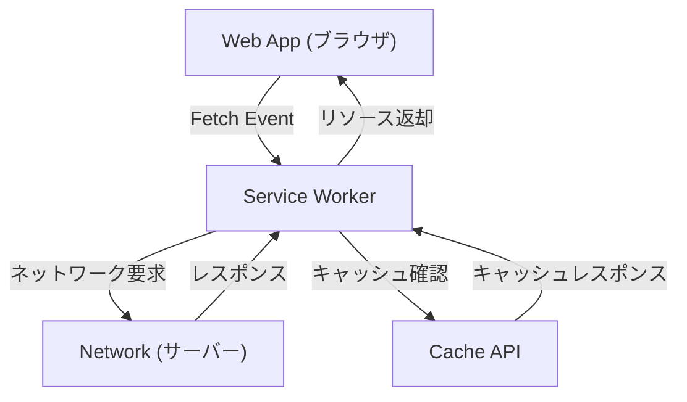

## 1. はじめに：Webアプリケーションの進化

Webアプリケーションは、初期の静的なHTMLページの提供から始まり、JavaScriptの進化によって動的でリッチなユーザー体験（UX）を提供するSingle Page Application (SPA)へと進化してきました。しかし、長らくの間、Webアプリケーションには「オフラインでは動作しない」「ネイティブアプリのようなプッシュ通知がない」「ホーム画面に追加できない」といった、ネイティブアプリ（iOSやAndroidアプリ）と比較して大きなギャップが存在していました。

このギャップを埋め、Webアプリケーションにネイティブアプリのような強力な機能と優れたユーザー体験をもたらす技術が**Progressive Web Apps（PWA）**です。本記事では、PWAの概念から、そのコア技術である**Service Worker**の仕組み、ライフサイクル、そして多様なキャッシュ戦略まで、非常に詳細に解説します。

## 2. ネイティブアプリとWebアプリのギャップ

ネイティブアプリと従来のWebアプリの間には、主に以下の3つの大きなギャップが存在していました。

1.  **ネットワーク依存性（オフライン動作）**: ネイティブアプリは一度インストールすれば、ネットワーク環境がないオフライン状態でも、少なくともアプリを起動してキャッシュされたデータを表示することができます。一方、従来のWebアプリは、ネットワークに接続できなければブラウザの恐竜アイコン（オフラインエラー）が表示されるだけでした。
2.  **エンゲージメント（プッシュ通知など）**: ネイティブアプリはOSの機能を利用してプッシュ通知を送信し、ユーザーの再訪を促すことができます。
3.  **統合されたUX**: ネイティブアプリはホーム画面にアイコンとして存在し、全画面で起動でき、デバイスのハードウェア機能（カメラ、GPSなど）に深くアクセスできます。

PWAは、Webの標準技術を用いてこれらのギャップを埋めることを目的としています。

## 3. PWAを構成する3つの要素

PWAは単一の技術ではなく、以下の3つの主要な要素（ベストプラクティス）の組み合わせによって実現されます。

### 3.1. HTTPS（セキュアな通信）

PWAの強力な機能（特にService Worker）は、中間者攻撃などを防ぐため、セキュアな環境でのみ動作するように設計されています。そのため、PWAとして機能させるには、サイト全体がHTTPSで提供されている必要があります（ローカル開発環境である`localhost`は例外的に許可されています）。

### 3.2. Web App Manifest（ウェブアプリマニフェスト）

Web App Manifestは、Webアプリに関するメタデータを記述したJSONファイル（通常は `manifest.json`）です。このファイルにより、以下のような設定が可能になります。
-   **ホーム画面への追加**: アプリのアイコンや名前を指定できます。
-   **表示モード**: ブラウザのUI（URLバーなど）を隠して全画面表示（`standalone` や `fullscreen`）にする設定ができます。
-   **スプラッシュ画面**: アプリ起動時の背景色やアイコンを設定できます。

### 3.3. Service Worker（サービスワーカー）

そして、PWAをPWAたらしめる最も重要な技術が**Service Worker**です。Service Workerは、ブラウザがWebページとは別のバックグラウンドで実行するJavaScript環境（ワーカー）です。DOMには直接アクセスできませんが、ネットワークリクエストをインターセプト（横取り）したり、プッシュ通知を受け取ったりすることができます。

## 4. Service Workerの仕組みと役割

Service Workerは、ブラウザとネットワークの間に入る「プロキシサーバー」のような役割を果たします。これにより、Webアプリはネットワークの状態を制御し、オフラインでも機能を提供できるようになります。



主な役割は以下の通りです。
-   **ネットワークリクエストのインターセプト**: ページからのリクエスト（画像、CSS、APIリクエストなど）を全て監視し、必要に応じてキャッシュから応答を返したり、ネットワークに要求を転送したりします。
-   **バックグラウンド同期**: ユーザーがオフライン時に行ったアクション（メッセージ送信など）を記録し、オンラインに復帰した際に自動的にサーバーに送信します。
-   **プッシュ通知**: ブラウザが閉じられていても、サーバーからのプッシュ通知を受け取り、ユーザーに表示することができます。

## 5. Service Workerのライフサイクル

Service Workerは、通常のWebページのライフサイクルとは独立した独自のライフサイクルを持っています。主に以下の3つのステップを経て有効になります。

### 5.1. Install（インストール）

WebページがService Workerのスクリプトを登録（`navigator.serviceWorker.register()`）すると、ブラウザはスクリプトをダウンロードし、インストールを開始します。
このフェーズでは、通常、オフライン動作に必要な静的アセット（HTML、CSS、JavaScript、画像など）を**Cache API**を使って事前キャッシュ（Pre-caching）します。

```javascript
self.addEventListener('install', (event) => {
  event.waitUntil(
    caches.open('v1-static-cache').then((cache) => {
      return cache.addAll([
        '/',
        '/index.html',
        '/styles/main.css',
        '/scripts/app.js',
        '/images/logo.png'
      ]);
    })
  );
});
```

### 5.2. Activate（有効化）

インストールが完了すると、Service WorkerはActivate（有効化）フェーズに移行します。ただし、すでに古いService Workerが制御しているページが開かれている場合、新しいService Workerはすぐには有効にならず、「waiting」状態になります（ユーザーがページをすべて閉じるかリロードするまで待機します）。
このフェーズは、古いキャッシュの削除など、クリーンアップ作業を行うのに適しています。

```javascript
self.addEventListener('activate', (event) => {
  const cacheWhitelist = ['v1-static-cache'];
  event.waitUntil(
    caches.keys().then((cacheNames) => {
      return Promise.all(
        cacheNames.map((cacheName) => {
          if (cacheWhitelist.indexOf(cacheName) === -1) {
            return caches.delete(cacheName); // 古いキャッシュを削除
          }
        })
      );
    })
  );
});
```

### 5.3. Fetch（フェッチ / イベントの処理）

有効化されると、Service Workerはページ内のすべてのリクエストを制御できるようになります。`fetch` イベントをリッスンすることで、リクエストに対するカスタムの応答を返すことができます。

## 6. 多様なキャッシュ戦略

Service Workerの強力な点は、リクエストの種類や要件に合わせて柔軟なキャッシュ戦略（Cache Strategies）を実装できることです。代表的な戦略をいくつか紹介します。

### 6.1. Cache First（キャッシュ優先）

まずキャッシュを確認し、存在すればそれを返します。キャッシュになければネットワークにリクエストします。画像やCSSなど、頻繁に変更されない静的リソースに最適です。

```javascript
self.addEventListener('fetch', (event) => {
  event.respondWith(
    caches.match(event.request).then((response) => {
      return response || fetch(event.request);
    })
  );
});
```

### 6.2. Network First（ネットワーク優先）

常にネットワークから最新のデータを取得しようと試みます。ネットワークが失敗した場合（オフライン時など）のみ、キャッシュからフォールバックとしてデータを返します。常に最新の情報を表示する必要があるニュース記事やSNSのタイムラインなどに適しています。

### 6.3. Stale-While-Revalidate（キャッシュを返しつつ裏で更新）

まずは即座にキャッシュ（Stale: 古いデータ）を返して高速に表示し、同時にバックグラウンドでネットワークにリクエスト（Revalidate: 再検証）してキャッシュを最新状態に更新します。次にユーザーがアクセスしたときには、更新されたデータが表示されます。表示速度と新鮮さのバランスが良く、頻繁に利用される戦略です。

### 6.4. Network Only / Cache Only

-   **Network Only**: キャッシュを一切使わず、常にネットワークから取得します。
-   **Cache Only**: ネットワークを使わず、常にキャッシュのみから取得します。

## 7. バックグラウンド同期とプッシュ通知

Service Workerの恩恵はキャッシュだけにとどまりません。

### バックグラウンド同期（Background Sync）

ユーザーがオフライン状態の時にデータを送信しようとした場合、Service Workerのバックグラウンド同期 API を利用すると、タスクをキューに保存できます。デバイスがオンラインに復帰すると、ブラウザがバックグラウンドで自動的にService Workerを起動し、キューに保存されたタスク（データの送信）を実行します。これにより、ユーザーはオフラインを意識せずにシームレスな操作を継続できます。

### プッシュ通知（Push Notifications）

Web Push APIと連携することで、Webアプリはネイティブアプリと同等のプッシュ通知を実現できます。サーバーからのプッシュイベントはService Workerによって受信され、ブラウザが閉じていても通知を表示し、ユーザーの再エンゲージメントを高めることが可能です。

## 8. まとめ

Progressive Web Apps（PWA）とそれを支えるService Workerは、Webアプリケーションの限界を押し広げ、ネイティブアプリに匹敵するパフォーマンスとユーザー体験をもたらす革新的な技術です。
HTTPSによる安全性、Manifestによるインストール体験、そしてService Workerによるオフライン対応と高度なキャッシュ制御を組み合わせることで、開発者はユーザーにとって真に価値のある堅牢なWebアプリケーションを構築することができます。

今後のWeb開発において、PWAのアプローチを取り入れることは、より良いUXを提供するための標準的な選択肢となっていくでしょう。
