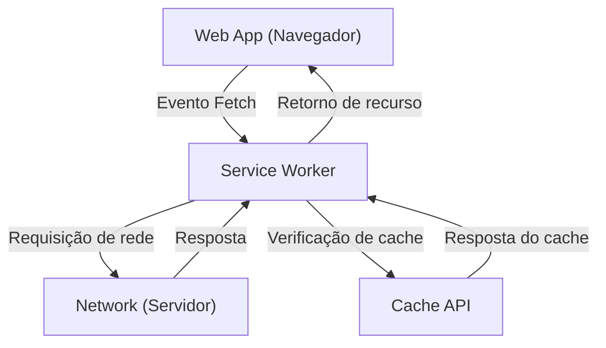

## 1. Introdução: A evolução dos aplicativos da Web

Os aplicativos da Web evoluíram do fornecimento de páginas HTML estáticas iniciais para Single Page Applications (SPA), que oferecem uma experiência de usuário (UX) dinâmica e rica através da evolução do JavaScript. No entanto, por muito tempo, os aplicativos da web tiveram uma grande lacuna em comparação aos aplicativos nativos (aplicativos iOS e Android), como "não funcionar offline", "não ter notificações push como aplicativos nativos" e "não poder ser adicionados à tela inicial".

A tecnologia que preenche essa lacuna e traz funcionalidades poderosas e uma excelente experiência de usuário semelhantes aos aplicativos nativos para os aplicativos da Web é o **Progressive Web Apps (PWA)**. Neste artigo, explicaremos de forma bastante detalhada, desde o conceito de PWA até como funciona sua tecnologia principal, o **Service Worker**, seu ciclo de vida e diversas estratégias de cache.

## 2. A lacuna entre aplicativos nativos e aplicativos da Web

Entre os aplicativos nativos e os aplicativos da Web tradicionais, existiam principalmente três grandes lacunas a seguir.

1.  **Dependência de rede (funcionamento offline)**: Os aplicativos nativos, uma vez instalados, podem pelo menos iniciar o aplicativo e exibir dados em cache, mesmo em estado offline sem um ambiente de rede. Por outro lado, os aplicativos da Web tradicionais apenas mostravam o ícone de dinossauro do navegador (erro offline) se não pudessem se conectar à rede.
2.  **Engajamento (notificações push, etc.)**: Os aplicativos nativos podem usar as funcionalidades do SO para enviar notificações push e encorajar os usuários a retornar.
3.  **UX integrada**: Os aplicativos nativos existem como um ícone na tela inicial, podem ser iniciados em tela cheia e têm acesso profundo aos recursos de hardware do dispositivo (câmera, GPS, etc.).

O PWA visa preencher essas lacunas usando tecnologias padrão da Web.

## 3. Três elementos que compõem o PWA

O PWA não é uma única tecnologia, mas é realizado pela combinação dos seguintes três elementos principais (melhores práticas).

### 3.1. HTTPS (Comunicação segura)

Os recursos poderosos do PWA (especialmente o Service Worker) são projetados para funcionar apenas em ambientes seguros para evitar ataques man-in-the-middle e afins. Portanto, para funcionar como um PWA, todo o site deve ser servido por HTTPS (o ambiente de desenvolvimento local `localhost` é permitido como uma exceção).

### 3.2. Web App Manifest (Manifesto de aplicativo da web)

O Web App Manifest é um arquivo JSON (geralmente `manifest.json`) que descreve metadados sobre o aplicativo da web. Através deste arquivo, as seguintes configurações são possíveis:
-   **Adicionar à tela inicial**: Você pode especificar o ícone e o nome do aplicativo.
-   **Modo de exibição**: Você pode configurá-lo para exibição em tela cheia (`standalone` ou `fullscreen`) ocultando a UI do navegador (como a barra de URL).
-   **Tela de abertura (Splash screen)**: Você pode definir a cor de fundo e o ícone quando o aplicativo é iniciado.

### 3.3. Service Worker

E a tecnologia mais importante que faz de um PWA um PWA é o **Service Worker**. O Service Worker é um ambiente JavaScript (worker) que o navegador executa em segundo plano, separado da página da web. Ele não pode acessar diretamente o DOM, mas pode interceptar (capturar) solicitações de rede e receber notificações push.

## 4. Como funciona o Service Worker e seu papel

O Service Worker atua como um "servidor proxy" que fica entre o navegador e a rede. Isso permite que o aplicativo da web controle o estado da rede e forneça funcionalidade mesmo offline.



Os principais papéis são os seguintes:
-   **Interceptação de solicitações de rede**: Ele monitora todas as solicitações (imagens, CSS, solicitações de API, etc.) da página e, conforme necessário, retorna respostas do cache ou encaminha solicitações para a rede.
-   **Sincronização em segundo plano**: Registra as ações tomadas pelo usuário offline (como envio de mensagens) e as envia automaticamente para o servidor quando retorna online.
-   **Notificações push**: Mesmo se o navegador estiver fechado, ele pode receber notificações push do servidor e exibi-las ao usuário.

## 5. Ciclo de vida do Service Worker

O Service Worker tem seu próprio ciclo de vida independente do ciclo de vida de uma página da web normal. Ele se torna ativo principalmente pelas três etapas a seguir.

### 5.1. Install (Instalar)

Quando a página da web registra o script do Service Worker (`navigator.serviceWorker.register()`), o navegador baixa o script e inicia a instalação.
Nesta fase, ativos estáticos necessários para operação offline (HTML, CSS, JavaScript, imagens, etc.) geralmente são armazenados em pré-cache (Pre-caching) usando a **Cache API**.

```javascript
self.addEventListener('install', (event) => {
  event.waitUntil(
    caches.open('v1-static-cache').then((cache) => {
      return cache.addAll([
        '/',
        '/index.html',
        '/styles/main.css',
        '/scripts/app.js',
        '/images/logo.png'
      ]);
    })
  );
});
```

### 5.2. Activate (Ativar)

Assim que a instalação estiver concluída, o Service Worker passa para a fase Activate (Ativar). No entanto, se uma página controlada por um Service Worker antigo já estiver aberta, o novo Service Worker não se tornará ativo imediatamente, mas entrará em um estado de "espera" (ele aguarda até que o usuário feche ou recarregue todas as páginas).
Esta fase é adequada para realizar trabalhos de limpeza, como exclusão de caches antigos.

```javascript
self.addEventListener('activate', (event) => {
  const cacheWhitelist = ['v1-static-cache'];
  event.waitUntil(
    caches.keys().then((cacheNames) => {
      return Promise.all(
        cacheNames.map((cacheName) => {
          if (cacheWhitelist.indexOf(cacheName) === -1) {
            return caches.delete(cacheName); // Excluir caches antigos
          }
        })
      );
    })
  );
});
```

### 5.3. Fetch (Buscar / Tratamento de eventos)

Uma vez ativado, o Service Worker pode controlar todas as solicitações dentro da página. Ao escutar o evento `fetch`, você pode retornar uma resposta personalizada à solicitação.

## 6. Diversas estratégias de cache

O ponto forte do Service Worker é que ele permite implementar estratégias de cache (Cache Strategies) flexíveis para se adequar ao tipo e aos requisitos da solicitação. Apresentaremos algumas estratégias típicas.

### 6.1. Cache First (Cache primeiro)

Primeiro verifica o cache e, se existir, ele o retorna. Se não estiver no cache, ele solicita à rede. Ideal para recursos estáticos que não mudam com frequência, como imagens e CSS.

```javascript
self.addEventListener('fetch', (event) => {
  event.respondWith(
    caches.match(event.request).then((response) => {
      return response || fetch(event.request);
    })
  );
});
```

### 6.2. Network First (Rede primeiro)

Sempre tenta obter os dados mais recentes da rede. Somente se a rede falhar (como ao estar offline), ele retorna os dados do cache como um fallback (alternativa). É adequado para artigos de notícias ou linhas do tempo de redes sociais (SNS), onde é necessário exibir sempre as informações mais recentes.

### 6.3. Stale-While-Revalidate (Retornar cache enquanto atualiza em segundo plano)

Primeiro, ele retorna imediatamente o cache (Stale: dados antigos) para uma exibição rápida e, ao mesmo tempo, faz uma solicitação à rede em segundo plano (Revalidate: revalidar) para atualizar o cache para o estado mais recente. Na próxima vez que o usuário acessar, os dados atualizados serão exibidos. É uma estratégia frequentemente usada com um bom equilíbrio entre velocidade de exibição e frescor.

### 6.4. Network Only / Cache Only (Somente Rede / Somente Cache)

-   **Network Only**: Não usa cache e sempre busca na rede.
-   **Cache Only**: Não usa rede e busca sempre apenas no cache.

## 7. Sincronização em segundo plano e notificações push

Os benefícios do Service Worker vão além do cache.

### Sincronização em segundo plano (Background Sync)

Se um usuário tentar enviar dados enquanto estiver offline, as tarefas podem ser salvas em uma fila usando a API de sincronização em segundo plano do Service Worker. Quando o dispositivo retorna online, o navegador inicia automaticamente o Service Worker em segundo plano e executa as tarefas salvas na fila (envio de dados). Isso permite que os usuários continuem operando perfeitamente sem ter consciência de que estão offline.

### Notificações push (Push Notifications)

Ao se integrar à Web Push API, os aplicativos da web podem realizar notificações push equivalentes a aplicativos nativos. Os eventos de push do servidor são recebidos pelo Service Worker e podem exibir notificações mesmo quando o navegador está fechado, aumentando o reengajamento do usuário.

## 8. Conclusão

Os Progressive Web Apps (PWA) e os Service Workers que os sustentam são tecnologias inovadoras que ampliam os limites dos aplicativos da web, proporcionando desempenho e experiências de usuário comparáveis aos aplicativos nativos.
Combinando a segurança do HTTPS, a experiência de instalação via Manifest e a capacidade offline com o controle de cache avançado do Service Worker, os desenvolvedores podem criar aplicativos da web robustos e que sejam verdadeiramente valiosos para os usuários.

No futuro do desenvolvimento web, a adoção da abordagem PWA se tornará uma escolha padrão para fornecer uma melhor UX.
