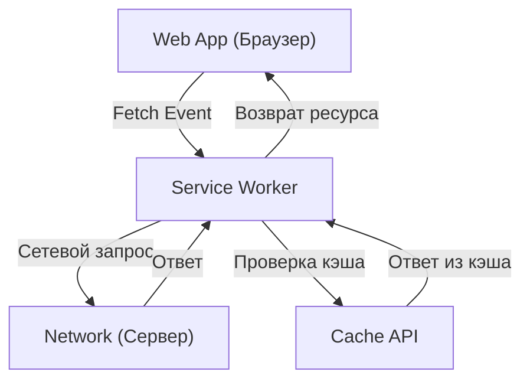

## 1. Введение: Эволюция веб-приложений

Веб-приложения прошли путь от предоставления ранних статических HTML-страниц до Single Page Application (SPA), которые предлагают динамичный и богатый пользовательский опыт (UX) благодаря эволюции JavaScript. Однако долгое время веб-приложения имели значительный разрыв по сравнению с нативными приложениями (для iOS и Android), так как они «не работали в автономном режиме», «не имели push-уведомлений, как у нативных приложений» и «не могли быть добавлены на главный экран».

Технология, которая устраняет этот пробел и приносит веб-приложениям мощные функции и превосходный пользовательский опыт, подобные нативным приложениям, называется **Progressive Web Apps (PWA)**. В этой статье мы подробно рассмотрим все: от концепции PWA до механизма работы его основной технологии **Service Worker**, жизненного цикла и различных стратегий кэширования.

## 2. Разрыв между нативными и веб-приложениями

Между нативными приложениями и традиционными веб-приложениями существовали три основных больших пробела:

1.  **Зависимость от сети (автономная работа)**: Как только нативное приложение установлено, даже в автономном режиме без сетевого окружения вы можете, по крайней мере, запустить приложение и просмотреть кэшированные данные. С другой стороны, традиционное веб-приложение показывало только иконку динозавра в браузере (ошибка отсутствия сети), если не могло подключиться к сети.
2.  **Вовлеченность (push-уведомления и т.д.)**: Нативные приложения могут использовать функции ОС для отправки push-уведомлений, поощряя пользователей к возвращению.
3.  **Интегрированный UX**: Нативные приложения присутствуют на главном экране в виде иконок, могут запускаться в полноэкранном режиме и имеют глубокий доступ к аппаратным функциям устройства (камера, GPS и т.д.).

Цель PWA — устранить эти пробелы с использованием стандартных веб-технологий.

## 3. Три элемента, составляющие PWA

PWA — это не единая технология, а реализация путем комбинации следующих трех основных элементов (лучших практик).

### 3.1. HTTPS (Безопасная связь)

Мощные функции PWA (особенно Service Worker) предназначены для работы только в защищенной среде для предотвращения атак типа "человек посередине". Поэтому, чтобы функционировать как PWA, весь сайт должен предоставляться по HTTPS (локальная среда разработки `localhost` разрешена в виде исключения).

### 3.2. Web App Manifest (Манифест веб-приложения)

Web App Manifest — это JSON-файл (обычно `manifest.json`), который описывает метаданные о веб-приложении. Этот файл позволяет выполнять следующие настройки:
-   **Добавление на главный экран**: Вы можете указать иконку и название приложения.
-   **Режим отображения**: Вы можете скрыть UI браузера (например, панель URL) и установить отображение в полноэкранном режиме (`standalone` или `fullscreen`).
-   **Заставка**: Вы можете установить цвет фона и иконку при запуске приложения.

### 3.3. Service Worker (Сервис-воркер)

Самой важной технологией, делающей PWA именно PWA, является **Service Worker**. Service Worker — это среда JavaScript (воркер), которую браузер запускает в фоновом режиме, отдельно от веб-страницы. Он не имеет прямого доступа к DOM, но может перехватывать сетевые запросы и получать push-уведомления.

## 4. Механизм и роль Service Worker

Service Worker действует как «прокси-сервер», который находится между браузером и сетью. Это позволяет веб-приложению контролировать состояние сети и предоставлять функциональность даже в автономном режиме.



Основные роли заключаются в следующем:
-   **Перехват сетевых запросов**: Мониторит все запросы со страницы (изображения, CSS, API-запросы и т.д.) и при необходимости возвращает ответы из кэша или перенаправляет запросы в сеть.
-   **Фоновая синхронизация**: Записывает действия, выполненные пользователем в автономном режиме (например, отправка сообщений), и автоматически отправляет их на сервер при возобновлении подключения к сети.
-   **Push-уведомления**: Даже если браузер закрыт, он может получать push-уведомления от сервера и отображать их пользователю.

## 5. Жизненный цикл Service Worker

Service Worker имеет свой собственный жизненный цикл, независимый от жизненного цикла обычной веб-страницы. В основном он становится активным, пройдя следующие три этапа.

### 5.1. Install (Установка)

Когда веб-страница регистрирует скрипт Service Worker (`navigator.serviceWorker.register()`), браузер загружает скрипт и начинает установку.
На этом этапе статические ресурсы (HTML, CSS, JavaScript, изображения и т.д.), необходимые для автономной работы, обычно предварительно кэшируются (Pre-caching) с помощью **Cache API**.

```javascript
self.addEventListener('install', (event) => {
  event.waitUntil(
    caches.open('v1-static-cache').then((cache) => {
      return cache.addAll([
        '/',
        '/index.html',
        '/styles/main.css',
        '/scripts/app.js',
        '/images/logo.png'
      ]);
    })
  );
});
```

### 5.2. Activate (Активация)

После завершения установки Service Worker переходит в фазу активации (Activate). Однако, если страница, контролируемая старым Service Worker, уже открыта, новый Service Worker не станет активным немедленно, а перейдет в состояние «ожидания» (он ждет, пока пользователь не закроет все страницы или не перезагрузит их).
Этот этап хорошо подходит для выполнения задач очистки, таких как удаление старых кэшей.

```javascript
self.addEventListener('activate', (event) => {
  const cacheWhitelist = ['v1-static-cache'];
  event.waitUntil(
    caches.keys().then((cacheNames) => {
      return Promise.all(
        cacheNames.map((cacheName) => {
          if (cacheWhitelist.indexOf(cacheName) === -1) {
            return caches.delete(cacheName); // Удаляем старый кэш
          }
        })
      );
    })
  );
});
```

### 5.3. Fetch (Извлечение / Обработка событий)

После активации Service Worker может контролировать все запросы на странице. Прослушивая событие `fetch`, вы можете возвращать пользовательские ответы на запросы.

## 6. Различные стратегии кэширования

Сильная сторона Service Worker заключается в том, что вы можете реализовывать гибкие стратегии кэширования (Cache Strategies), адаптированные к типам запросов и требованиям. Вот некоторые типичные стратегии.

### 6.1. Cache First (Сначала кэш)

Сначала проверяет кэш и возвращает его, если он существует. Если его нет в кэше, он запрашивает сеть. Идеально подходит для статических ресурсов, которые не меняются часто, таких как изображения и CSS.

```javascript
self.addEventListener('fetch', (event) => {
  event.respondWith(
    caches.match(event.request).then((response) => {
      return response || fetch(event.request);
    })
  );
});
```

### 6.2. Network First (Сначала сеть)

Всегда пытается получить последние данные из сети. Только в случае сбоя сети (например, при отсутствии сети) он возвращает данные из кэша в качестве резервного варианта. Подходит для новостных статей или таймлайнов социальных сетей, где всегда необходимо отображать актуальную информацию.

### 6.3. Stale-While-Revalidate (Устаревший при ревалидации)

Сначала он немедленно возвращает кэш (Stale: старые данные) для быстрого отображения, а в то же время делает фоновый запрос к сети (Revalidate: повторная проверка) для обновления кэша до последнего состояния. В следующий раз, когда пользователь получит доступ, будут показаны обновленные данные. Это часто используемая стратегия, которая обеспечивает хороший баланс между скоростью отображения и свежестью.

### 6.4. Network Only / Cache Only

-   **Network Only**: Совсем не использует кэш, всегда получает из сети.
-   **Cache Only**: Не использует сеть, всегда получает только из кэша.

## 7. Фоновая синхронизация и Push-уведомления

Преимущества Service Worker не ограничиваются только кэшированием.

### Фоновая синхронизация (Background Sync)

Если пользователь пытается отправить данные в автономном режиме, с помощью API фоновой синхронизации Service Worker задача может быть сохранена в очереди. Когда устройство снова подключается к сети, браузер автоматически запускает Service Worker в фоновом режиме и выполняет задачи (отправку данных), сохраненные в очереди. Это позволяет пользователям продолжать работу плавно, не задумываясь о том, что они находятся в автономном режиме.

### Push-уведомления (Push Notifications)

Интегрируясь с Web Push API, веб-приложения могут реализовывать push-уведомления наравне с нативными приложениями. Push-события с сервера принимаются Service Worker, что позволяет отображать уведомления даже при закрытом браузере, повышая повторную вовлеченность пользователей.

## 8. Заключение

Progressive Web Apps (PWA) и поддерживающий их Service Worker — это инновационные технологии, которые раздвигают границы веб-приложений, обеспечивая производительность и пользовательский опыт, сопоставимые с нативными приложениями.
Комбинируя безопасность через HTTPS, опыт установки с помощью Manifest, а также автономную поддержку и расширенное управление кэшем с помощью Service Worker, разработчики могут создавать надежные веб-приложения, которые действительно ценны для пользователей.

В будущей веб-разработке принятие подхода PWA, вероятно, станет стандартным выбором для обеспечения лучшего UX.
