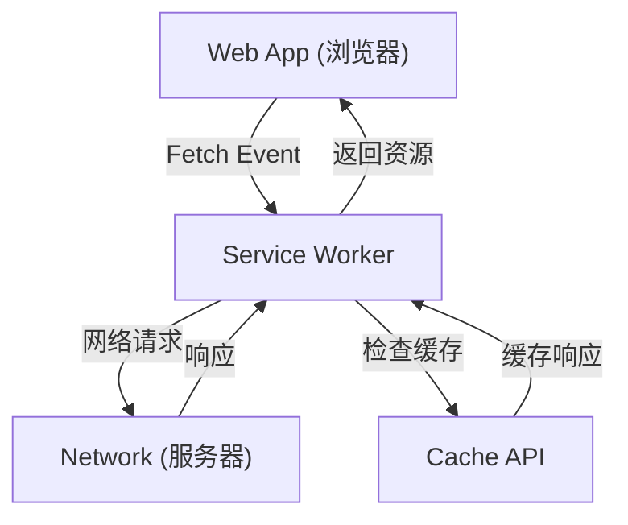

## 1. 引言：Web 应用程序的演进

Web 应用程序从最初提供静态 HTML 页面开始，随着 JavaScript 的发展，已经演变为提供动态且丰富的用户体验 (UX) 的单页应用 (Single Page Application, SPA)。然而，长期以来，与原生应用程序（iOS 或 Android 应用程序）相比，Web 应用程序存在着巨大的差距，例如“无法离线运行”、“没有类似原生应用的推送通知”、“无法添加到主屏幕”等。

为了填补这一差距，并为 Web 应用程序带来类似原生应用的强大功能和卓越用户体验，**Progressive Web Apps (PWA)** 技术应运而生。本文将从 PWA 的概念开始，非常详细地解释其核心技术 **Service Worker** 的工作原理、生命周期以及各种缓存策略。

## 2. 原生应用与 Web 应用之间的差距

原生应用与传统 Web 应用之间，主要存在以下三个巨大的差距：

1.  **网络依赖性 (离线运行)**: 原生应用一旦安装，即使在没有网络环境的离线状态下，至少也能启动应用并显示已缓存的数据。另一方面，传统的 Web 应用如果不连接网络，就只会显示浏览器的恐龙图标（离线错误）。
2.  **参与度 (推送通知等)**: 原生应用可以利用操作系统的功能发送推送通知，从而促使用户再次访问。
3.  **集成的 UX**: 原生应用作为图标存在于主屏幕上，可以全屏启动，并且可以深入访问设备的硬件功能（如摄像头、GPS 等）。

PWA 旨在利用 Web 标准技术来填补这些差距。

## 3. 构成 PWA 的 3 个要素

PWA 并非单一技术，而是通过组合以下 3 个主要要素（最佳实践）来实现的。

### 3.1. HTTPS (安全通信)

PWA 的强大功能（尤其是 Service Worker）被设计为仅在安全环境中运行，以防止中间人攻击等。因此，为了使其作为 PWA 运行，整个站点必须通过 HTTPS 提供（本地开发环境 `localhost` 是例外允许的）。

### 3.2. Web App Manifest (Web 应用清单)

Web App Manifest 是一个描述 Web 应用相关元数据的 JSON 文件（通常为 `manifest.json`）。通过此文件，可以进行以下设置：
-   **添加到主屏幕**: 可以指定应用的图标和名称。
-   **显示模式**: 可以设置隐藏浏览器 UI（如 URL 栏）并全屏显示（`standalone` 或 `fullscreen`）。
-   **启动画面**: 可以设置应用启动时的背景色和图标。

### 3.3. Service Worker

并且，使 PWA 成为 PWA 的最重要技术是 **Service Worker**。Service Worker 是浏览器在独立于 Web 页面的后台运行的 JavaScript 环境（工作线程）。它无法直接访问 DOM，但可以拦截网络请求，或接收推送通知。

## 4. Service Worker 的工作原理和作用

Service Worker 扮演着介于浏览器和网络之间的“代理服务器”的角色。这使得 Web 应用能够控制网络状态，并即使在离线状态下也能提供功能。



主要作用如下：
-   **拦截网络请求**: 监控来自页面的所有请求（如图片、CSS、API 请求等），并根据需要从缓存返回响应，或将请求转发到网络。
-   **后台同步**: 记录用户在离线时执行的操作（如发送消息等），并在恢复在线时自动发送到服务器。
-   **推送通知**: 即使浏览器已关闭，也能接收来自服务器的推送通知，并显示给用户。

## 5. Service Worker 的生命周期

Service Worker 拥有独立于常规 Web 页面生命周期的独特生命周期。它主要通过以下 3 个步骤生效。

### 5.1. Install (安装)

当 Web 页面注册 Service Worker 脚本（`navigator.serviceWorker.register()`）时，浏览器会下载脚本并开始安装。
在这个阶段，通常使用 **Cache API** 预缓存 (Pre-caching) 离线运行所需的静态资源（如 HTML、CSS、JavaScript、图片等）。

```javascript
self.addEventListener('install', (event) => {
  event.waitUntil(
    caches.open('v1-static-cache').then((cache) => {
      return cache.addAll([
        '/',
        '/index.html',
        '/styles/main.css',
        '/scripts/app.js',
        '/images/logo.png'
      ]);
    })
  );
});
```

### 5.2. Activate (激活)

安装完成后，Service Worker 会过渡到 Activate（激活）阶段。但是，如果已经有旧的 Service Worker 控制着打开的页面，新的 Service Worker 不会立即激活，而是进入“waiting”状态（等待直到用户关闭所有页面或重新加载）。
此阶段适合执行清理工作，例如删除旧缓存。

```javascript
self.addEventListener('activate', (event) => {
  const cacheWhitelist = ['v1-static-cache'];
  event.waitUntil(
    caches.keys().then((cacheNames) => {
      return Promise.all(
        cacheNames.map((cacheName) => {
          if (cacheWhitelist.indexOf(cacheName) === -1) {
            return caches.delete(cacheName); // 删除旧缓存
          }
        })
      );
    })
  );
});
```

### 5.3. Fetch (获取 / 事件处理)

激活后，Service Worker 就可以控制页面内的所有请求。通过监听 `fetch` 事件，可以对请求返回自定义响应。

## 6. 多样的缓存策略

Service Worker 的强大之处在于，可以根据请求的类型和要求实现灵活的缓存策略 (Cache Strategies)。这里介绍几个代表性的策略。

### 6.1. Cache First (缓存优先)

首先检查缓存，如果存在则返回它。如果不在缓存中，则向网络发出请求。这非常适合不经常更改的静态资源，例如图片和 CSS。

```javascript
self.addEventListener('fetch', (event) => {
  event.respondWith(
    caches.match(event.request).then((response) => {
      return response || fetch(event.request);
    })
  );
});
```

### 6.2. Network First (网络优先)

始终尝试从网络获取最新数据。只有在网络失败（如离线时）时，才作为回退方案从缓存中返回数据。适合必须始终显示最新信息的新闻文章或 SNS 时间线等。

### 6.3. Stale-While-Revalidate (返回缓存同时在后台更新)

首先立即返回缓存（Stale: 旧数据）以实现快速显示，同时在后台向网络发出请求（Revalidate: 重新验证）以将缓存更新到最新状态。用户下次访问时，将显示更新后的数据。这是一种兼顾显示速度和新鲜度平衡的策略，被频繁使用。

### 6.4. Network Only / Cache Only

-   **Network Only**: 完全不使用缓存，始终从网络获取。
-   **Cache Only**: 不使用网络，始终仅从缓存获取。

## 7. 后台同步与推送通知

Service Worker 的好处不仅限于缓存。

### 后台同步 (Background Sync)

当用户在离线状态下尝试发送数据时，利用 Service Worker 的后台同步 API，可以将任务保存到队列中。当设备恢复在线时，浏览器会在后台自动启动 Service Worker，并执行保存在队列中的任务（发送数据）。这使得用户可以继续无缝操作，而无需意识到离线状态。

### 推送通知 (Push Notifications)

通过与 Web Push API 配合使用，Web 应用可以实现与原生应用同等的推送通知。来自服务器的推送事件由 Service Worker 接收，即使浏览器关闭也能显示通知，从而提高用户的重新参与度。

## 8. 总结

Progressive Web Apps (PWA) 及其底层的 Service Worker 是不断突破 Web 应用局限，并带来媲美原生应用性能和用户体验的创新技术。
通过将 HTTPS 的安全性、Manifest 带来的安装体验，以及 Service Worker 的离线支持和高级缓存控制相结合，开发者可以构建出对用户具有真正价值的强大 Web 应用程序。

在未来的 Web 开发中，采用 PWA 的方法将成为提供更好 UX 的标准选择。
