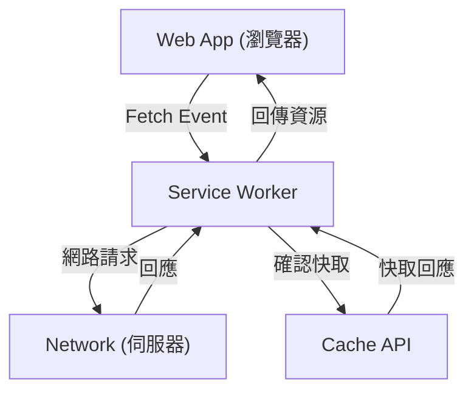

## 1. 簡介：網頁應用程式的演進

網頁應用程式從早期提供靜態 HTML 網頁開始，隨著 JavaScript 的演進，發展成能夠提供動態且豐富使用者體驗 (UX) 的單頁應用程式 (Single Page Application, SPA)。然而，長久以來，網頁應用程式與原生應用程式（iOS 或 Android 應用程式）相比，存在著巨大的落差，例如「無法在離線狀態下運作」、「沒有像原生應用程式那樣的推播通知」、「無法新增到主畫面」等。

填補這個落差，並為網頁應用程式帶來如同原生應用程式般強大功能與卓越使用者體驗的技術，就是 **漸進式網頁應用程式 (Progressive Web Apps, PWA)**。本文將從 PWA 的概念開始，非常詳細地解說其核心技術 **Service Worker** 的運作原理、生命週期，以及多樣化的快取策略。

## 2. 原生應用程式與網頁應用程式的落差

原生應用程式與傳統網頁應用程式之間，主要存在以下三個巨大的落差：

1.  **網路依賴性 (離線運作)**：原生應用程式只要安裝一次，即使在沒有網路環境的離線狀態下，至少也能開啟應用程式並顯示已快取的資料。另一方面，傳統網頁應用程式如果無法連上網路，瀏覽器就只會顯示恐龍圖示（離線錯誤）。
2.  **互動參與 (推播通知等)**：原生應用程式可以利用作業系統的功能發送推播通知，促使使用者再次造訪。
3.  **整合的 UX**：原生應用程式會以圖示的形式存在於主畫面上，能夠全螢幕啟動，並且可以深入存取裝置的硬體功能（相機、GPS 等）。

PWA 的目的就是利用網頁的標準技術來填補這些落差。

## 3. 構成 PWA 的三個要素

PWA 並不是單一技術，而是由以下三個主要要素（最佳實踐）組合而成的。

### 3.1. HTTPS (安全的通訊)

PWA 的強大功能（特別是 Service Worker）被設計為只能在安全的環境中運作，以防止中間人攻擊等。因此，為了讓 PWA 發揮作用，整個網站必須透過 HTTPS 提供（做為本地開發環境的 `localhost` 是例外的允許情況）。

### 3.2. Web App Manifest (網頁應用程式清單)

Web App Manifest 是一個以 JSON 格式編寫的檔案（通常是 `manifest.json`），其中包含了網頁應用程式的詮釋資料 (Metadata)。透過這個檔案，可以進行以下設定：
-   **新增至主畫面**：可以指定應用程式的圖示與名稱。
-   **顯示模式**：可以設定隱藏瀏覽器的 UI（如 URL 網址列等），以全螢幕顯示 (`standalone` 或 `fullscreen`)。
-   **啟動畫面**：可以設定應用程式啟動時的背景顏色與圖示。

### 3.3. Service Worker

而讓 PWA 真正成為 PWA 最重要的技術，就是 **Service Worker**。Service Worker 是瀏覽器在網頁之外於背景執行的 JavaScript 環境（Worker）。它無法直接存取 DOM，但能夠攔截網路請求，或是接收推播通知。

## 4. Service Worker 的運作原理與職責

Service Worker 扮演著介於瀏覽器與網路之間的「代理伺服器」角色。透過它，網頁應用程式就能夠控制網路狀態，即使在離線狀態下也能提供功能。



主要的職責如下：
-   **攔截網路請求**：監控來自網頁的所有請求（圖片、CSS、API 請求等），並根據需求從快取回傳回應，或是將請求轉發到網路。
-   **背景同步**：記錄使用者在離線時所執行的操作（如發送訊息等），並在恢復連線時自動發送到伺服器。
-   **推播通知**：即使瀏覽器處於關閉狀態，也能接收來自伺服器的推播通知，並顯示給使用者看。

## 5. Service Worker 的生命週期

Service Worker 擁有自己獨立的生命週期，與一般網頁的生命週期不同。它主要會經過以下三個步驟來生效。

### 5.1. Install (安裝)

當網頁註冊了 Service Worker 的腳本 (`navigator.serviceWorker.register()`) 後，瀏覽器就會下載該腳本並開始安裝。
在這個階段，通常會使用 **Cache API** 來預先快取 (Pre-caching) 離線運作所需的靜態資源（HTML、CSS、JavaScript、圖片等）。

```javascript
self.addEventListener('install', (event) => {
  event.waitUntil(
    caches.open('v1-static-cache').then((cache) => {
      return cache.addAll([
        '/',
        '/index.html',
        '/styles/main.css',
        '/scripts/app.js',
        '/images/logo.png'
      ]);
    })
  );
});
```

### 5.2. Activate (啟用)

安裝完成後，Service Worker 就會進入 Activate (啟用) 階段。不過，如果目前開啟的網頁仍由舊版的 Service Worker 控制，新版的 Service Worker 就不會立刻生效，而是會處於「waiting (等待)」狀態（直到使用者關閉所有網頁或重新整理為止）。
這個階段很適合用來執行清理作業，例如刪除舊的快取。

```javascript
self.addEventListener('activate', (event) => {
  const cacheWhitelist = ['v1-static-cache'];
  event.waitUntil(
    caches.keys().then((cacheNames) => {
      return Promise.all(
        cacheNames.map((cacheName) => {
          if (cacheWhitelist.indexOf(cacheName) === -1) {
            return caches.delete(cacheName); // 刪除舊的快取
          }
        })
      );
    })
  );
});
```

### 5.3. Fetch (擷取 / 處理事件)

一旦啟用後，Service Worker 就能夠控制網頁內的所有請求。透過監聽 `fetch` 事件，可以針對請求回傳自訂的回應。

## 6. 多樣化的快取策略

Service Worker 最強大的地方在於，可以根據請求的類型或需求，實作出靈活的快取策略 (Cache Strategies)。以下介紹幾個具代表性的策略。

### 6.1. Cache First (快取優先)

首先確認快取，如果存在就直接回傳快取內容。如果快取中沒有，才會向網路發出請求。這個策略非常適合用於圖片或 CSS 等不常變動的靜態資源。

```javascript
self.addEventListener('fetch', (event) => {
  event.respondWith(
    caches.match(event.request).then((response) => {
      return response || fetch(event.request);
    })
  );
});
```

### 6.2. Network First (網路優先)

總是嘗試從網路取得最新的資料。只有在網路請求失敗時（例如離線時），才會作為備案從快取回傳資料。適合用於總是需要顯示最新資訊的新聞文章或社群媒體動態消息等。

### 6.3. Stale-While-Revalidate (回傳快取的同時在背景更新)

首先立即回傳快取 (Stale：舊資料) 以達到高速顯示，同時在背景向網路發出請求 (Revalidate：重新驗證) 以將快取更新為最新狀態。當使用者下次造訪時，就會顯示已更新的資料。這是在顯示速度與資料新鮮度之間取得良好平衡，且經常被使用的策略。

### 6.4. Network Only / Cache Only

-   **Network Only**：完全不使用快取，總是從網路取得。
-   **Cache Only**：不使用網路，總是只從快取取得。

## 7. 背景同步與推播通知

Service Worker 的好處不僅止於快取。

### 背景同步 (Background Sync)

當使用者在離線狀態下嘗試發送資料時，利用 Service Worker 的背景同步 API，可以將任務儲存到佇列 (Queue) 中。當裝置恢復連線時，瀏覽器會在背景自動啟動 Service Worker，並執行儲存在佇列中的任務（發送資料）。這樣一來，使用者就可以在不察覺離線的情況下，繼續流暢地操作。

### 推播通知 (Push Notifications)

藉由與 Web Push API 整合，網頁應用程式可以實現等同於原生應用程式的推播通知。來自伺服器的推播事件會由 Service Worker 接收，即使瀏覽器已關閉也能顯示通知，從而提高使用者的回訪率與互動參與度。

## 8. 總結

漸進式網頁應用程式 (PWA) 以及在背後支撐它的 Service Worker，是打破網頁應用程式限制，並帶來媲美原生應用程式效能與使用者體驗的創新技術。
結合 HTTPS 的安全性、Manifest 的安裝體驗，以及 Service Worker 帶來的離線支援與進階快取控制，開發者將能夠建構出對使用者具有真正價值且穩健的網頁應用程式。

在未來的網頁開發中，採用 PWA 的方法將成為提供更好 UX 的標準選擇之一。
