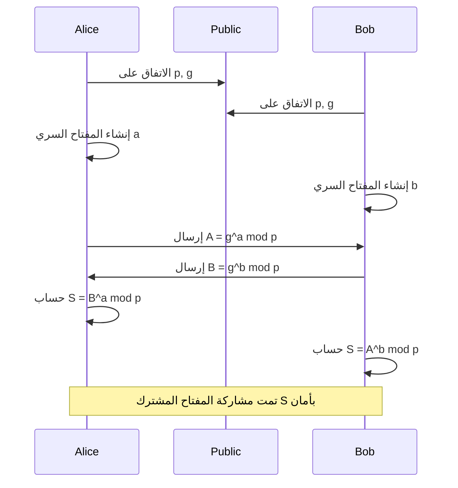
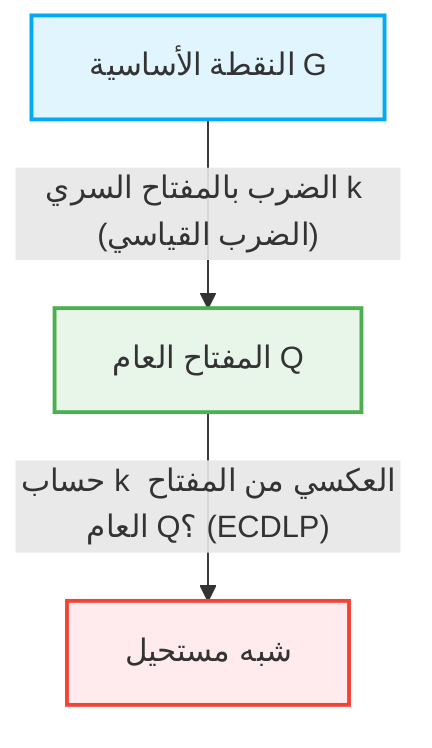

في مجتمع الإنترنت، يعود الفضل في قدرتنا على التواصل بأمان يوميًا إلى "تقنية التشفير". وراء كل عملية إرسال واستقبال للبيانات الرقمية، سواء كانت خدمات مصرفية عبر الإنترنت، أو رسائل بريد إلكتروني، أو رسائل على وسائل التواصل الاجتماعي، توجد آليات أمنية مدعومة بنظريات رياضية متقدمة. في هذا المقال، سنشرح بالتفصيل الدقيق الهيكل الرياضي لتشفير RSA، الذي أرسى أسس التشفير بالمفتاح العام الحديث، والانتقال التاريخي والرياضي إلى تشفير المنحنى الإهليلجي (ECC) الذي يوفر أمانًا أكثر كفاءة وقوة.

## 1. حدود التشفير بالمفتاح المتماثل ومشكلة توزيع المفاتيح

تاريخ تقنية التشفير قديم، وقد تم ابتكار العديد من طرق التشفير مثل تشفير قيصر وآلة إنجما. تُصنف هذه أساسًا ضمن "التشفير بالمفتاح المتماثل (Symmetric-key cryptography)". في التشفير بالمفتاح المتماثل، يُستخدم نفس المفتاح للتشفير وفك التشفير.

### مشكلة توزيع المفاتيح (Key Distribution Problem)
أكبر نقطة ضعف في التشفير بالمفتاح المتماثل هي مشكلة "كيفية توصيل المفتاح بأمان إلى الطرف الآخر". إذا كان الطرف الآخر في الاتصال على الجانب الآخر من الأرض، فإن إرسال المفتاح عبر الإنترنت يحمل خطر تعرضه للسرقة من قبل المتنصتين. إذا سُرق المفتاح، يمكن فك التشفير بسهولة. كانت "مشكلة توزيع المفاتيح" هذه أكبر عائق أمام الاتصال الآمن على الشبكات المفتوحة مثل الإنترنت.

## 2. تبادل مفاتيح ديفي-هيلمان (Diffie-Hellman Key Exchange)

في عام 1976، أعلن ويتفيلد ديفي ومارتن هيلمان عن طريقة رائدة لحل مشكلة توزيع المفاتيح هذه. إنها "تبادل مفاتيح ديفي-هيلمان". بفضل هذه الطريقة، أصبح من الممكن لطرفين مشاركة مفتاح سري مشترك بأمان حتى لو كانت قناة الاتصال مراقبة.

### الأساس الرياضي: مشكلة اللوغاريتم المنفصل
يعتمد أمان تبادل مفاتيح ديفي-هيلمان على الصعوبة الحسابية لـ "مشكلة اللوغاريتم المنفصل (Discrete Logarithm Problem)".

لنفترض أن هناك عددًا أوليًا $p$ وجذره البدائي $g$ معلنان للعامة.
يتشارك أليس وبوب المفتاح بالخطوات التالية:

1. تختار أليس عددًا صحيحًا سريًا $a$، وتحسب $A = g^a \pmod p$ وترسله إلى بوب.
2. يختار بوب عددًا صحيحًا سريًا $b$، ويحسب $B = g^b \pmod p$ ويرسله إلى أليس.
3. تستخدم أليس $B$ المستلم لحساب $S = B^a \pmod p$.
4. يستخدم بوب $A$ المستلم لحساب $S = A^b \pmod p$.

هنا، نظرًا لأن $B^a = (g^b)^a = g^{ba} = g^{ab} = (g^a)^b = A^b \pmod p$، يمكن لأليس وبوب مشاركة نفس القيمة السرية $S$.
يعرف المتنصت إيف $p, g, A, B$، لكن إيجاد $a$ من $A$ (مشكلة اللوغاريتم المنفصل) يصبح صعبًا للغاية من الناحية الحسابية كلما كبرت الأعداد.

## 3. ولادة تشفير RSA ومبرهنة أويلر

كان تبادل مفاتيح ديفي-هيلمان مفيدًا لمشاركة المفاتيح، لكنه لم يكن يمتلك في حد ذاته وظائف التشفير وفك التشفير أو التوقيعات الرقمية. في عام 1977، طور كل من رونالد ريفست، وآدي شامير، وليونارد أدليمان "تشفير RSA"، وهو أول نظام تشفير كامل بالمفتاح العام.

### عدم التماثل بين المفتاح العام والمفتاح السري
حقق تشفير RSA المفهوم الثوري المتمثل في فصل "المفتاح العام" المستخدم للتشفير عن "المفتاح السري" المستخدم لفك التشفير. يمكن نشر المفتاح العام لأي شخص، ولا يمكن فك تشفير الرسالة المشفرة به إلا من قبل الشخص نفسه الذي يمتلك المفتاح السري المقابل.

### الأساس الرياضي: صعوبة التحليل إلى العوامل ومبرهنة أويلر
يعتمد أمان تشفير RSA على "صعوبة التحليل إلى العوامل" للأعداد المؤلفة الضخمة.

1. يتم اختيار عددين أوليين كبيرين جدًا $p$ و $q$، ويتم حساب حاصل ضربهما $N = p \times q$.
2. يتم حساب دالة مؤشر أويلر $\phi(N) = (p-1)(q-1)$.
3. يتم اختيار عدد صحيح $e$ أولي نسبيًا مع $\phi(N)$ (هذا يشكل جزءًا من المفتاح العام).
4. يتم حساب $d$ الذي يحقق $e \times d \equiv 1 \pmod{\phi(N)}$ (هذا سيكون المفتاح السري).

المفتاح العام هو $(N, e)$ والمفتاح السري هو $d$.

#### عملية التشفير وفك التشفير
- **التشفير**: لتشفير الرسالة $M$ والحصول على النص المشفر $C$، يتم حساب $C = M^e \pmod N$.
- **فك التشفير**: لفك تشفير النص المشفر $C$ واستعادة الرسالة الأصلية $M$، يتم حساب $M = C^d \pmod N$.

لماذا يتحقق هذا؟ يعتمد ذلك على مبرهنة أويلر.
وفقًا لمبرهنة أويلر، إذا كان $M$ و $N$ أوليين نسبيًا، فإن $M^{\phi(N)} \equiv 1 \pmod N$ يتحقق.
نظرًا لأن $e \times d = 1 + k \times \phi(N)$ ($k$ عدد صحيح)، فإن:
$C^d = (M^e)^d = M^{ed} = M^{1 + k\phi(N)} = M \times (M^{\phi(N)})^k \equiv M \times 1^k \equiv M \pmod N$
وبذلك يتم استعادة الرسالة الأصلية $M$ ببراعة.

لكي يجد المهاجم المفتاح السري $d$ من المفتاح العام $(N, e)$، يجب عليه معرفة $\phi(N)$، ولهذا يجب عليه تحليل $N$ إلى عامليه الأوليين $p$ و $q$. إن تحليل عدد ضخم (مثل 2048 بت) يستغرق وقتًا فلكيًا باستخدام أجهزة الكمبيوتر الكلاسيكية الحالية.

## 4. حدود تشفير RSA: تضخم طول المفتاح

عمل RSA كأساس لأمن الإنترنت لسنوات عديدة، ولكن مع تحسن قدرات المعالجة للكمبيوتر وتطور خوارزميات التحليل إلى العوامل (مثل غربال حقل الأعداد العام)، بدأت نقاط الضعف في الظهور.

للحفاظ على الأمان، من الضروري زيادة عدد أرقام $N$ (طول المفتاح) باستمرار. في الماضي كان يعتبر طول 512 بت آمنًا، ولكن تم كسر 1024 بت، وحاليًا يوصى بطول مفتاح يبلغ 2048 بت كحد أدنى، وللحصول على أمان أعلى يوصى بـ 3072 بت أو 4096 بت.

عندما يصبح طول المفتاح طويلًا، تحدث المشاكل التالية:
1. **زيادة التكلفة الحسابية**: تزداد الموارد الحسابية المطلوبة للتشفير وفك التشفير، وخاصة لتوليد التوقيع.
2. **استهلاك الذاكرة وعرض النطاق الترددي**: في البيئات ذات الموارد المحدودة مثل الهواتف الذكية وأجهزة إنترنت الأشياء (IoT)، فإن تخزين وإرسال مفاتيح بآلاف البتات ليس فعالًا.

للتعامل مع "تضخم طول المفتاح" هذا، كانت هناك حاجة إلى نهج رياضي جديد تمامًا.

## 5. أناقة تشفير المنحنى الإهليلجي (ECC)

هنا يأتي دور "تشفير المنحنى الإهليلجي (Elliptic Curve Cryptography: ECC)". تم اقتراح ECC بشكل مستقل من قبل نيل كوبليتز وفيكتور ميلر في عام 1985، وهو يوفر نفس مستوى الأمان الذي يوفره RSA بطول مفتاح أقصر بكثير. على سبيل المثال، يمكن تحقيق مستوى الأمان المعادل لـ 3072 بت في RSA باستخدام مفتاح بطول 256 بت فقط في ECC.

### رياضيات المنحنيات الإهليلجية
المنحنى الإهليلجي هو معادلة تكعيبية معبر عنها بالصيغة القياسية لفايرشتراس التالية:
$$ y^2 = x^3 + ax + b $$
(حيث $4a^3 + 27b^2 \neq 0$، مما يضمن أن المنحنى ليس له نقاط شاذة).

عند استخدامه في التشفير، لا يُعرّف هذا المنحنى على الأعداد الحقيقية، بل على حقل منتهٍ (مثل حقل مقاسه عدد أولي $p$).

### إضافة النقاط على المنحنى الإهليلجي (Point Addition)
أهم خاصية لـ ECC هي إمكانية تعريف عملية هندسية تسمى "الجمع" بين نقطتين على المنحنى.

إذا كانت النقطتان $P$ و $Q$ على المنحنى وكان $P \neq Q$، يتم رسم خط مستقيم يمر بالنقطتين، ويتم إيجاد نقطة التقاطع الأخرى مع المنحنى، وتكون النقطة المنعكسة عبر محور $x$ هي النقطة $R = P + Q$.
عند جمع النقطة $P$ مع نفسها (الضرب القياسي)، يتم رسم خط المماس عند النقطة $P$، وبنفس الطريقة يتم إيجاد نقطة التقاطع وعكسها للحصول على $2P$.

### الضرب القياسي ومشكلة اللوغاريتم المنفصل للمنحنى الإهليلجي (ECDLP)
تُسمى العملية التي يتم فيها جمع نقطة أساسية يشار إليها بالرمز $G$ لعدد سري من المرات $k$ بالضرب القياسي.
$Q = k \times G = G + G + \dots + G$ ($k$ من المرات)

هنا:
- $k$ هو "المفتاح السري"
- $Q$ هو "المفتاح العام"

عندما يُعطى $G$ و $Q$، تُسمى مشكلة إيجاد $k$ منها بشكل عكسي "مشكلة اللوغاريتم المنفصل للمنحنى الإهليلجي (ECDLP)".
على عكس مشكلة اللوغاريتم المنفصل العادية، لم يتم العثور حتى الآن على خوارزمية فعالة (خوارزمية وقت شبه أسي) لحل ECDLP، ويُعتقد أن هناك حاجة إلى وقت أسي كامل. هذا هو السبب الرياضي الذي يجعل ECC يوفر أمانًا قويًا بمفتاح قصير جدًا.

## 6. تطبيقات ECC والمستقبل

حاليًا، يُعتمد ECC على نطاق واسع كتقنية أساسية لـ TLS/SSL (اتصالات HTTPS لمتصفحات الويب)، و SSH، والعملات المشفرة مثل البيتكوين، والعديد من تطبيقات المراسلة الحديثة (مثل Signal و WhatsApp). جلب الانتقال من RSA إلى ECC توفيرًا في الموارد وتحسينًا في الأداء، وأصبح لا غنى عنه بشكل خاص في مجتمع اليوم حيث تنتشر الأجهزة المحمولة وإنترنت الأشياء.

### تهديد أجهزة الكمبيوتر الكمية
ومع ذلك، فإن كلا من RSA و ECC ضعيفان أمام "أجهزة الكمبيوتر الكمية" التي تمثل تهديدًا مستقبليًا. إذا تم تحقيق جهاز كمبيوتر كمي واسع النطاق قادر على تشغيل خوارزمية شور، فسيتم حل كل من التحليل إلى العوامل ومشكلة اللوغاريتم المنفصل في وقت متعدد الحدود.
لذلك، يتم حاليًا إجراء الأبحاث والتوحيد القياسي لـ "التشفير ما بعد الكمي (Post-Quantum Cryptography: PQC)"، مثل تشفير الشبكات وتشفير متعدد الحدود متعدد المتغيرات، والذي يصعب فك تشفيره حتى بواسطة أجهزة الكمبيوتر الكمية.

## الخلاصة

في هذا المقال، تعمقنا في الجمال الهندسي والجبري لتشفير المنحنى الإهليلجي (ECC) الذي تجاوز حدود طول المفتاح، بدءًا من تبادل مفاتيح ديفي-هيلمان الذي تغلب على حدود التشفير بالمفتاح المتماثل، مرورًا بالبنية الرياضية الأنيقة لتشفير RSA القائم على التحليل إلى العوامل.
لا تقتصر تقنية التشفير على مجرد إخفاء المعلومات، بل هي واحدة من أنجح الأمثلة على تطبيق المعرفة المتطورة في الرياضيات على البنية التحتية في العالم الحقيقي. يوضح الانتقال من RSA إلى ECC ببراعة كيف تجعل الرياضيات الأكثر تطورًا حياتنا الرقمية أكثر أمانًا وكفاءة.
