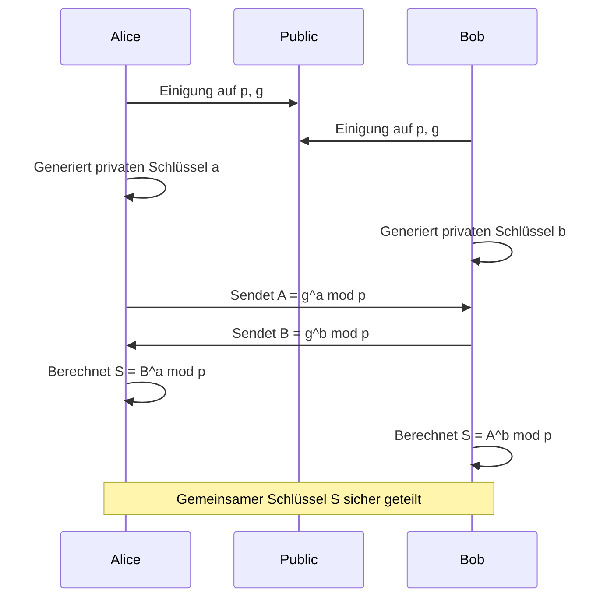
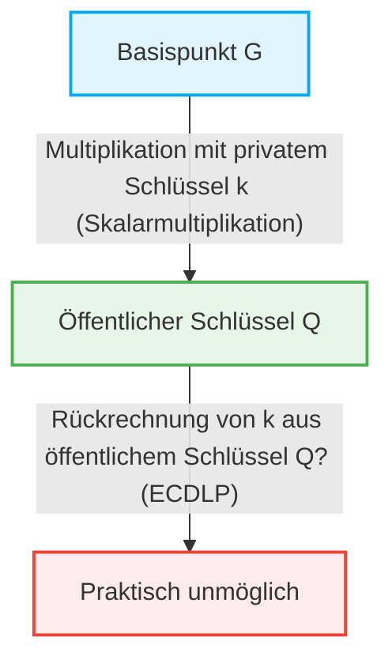

In der Internetgesellschaft ist es die „Kryptographietechnologie“, die es uns ermöglicht, jeden Tag sicher zu kommunizieren. Hinter dem Senden und Empfangen aller digitalen Daten wie Online-Banking, E-Mails und SNS-Nachrichten verbergen sich Sicherheitsmechanismen, die durch fortgeschrittene mathematische Theorien gestützt werden. In diesem Artikel erklären wir sehr detailliert den historischen und mathematischen Wechsel von der mathematischen Struktur der RSA-Kryptographie, die die Grundlage der modernen Public-Key-Kryptographie bildete, hin zur Elliptischen-Kurven-Kryptographie (ECC), die eine effizientere und stärkere Sicherheit bietet.

## 1. Die Grenzen der symmetrischen Kryptographie und das Schlüsselverteilungsproblem

Die Geschichte der Kryptographie ist alt, und viele kryptographische Methoden wie die Caesar-Chiffre und die Enigma wurden entwickelt. Diese werden grundsätzlich als „symmetrische Kryptographie“ (Symmetric-key cryptography) klassifiziert. Bei der symmetrischen Kryptographie wird derselbe Schlüssel zum Ver- und Entschlüsseln verwendet.

### Das Schlüsselverteilungsproblem (Key Distribution Problem)
Die größte Schwäche der symmetrischen Kryptographie ist die Frage, „wie man den Schlüssel sicher an den Empfänger übermittelt“. Wenn sich der Kommunikationspartner auf der anderen Seite der Erde befindet und der Schlüssel über das Internet gesendet wird, besteht die Gefahr, dass ein Lauscher den Schlüssel stiehlt. Wenn der Schlüssel gestohlen wird, kann die Verschlüsselung leicht geknackt werden. Dieses „Schlüsselverteilungsproblem“ war das größte Hindernis für die sichere Kommunikation in offenen Netzwerken wie dem Internet.

## 2. Diffie-Hellman-Schlüsselaustausch (Diffie-Hellman Key Exchange)

Im Jahr 1976 veröffentlichten Whitfield Diffie und Martin Hellman eine bahnbrechende Methode zur Lösung dieses Schlüsselverteilungsproblems. Das war der „Diffie-Hellman-Schlüsselaustausch“. Mit dieser Methode wurde es möglich, dass zwei Parteien einen gemeinsamen geheimen Schlüssel sicher austauschen können, selbst wenn der Kommunikationsweg abgehört wird.

### Mathematische Grundlage: Das Problem des diskreten Logarithmus
Die Sicherheit des Diffie-Hellman-Schlüsselaustauschs beruht auf der rechnerischen Schwierigkeit des „Problems des diskreten Logarithmus“ (Discrete Logarithm Problem).

Angenommen, eine Primzahl $p$ und ihre Primitivwurzel $g$ sind öffentlich bekannt.
Alice und Bob tauschen den Schlüssel wie folgt aus:

1. Alice wählt eine geheime Ganzzahl $a$, berechnet $A = g^a \pmod p$ und sendet dies an Bob.
2. Bob wählt eine geheime Ganzzahl $b$, berechnet $B = g^b \pmod p$ und sendet dies an Alice.
3. Alice verwendet das empfangene $B$, um $S = B^a \pmod p$ zu berechnen.
4. Bob verwendet das empfangene $A$, um $S = A^b \pmod p$ zu berechnen.

Hierbei ist $B^a = (g^b)^a = g^{ba} = g^{ab} = (g^a)^b = A^b \pmod p$, sodass Alice und Bob denselben geheimen Wert $S$ teilen können.
Der Lauscher Eve kennt $p, g, A, B$, aber es ist rechnerisch extrem schwierig, $a$ aus $A$ zu ermitteln (das Problem des diskreten Logarithmus), wenn die Zahlen groß werden.

## 3. Die Geburt der RSA-Kryptographie und der Satz von Euler

Der Diffie-Hellman-Schlüsselaustausch war nützlich für den Austausch von Schlüsseln, aber er selbst besaß keine Funktionen zur Verschlüsselung/Entschlüsselung oder für digitale Signaturen. Im Jahr 1977 wurde die „RSA-Kryptographie“, das erste vollwertige Public-Key-Kryptosystem, von Ronald Rivest, Adi Shamir und Leonard Adleman entwickelt.

### Die Asymmetrie von öffentlichen und privaten Schlüsseln
Die RSA-Kryptographie verwirklichte das revolutionäre Konzept der Trennung des „öffentlichen Schlüssels“, der zur Verschlüsselung verwendet wird, vom „privaten Schlüssel“, der zur Entschlüsselung verwendet wird. Der öffentliche Schlüssel kann jedem zugänglich gemacht werden, und eine Nachricht, die damit verschlüsselt wurde, kann nur von der Person entschlüsselt werden, die den entsprechenden privaten Schlüssel besitzt.

### Mathematische Grundlage: Die Schwierigkeit der Primfaktorzerlegung und der Satz von Euler
Die Sicherheit der RSA-Kryptographie basiert auf der „Schwierigkeit der Primfaktorzerlegung“ einer riesigen zusammengesetzten Zahl.

1. Wähle zwei sehr große Primzahlen $p$ und $q$ und berechne ihr Produkt $N = p \times q$.
2. Berechne Eulersche Phi-Funktion $\phi(N) = (p-1)(q-1)$.
3. Wähle eine Ganzzahl $e$, die teilerfremd zu $\phi(N)$ ist (dies wird Teil des öffentlichen Schlüssels).
4. Berechne $d$, das $e \times d \equiv 1 \pmod{\phi(N)}$ erfüllt (dies wird der private Schlüssel).

Der öffentliche Schlüssel ist $(N, e)$ und der private Schlüssel ist $d$.

#### Der Prozess der Verschlüsselung und Entschlüsselung
- **Verschlüsselung**: Um die Nachricht $M$ zu verschlüsseln und den Geheimtext $C$ zu erhalten, berechne $C = M^e \pmod N$.
- **Entschlüsselung**: Um den Geheimtext $C$ zu entschlüsseln und die ursprüngliche Nachricht $M$ zu erhalten, berechne $M = C^d \pmod N$.

Warum funktioniert das? Es beruht auf dem Satz von Euler.
Nach dem Satz von Euler gilt $M^{\phi(N)} \equiv 1 \pmod N$, wenn $M$ und $N$ teilerfremd sind.
Da $e \times d = 1 + k \times \phi(N)$ (wobei $k$ eine Ganzzahl ist), gilt:
$C^d = (M^e)^d = M^{ed} = M^{1 + k\phi(N)} = M \times (M^{\phi(N)})^k \equiv M \times 1^k \equiv M \pmod N$
Die ursprüngliche Nachricht $M$ wird wunderbar wiederhergestellt.

Damit ein Angreifer den privaten Schlüssel $d$ aus dem öffentlichen Schlüssel $(N, e)$ ermitteln kann, muss er $\phi(N)$ kennen, und dafür muss er $N$ in $p$ und $q$ in Primfaktoren zerlegen. Die Primfaktorzerlegung einer riesigen Zahl (z.B. 2048 Bit) dauert auf aktuellen klassischen Computern astronomisch lange.

## 4. Die Grenzen der RSA-Kryptographie: Die enorme Vergrößerung der Schlüssellänge

RSA hat viele Jahre als Grundlage für die Internetsicherheit gedient, aber mit der Verbesserung der Rechenleistung von Computern und der Entwicklung von Algorithmen zur Primfaktorzerlegung (wie dem allgemeinen Zahlkörpersieb) wurden Schwachstellen aufgedeckt.

Um die Sicherheit aufrechtzuerhalten, muss die Anzahl der Ziffern von $N$ (die Schlüssellänge) kontinuierlich erhöht werden. Früher galten 512 Bit als sicher, aber 1024 Bit wurden geknackt, und heute werden mindestens 2048 Bit oder für höhere Sicherheit Schlüssellängen von 3072 Bit oder 4096 Bit empfohlen.

Wenn die Schlüssellänge länger wird, treten folgende Probleme auf:
1. **Erhöhte Rechenkosten**: Die für die Ver- und Entschlüsselung, insbesondere für die Signaturerstellung, erforderlichen Rechenressourcen steigen.
2. **Speicher- und Bandbreitenverbrauch**: In Umgebungen mit begrenzten Ressourcen, wie Smartphones und IoT-Geräten, ist das Speichern und Übertragen von Schlüsseln mit Tausenden von Bits ineffizient.

Um dieser „Inflation der Schlüssellängen“ entgegenzuwirken, wurde ein völlig neuer mathematischer Ansatz erforderlich.

## 5. Die Eleganz der Elliptischen-Kurven-Kryptographie (ECC)

Hier kommt die „Elliptische-Kurven-Kryptographie“ (Elliptic Curve Cryptography: ECC) ins Spiel. ECC wurde 1985 unabhängig von Neal Koblitz und Victor Miller vorgeschlagen und bietet das gleiche Sicherheitsniveau wie RSA, jedoch mit einer weitaus kürzeren Schlüssellänge. Zum Beispiel kann die gleiche Sicherheit wie bei einem 3072-Bit-RSA-Schlüssel mit einer ECC-Schlüssellänge von nur 256 Bit erreicht werden.

### Die Mathematik der elliptischen Kurven
Eine elliptische Kurve ist eine kubische Gleichung, die in der folgenden Weierstraß-Normalform ausgedrückt wird:
$$ y^2 = x^3 + ax + b $$
(Unter der Bedingung $4a^3 + 27b^2 \neq 0$, um sicherzustellen, dass die Kurve keine Singularitäten aufweist).

Bei der Verwendung für die Kryptographie ist diese Kurve nicht über den reellen Zahlen definiert, sondern über einem endlichen Körper (z.B. einem Körper modulo einer Primzahl $p$).

### Punktaddition auf der elliptischen Kurve (Point Addition)
Die wichtigste Eigenschaft von ECC ist, dass zwischen zwei Punkten auf der Kurve eine geometrische Operation namens „Addition“ definiert werden kann.

Wenn die Punkte $P$ und $Q$ auf der Kurve liegen und $P \neq Q$, zieht man eine Linie durch die beiden Punkte, findet den anderen Schnittpunkt mit der Kurve und spiegelt diesen Punkt an der $x$-Achse, um den Punkt $R = P + Q$ zu definieren.
Wenn man den Punkt $P$ zu sich selbst addiert (Skalarmultiplikation), zieht man die Tangente an den Punkt $P$, findet auf ähnliche Weise den Schnittpunkt und spiegelt ihn, um $2P$ zu erhalten.

### Skalarmultiplikation und das Problem des diskreten Logarithmus auf elliptischen Kurven (ECDLP)
Die Operation, einen Basispunkt $G$ eine geheime ganzzahlige Anzahl von $k$-mal zu addieren, wird als Skalarmultiplikation bezeichnet.
$Q = k \times G = G + G + \dots + G$ (k-mal)

Hierbei ist:
- $k$ der „private Schlüssel“
- $Q$ der „öffentliche Schlüssel“

Das Problem, $k$ aus einem gegebenen $G$ und $Q$ zurückzurechnen, wird als „Problem des diskreten Logarithmus auf elliptischen Kurven (ECDLP)“ bezeichnet.
Im Gegensatz zum gewöhnlichen Problem des diskreten Logarithmus wurde bisher kein effizienter Algorithmus (Subexponentialzeitalgorithmus) zur Lösung des ECDLP gefunden, und es wird angenommen, dass vollständig exponentielle Zeit erforderlich ist. Dies ist der mathematische Grund, warum ECC mit sehr kurzen Schlüsseln starke Sicherheit bieten kann.

## 6. Anwendungen und Zukunft von ECC

Heute ist ECC als grundlegende Technologie für TLS/SSL (HTTPS-Kommunikation in Webbrowsern), SSH, Kryptowährungen wie Bitcoin und viele moderne Messaging-Apps (wie Signal und WhatsApp) weit verbreitet. Der Übergang von RSA zu ECC hat zu Ressourceneinsparungen und Leistungsverbesserungen geführt und ist in unserer modernen Gesellschaft mit der weiten Verbreitung von Mobil- und IoT-Geräten unverzichtbar geworden.

### Die Bedrohung durch Quantencomputer
Allerdings sind sowohl RSA als auch ECC anfällig für die zukünftige Bedrohung durch „Quantencomputer“. Wenn groß angelegte Quantencomputer realisiert werden, die den Shor-Algorithmus ausführen können, werden sowohl die Primfaktorzerlegung als auch das Problem des diskreten Logarithmus in polynomialer Zeit gelöst.
Aus diesem Grund schreiten die Erforschung und Standardisierung der „Post-Quanten-Kryptographie“ (Post-Quantum Cryptography: PQC), wie z.B. gitterbasierte Kryptographie und multivariate polynomische Kryptographie, die selbst von Quantencomputern schwer zu knacken ist, derzeit schnell voran.

## Fazit

In diesem Artikel haben wir uns eingehend mit dem Diffie-Hellman-Schlüsselaustausch, der die Grenzen der symmetrischen Kryptographie überwand, der eleganten Struktur der RSA-Kryptographie basierend auf der Primfaktorzerlegung und der geometrischen und algebraischen Schönheit der Elliptischen-Kurven-Kryptographie (ECC), die die Grenzen der Schlüssellängen durchbrach, befasst.
Kryptographietechnologie ist nicht nur das bloße Verbergen von Informationen, sondern eines der erfolgreichsten Beispiele für die Anwendung der fortschrittlichsten Erkenntnisse der Mathematik auf reale Infrastrukturen. Der Wechsel von RSA zu ECC veranschaulicht wunderbar den Prozess, durch den ausgefeiltere Mathematik unser digitales Leben sicherer und effizienter macht.
