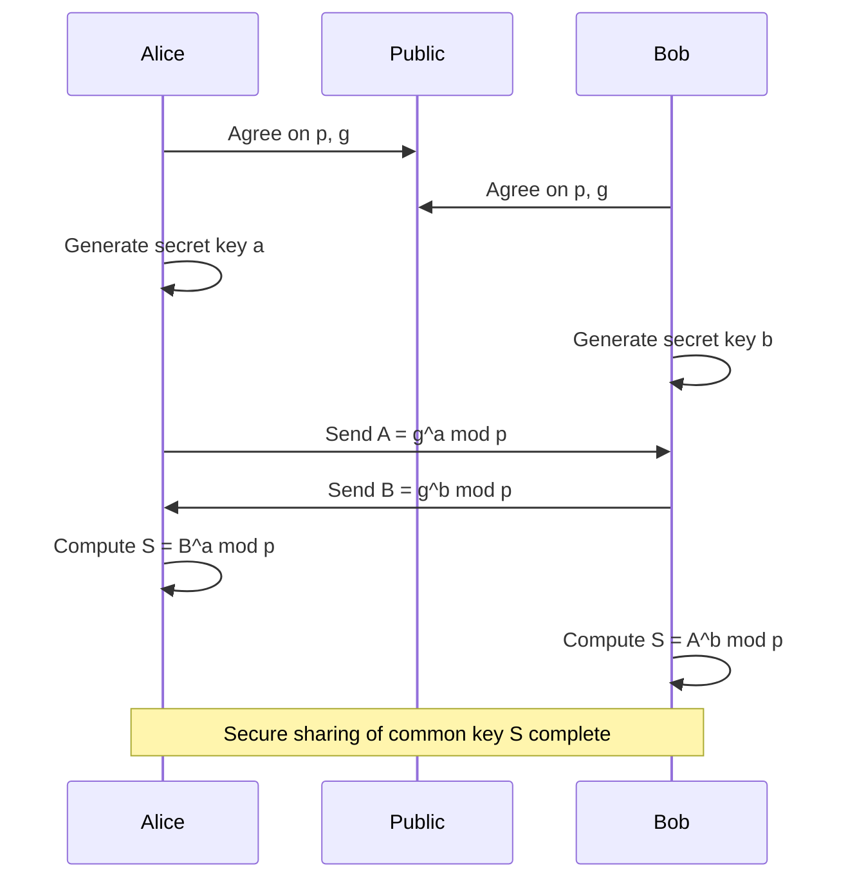
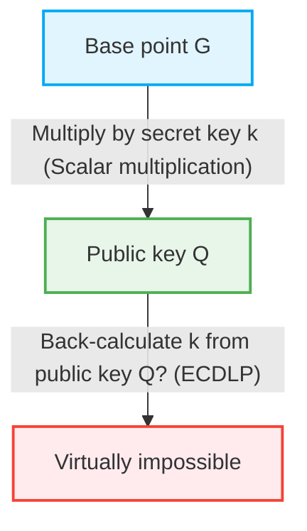

In the internet society, we are able to communicate safely every day thanks to the benefits of "cryptographic technology." Behind online banking, emails, SNS messages, and the transmission and reception of all digital data, there are security mechanisms backed by advanced mathematical theories. In this article, we will explain in great detail the historical and mathematical shift from the mathematical structure of the RSA cipher, which laid the foundation for modern public key cryptography, to Elliptic Curve Cryptography (ECC), which provides more efficient and powerful security.

## 1. The Limits of Symmetric-key Cryptography and the Key Distribution Problem

The history of cryptography is long, and many encryption methods have been devised, such as the Caesar cipher and the Enigma machine. These are fundamentally classified as "Symmetric-key cryptography." In symmetric-key cryptography, the same key is used for both encryption and decryption.

### Key Distribution Problem
The biggest weakness of symmetric-key cryptography is the problem of "how to safely deliver the key to the other party." If the communication partner is on the other side of the earth and the key is sent over the internet, there is a risk that the key will be stolen by an eavesdropper. If the key is stolen, the encryption can be easily deciphered. This "key distribution problem" was the greatest barrier to secure communication over open networks like the internet.

## 2. Diffie-Hellman Key Exchange

In 1976, Whitfield Diffie and Martin Hellman published a groundbreaking method to solve this key distribution problem. That is the "Diffie-Hellman Key Exchange." With this method, even if the communication channel is eavesdropped, it became possible for two parties to securely share a common secret key.

### Mathematical Foundation: Discrete Logarithm Problem
The security of the Diffie-Hellman key exchange depends on the computational difficulty of the "Discrete Logarithm Problem."

Suppose a certain prime number $p$ and its primitive root $g$ are public.
Alice and Bob share a key using the following steps:

1. Alice chooses a secret integer $a$, computes $A = g^a \pmod p$, and sends it to Bob.
2. Bob chooses a secret integer $b$, computes $B = g^b \pmod p$, and sends it to Alice.
3. Alice computes $S = B^a \pmod p$ using the received $B$.
4. Bob computes $S = A^b \pmod p$ using the received $A$.

Here, since $B^a = (g^b)^a = g^{ba} = g^{ab} = (g^a)^b = A^b \pmod p$, Alice and Bob can share the same secret value $S$.
The eavesdropper Eve knows $p, g, A, B$, but finding $a$ from $A$ (the discrete logarithm problem) becomes computationally extremely difficult as the numbers get larger.

## 3. The Birth of RSA Cryptography and Euler's Theorem

While Diffie-Hellman key exchange was useful for sharing keys, it did not have the functions of encryption/decryption or digital signatures itself. In 1977, Ronald Rivest, Adi Shamir, and Leonard Adleman developed the "RSA cipher," which was the first full-fledged public key encryption system.

### Asymmetry of Public and Secret Keys
The RSA cipher realized the groundbreaking concept of separating the "public key" used for encryption and the "secret key" used for decryption. The public key can be disclosed to anyone, and messages encrypted with it can only be decrypted by the person holding the corresponding secret key.

### Mathematical Foundation: The Difficulty of Prime Factorization and Euler's Theorem
The security of the RSA cipher is based on the "difficulty of prime factorization" of huge composite numbers.

1. Choose two very large prime numbers $p$ and $q$, and compute their product $N = p \times q$.
2. Compute Euler's totient function $\phi(N) = (p-1)(q-1)$.
3. Choose an integer $e$ that is coprime to $\phi(N)$ (this becomes part of the public key).
4. Compute $d$ that satisfies $e \times d \equiv 1 \pmod{\phi(N)}$ (this becomes the secret key).

The public key is $(N, e)$, and the secret key is $d$.

#### The Process of Encryption and Decryption
- **Encryption**: To encrypt a message $M$ to get ciphertext $C$, compute $C = M^e \pmod N$.
- **Decryption**: To decrypt the ciphertext $C$ to get the original message $M$, compute $M = C^d \pmod N$.

Why does this hold true? It relies on Euler's theorem.
According to Euler's theorem, if $M$ and $N$ are coprime, $M^{\phi(N)} \equiv 1 \pmod N$ holds.
Since $e \times d = 1 + k \times \phi(N)$ (where $k$ is an integer),
$C^d = (M^e)^d = M^{ed} = M^{1 + k\phi(N)} = M \times (M^{\phi(N)})^k \equiv M \times 1^k \equiv M \pmod N$
The original message $M$ is beautifully restored.

For an attacker to find the secret key $d$ from the public key $(N, e)$, they must know $\phi(N)$, and for that, they must factorize $N$ into $p$ and $q$. The prime factorization of a huge number (e.g., 2048 bits) takes an astronomical amount of time on today's classical computers.

## 4. The Limitations of RSA Cryptography: Gigantic Key Lengths

RSA has functioned as the foundation of internet security for many years, but with the improvement of computer processing power and the evolution of prime factorization algorithms (such as the general number field sieve), its weaknesses have been exposed.

To maintain security, it is necessary to continuously increase the number of digits (key length) of $N$. In the past, 512 bits was considered safe, but 1024 bits was broken, and currently, a minimum of 2048 bits is recommended, with 3072 bits or 4096 bits recommended for those seeking higher security.

When the key length increases, the following problems occur:
1. **Increased Computational Cost**: The computational resources required for encryption, decryption, and especially signature generation, increase.
2. **Memory and Bandwidth Consumption**: In environments with limited resources, such as smartphones and IoT devices, storing and transmitting keys of thousands of bits is not efficient.

To counter this "key length inflation," an entirely new mathematical approach was required.

## 5. The Elegance of Elliptic Curve Cryptography (ECC)

This is where "Elliptic Curve Cryptography (ECC)" comes in. Independently proposed by Neal Koblitz and Victor Miller in 1985, ECC achieves the same level of security as RSA with a much shorter key length. For example, the security equivalent to a 3072-bit RSA can be achieved with a key length of only 256 bits in ECC.

### Mathematics of Elliptic Curves
An elliptic curve is a cubic equation represented in the following Weierstrass normal form:
$$ y^2 = x^3 + ax + b $$
(Where $4a^3 + 27b^2 \neq 0$, which ensures the curve has no singular points).

When used for cryptography, this curve is defined not over real numbers, but over a finite field (such as a field modulo a prime number $p$).

### Point Addition on Elliptic Curves
The most important characteristic of ECC is that a geometric operation called "addition" can be defined between points on the curve.

When point $P$ and point $Q$ are on the curve, and $P \neq Q$, we draw a straight line passing through the two points, find the other intersection point with the curve, and define the point symmetric to it with respect to the $x$-axis as $R = P + Q$.
When adding point $P$ to point $P$ (scalar multiplication), we draw a tangent line at point $P$, similarly find the intersection point, reflect it, and obtain $2P$.

### Scalar Multiplication and the Elliptic Curve Discrete Logarithm Problem (ECDLP)
The operation of adding a reference point $G$, called the base point, a secret integer $k$ times is called scalar multiplication.
$Q = k \times G = G + G + \dots + G$ (k times)

Here, we define:
- $k$ as the "secret key"
- $Q$ as the "public key"

The problem of calculating backwards to find $k$ when given $G$ and $Q$ is called the "Elliptic Curve Discrete Logarithm Problem (ECDLP)."
Currently, no efficient algorithm (sub-exponential time algorithm) has been found to solve the ECDLP compared to the regular discrete logarithm problem, and it is thought that full exponential time is required. This is the mathematical reason why ECC can provide powerful security with extremely short keys.

## 6. Applications and Future of ECC

Currently, ECC is widely adopted as the underlying technology for TLS/SSL (HTTPS communication in web browsers), SSH, cryptocurrencies like Bitcoin, and many modern messaging apps (such as Signal and WhatsApp). The transition from RSA to ECC brings about resource savings and performance improvements, making it indispensable in modern society where mobile and IoT are prevalent.

### The Threat of Quantum Computers
However, both RSA and ECC are vulnerable to the future threat of "quantum computers." If a large-scale quantum computer capable of running Shor's algorithm is realized, both prime factorization and the discrete logarithm problem will be solved in polynomial time.
Therefore, research and standardization towards "Post-Quantum Cryptography (PQC)", which is difficult for even quantum computers to decipher, such as lattice-based cryptography and multivariate cryptography, are rapidly progressing today.

## Conclusion

In this article, we started with the Diffie-Hellman key exchange, which overcame the limitations of symmetric-key cryptography, and delved deep into the elegant structure of the RSA cipher based on prime factorization, and the geometric and algebraic beauty of Elliptic Curve Cryptography (ECC), which broke through the limitations of key length.
Cryptographic technology goes beyond mere information concealment; it is one of the most successful examples of applying cutting-edge mathematical knowledge to real-world infrastructure. The shift from RSA to ECC brilliantly demonstrates the process by which more refined mathematics is making our digital lives safer and more efficient.
