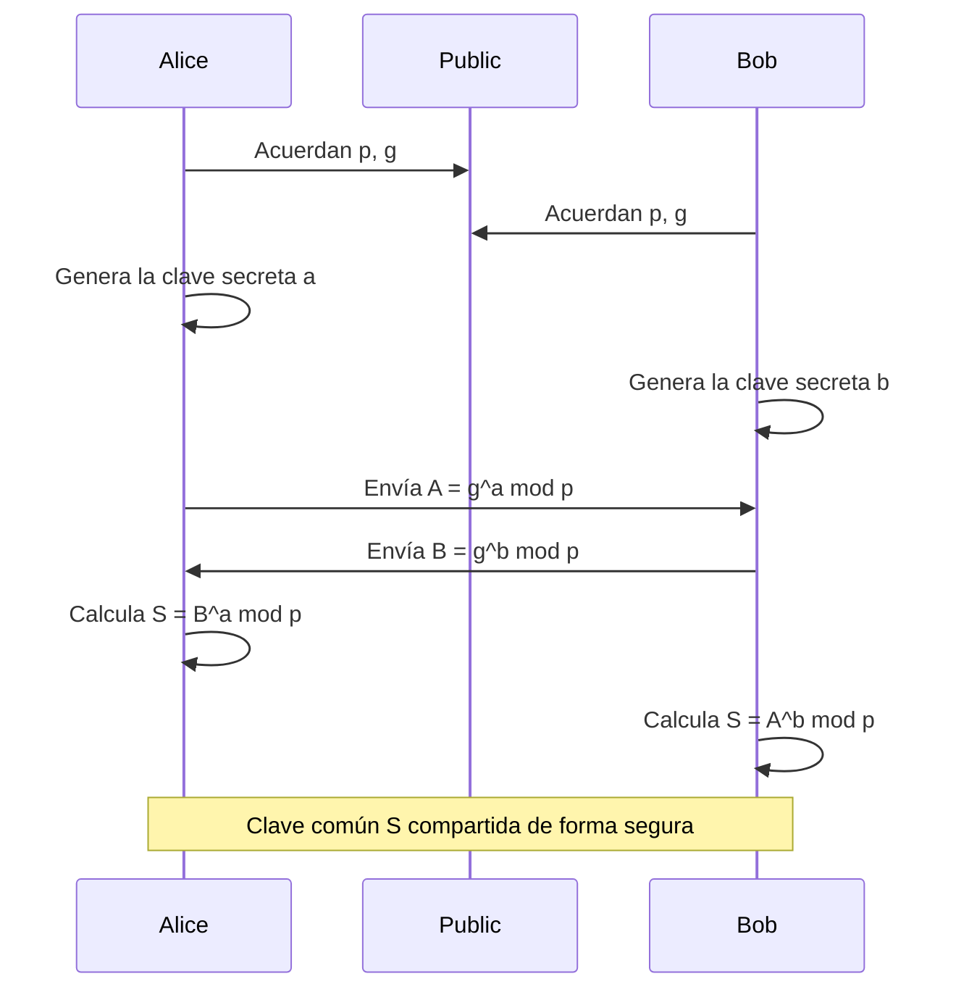
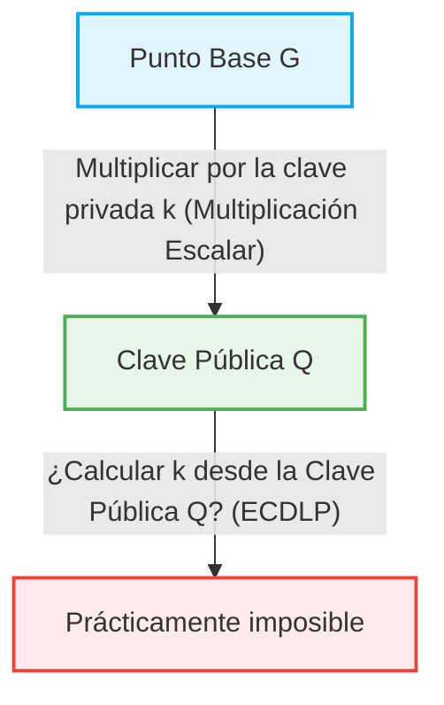

En nuestra sociedad de Internet, el hecho de que podamos comunicarnos de forma segura a diario es un beneficio de la "tecnología criptográfica". Detrás de la transmisión y recepción de la banca en línea, el correo electrónico, los mensajes en las redes sociales y cualquier dato digital, existen mecanismos de seguridad respaldados por teorías matemáticas avanzadas. En este artículo, explicaremos con gran detalle la estructura matemática del cifrado RSA, que sentó las bases de la criptografía de clave pública moderna, y el cambio histórico y matemático hacia la criptografía de curva elíptica (ECC), que ofrece una seguridad más eficiente y sólida.

## 1. Las limitaciones de la criptografía de clave simétrica y el problema de distribución de claves

La historia de la tecnología criptográfica es antigua, y se han ideado muchos métodos de cifrado, como el cifrado César o Enigma. Estos se clasifican básicamente como "criptografía de clave simétrica (Symmetric-key cryptography)". En la criptografía de clave simétrica, se utiliza la misma clave para cifrar y descifrar.

### Problema de Distribución de Claves (Key Distribution Problem)
La mayor debilidad de la criptografía de clave simétrica es el problema de "cómo entregar la clave de forma segura a la otra parte". Si la parte con la que te comunicas está al otro lado del mundo, enviar la clave a través de Internet conlleva el riesgo de que la clave sea robada por espías. Si se roba la clave, el cifrado se puede descifrar fácilmente. Este "problema de distribución de claves" fue la mayor barrera para la comunicación segura en redes abiertas como Internet.

## 2. Intercambio de Claves Diffie-Hellman (Diffie-Hellman Key Exchange)

En 1976, Whitfield Diffie y Martin Hellman anunciaron un método innovador para resolver este problema de distribución de claves. Ese es el "Intercambio de claves Diffie-Hellman". Con este método, incluso si la ruta de comunicación está siendo espiada, dos partes pueden compartir una clave secreta común de forma segura.

### Base Matemática: El problema del logaritmo discreto
La seguridad del intercambio de claves Diffie-Hellman se basa en la dificultad computacional del "Problema del Logaritmo Discreto (Discrete Logarithm Problem)".

Supongamos que un número primo $p$ y su raíz primitiva $g$ son públicos.
Alice y Bob comparten la clave mediante el siguiente procedimiento:

1. Alice elige un número entero secreto $a$, calcula $A = g^a \pmod p$ y se lo envía a Bob.
2. Bob elige un número entero secreto $b$, calcula $B = g^b \pmod p$ y se lo envía a Alice.
3. Alice usa el $B$ recibido para calcular $S = B^a \pmod p$.
4. Bob usa el $A$ recibido para calcular $S = A^b \pmod p$.

Aquí, como $B^a = (g^b)^a = g^{ba} = g^{ab} = (g^a)^b = A^b \pmod p$, Alice y Bob pueden compartir el mismo valor secreto $S$.
El espía Eve conoce $p, g, A, B$, pero encontrar $a$ a partir de $A$ (el problema del logaritmo discreto) se vuelve extremadamente difícil a nivel computacional a medida que los números se hacen grandes.

## 3. El Nacimiento del Cifrado RSA y el Teorema de Euler

Aunque el intercambio de claves Diffie-Hellman era útil para compartir claves, no tenía las funciones de cifrado/descifrado ni firmas digitales en sí mismo. En 1977, Ronald Rivest, Adi Shamir y Leonard Adleman desarrollaron el "Cifrado RSA", el primer sistema completo de criptografía de clave pública.

### Asimetría entre la clave pública y la clave privada
El cifrado RSA materializó el concepto innovador de separar la "clave pública" utilizada para el cifrado de la "clave privada" utilizada para el descifrado. La clave pública puede revelarse a cualquiera, y los mensajes cifrados con ella solo pueden ser descifrados por la persona que posee la clave privada correspondiente.

### Base Matemática: La dificultad de la factorización y el teorema de Euler
La seguridad del cifrado RSA se basa en la "dificultad de la factorización" de grandes números compuestos.

1. Se eligen dos números primos muy grandes $p$ y $q$, y se calcula su producto $N = p \times q$.
2. Se calcula la función totiente de Euler $\phi(N) = (p-1)(q-1)$.
3. Se elige un número entero $e$ que sea coprimo con $\phi(N)$ (esta será parte de la clave pública).
4. Se calcula $d$ que satisfaga $e \times d \equiv 1 \pmod{\phi(N)}$ (esta será la clave privada).

La clave pública es $(N, e)$ y la clave privada es $d$.

#### Proceso de cifrado y descifrado
- **Cifrado**: Para cifrar el mensaje $M$ y obtener el texto cifrado $C$, se calcula $C = M^e \pmod N$.
- **Descifrado**: Para descifrar el texto cifrado $C$ y recuperar el mensaje original $M$, se calcula $M = C^d \pmod N$.

¿Por qué funciona esto? Depende del teorema de Euler.
Según el teorema de Euler, si $M$ y $N$ son coprimos, se cumple que $M^{\phi(N)} \equiv 1 \pmod N$.
Dado que $e \times d = 1 + k \times \phi(N)$ (donde $k$ es un entero),
$C^d = (M^e)^d = M^{ed} = M^{1 + k\phi(N)} = M \times (M^{\phi(N)})^k \equiv M \times 1^k \equiv M \pmod N$
El mensaje original $M$ se recupera perfectamente.

Para que un atacante encuentre la clave privada $d$ a partir de la clave pública $(N, e)$, necesita conocer $\phi(N)$, y para ello, debe factorizar $N$ en $p$ y $q$. La factorización de números enormes (por ejemplo, 2048 bits) lleva un tiempo astronómico en las computadoras clásicas actuales.

## 4. Las limitaciones del Cifrado RSA: Claves Gigantescas

RSA ha servido como la base de la seguridad en Internet durante muchos años, pero con la mejora de la potencia de procesamiento de las computadoras y la evolución de los algoritmos de factorización (como el método de la criba del campo de números general), han surgido sus debilidades.

Para mantener la seguridad, es necesario aumentar continuamente el número de dígitos (longitud de la clave) de $N$. En el pasado, 512 bits se consideraban seguros, pero los 1024 bits han sido vulnerados, y hoy en día se recomienda un mínimo de 2048 bits, o longitudes de clave de 3072 o 4096 bits si se requiere una seguridad aún mayor.

Cuando la longitud de la clave aumenta, surgen los siguientes problemas:
1. **Aumento del costo computacional**: Los recursos computacionales requeridos para el cifrado y descifrado, especialmente la generación de firmas, aumentan.
2. **Consumo de memoria y ancho de banda**: En entornos con recursos limitados como teléfonos inteligentes y dispositivos IoT, almacenar y transmitir claves de miles de bits no es eficiente.

Para abordar esta "inflación de la longitud de la clave", se requería un enfoque matemático completamente nuevo.

## 5. La elegancia de la Criptografía de Curva Elíptica (ECC)

Aquí es donde entra la "Criptografía de Curva Elíptica (Elliptic Curve Cryptography: ECC)". Propuesta de forma independiente por Neal Koblitz y Victor Miller en 1985, ECC logra el mismo nivel de seguridad que RSA, pero con longitudes de clave mucho más cortas. Por ejemplo, la seguridad equivalente a un RSA de 3072 bits se puede lograr con ECC utilizando una longitud de clave de solo 256 bits.

### Las matemáticas de las curvas elípticas
Una curva elíptica es una ecuación cúbica expresada en la siguiente forma estándar de Weierstrass:
$$ y^2 = x^3 + ax + b $$
(donde $4a^3 + 27b^2 \neq 0$, garantizando que la curva no tiene puntos singulares).

Cuando se usa para criptografía, esta curva no se define sobre los números reales, sino sobre un campo finito (como un campo módulo de un número primo $p$).

### Suma de puntos en una curva elíptica (Point Addition)
La característica más importante de ECC es que se puede definir una operación geométrica llamada "suma" entre dos puntos de la curva.

Si los puntos $P$ y $Q$ están en la curva, y $P \neq Q$, trazamos una línea que pasa por los 2 puntos, encontramos la otra intersección con la curva y reflejamos ese punto respecto al eje $x$ para definir $R = P + Q$.
Al sumar un punto $P$ con sí mismo (multiplicación escalar), trazamos una tangente en el punto $P$, encontramos la intersección de manera similar y la reflejamos para obtener $2P$.

### Multiplicación escalar y el Problema del Logaritmo Discreto de la Curva Elíptica (ECDLP)
La operación de sumar un punto de referencia $G$, llamado punto base, por un número entero secreto de veces $k$, se llama multiplicación escalar.
$Q = k \times G = G + G + \dots + G$ (k veces)

Aquí,
- $k$ es la "clave privada"
- $Q$ es la "clave pública"

Dado $G$ y $Q$, el problema de calcular a la inversa $k$ a partir de ellos se llama el "Problema del Logaritmo Discreto de Curva Elíptica (ECDLP)".
A diferencia del problema del logaritmo discreto normal, actualmente no se ha encontrado un algoritmo eficiente (algoritmo de tiempo subexponencial) para resolver el ECDLP, y se cree que requiere un tiempo completamente exponencial. Esta es la razón matemática por la cual ECC puede ofrecer una seguridad sólida con claves muy cortas.

## 6. Aplicaciones de ECC y el futuro

Hoy en día, ECC es ampliamente adoptada como tecnología subyacente para TLS/SSL (comunicaciones HTTPS en navegadores web), SSH, criptomonedas como Bitcoin, y muchas aplicaciones modernas de mensajería (como Signal y WhatsApp). La transición de RSA a ECC ha traído un ahorro de recursos y mejoras en el rendimiento, haciéndola indispensable especialmente en nuestra sociedad moderna donde los dispositivos móviles y la IoT son omnipresentes.

### La amenaza de las computadoras cuánticas
Sin embargo, tanto RSA como ECC son vulnerables a la amenaza futura de las "computadoras cuánticas". Si se materializan computadoras cuánticas a gran escala capaces de ejecutar el algoritmo de Shor, tanto la factorización como el problema del logaritmo discreto se resolverían en tiempo polinómico.
Por esta razón, la investigación y estandarización de la "Criptografía Post-Cuántica (Post-Quantum Cryptography: PQC)", que es difícil de descifrar incluso para las computadoras cuánticas, como la criptografía basada en retículos y la criptografía de polinomios multivariables, está avanzando rápidamente en la actualidad.

## Resumen

En este artículo, hemos profundizado desde el Intercambio de claves Diffie-Hellman, que superó las limitaciones de la criptografía de clave simétrica, la estructura elegante del cifrado RSA basada en la factorización, y la belleza geométrica y algebraica de la Criptografía de Curva Elíptica (ECC) que rompió los límites de la longitud de las claves.
La tecnología criptográfica no es solo ocultar información, sino uno de los ejemplos más exitosos de la aplicación del conocimiento matemático de vanguardia a la infraestructura del mundo real. El cambio de RSA a ECC demuestra brillantemente cómo las matemáticas más refinadas están haciendo que nuestras vidas digitales sean más seguras y eficientes.
