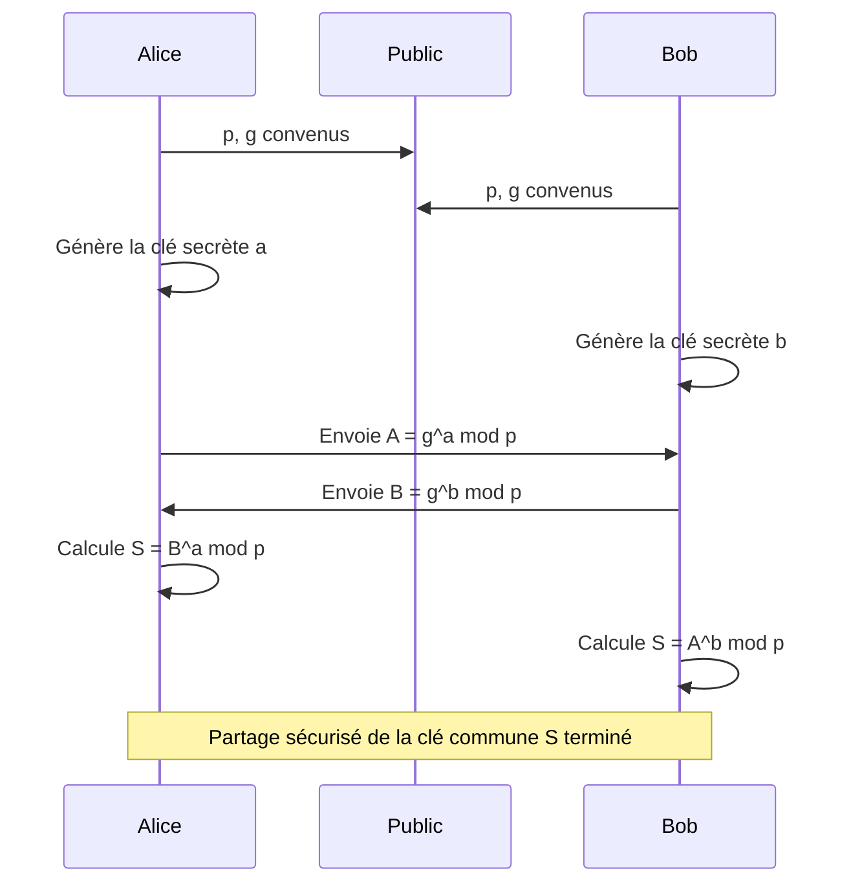
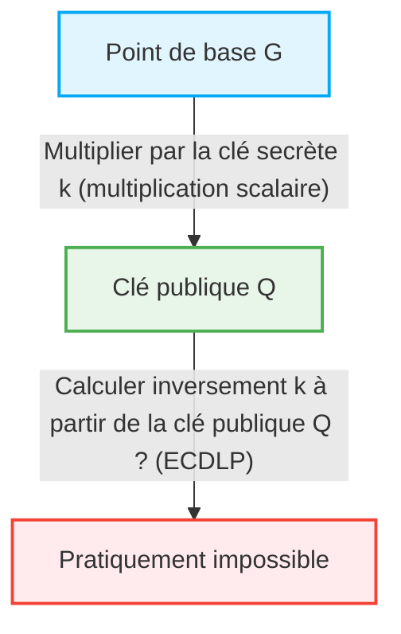

Dans la société Internet, le fait que nous puissions communiquer en toute sécurité chaque jour est une aubaine de la "technologie cryptographique". Derrière la banque en ligne, les e-mails, les messages sur les réseaux sociaux et la transmission/réception de toutes les données numériques, il existe un mécanisme de sécurité soutenu par des théories mathématiques avancées. Dans cet article, nous expliquerons très en détail la structure mathématique du chiffrement RSA, qui a jeté les bases de la cryptographie à clé publique moderne, ainsi que le changement historique et mathématique vers la cryptographie sur les courbes elliptiques (ECC), qui offre une sécurité plus efficace et plus forte.

## 1. Les limites de la cryptographie à clé symétrique et le problème de distribution des clés

L'histoire de la cryptographie est ancienne et de nombreuses méthodes de chiffrement ont été conçues, telles que le chiffre de César et Enigma. Celles-ci sont fondamentalement classées dans la "cryptographie à clé symétrique" (Symmetric-key cryptography). Dans la cryptographie à clé symétrique, la même clé est utilisée pour le chiffrement et le déchiffrement.

### Le problème de distribution des clés (Key Distribution Problem)
La plus grande faiblesse de la cryptographie à clé symétrique est le problème de "comment livrer la clé en toute sécurité à l'autre partie". Si l'interlocuteur se trouve à l'autre bout du monde et que la clé est envoyée via Internet, il y a un risque qu'une personne sur écoute s'en empare. Si la clé est volée, le chiffrement sera facilement déchiffré. Ce "problème de distribution des clés" était le plus grand obstacle à la communication sécurisée sur des réseaux ouverts comme Internet.

## 2. L'échange de clés Diffie-Hellman (Diffie-Hellman Key Exchange)

En 1976, Whitfield Diffie et Martin Hellman ont publié une méthode révolutionnaire pour résoudre ce problème de distribution de clés. Il s'agit de "l'échange de clés Diffie-Hellman". Grâce à cette méthode, même si le canal de communication est sur écoute, il est devenu possible pour deux parties de partager une clé secrète commune en toute sécurité.

### Fondement mathématique : Le problème du logarithme discret
La sécurité de l'échange de clés Diffie-Hellman repose sur la difficulté de calcul du "problème du logarithme discret" (Discrete Logarithm Problem).

Supposons qu'un nombre premier $p$ et sa racine primitive $g$ soient publics.
Alice et Bob partagent la clé selon la procédure suivante.

1. Alice choisit un entier secret $a$, calcule $A = g^a \pmod p$ et l'envoie à Bob.
2. Bob choisit un entier secret $b$, calcule $B = g^b \pmod p$ et l'envoie à Alice.
3. Alice utilise le $B$ reçu pour calculer $S = B^a \pmod p$.
4. Bob utilise le $A$ reçu pour calculer $S = A^b \pmod p$.

Ici, comme $B^a = (g^b)^a = g^{ba} = g^{ab} = (g^a)^b = A^b \pmod p$, Alice et Bob peuvent partager la même valeur secrète $S$.
L'espionne Eve connaît $p, g, A, B$, mais trouver $a$ à partir de $A$ (le problème du logarithme discret) est extrêmement difficile en termes de complexité de calcul à mesure que le nombre devient grand.

## 3. La naissance du chiffrement RSA et le théorème d'Euler

L'échange de clés Diffie-Hellman était utile pour le partage de clés, mais il n'avait pas en soi de fonctions de chiffrement/déchiffrement ou de signature numérique. En 1977, Ronald Rivest, Adi Shamir et Leonard Adleman ont développé le "chiffrement RSA", qui est le premier véritable système de cryptographie à clé publique.

### L'asymétrie de la clé publique et de la clé secrète
Le chiffrement RSA a réalisé le concept révolutionnaire de séparer la "clé publique" utilisée pour le chiffrement et la "clé secrète" utilisée pour le déchiffrement. La clé publique peut être révélée à n'importe qui, et un message chiffré avec celle-ci ne peut être déchiffré que par la personne qui possède la clé secrète correspondante.

### Fondement mathématique : La difficulté de la factorisation en nombres premiers et le théorème d'Euler
La sécurité du chiffrement RSA repose sur la "difficulté de la factorisation en nombres premiers" d'un très grand nombre composé.

1. Choisissez deux très grands nombres premiers $p$ et $q$, et calculez leur produit $N = p \times q$.
2. Calculez la fonction indicatrice d'Euler $\phi(N) = (p-1)(q-1)$.
3. Choisissez un entier $e$ premier avec $\phi(N)$ (cela fera partie de la clé publique).
4. Calculez $d$ tel que $e \times d \equiv 1 \pmod{\phi(N)}$ (cela deviendra la clé secrète).

La clé publique est $(N, e)$, et la clé secrète est $d$.

#### Le processus de chiffrement et de déchiffrement
- **Chiffrement** : Pour chiffrer un message $M$ et obtenir le texte chiffré $C$, calculez $C = M^e \pmod N$.
- **Déchiffrement** : Pour déchiffrer le texte chiffré $C$ et obtenir le message original $M$, calculez $M = C^d \pmod N$.

Pourquoi cela fonctionne-t-il ? Cela dépend du théorème d'Euler.
Selon le théorème d'Euler, si $M$ et $N$ sont premiers entre eux, $M^{\phi(N)} \equiv 1 \pmod N$ est vérifié.
Comme $e \times d = 1 + k \times \phi(N)$ ($k$ est un entier),
$C^d = (M^e)^d = M^{ed} = M^{1 + k\phi(N)} = M \times (M^{\phi(N)})^k \equiv M \times 1^k \equiv M \pmod N$
Le message original $M$ est magnifiquement restauré.

Pour qu'un attaquant trouve la clé secrète $d$ à partir de la clé publique $(N, e)$, il doit connaître $\phi(N)$, et pour cela, il doit factoriser $N$ en nombres premiers $p$ et $q$. La factorisation en nombres premiers d'un très grand nombre (par exemple 2048 bits) prendrait un temps astronomique avec les ordinateurs classiques actuels.

## 4. Les limites du chiffrement RSA : L'augmentation de la taille des clés

Le RSA a fonctionné comme base de la sécurité sur Internet pendant de nombreuses années, mais avec l'amélioration de la puissance de traitement des ordinateurs et l'évolution des algorithmes de factorisation en nombres premiers (comme le crible du corps de nombres général), ses faiblesses ont été exposées.

Pour maintenir la sécurité, il est nécessaire d'augmenter continuellement le nombre de chiffres (la taille de la clé) de $N$. Autrefois, 512 bits étaient considérés comme sûrs, mais 1024 bits ont été cassés, et actuellement au moins 2048 bits, voire des tailles de clé de 3072 bits ou 4096 bits pour une sécurité accrue, sont recommandés.

Lorsque la taille de la clé augmente, les problèmes suivants surviennent :
1. **Augmentation du coût de calcul** : Les ressources de calcul nécessaires au chiffrement, au déchiffrement, et en particulier à la génération de signatures, augmentent.
2. **Consommation de mémoire et de bande passante** : Dans les environnements aux ressources limitées tels que les smartphones et les appareils IoT, le stockage et la transmission de clés de plusieurs milliers de bits ne sont pas efficaces.

Pour faire face à cette "inflation de la taille des clés", une approche mathématique entièrement nouvelle était requise.

## 5. L'élégance de la cryptographie sur les courbes elliptiques (ECC)

C'est ici qu'intervient la "cryptographie sur les courbes elliptiques" (Elliptic Curve Cryptography : ECC). Proposée indépendamment par Neal Koblitz et Victor Miller en 1985, l'ECC permet d'atteindre le même niveau de sécurité que le RSA avec une taille de clé beaucoup plus courte. Par exemple, une sécurité équivalente à 3072 bits pour le RSA peut être atteinte avec une clé de seulement 256 bits pour l'ECC.

### Les mathématiques des courbes elliptiques
Une courbe elliptique est une équation cubique exprimée sous la forme standard de Weierstrass suivante :
$$ y^2 = x^3 + ax + b $$
(où $4a^3 + 27b^2 \neq 0$, ce qui garantit que la courbe n'a pas de points singuliers).

Lorsqu'elle est utilisée pour la cryptographie, cette courbe n'est pas définie sur les nombres réels, mais sur un corps fini (tel qu'un corps modulo un nombre premier $p$).

### L'addition de points sur une courbe elliptique (Point Addition)
La caractéristique la plus importante de l'ECC est qu'une opération géométrique appelée "addition" peut être définie entre les points de la courbe.

Si un point $P$ et un point $Q$ sont sur la courbe et que $P \neq Q$, nous traçons une ligne passant par les deux points, trouvons l'autre point d'intersection avec la courbe, et le point symétrique par rapport à l'axe des $x$ est défini comme $R = P + Q$.
Pour additionner le point $P$ et le point $P$ (multiplication scalaire), nous traçons la tangente au point $P$, trouvons le point d'intersection de la même manière et le déplaçons symétriquement pour obtenir $2P$.

### La multiplication scalaire et le problème du logarithme discret sur courbe elliptique (ECDLP)
L'opération consistant à additionner un point de référence appelé point de base $G$ un nombre secret de fois $k$ est appelée multiplication scalaire.
$Q = k \times G = G + G + \dots + G$ (k fois)

Ici,
- $k$ est la "clé secrète"
- $Q$ est la "clé publique"

Étant donné $G$ et $Q$, le problème de trouver $k$ à partir d'eux est appelé le "problème du logarithme discret sur courbe elliptique (ECDLP)".
Il n'existe actuellement aucun algorithme efficace (algorithme en temps sous-exponentiel) pour résoudre l'ECDLP par rapport au problème habituel du logarithme discret, et l'on pense qu'un temps totalement exponentiel est nécessaire. C'est la raison mathématique pour laquelle l'ECC peut fournir une sécurité robuste avec une clé très courte.

## 6. Applications et avenir de l'ECC

Actuellement, l'ECC est largement adopté comme technologie de base pour TLS/SSL (communications HTTPS des navigateurs web), SSH, les crypto-monnaies comme le Bitcoin, et de nombreuses applications de messagerie modernes (telles que Signal et WhatsApp). La transition du RSA vers l'ECC a permis d'économiser des ressources et d'améliorer les performances, ce qui la rend indispensable dans la société moderne d'aujourd'hui où les appareils mobiles et l'IoT sont omniprésents.

### La menace des ordinateurs quantiques
Cependant, à la fois le RSA et l'ECC sont vulnérables à la menace future des "ordinateurs quantiques". Si des ordinateurs quantiques à grande échelle capables d'exécuter l'algorithme de Shor sont réalisés, la factorisation en nombres premiers et le problème du logarithme discret pourront être résolus en temps polynomial.
Par conséquent, la recherche et la standardisation de la "cryptographie post-quantique" (Post-Quantum Cryptography : PQC), qui est difficile à déchiffrer même pour les ordinateurs quantiques, comme la cryptographie sur les réseaux euclidiens et la cryptographie multivariée, progressent actuellement rapidement.

## Conclusion

Dans cet article, nous avons commencé par l'échange de clés Diffie-Hellman qui a surmonté les limites de la cryptographie à clé symétrique, nous avons approfondi la structure élégante du chiffrement RSA basé sur la factorisation en nombres premiers, et la beauté géométrique et algébrique de la cryptographie sur les courbes elliptiques (ECC) qui a brisé les limites de la taille des clés.
La technologie cryptographique n'est pas seulement un moyen de cacher des informations, c'est l'un des exemples les plus réussis d'application des connaissances mathématiques de pointe aux infrastructures du monde réel. Le passage du RSA à l'ECC illustre parfaitement comment des mathématiques plus sophistiquées rendent notre vie numérique plus sûre et plus efficace.
