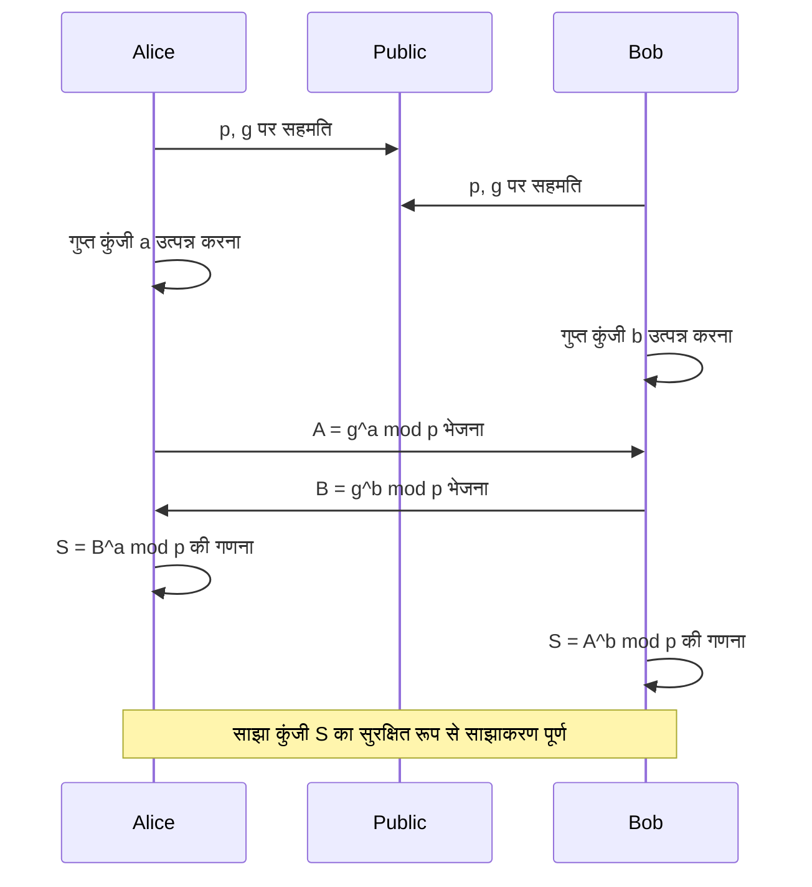
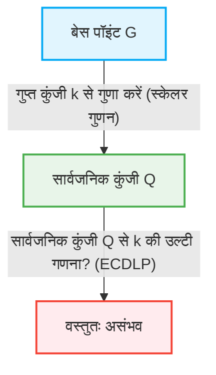

इंटरनेट समाज में, हम हर दिन सुरक्षित रूप से संवाद कर पा रहे हैं, यह "क्रिप्टोग्राफी (Cryptographic technology)" का ही वरदान है। ऑनलाइन बैंकिंग, ईमेल, SNS संदेश और सभी डिजिटल डेटा के प्रसारण-प्राप्ति के पीछे उच्च गणितीय सिद्धांतों पर आधारित एक सुरक्षा तंत्र मौजूद है। इस लेख में, हम आधुनिक सार्वजनिक कुंजी क्रिप्टोग्राफी (public key cryptography) की नींव रखने वाले RSA क्रिप्टोग्राफी की गणितीय संरचना से लेकर अधिक कुशल और मजबूत सुरक्षा प्रदान करने वाले एलिप्टिक कर्व क्रिप्टोग्राफी (ECC) तक ऐतिहासिक और गणितीय बदलाव के बारे में बहुत विस्तार से चर्चा करेंगे।

## 1. सिमेट्रिक-की क्रिप्टोग्राफी (Symmetric-key cryptography) की सीमाएं और कुंजी वितरण समस्या (Key Distribution Problem)

क्रिप्टोग्राफी का इतिहास बहुत पुराना है, जिसमें सीज़र साइफर (Caesar cipher) और एनिग्मा (Enigma) जैसे कई एन्क्रिप्शन तरीके तैयार किए गए हैं। इन्हें मुख्य रूप से "सिमेट्रिक-की क्रिप्टोग्राफी (Symmetric-key cryptography)" के अंतर्गत वर्गीकृत किया जाता है। सिमेट्रिक-की क्रिप्टोग्राफी में एन्क्रिप्शन और डिक्रिप्शन दोनों के लिए एक ही कुंजी का उपयोग किया जाता है।

### कुंजी वितरण समस्या (Key Distribution Problem)
सिमेट्रिक-की क्रिप्टोग्राफी की सबसे बड़ी कमजोरी यह समस्या है कि "कुंजी को सुरक्षित रूप से दूसरे व्यक्ति तक कैसे पहुँचाया जाए"। यदि संचार करने वाला व्यक्ति दुनिया के दूसरी तरफ है, तो इंटरनेट के माध्यम से कुंजी भेजने पर छिपकर बात सुनने वाले (eavesdropper) द्वारा कुंजी चुराने का खतरा रहता है। यदि कुंजी चोरी हो जाती है, तो एन्क्रिप्शन आसानी से डिक्रिप्ट हो जाएगा। यह "कुंजी वितरण समस्या" इंटरनेट जैसे खुले नेटवर्क में सुरक्षित संचार के लिए सबसे बड़ी बाधा थी।

## 2. डिफी-हेलमैन कुंजी विनिमय (Diffie-Hellman Key Exchange)

1976 में व्हिटफील्ड डिफी और मार्टिन हेलमैन ने इस कुंजी वितरण समस्या को हल करने के लिए एक क्रांतिकारी तकनीक प्रस्तुत की। यही "डिफी-हेलमैन कुंजी विनिमय" है। इस तकनीक ने संचार मार्ग पर जासूसी होने के बावजूद, दो पक्षों के बीच सुरक्षित रूप से एक साझा गुप्त कुंजी (shared secret key) साझा करना संभव बना दिया।

### गणितीय आधार: डिस्क्रीट लॉगरिथम समस्या (Discrete Logarithm Problem)
डिफी-हेलमैन कुंजी विनिमय की सुरक्षा "डिस्क्रीट लॉगरिथम समस्या" की गणनात्मक कठिनाई पर निर्भर करती है।

मान लीजिए कि एक अभाज्य संख्या $p$ और उसकी आद्य मूल (primitive root) $g$ सार्वजनिक रूप से ज्ञात हैं।
ऐलिस और बॉब निम्नलिखित चरणों के माध्यम से एक कुंजी साझा करते हैं:

1. ऐलिस एक गुप्त पूर्णांक $a$ चुनती है, $A = g^a \pmod p$ की गणना करती है, और इसे बॉब को भेजती है।
2. बॉब एक गुप्त पूर्णांक $b$ चुनता है, $B = g^b \pmod p$ की गणना करता है, और इसे ऐलिस को भेजता है।
3. ऐलिस प्राप्त $B$ का उपयोग करके $S = B^a \pmod p$ की गणना करती है।
4. बॉब प्राप्त $A$ का उपयोग करके $S = A^b \pmod p$ की गणना करता है।

यहाँ, चूंकि $B^a = (g^b)^a = g^{ba} = g^{ab} = (g^a)^b = A^b \pmod p$ होता है, इसलिए ऐलिस और बॉब एक ही गुप्त मान $S$ को साझा कर सकते हैं।
जासूस ईव $p, g, A, B$ को जानती है, लेकिन $A$ से $a$ का पता लगाना (डिस्क्रीट लॉगरिथम समस्या) संख्या बड़ी होने पर कम्प्यूटेशनल रूप से अत्यधिक कठिन हो जाता है।

## 3. RSA क्रिप्टोग्राफी का जन्म और यूलर का प्रमेय (Euler's Theorem)

डिफी-हेलमैन कुंजी विनिमय कुंजी साझा करने के लिए उपयोगी था, लेकिन इसमें अपने आप एन्क्रिप्शन-डिक्रिप्शन या डिजिटल हस्ताक्षर की कार्यक्षमता नहीं थी। 1977 में, रोनाल्ड रिवेस्ट, अदि शमीर और लियोनार्ड एडेलमैन द्वारा पहला वास्तविक सार्वजनिक कुंजी एन्क्रिप्शन तरीका "RSA क्रिप्टोग्राफी" विकसित किया गया था।

### सार्वजनिक कुंजी (Public Key) और निजी कुंजी (Private Key) की विषमता
RSA क्रिप्टोग्राफी ने एक क्रांतिकारी अवधारणा को साकार किया जिसमें एन्क्रिप्शन के लिए उपयोग की जाने वाली "सार्वजनिक कुंजी" और डिक्रिप्शन के लिए उपयोग की जाने वाली "निजी कुंजी" को अलग किया गया। सार्वजनिक कुंजी किसी को भी प्रकाशित की जा सकती है, और इसके उपयोग से एन्क्रिप्ट किए गए संदेश को केवल वही व्यक्ति डिक्रिप्ट कर सकता है जिसके पास संबंधित निजी कुंजी हो।

### गणितीय आधार: प्राइम फैक्टराइजेशन की कठिनाई और यूलर का प्रमेय
RSA क्रिप्टोग्राफी की सुरक्षा एक विशाल भाज्य संख्या (composite number) के "प्राइम फैक्टराइजेशन (prime factorization) की कठिनाई" पर आधारित है।

1. दो बहुत बड़ी अभाज्य संख्याएं $p$ और $q$ चुनें और उनके गुणनफल $N = p \times q$ की गणना करें।
2. यूलर के टॉटिएंट फ़ंक्शन (Euler's totient function) $\phi(N) = (p-1)(q-1)$ की गणना करें।
3. एक पूर्णांक $e$ चुनें जो $\phi(N)$ के सह-अभाज्य (coprime) हो (यह सार्वजनिक कुंजी का हिस्सा बन जाएगा)।
4. $d$ की गणना करें जो $e \times d \equiv 1 \pmod{\phi(N)}$ को संतुष्ट करता हो (यह निजी कुंजी बन जाएगा)।

सार्वजनिक कुंजी $(N, e)$ है, और निजी कुंजी $d$ है।

#### एन्क्रिप्शन और डिक्रिप्शन की प्रक्रिया
- **एन्क्रिप्शन**: संदेश $M$ को एन्क्रिप्ट करके सिफरटेक्स्ट $C$ प्राप्त करने के लिए, $C = M^e \pmod N$ की गणना करें।
- **डिक्रिप्शन**: सिफरटेक्स्ट $C$ को डिक्रिप्ट करके मूल संदेश $M$ वापस पाने के लिए, $M = C^d \pmod N$ की गणना करें।

यह क्यों काम करता है? यह यूलर के प्रमेय (Euler's Theorem) पर निर्भर करता है।
यूलर के प्रमेय के अनुसार, यदि $M$ और $N$ सह-अभाज्य (coprime) हैं, तो $M^{\phi(N)} \equiv 1 \pmod N$ लागू होता है।
चूंकि $e \times d = 1 + k \times \phi(N)$ ($k$ एक पूर्णांक है),
$C^d = (M^e)^d = M^{ed} = M^{1 + k\phi(N)} = M \times (M^{\phi(N)})^k \equiv M \times 1^k \equiv M \pmod N$
मूल संदेश $M$ सफलतापूर्वक पुनर्प्राप्त हो जाता है।

एक हमलावर को सार्वजनिक कुंजी $(N, e)$ से निजी कुंजी $d$ खोजने के लिए, $\phi(N)$ को जानने की आवश्यकता है, और इसके लिए उसे $N$ का $p$ और $q$ में प्राइम फैक्टराइजेशन करना होगा। एक विशाल संख्या (उदाहरण के लिए 2048 बिट) का प्राइम फैक्टराइजेशन करने में वर्तमान शास्त्रीय कंप्यूटरों (classical computers) के साथ खगोलीय समय लगता है।

## 4. RSA क्रिप्टोग्राफी की सीमाएं: कुंजी की लंबाई का बढ़ना

RSA ने कई वर्षों तक इंटरनेट सुरक्षा की नींव के रूप में काम किया है, लेकिन कंप्यूटर प्रसंस्करण शक्ति (processing power) में सुधार और प्राइम फैक्टराइजेशन एल्गोरिदम (जैसे जनरल नंबर फील्ड सीव - General Number Field Sieve) के विकास के साथ, इसकी कमजोरियां उजागर हो गई हैं।

सुरक्षा बनाए रखने के लिए, $N$ के अंकों (कुंजी की लंबाई) को लगातार बढ़ाने की आवश्यकता है। एक समय था जब 512 बिट्स को सुरक्षित माना जाता था, लेकिन 1024 बिट्स को भी तोड़ दिया गया, और अब कम से कम 2048 बिट्स, और यदि उच्च सुरक्षा की आवश्यकता है तो 3072 बिट्स या 4096 बिट्स की कुंजी की लंबाई की सिफारिश की जाती है।

जब कुंजी की लंबाई बढ़ जाती है, तो निम्नलिखित समस्याएं उत्पन्न होती हैं:
1. **कम्प्यूटेशनल लागत में वृद्धि**: एन्क्रिप्शन और डिक्रिप्शन, विशेष रूप से हस्ताक्षर निर्माण के लिए आवश्यक कम्प्यूटेशनल संसाधनों में वृद्धि होती है।
2. **मेमोरी और बैंडविड्थ की खपत**: स्मार्टफोन और IoT उपकरणों जैसे सीमित संसाधनों वाले वातावरण में, हजारों बिट्स की कुंजियों को सहेजना और भेजना कुशल नहीं है।

कुंजी की लंबाई के इस "मुद्रास्फीति (inflation)" से निपटने के लिए एक बिल्कुल नए गणितीय दृष्टिकोण की आवश्यकता थी।

## 5. एलिप्टिक कर्व क्रिप्टोग्राफी (ECC) की सुंदरता (Elegance)

यहाँ "एलिप्टिक कर्व क्रिप्टोग्राफी (Elliptic Curve Cryptography: ECC)" का प्रवेश होता है। 1985 में नील कोब्लिट्ज और विक्टर मिलर द्वारा स्वतंत्र रूप से प्रस्तावित, ECC RSA के समान स्तर की सुरक्षा बहुत छोटी कुंजी की लंबाई के साथ प्रदान करता है। उदाहरण के लिए, RSA के 3072 बिट्स के बराबर सुरक्षा ECC के साथ केवल 256 बिट्स की कुंजी की लंबाई में प्राप्त की जा सकती है।

### एलिप्टिक कर्व्स (Elliptic Curves) का गणित
एक एलिप्टिक कर्व एक त्रिघातीय समीकरण (cubic equation) है जिसे वीयरस्ट्रैस (Weierstrass) सामान्य रूप में व्यक्त किया जाता है:
$$ y^2 = x^3 + ax + b $$
(जहाँ, $4a^3 + 27b^2 \neq 0$ है, जो यह सुनिश्चित करता है कि वक्र में कोई एकवचन (singular) बिंदु नहीं है)।

जब क्रिप्टोग्राफी के लिए उपयोग किया जाता है, तो यह वक्र वास्तविक संख्याओं (real numbers) पर नहीं, बल्कि एक परिमित क्षेत्र (finite field) (जैसे अभाज्य संख्या $p$ के मापांक/modulo वाले क्षेत्र) पर परिभाषित होता है।

### एलिप्टिक कर्व पर बिंदु जोड़ (Point Addition)
ECC की सबसे महत्वपूर्ण विशेषता यह है कि वक्र पर बिंदुओं के बीच "जोड़ (addition)" नामक ज्यामितीय संचालन (geometric operation) को परिभाषित किया जा सकता है।

जब बिंदु $P$ और बिंदु $Q$ वक्र पर होते हैं और $P \neq Q$ होता है, तो दो बिंदुओं से गुजरने वाली एक रेखा खींची जाती है, वक्र के साथ इसके प्रतिच्छेदन (intersection) का एक और बिंदु ज्ञात किया जाता है, और उस बिंदु को $x$-अक्ष के सापेक्ष सममित रूप (symmetrically) से स्थानांतरित करके $R = P + Q$ परिभाषित किया जाता है।
जब बिंदु $P$ को बिंदु $P$ में जोड़ा जाता है (स्केलर गुणन - scalar multiplication), तो बिंदु $P$ पर एक स्पर्शरेखा (tangent line) खींची जाती है, प्रतिच्छेदन बिंदु ज्ञात किया जाता है, और इसी तरह सममित रूप से स्थानांतरित करके $2P$ प्राप्त किया जाता है।

### स्केलर गुणन और एलिप्टिक कर्व डिस्क्रीट लॉगरिथम समस्या (ECDLP)
बेस पॉइंट (base point) नामक एक संदर्भ बिंदु $G$ को एक गुप्त पूर्णांक $k$ बार जोड़ने के संचालन को स्केलर गुणन (scalar multiplication) कहा जाता है।
$Q = k \times G = G + G + \dots + G$ (k बार)

यहाँ,
- $k$ "निजी कुंजी" है
- $Q$ "सार्वजनिक कुंजी" है

जब $G$ और $Q$ दिए जाते हैं, तो उनसे $k$ की उल्टी गणना (reverse calculation) करने की समस्या को "एलिप्टिक कर्व डिस्क्रीट लॉगरिथम समस्या (Elliptic Curve Discrete Logarithm Problem: ECDLP)" कहा जाता है।
सामान्य डिस्क्रीट लॉगरिथम समस्या की तुलना में, ECDLP को हल करने के लिए वर्तमान में कोई कुशल एल्गोरिदम (सब-एक्सपोनेंशियल टाइम एल्गोरिदम) नहीं मिला है, और माना जाता है कि इसे पूरी तरह से एक्सपोनेंशियल समय की आवश्यकता होती है। यही गणितीय कारण है कि ECC बहुत छोटी कुंजी के साथ मजबूत सुरक्षा प्रदान कर सकता है।

## 6. ECC के अनुप्रयोग और भविष्य

वर्तमान में, ECC को TLS/SSL (वेब ब्राउज़र का HTTPS संचार), SSH, बिटकॉइन जैसी क्रिप्टोकरेंसी, और कई नवीनतम मैसेजिंग ऐप (जैसे Signal और WhatsApp) की आधारभूत तकनीक के रूप में व्यापक रूप से अपनाया जाता है। RSA से ECC में बदलाव संसाधनों की बचत और प्रदर्शन में सुधार लाता है, जिससे यह विशेष रूप से मोबाइल और IoT के व्यापक उपयोग वाले आधुनिक समाज में अपरिहार्य हो जाता है।

### क्वांटम कंप्यूटर का खतरा
हालाँकि, RSA और ECC दोनों ही भविष्य के खतरे "क्वांटम कंप्यूटर" के प्रति संवेदनशील (vulnerable) हैं। यदि एक बड़े पैमाने का क्वांटम कंप्यूटर साकार हो जाता है जो शोर के एल्गोरिदम (Shor's algorithm) को निष्पादित कर सकता है, तो प्राइम फैक्टराइजेशन और डिस्क्रीट लॉगरिथम समस्या दोनों को पॉलीनोमियल समय में हल कर लिया जाएगा।
इसलिए, वर्तमान में जाली क्रिप्टोग्राफी (lattice-based cryptography) और बहुभिन्नरूपी बहुपद क्रिप्टोग्राफी (multivariate polynomial cryptography) जैसे "पोस्ट-क्वांटम क्रिप्टोग्राफी (Post-Quantum Cryptography: PQC)" पर तेजी से शोध और मानकीकरण (standardization) किया जा रहा है, जिसे क्वांटम कंप्यूटरों द्वारा भी डिक्रिप्ट करना मुश्किल है।

## निष्कर्ष (सारांश)

इस लेख में, हमने डिफी-हेलमैन कुंजी विनिमय के साथ शुरुआत की जिसने सिमेट्रिक-की क्रिप्टोग्राफी की सीमाओं को दूर किया, प्राइम फैक्टराइजेशन पर आधारित RSA क्रिप्टोग्राफी की सुरुचिपूर्ण (elegant) संरचना को देखा, और फिर एलिप्टिक कर्व क्रिप्टोग्राफी (ECC) की ज्यामितीय और बीजगणितीय (algebraic) सुंदरता की गहराई में छानबीन की जिसने कुंजी की लंबाई की सीमा को पार कर लिया।
क्रिप्टोग्राफिक तकनीक केवल जानकारी छिपाने तक ही सीमित नहीं है, बल्कि यह वास्तविक दुनिया के बुनियादी ढांचे (infrastructure) में अत्याधुनिक गणितीय ज्ञान को लागू करने के सबसे सफल उदाहरणों में से एक है। RSA से ECC में बदलाव इस प्रक्रिया को शानदार ढंग से प्रदर्शित करता है कि कैसे अधिक परिष्कृत गणित हमारे डिजिटल जीवन को अधिक सुरक्षित और कुशल बना रहा है।
