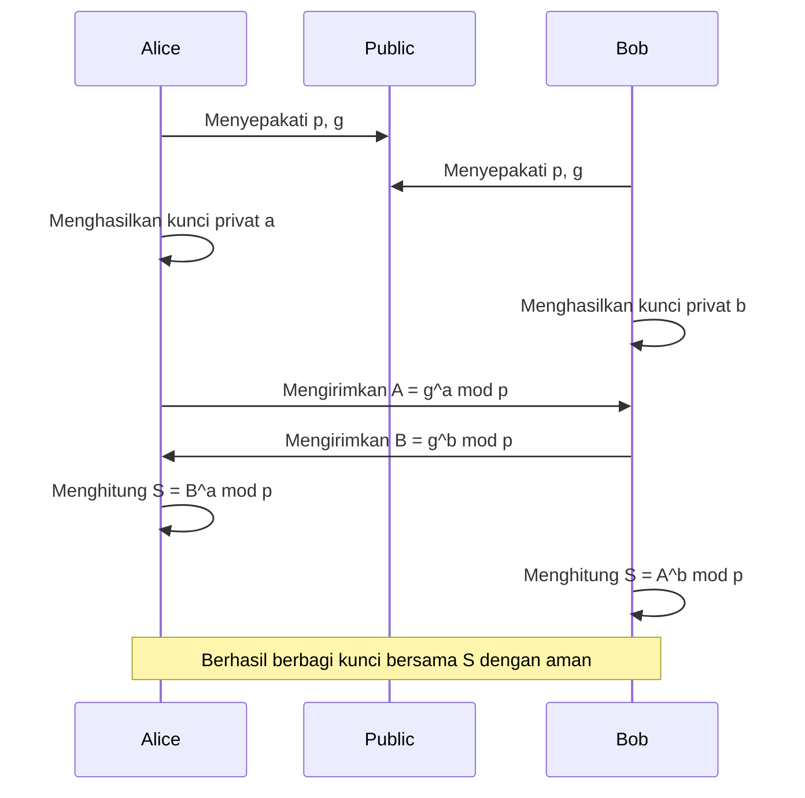
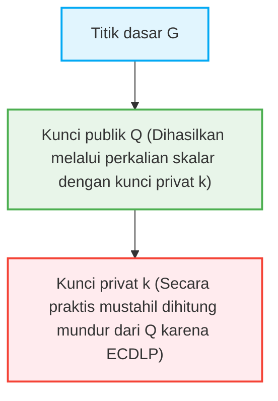

Di dalam masyarakat internet, fakta bahwa kita dapat berkomunikasi secara aman setiap hari adalah berkat "teknologi kriptografi". Di balik pengiriman dan penerimaan perbankan online, email, pesan media sosial, dan semua data digital, terdapat mekanisme keamanan yang didukung oleh teori matematika tingkat tinggi. Dalam artikel ini, kami akan menjelaskan secara sangat terperinci mengenai struktur matematika kriptografi RSA yang meletakkan dasar bagi kriptografi kunci publik modern, serta pergeseran historis dan matematis menuju Kriptografi Kurva Eliptik (ECC) yang memberikan keamanan yang lebih efisien dan kuat.

## 1. Keterbatasan Kriptografi Kunci Simetris dan Masalah Distribusi Kunci

Sejarah teknologi kriptografi sangatlah panjang, dengan banyak metode enkripsi seperti sandi Caesar dan Enigma yang telah diciptakan. Pada dasarnya, ini diklasifikasikan sebagai "kriptografi kunci simetris (Symmetric-key cryptography)". Pada kriptografi kunci simetris, kunci yang sama digunakan untuk enkripsi dan dekripsi.

### Masalah Distribusi Kunci (Key Distribution Problem)
Kelemahan terbesar dari kriptografi kunci simetris adalah "bagaimana cara mengirimkan kunci dengan aman ke pihak lain". Jika lawan bicara berada di belahan bumi lain, mengirim kunci melalui internet berisiko tinggi kunci tersebut dicuri oleh penyadap. Jika kunci dicuri, sandi dapat didekripsi dengan mudah. "Masalah distribusi kunci" ini adalah hambatan terbesar dalam komunikasi yang aman di jaringan terbuka seperti internet.

## 2. Pertukaran Kunci Diffie-Hellman (Diffie-Hellman Key Exchange)

Pada tahun 1976, Whitfield Diffie dan Martin Hellman mempublikasikan sebuah metode revolusioner yang memecahkan masalah distribusi kunci ini. Itu adalah "Pertukaran Kunci Diffie-Hellman". Melalui metode ini, bahkan jika jalur komunikasi disadap, menjadi mungkin bagi dua pihak untuk berbagi kunci rahasia bersama dengan aman.

### Basis Matematis: Masalah Logaritma Diskrit
Keamanan pertukaran kunci Diffie-Hellman bergantung pada kesulitan komputasi dari "Masalah Logaritma Diskrit (Discrete Logarithm Problem)".

Misalkan sebuah bilangan prima $p$ dan akar primitifnya $g$ diketahui secara publik.
Alice dan Bob berbagi kunci melalui langkah-langkah berikut.

1. Alice memilih bilangan bulat rahasia $a$, menghitung $A = g^a \pmod p$, dan mengirimkannya ke Bob.
2. Bob memilih bilangan bulat rahasia $b$, menghitung $B = g^b \pmod p$, dan mengirimkannya ke Alice.
3. Alice menggunakan $B$ yang diterimanya untuk menghitung $S = B^a \pmod p$.
4. Bob menggunakan $A$ yang diterimanya untuk menghitung $S = A^b \pmod p$.

Di sini, karena $B^a = (g^b)^a = g^{ba} = g^{ab} = (g^a)^b = A^b \pmod p$, Alice dan Bob dapat berbagi nilai rahasia $S$ yang sama.
Penyadap Eve mengetahui $p, g, A, B$, tetapi mencari $a$ dari $A$ (masalah logaritma diskrit) menjadi sangat sulit secara komputasi ketika angkanya membesar.

## 3. Kelahiran Kriptografi RSA dan Teorema Euler

Pertukaran kunci Diffie-Hellman berguna untuk berbagi kunci, tetapi tidak memiliki fungsi enkripsi/dekripsi atau tanda tangan digital itu sendiri. Pada tahun 1977, kriptografi kunci publik berskala penuh pertama, "Kriptografi RSA", dikembangkan oleh ketiga tokoh: Ronald Rivest, Adi Shamir, dan Leonard Adleman.

### Asimetri Kunci Publik dan Kunci Privat
Kriptografi RSA merealisasikan konsep revolusioner yaitu memisahkan "kunci publik" yang digunakan untuk enkripsi, dan "kunci privat" yang digunakan untuk dekripsi. Kunci publik dapat diungkapkan kepada siapa saja, dan pesan yang dienkripsi menggunakannya hanya dapat didekripsi oleh orang yang memiliki kunci privat yang sesuai.

### Basis Matematis: Kesulitan Faktorisasi Prima dan Teorema Euler
Keamanan kriptografi RSA didasarkan pada "kesulitan faktorisasi prima" dari bilangan komposit raksasa.

1. Pilih dua bilangan prima yang sangat besar $p$ dan $q$, dan hitung hasil kalinya $N = p \times q$.
2. Hitung fungsi totient Euler $\phi(N) = (p-1)(q-1)$.
3. Pilih bilangan bulat $e$ yang relatif prima terhadap $\phi(N)$ (ini menjadi bagian dari kunci publik).
4. Hitung $d$ yang memenuhi $e \times d \equiv 1 \pmod{\phi(N)}$ (ini menjadi kunci privat).

Kunci publik adalah $(N, e)$, dan kunci privat adalah $d$.

#### Proses Enkripsi dan Dekripsi
- **Enkripsi**: Untuk mengenkripsi pesan $M$ dan mendapatkan ciphertext $C$, hitung $C = M^e \pmod N$.
- **Dekripsi**: Untuk mendekripsi ciphertext $C$ dan mendapatkan pesan asli $M$, hitung $M = C^d \pmod N$.

Mengapa ini berlaku? Ini bergantung pada Teorema Euler.
Menurut Teorema Euler, jika $M$ dan $N$ relatif prima, maka $M^{\phi(N)} \equiv 1 \pmod N$ berlaku.
Karena $e \times d = 1 + k \times \phi(N)$ ($k$ adalah bilangan bulat),
$C^d = (M^e)^d = M^{ed} = M^{1 + k\phi(N)} = M \times (M^{\phi(N)})^k \equiv M \times 1^k \equiv M \pmod N$
Dengan luar biasa, pesan asli $M$ berhasil dipulihkan.

Bagi penyerang untuk mencari kunci privat $d$ dari kunci publik $(N, e)$, mereka perlu mengetahui $\phi(N)$, dan untuk itu mereka harus memfaktorkan $N$ menjadi $p$ dan $q$. Faktorisasi prima dari bilangan raksasa (misalnya 2048 bit) memakan waktu astronomis pada komputer klasik saat ini.

## 4. Keterbatasan Kriptografi RSA: Peningkatan Ukuran Kunci

RSA telah berfungsi sebagai fondasi keamanan internet selama bertahun-tahun, tetapi seiring dengan peningkatan daya pemrosesan komputer dan evolusi algoritma faktorisasi prima (seperti *general number field sieve*), kelemahannya mulai terekspos.

Untuk mempertahankan keamanan, jumlah digit (panjang kunci) dari $N$ perlu terus ditingkatkan. Dahulu 512 bit dianggap aman, tetapi kemudian 1024 bit berhasil dipecahkan, dan saat ini direkomendasikan panjang kunci minimal 2048 bit, atau bahkan 3072 bit dan 4096 bit jika membutuhkan keamanan yang lebih tinggi.

Ketika panjang kunci menjadi lebih panjang, masalah berikut terjadi:
1. **Peningkatan Biaya Komputasi**: Sumber daya komputasi yang dibutuhkan untuk enkripsi, dekripsi, dan khususnya pembuatan tanda tangan menjadi meningkat.
2. **Konsumsi Memori dan Bandwidth**: Dalam lingkungan dengan sumber daya terbatas seperti ponsel pintar atau perangkat IoT, menyimpan atau mentransmisikan kunci berukuran ribuan bit tidaklah efisien.

Untuk mengatasi "inflasi panjang kunci" ini, pendekatan matematika yang sama sekali baru diperlukan.

## 5. Keanggunan Kriptografi Kurva Eliptik (ECC)

Di sinilah "Kriptografi Kurva Eliptik (Elliptic Curve Cryptography: ECC)" muncul. Diusulkan secara independen oleh Neal Koblitz dan Victor Miller pada tahun 1985, ECC mencapai tingkat keamanan yang sama dengan RSA, tetapi dengan panjang kunci yang jauh lebih pendek. Misalnya, keamanan yang setara dengan 3072 bit RSA dapat dicapai di ECC hanya dengan panjang kunci 256 bit.

### Matematika Kurva Eliptik
Kurva eliptik adalah persamaan pangkat tiga yang dinyatakan dalam bentuk standar Weierstrass berikut.
$$ y^2 = x^3 + ax + b $$
(Di mana, $4a^3 + 27b^2 \neq 0$, menjamin bahwa kurva tidak memiliki titik singular).

Saat digunakan dalam kriptografi, kurva ini didefinisikan di atas lapangan berhingga (seperti lapangan dengan modulo bilangan prima $p$), bukan pada bilangan real.

### Penambahan Titik pada Kurva Eliptik (Point Addition)
Karakteristik paling penting dari ECC adalah bahwa operasi geometris yang disebut "penambahan" dapat didefinisikan antara titik-titik pada kurva.

Jika titik $P$ dan titik $Q$ berada pada kurva, dan $P \neq Q$, tarik garis lurus yang melewati dua titik tersebut, cari titik perpotongan lain dengan kurva, lalu refleksikan titik tersebut terhadap sumbu $x$ yang kemudian didefinisikan sebagai $R = P + Q$.
Saat menambahkan titik $P$ dan titik $P$ (perkalian skalar), gambar garis singgung pada titik $P$, temukan perpotongannya dengan cara yang sama, refleksikan, dan dapatkan $2P$.

### Perkalian Skalar dan Masalah Logaritma Diskrit Kurva Eliptik (ECDLP)
Operasi penambahan titik referensi yang disebut titik dasar $G$ berulang-ulang dengan bilangan bulat rahasia $k$ kali disebut perkalian skalar.
$Q = k \times G = G + G + \dots + G$ (k kali)

Di sini,
- $k$ adalah "kunci privat"
- $Q$ adalah "kunci publik"

Masalah komputasi $k$ kembali secara terbalik ketika diberikan $G$ dan $Q$ disebut "Masalah Logaritma Diskrit Kurva Eliptik (ECDLP)".
Tidak seperti masalah logaritma diskrit biasa, saat ini tidak ada algoritma efisien (algoritma waktu eksponensial sub-linier) yang ditemukan untuk memecahkan ECDLP, dan diyakini memerlukan waktu eksponensial secara penuh. Inilah alasan matematis mengapa ECC dapat memberikan keamanan yang kuat dengan kunci yang sangat pendek.

## 6. Aplikasi ECC dan Masa Depan

Saat ini, ECC banyak diadopsi sebagai teknologi dasar untuk TLS/SSL (komunikasi HTTPS di peramban web), SSH, mata uang kripto seperti Bitcoin, dan banyak aplikasi pesan modern (seperti Signal dan WhatsApp). Transisi dari RSA ke ECC menghemat sumber daya dan meningkatkan performa, menjadikannya sangat penting terutama di masyarakat modern dengan adopsi mobile dan IoT yang luas.

### Ancaman Komputer Kuantum
Namun, baik RSA maupun ECC rentan terhadap ancaman masa depan yaitu "komputer kuantum". Jika komputer kuantum skala besar yang dapat menjalankan algoritma Shor direalisasikan, baik masalah faktorisasi prima maupun masalah logaritma diskrit akan dapat dipecahkan dalam waktu polinomial.
Oleh karena itu, saat ini penelitian dan standardisasi menuju "Kriptografi Pasca-Kuantum (Post-Quantum Cryptography: PQC)", seperti kriptografi berbasis kisi dan kriptografi polinomial multivariat yang sulit dipecahkan bahkan oleh komputer kuantum, sedang mengalami kemajuan yang pesat.

## Kesimpulan

Dalam artikel ini, kita mendalami pertukaran kunci Diffie-Hellman yang mengatasi keterbatasan kriptografi kunci simetris, struktur elegan dari kriptografi RSA yang didasarkan pada faktorisasi prima, serta keindahan geometris dan aljabar dari Kriptografi Kurva Eliptik (ECC) yang menembus batasan panjang kunci.
Teknologi kriptografi bukan sekadar penyembunyian informasi, melainkan salah satu contoh paling sukses dalam menerapkan wawasan matematika termutakhir ke dalam infrastruktur dunia nyata. Pergeseran dari RSA ke ECC dengan apik menunjukkan proses di mana matematika yang lebih canggih membuat kehidupan digital kita menjadi lebih aman dan efisien.
