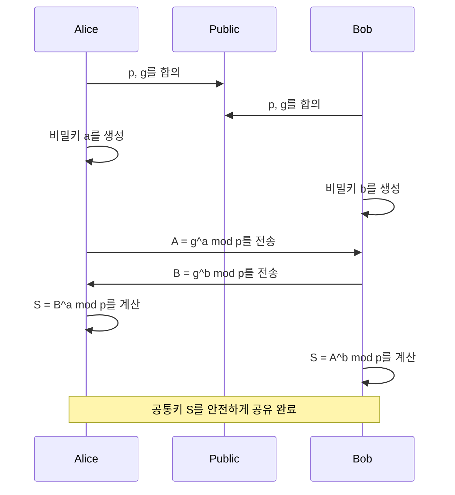
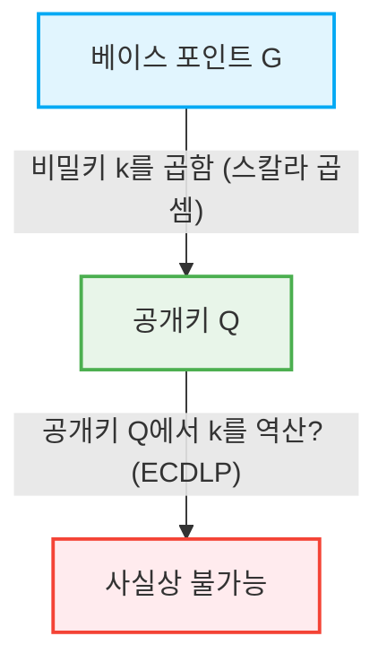

인터넷 사회에서 우리가 매일 안전하게 통신할 수 있는 것은 '암호 기술'의 혜택입니다. 온라인 뱅킹, 이메일, SNS 메시지 등 모든 디지털 데이터의 송수신 이면에는 고도의 수학적 이론으로 뒷받침된 보안 메커니즘이 존재합니다. 본 기사에서는 현대 공개키 암호의 기초를 다진 RSA 암호의 수학적 구조부터, 더 효율적이고 강력한 보안을 제공하는 타원곡선암호(ECC)로의 역사적 및 수학적 전환에 대해 매우 상세하게 해설합니다.

## 1. 대칭키 암호의 한계와 키 분배 문제

암호 기술의 역사는 오래되었으며, 시저 암호나 에니그마 등 많은 암호 방식이 고안되어 왔습니다. 이들은 기본적으로 '대칭키 암호(Symmetric-key cryptography)'로 분류됩니다. 대칭키 암호에서는 암호화와 복호화에 동일한 키를 사용합니다.

### 키 분배 문제(Key Distribution Problem)
대칭키 암호의 가장 큰 약점은 "키를 어떻게 안전하게 상대방에게 전달할 것인가"하는 문제입니다. 통신 상대가 지구 반대편에 있을 경우, 인터넷을 통해 키를 보내면 도청자에게 키를 빼앗길 위험이 있습니다. 키를 빼앗기면 암호는 쉽게 해독되고 맙니다. 이 '키 분배 문제'는 인터넷과 같은 개방된 네트워크에서 안전한 통신을 하는 데 있어 가장 큰 장벽이었습니다.

## 2. 디피-헬만 키 교환(Diffie-Hellman Key Exchange)

1976년, 휘트필드 디피와 마틴 헬만은 이 키 분배 문제를 해결하는 획기적인 기법을 발표했습니다. 그것이 바로 '디피-헬만 키 교환'입니다. 이 기법을 통해 통신 경로가 도청되더라도 두 사람 사이에 안전하게 공통의 비밀키를 공유하는 것이 가능해졌습니다.

### 수학적 기반: 이산로그 문제
디피-헬만 키 교환의 안전성은 '이산로그 문제(Discrete Logarithm Problem)'의 계산적 어려움에 의존합니다.

어떤 소수 $p$ 와 그 원시근 $g$ 가 공개되어 있다고 가정합니다.
앨리스와 밥은 다음 절차로 키를 공유합니다.

1. 앨리스는 비밀 정수 $a$ 를 선택하고, $A = g^a \pmod p$ 를 계산하여 밥에게 전송합니다.
2. 밥은 비밀 정수 $b$ 를 선택하고, $B = g^b \pmod p$ 를 계산하여 앨리스에게 전송합니다.
3. 앨리스는 받은 $B$ 를 사용하여 $S = B^a \pmod p$ 를 계산합니다.
4. 밥은 받은 $A$ 를 사용하여 $S = A^b \pmod p$ 를 계산합니다.

여기서 $B^a = (g^b)^a = g^{ba} = g^{ab} = (g^a)^b = A^b \pmod p$ 가 되므로, 앨리스와 밥은 같은 비밀 값 $S$ 를 공유할 수 있습니다.
도청자 이브는 $p, g, A, B$ 를 알고 있지만, $A$ 에서 $a$ 를 구하는 것(이산로그 문제)은 수가 커지면 계산량 측면에서 극히 어렵습니다.

## 3. RSA 암호의 탄생과 오일러의 정리

디피-헬만 키 교환은 키 공유에는 유용했지만, 그 자체로 암호화·복호화나 디지털 서명 기능을 가지고 있지는 않았습니다. 1977년 로널드 리베스트, 아디 샤미르, 레너드 애들먼 세 사람에 의해 최초의 본격적인 공개키 암호 방식인 'RSA 암호'가 개발되었습니다.

### 공개키와 비밀키의 비대칭성
RSA 암호는 암호화에 사용하는 '공개키'와 복호화에 사용하는 '비밀키'를 분리한다는 획기적인 개념을 실현했습니다. 공개키는 누구에게나 공개할 수 있으며, 그것을 사용하여 암호화된 메시지는 해당하는 비밀키를 가진 본인만이 복호화할 수 있습니다.

### 수학적 기반: 소인수분해의 어려움과 오일러의 정리
RSA 암호의 안전성은 거대한 합성수의 '소인수분해의 어려움'에 기반을 두고 있습니다.

1. 매우 큰 두 소수 $p$ 와 $q$ 를 선택하고, 그 곱 $N = p \times q$ 를 계산합니다.
2. 오일러의 피 함수 $\phi(N) = (p-1)(q-1)$ 을 계산합니다.
3. $\phi(N)$ 와 서로소인 정수 $e$ 를 선택합니다 (이것이 공개키의 일부가 됩니다).
4. $e \times d \equiv 1 \pmod{\phi(N)}$ 을 만족하는 $d$ 를 계산합니다 (이것이 비밀키가 됩니다).

공개키는 $(N, e)$, 비밀키는 $d$ 입니다.

#### 암호화와 복호화 프로세스
- **암호화**: 메시지 $M$ 을 암호화하여 암호문 $C$ 를 얻으려면, $C = M^e \pmod N$ 을 계산합니다.
- **복호화**: 암호문 $C$ 를 복호화하여 원래의 메시지 $M$ 을 얻으려면, $M = C^d \pmod N$ 을 계산합니다.

왜 이것이 성립할까요? 그것은 오일러의 정리에 의존하고 있습니다.
오일러의 정리에 따르면, $M$ 과 $N$ 이 서로소이면, $M^{\phi(N)} \equiv 1 \pmod N$ 이 성립합니다.
$e \times d = 1 + k \times \phi(N)$ ($k$ 는 정수)이므로,
$C^d = (M^e)^d = M^{ed} = M^{1 + k\phi(N)} = M \times (M^{\phi(N)})^k \equiv M \times 1^k \equiv M \pmod N$
훌륭하게 원래의 메시지 $M$ 이 복원됩니다.

공격자가 공개키 $(N, e)$ 에서 비밀키 $d$ 를 구하려면 $\phi(N)$ 을 알아야 하며, 이를 위해서는 $N$ 을 $p$ 와 $q$ 로 소인수분해해야 합니다. 거대한 수(예: 2048비트)의 소인수분해는 현재의 고전 컴퓨터로는 천문학적인 시간이 걸립니다.

## 4. RSA 암호의 한계: 키 길이의 거대화

RSA는 오랫동안 인터넷 보안의 기반으로 기능해 왔지만, 컴퓨터 처리 능력의 향상과 소인수분해 알고리즘(일반 수체 체 등)의 진화에 따라 약점이 노출되어 왔습니다.

안전성을 유지하기 위해서는 $N$ 의 자릿수(키 길이)를 지속적으로 늘려야 합니다. 과거에는 512비트로 안전하다고 여겨졌지만, 1024비트가 뚫렸고, 현재는 최소한 2048비트, 더 높은 보안을 원한다면 3072비트나 4096비트의 키 길이가 권장되고 있습니다.

키 길이가 길어지면 다음과 같은 문제가 발생합니다.
1. **계산 비용의 증가**: 암호화나 복호화, 특히 서명 생성에 드는 계산 리소스가 증대됩니다.
2. **메모리와 대역폭의 소비**: 스마트폰이나 IoT 디바이스 등 리소스가 제한된 환경에서는 수천 비트의 키 저장이나 전송이 효율적이지 않습니다.

이 '키 길이 인플레이션'에 대처하기 위해 전혀 새로운 수학적 접근이 요구되었습니다.

## 5. 타원곡선암호(ECC)의 우아함

여기서 등장하는 것이 '타원곡선암호(Elliptic Curve Cryptography: ECC)'입니다. 1985년 닐 코블리츠와 빅터 밀러에 의해 독립적으로 제안된 ECC는, RSA와 동일한 수준의 보안을 훨씬 짧은 키 길이로 실현합니다. 예를 들어, RSA의 3072비트와 동등한 안전성을 ECC에서는 불과 256비트의 키 길이로 달성할 수 있습니다.

### 타원곡선의 수학
타원곡선은 다음의 바이어슈트라스 표준형으로 표현되는 3차 방정식입니다.
$$ y^2 = x^3 + ax + b $$
(단, $4a^3 + 27b^2 \neq 0$ 이며, 곡선이 특이점을 갖지 않음을 보장합니다).

암호에 사용할 경우, 이 곡선은 실수가 아닌 유한체(소수 $p$ 를 법으로 하는 체 등) 위에서 정의됩니다.

### 타원곡선 상의 점의 덧셈(Point Addition)
ECC의 가장 중요한 특성은 곡선 상의 점과 점 사이에 '덧셈'이라는 기하학적 연산을 정의할 수 있다는 것입니다.

점 $P$ 와 점 $Q$ 가 곡선 상에 있고 $P \neq Q$ 일 경우, 두 점을 지나는 직선을 그어 곡선과의 또 다른 교점을 구하고, 그것을 $x$ 축에 대해 대칭 이동시킨 점을 $R = P + Q$ 로 정의합니다.
점 $P$ 와 점 $P$ 를 더할 경우(스칼라 곱셈), 점 $P$ 에서의 접선을 그어 동일하게 교점을 구하고 대칭 이동시켜 $2P$ 를 얻습니다.

### 스칼라 곱셈과 타원곡선 이산로그 문제(ECDLP)
베이스 포인트라 불리는 기준점 $G$ 를 비밀 정수 $k$ 번 더하는 연산을 스칼라 곱셈이라고 부릅니다.
$Q = k \times G = G + G + \dots + G$ (k번)

여기서,
- $k$ 를 '비밀키'
- $Q$ 를 '공개키'
로 합니다.

$G$ 와 $Q$ 가 주어졌을 때, 그것들로부터 $k$ 를 역산하는 문제를 '타원곡선 이산로그 문제(ECDLP)'라고 부릅니다.
일반적인 이산로그 문제보다 ECDLP를 풀기 위한 효율적인 알고리즘(준지수시간 알고리즘)은 현재 발견되지 않았으며, 완전한 지수시간이 필요하다고 여겨집니다. 이것이 ECC가 매우 짧은 키로 강력한 보안을 제공할 수 있는 수학적 이유입니다.

## 6. ECC의 응용과 미래

현재 ECC는 TLS/SSL(웹 브라우저의 HTTPS 통신), SSH, 비트코인 등의 암호화폐, 그리고 많은 최신 메시징 앱(Signal이나 WhatsApp 등)의 기반 기술로 널리 채택되고 있습니다. RSA에서 ECC로의 전환은 리소스 절약과 성능 향상을 가져왔으며, 특히 모바일과 IoT가 보급된 현대 사회에서 불가결한 요소가 되었습니다.

### 양자 컴퓨터의 위협
그러나 RSA도 ECC도 미래의 위협인 '양자 컴퓨터'에는 취약합니다. 쇼어의 알고리즘을 실행할 수 있는 대규모 양자 컴퓨터가 실현되면, 소인수분해나 이산로그 문제 모두 다항시간 안에 풀리고 맙니다.
그렇기 때문에 현재는 격자 암호나 다변수 다항식 암호 등 양자 컴퓨터로도 해독이 어려운 '양자내성암호(Post-Quantum Cryptography: PQC)'에 대한 연구와 표준화가 급속히 진행되고 있습니다.

## 요약

본 기사에서는 대칭키 암호의 한계를 극복한 디피-헬만 키 교환에서 시작하여, 소인수분해에 기반한 RSA 암호의 우아한 구조, 그리고 키 길이의 한계를 돌파한 타원곡선암호(ECC)의 기하학적·대수적 아름다움에 대해 깊이 파헤쳐 보았습니다.
암호 기술은 단순한 정보 은폐에 그치지 않고, 수학의 최첨단 지식을 현실 세계의 인프라에 응용한 가장 성공적인 사례 중 하나입니다. RSA에서 ECC로의 전환은 더 세련된 수학이 우리의 디지털 생활을 더 안전하고 효율적으로 만들어가는 과정을 훌륭하게 보여줍니다.
