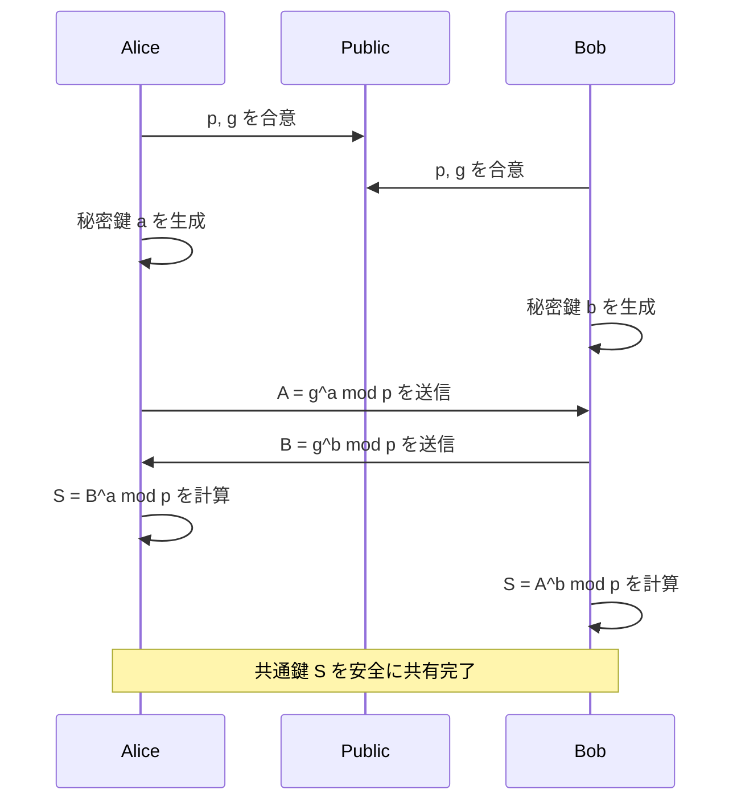
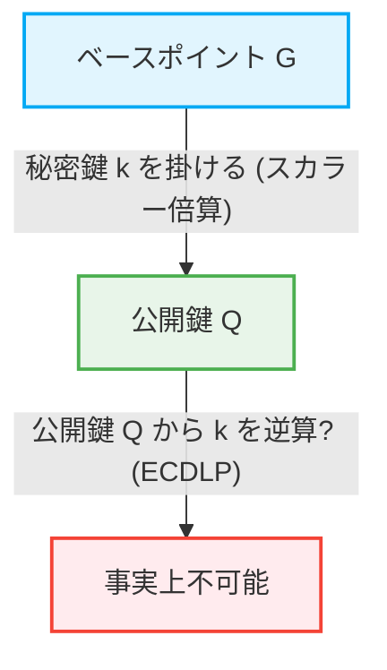

インターネット社会において、私たちが日々安全に通信を行えるのは「暗号技術」の恩恵です。オンラインバンキング、電子メール、SNSのメッセージ、あらゆるデジタルデータの送受信の背後には、高度な数学的理論に裏打ちされたセキュリティメカニズムが存在します。本記事では、現代の公開鍵暗号の基礎を築いたRSA暗号の数学的構造から、より効率的で強力なセキュリティを提供する楕円曲線暗号（ECC）への歴史的および数学的シフトについて、非常に詳細に解説します。

## 1. 共通鍵暗号の限界と鍵配送問題

暗号技術の歴史は古く、シーザー暗号やエニグマなど、多くの暗号方式が考案されてきました。これらは基本的に「共通鍵暗号（Symmetric-key cryptography）」に分類されます。共通鍵暗号では、暗号化と復号に同じ鍵を使用します。

### 鍵配送問題（Key Distribution Problem）
共通鍵暗号の最大の弱点は「鍵をどのように安全に相手に届けるか」という問題です。通信相手が地球の裏側にいる場合、鍵をインターネット経由で送ると、盗聴者に鍵を奪われる危険があります。鍵が奪われれば、暗号は簡単に解読されてしまいます。この「鍵配送問題」は、インターネットのようなオープンなネットワークでの安全な通信における最大の障壁でした。

## 2. ディフィー・ヘルマン鍵共有（Diffie-Hellman Key Exchange）

1976年、ホイットフィールド・ディフィーとマーティン・ヘルマンは、この鍵配送問題を解決する画期的な手法を発表しました。それが「ディフィー・ヘルマン鍵共有」です。この手法により、通信経路が盗聴されていても、二者間で安全に共通の秘密鍵を共有することが可能になりました。

### 数学的基盤：離散対数問題
ディフィー・ヘルマン鍵共有の安全性は、「離散対数問題（Discrete Logarithm Problem）」の計算困難性に依存しています。

ある素数 $p$ と、その原始根 $g$ が公開されているとします。
アリスとボブは以下の手順で鍵を共有します。

1. アリスは秘密の整数 $a$ を選び、$A = g^a \pmod p$ を計算してボブに送信します。
2. ボブは秘密の整数 $b$ を選び、$B = g^b \pmod p$ を計算してアリスに送信します。
3. アリスは受け取った $B$ を用いて、$S = B^a \pmod p$ を計算します。
4. ボブは受け取った $A$ を用いて、$S = A^b \pmod p$ を計算します。

ここで、$B^a = (g^b)^a = g^{ba} = g^{ab} = (g^a)^b = A^b \pmod p$ となるため、アリスとボブは同じ秘密の値 $S$ を共有できます。
盗聴者イブは $p, g, A, B$ を知っていますが、$A$ から $a$ を求める（離散対数問題）ことは、数が大きくなると計算量的に極めて困難です。

## 3. RSA暗号の誕生とオイラーの定理

ディフィー・ヘルマン鍵共有は鍵の共有には有用でしたが、それ自体は暗号化・復号やデジタル署名の機能を持っていませんでした。1977年、ロナルド・リベスト、アディ・シャミア、レオナルド・エーデルマンの3人によって、初めての本格的な公開鍵暗号方式である「RSA暗号」が開発されました。

### 公開鍵と秘密鍵の非対称性
RSA暗号は、暗号化に使う「公開鍵」と、復号に使う「秘密鍵」を分けるという画期的な概念を実現しました。公開鍵は誰にでも公開でき、それを使って暗号化されたメッセージは、対応する秘密鍵を持つ本人しか復号できません。

### 数学的基盤：素因数分解の困難さとオイラーの定理
RSA暗号の安全性は、巨大な合成数の「素因数分解の困難さ」に基づいています。

1. 非常に大きな2つの素数 $p$ と $q$ を選び、その積 $N = p \times q$ を計算します。
2. オイラーのトーティエント関数 $\phi(N) = (p-1)(q-1)$ を計算します。
3. $\phi(N)$ と互いに素な整数 $e$ を選びます（これが公開鍵の一部となります）。
4. $e \times d \equiv 1 \pmod{\phi(N)}$ を満たす $d$ を計算します（これが秘密鍵となります）。

公開鍵は $(N, e)$、秘密鍵は $d$ です。

#### 暗号化と復号のプロセス
- **暗号化**: メッセージ $M$ を暗号化して暗号文 $C$ を得るには、$C = M^e \pmod N$ を計算します。
- **復号**: 暗号文 $C$ を復号して元のメッセージ $M$ を得るには、$M = C^d \pmod N$ を計算します。

なぜこれが成り立つのか？それはオイラーの定理に依存しています。
オイラーの定理によれば、$M$ と $N$ が互いに素であれば、$M^{\phi(N)} \equiv 1 \pmod N$ が成り立ちます。
$e \times d = 1 + k \times \phi(N)$（$k$ は整数）であるため、
$C^d = (M^e)^d = M^{ed} = M^{1 + k\phi(N)} = M \times (M^{\phi(N)})^k \equiv M \times 1^k \equiv M \pmod N$
見事に元のメッセージ $M$ が復元されます。

攻撃者が公開鍵 $(N, e)$ から秘密鍵 $d$ を求めるには、$\phi(N)$ を知る必要があり、そのためには $N$ を $p$ と $q$ に素因数分解しなければなりません。巨大な数（例えば2048ビット）の素因数分解は、現在の古典コンピュータでは天文学的な時間がかかります。

## 4. RSA暗号の限界：鍵長の巨大化

RSAは長年にわたりインターネットセキュリティの基盤として機能してきましたが、コンピュータの処理能力の向上と素因数分解アルゴリズム（一般数体ふるい法など）の進化に伴い、弱点が露呈してきました。

安全性を維持するためには、$N$ の桁数（鍵長）を継続的に増やす必要があります。かつては512ビットで安全とされていましたが、1024ビットが破られ、現在では最低でも2048ビット、より高いセキュリティを求めるなら3072ビットや4096ビットの鍵長が推奨されています。

鍵長が長くなると、以下の問題が発生します。
1. **計算コストの増加**: 暗号化や復号、特に署名生成にかかる計算リソースが増大します。
2. **メモリと帯域幅の消費**: スマートフォンやIoTデバイスなど、リソースが限られた環境では、数千ビットの鍵の保存や送信は効率的ではありません。

この「鍵長のインフレーション」に対処するために、全く新しい数学的アプローチが求められました。

## 5. 楕円曲線暗号（ECC）のエレガンス

ここで登場するのが「楕円曲線暗号（Elliptic Curve Cryptography: ECC）」です。1985年にニール・コブリッツとビクター・ミラーによって独立に提案されたECCは、RSAと同じレベルのセキュリティを、はるかに短い鍵長で実現します。例えば、RSAの3072ビットと同等の安全性を、ECCではわずか256ビットの鍵長で達成できます。

### 楕円曲線の数学
楕円曲線は、以下のワイエルシュトラス標準形で表される三次方程式です。
$$ y^2 = x^3 + ax + b $$
（ただし、$4a^3 + 27b^2 \neq 0$ であり、曲線が特異点を持たないことを保証します）。

暗号に用いる場合、この曲線は実数上ではなく、有限体（素数 $p$ を法とする体など）上で定義されます。

### 楕円曲線上の点の加算（Point Addition）
ECCの最も重要な特性は、曲線上の点と点の間に「加算」という幾何学的な演算を定義できることです。

点 $P$ と点 $Q$ が曲線上にあり、$P \neq Q$ の場合、2点を通る直線を引き、曲線とのもう一つの交点を求め、それを $x$ 軸に対して対称移動させた点を $R = P + Q$ と定義します。
点 $P$ と点 $P$ を足す場合（スカラー倍算）、点 $P$ における接線を引き、同様に交点を求めて対称移動させ、$2P$ を得ます。

### スカラー倍算と楕円曲線離散対数問題（ECDLP）
ベースポイントと呼ばれる基準点 $G$ を、秘密の整数 $k$ 回足し合わせる演算をスカラー倍算と呼びます。
$Q = k \times G = G + G + \dots + G$ (k回)

ここで、
- $k$ を「秘密鍵」
- $Q$ を「公開鍵」
とします。

$G$ と $Q$ が与えられたとき、それらから $k$ を逆算する問題を「楕円曲線離散対数問題（ECDLP）」と呼びます。
通常の離散対数問題よりも、ECDLPを解くための効率的なアルゴリズム（準指数関数時間アルゴリズム）は現在見つかっておらず、完全な指数関数時間が必要と考えられています。これが、ECCが非常に短い鍵で強力なセキュリティを提供できる数学的理由です。

## 6. ECCの応用と未来

現在、ECCはTLS/SSL（ウェブブラウザのHTTPS通信）、SSH、ビットコインなどの暗号通貨、そして多くの最新のメッセージングアプリ（SignalやWhatsAppなど）の基盤技術として広く採用されています。RSAからECCへの移行は、リソースの節約とパフォーマンスの向上をもたらし、特にモバイルやIoTの普及した現代社会において不可欠なものとなっています。

### 量子コンピュータの脅威
しかし、RSAもECCも、未来の脅威である「量子コンピュータ」に対しては脆弱です。ショアのアルゴリズムを実行できる大規模な量子コンピュータが実現すれば、素因数分解も離散対数問題も多項式時間で解かれてしまいます。
そのため、現在では格子暗号や多変数多項式暗号など、量子コンピュータでも解読が困難な「耐量子計算機暗号（Post-Quantum Cryptography: PQC）」への研究と標準化が急速に進められています。

## まとめ

本記事では、共通鍵暗号の限界を克服したディフィー・ヘルマン鍵共有から始まり、素因数分解に基づくRSA暗号のエレ পণ্ডিত的な構造、そして鍵長の限界を突破した楕円曲線暗号（ECC）の幾何学的・代数的な美しさについて深く掘り下げました。
暗号技術は、単なる情報の隠蔽にとどまらず、数学の最先端の知見を現実世界のインフラに応用する最も成功した例の一つです。RSAからECCへのシフトは、より洗練された数学が、私たちのデジタルな生活をより安全で効率的なものにしていく過程を見事に示しています。
