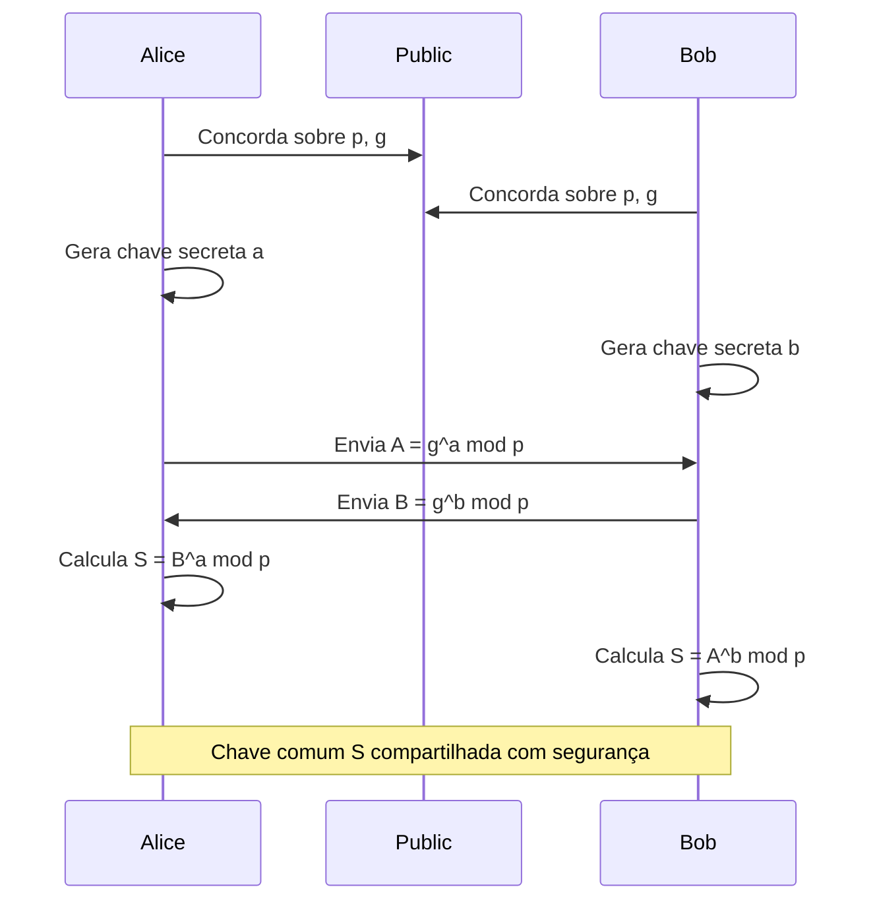
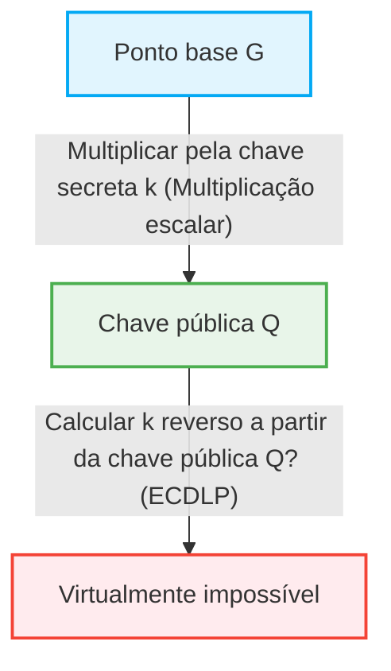

Na sociedade da internet, o fato de podermos nos comunicar com segurança todos os dias é um benefício da "tecnologia criptográfica". Por trás do envio e recebimento de todos os dados digitais, como operações bancárias online, e-mails e mensagens de redes sociais, existe um mecanismo de segurança apoiado por teorias matemáticas avançadas. Neste artigo, explicaremos em grande detalhe a mudança histórica e matemática da estrutura matemática da criptografia RSA, que estabeleceu as bases para a criptografia moderna de chave pública, para a criptografia de curva elíptica (ECC), que oferece uma segurança mais eficiente e robusta.

## 1. As Limitações da Criptografia de Chave Simétrica e o Problema de Distribuição de Chaves

A história da tecnologia criptográfica é antiga, e muitos esquemas de criptografia, como a Cifra de César e a Enigma, foram inventados. Estes são basicamente classificados como "criptografia de chave simétrica" (Symmetric-key cryptography). Na criptografia de chave simétrica, a mesma chave é usada para criptografia e descriptografia.

### Problema de Distribuição de Chaves (Key Distribution Problem)
A maior fraqueza da criptografia de chave simétrica é o problema de "como entregar a chave com segurança para a outra parte". Se a parte comunicante estiver do outro lado do mundo e a chave for enviada pela internet, há o perigo de que a chave seja roubada por um espião. Se a chave for roubada, a criptografia será facilmente decifrada. Este "problema de distribuição de chaves" era a maior barreira para a comunicação segura em redes abertas como a internet.

## 2. Troca de Chaves Diffie-Hellman (Diffie-Hellman Key Exchange)

Em 1976, Whitfield Diffie e Martin Hellman anunciaram um método inovador para resolver esse problema de distribuição de chaves. Esse é o "Diffie-Hellman Key Exchange" (Troca de Chaves Diffie-Hellman). Este método tornou possível para duas partes compartilharem com segurança uma chave secreta comum, mesmo se a rota de comunicação estiver sendo espionada.

### Base Matemática: O Problema do Logaritmo Discreto
A segurança da troca de chaves Diffie-Hellman depende da dificuldade computacional do "Problema do Logaritmo Discreto" (Discrete Logarithm Problem).

Suponha que um número primo $p$ e sua raiz primitiva $g$ sejam tornados públicos.
Alice e Bob compartilham a chave da seguinte maneira:

1. Alice escolhe um número inteiro secreto $a$, calcula $A = g^a \pmod p$ e envia para Bob.
2. Bob escolhe um número inteiro secreto $b$, calcula $B = g^b \pmod p$ e envia para Alice.
3. Alice usa o $B$ recebido para calcular $S = B^a \pmod p$.
4. Bob usa o $A$ recebido para calcular $S = A^b \pmod p$.

Aqui, como $B^a = (g^b)^a = g^{ba} = g^{ab} = (g^a)^b = A^b \pmod p$, Alice e Bob podem compartilhar o mesmo valor secreto $S$.
A bisbilhoteira Eve conhece $p, g, A, B$, mas encontrar $a$ a partir de $A$ (o problema do logaritmo discreto) é computacionalmente extremamente difícil quando os números são grandes.

## 3. O Nascimento da Criptografia RSA e o Teorema de Euler

A troca de chaves Diffie-Hellman era útil para compartilhar chaves, mas em si, não tinha as funções de criptografia/descriptografia e assinaturas digitais. Em 1977, a "Criptografia RSA", o primeiro sistema de criptografia de chave pública completo, foi desenvolvida por três pessoas: Ronald Rivest, Adi Shamir e Leonard Adleman.

### A Assimetria entre Chaves Públicas e Privadas
A criptografia RSA percebeu o conceito inovador de separar a "chave pública" usada para criptografia da "chave privada" usada para descriptografia. A chave pública pode ser revelada a qualquer pessoa, e uma mensagem criptografada usando-a só pode ser descriptografada pela própria pessoa que possui a chave privada correspondente.

### Base Matemática: A Dificuldade da Fatoração de Primos e o Teorema de Euler
A segurança da criptografia RSA baseia-se na "dificuldade da fatoração de primos" de números compostos enormes.

1. Escolha dois números primos muito grandes $p$ e $q$, e calcule o seu produto $N = p \times q$.
2. Calcule a função totiente de Euler $\phi(N) = (p-1)(q-1)$.
3. Escolha um número inteiro $e$ que seja coprimo de $\phi(N)$ (esta será parte da chave pública).
4. Calcule $d$ que satisfaça $e \times d \equiv 1 \pmod{\phi(N)}$ (esta será a chave privada).

A chave pública é $(N, e)$ e a chave privada é $d$.

#### O Processo de Criptografia e Descriptografia
- **Criptografia**: Para criptografar uma mensagem $M$ para obter um texto cifrado $C$, calcule $C = M^e \pmod N$.
- **Descriptografia**: Para descriptografar um texto cifrado $C$ para obter a mensagem original $M$, calcule $M = C^d \pmod N$.

Por que isso se sustenta? Isso depende do Teorema de Euler.
De acordo com o Teorema de Euler, se $M$ e $N$ são coprimos, então $M^{\phi(N)} \equiv 1 \pmod N$ é verdadeiro.
Como $e \times d = 1 + k \times \phi(N)$ ($k$ é um número inteiro),
$C^d = (M^e)^d = M^{ed} = M^{1 + k\phi(N)} = M \times (M^{\phi(N)})^k \equiv M \times 1^k \equiv M \pmod N$
A mensagem original $M$ é maravilhosamente restaurada.

Para que um invasor encontre a chave privada $d$ a partir da chave pública $(N, e)$, ele precisa conhecer $\phi(N)$, e para isso, $N$ deve ser fatorado em $p$ e $q$. A fatoração de um número enorme (por exemplo, 2048 bits) leva um tempo astronômico com os computadores clássicos atuais.

## 4. As Limitações da Criptografia RSA: O Aumento do Tamanho da Chave

A RSA tem funcionado como a base da segurança da internet por muitos anos, mas à medida que o poder de processamento dos computadores melhorou e os algoritmos de fatoração de primos (como o crivo do campo de números geral) evoluíram, suas fraquezas foram expostas.

Para manter a segurança, o número de dígitos (tamanho da chave) de $N$ deve ser continuamente aumentado. Antes considerado seguro com 512 bits, os 1024 bits já foram quebrados e, atualmente, um comprimento de chave de pelo menos 2048 bits é recomendado, e 3072 bits ou 4096 bits para maior segurança.

Quando o comprimento da chave se torna longo, ocorrem os seguintes problemas:
1. **Aumento do custo computacional**: Os recursos computacionais necessários para criptografia, descriptografia e, especialmente, geração de assinaturas aumentam.
2. **Consumo de memória e largura de banda**: Em ambientes com recursos limitados, como smartphones e dispositivos IoT, armazenar e transmitir chaves de vários milhares de bits não é eficiente.

Para lidar com essa "inflação do tamanho da chave", uma abordagem matemática completamente nova era necessária.

## 5. A Elegância da Criptografia de Curva Elíptica (ECC)

Aqui entra a "Criptografia de Curva Elíptica" (Elliptic Curve Cryptography: ECC). Proposta independentemente por Neal Koblitz e Victor Miller em 1985, a ECC atinge o mesmo nível de segurança que a RSA, mas com um comprimento de chave muito mais curto. Por exemplo, a segurança equivalente à RSA de 3072 bits pode ser alcançada com um comprimento de chave de apenas 256 bits na ECC.

### A Matemática das Curvas Elípticas
Uma curva elíptica é uma equação cúbica expressa na seguinte forma normal de Weierstrass:
$$ y^2 = x^3 + ax + b $$
(onde $4a^3 + 27b^2 \neq 0$, garantindo que a curva não tenha pontos singulares).

Quando usada para criptografia, esta curva não é definida sobre números reais, mas sobre um campo finito (como um campo módulo um número primo $p$).

### Adição de Pontos em uma Curva Elíptica (Point Addition)
A característica mais importante da ECC é que uma operação geométrica chamada "adição" pode ser definida entre pontos na curva.

Se o ponto $P$ e o ponto $Q$ estão na curva e $P \neq Q$, desenhe uma linha reta passando por ambos os pontos, encontre o outro ponto de interseção com a curva e reflita esse ponto no eixo $x$ para definir $R = P + Q$.
Ao adicionar o ponto $P$ ao ponto $P$ (multiplicação escalar), desenhe uma tangente no ponto $P$, encontre o ponto de interseção da mesma forma e reflita-o para obter $2P$.

### Multiplicação Escalar e o Problema do Logaritmo Discreto de Curva Elíptica (ECDLP)
A operação de somar um ponto de referência chamado ponto base $G$, $k$ (um inteiro secreto) vezes é chamada de multiplicação escalar.
$Q = k \times G = G + G + \dots + G$ (k vezes)

Aqui,
- $k$ é a "chave privada"
- $Q$ é a "chave pública"

O problema de, dados $G$ e $Q$, calcular o valor inverso $k$ a partir deles é chamado de "Problema do Logaritmo Discreto de Curva Elíptica (ECDLP)".
Atualmente, não há algoritmo eficiente conhecido (algoritmo de tempo subexponencial) para resolver o ECDLP, em comparação com o problema do logaritmo discreto usual, e acredita-se que seja necessário um tempo puramente exponencial. Esta é a razão matemática pela qual a ECC pode fornecer forte segurança com chaves muito curtas.

## 6. Aplicações e o Futuro da ECC

Atualmente, a ECC é amplamente adotada como a tecnologia fundamental para TLS/SSL (comunicação HTTPS para navegadores web), SSH, criptomoedas como o Bitcoin e muitos aplicativos de mensagens modernos (como Signal e WhatsApp). A transição do RSA para a ECC proporcionou economia de recursos e melhorias de desempenho, tornando-se essencial na sociedade moderna atual, onde os dispositivos móveis e a IoT são predominantes.

### A Ameaça dos Computadores Quânticos
No entanto, tanto a RSA quanto a ECC são vulneráveis à ameaça futura dos "computadores quânticos". Se um computador quântico de grande escala capaz de executar o algoritmo de Shor for realizado, tanto a fatoração de primos quanto o problema do logaritmo discreto serão resolvidos em tempo polinomial.
Portanto, a pesquisa e a padronização em direção à "Criptografia Pós-Quântica (PQC)", como a criptografia baseada em reticulados e a criptografia polinomial multivariável, que são difíceis até mesmo para computadores quânticos quebrarem, estão avançando rapidamente.

## Conclusão

Neste artigo, aprofundamo-nos na Troca de Chaves Diffie-Hellman que superou os limites da criptografia de chave simétrica, a estrutura elegante da Criptografia RSA baseada na fatoração de primos, e a beleza geométrica e algébrica da Criptografia de Curva Elíptica (ECC) que rompeu os limites de comprimento de chaves.
A tecnologia de criptografia não se resume à simples ocultação de informações, mas é um dos exemplos mais bem-sucedidos de aplicação de conhecimentos matemáticos de ponta na infraestrutura do mundo real. A mudança de RSA para ECC ilustra perfeitamente o processo pelo qual a matemática mais sofisticada está tornando nossas vidas digitais mais seguras e eficientes.
