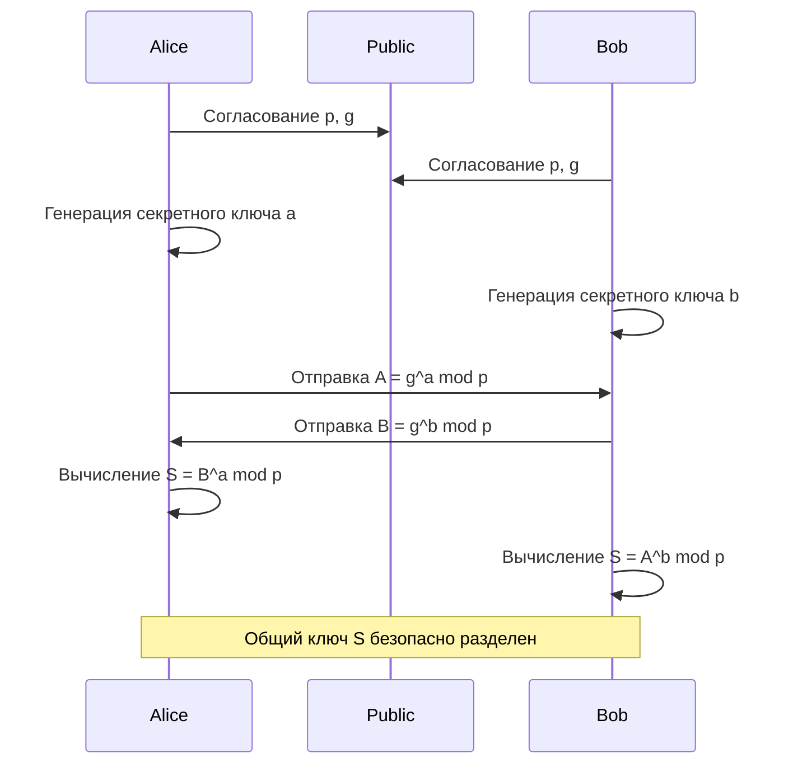
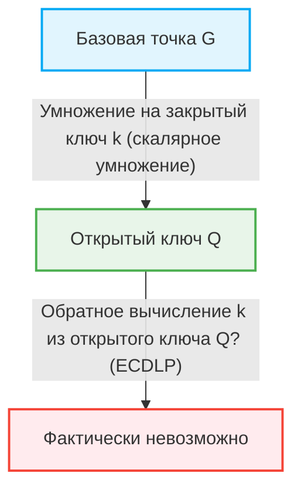

В интернет-обществе мы можем безопасно общаться каждый день благодаря «криптографическим технологиям». За отправкой и получением онлайн-банкинга, электронных писем, сообщений в социальных сетях и любых цифровых данных стоят механизмы безопасности, подкрепленные передовыми математическими теориями. В этой статье очень подробно объясняется исторический и математический переход от математической структуры криптографии RSA, заложившей основу современной криптографии с открытым ключом, к криптографии на эллиптических кривых (ECC), которая обеспечивает более эффективную и надежную безопасность.

## 1. Ограничения криптографии с симметричным ключом и проблема распределения ключей

История криптографии долгая, и было разработано множество методов шифрования, таких как шифр Цезаря и Энигма. В основном они классифицируются как «криптография с симметричным ключом (Symmetric-key cryptography)». В криптографии с симметричным ключом для шифрования и расшифровки используется один и тот же ключ.

### Проблема распределения ключей (Key Distribution Problem)
Самая большая слабость криптографии с симметричным ключом — проблема «как безопасно доставить ключ собеседнику». Если собеседник находится на другой стороне земного шара, то при отправке ключа через Интернет существует риск его перехвата злоумышленником. Если ключ будет украден, шифр будет легко взломан. Эта «проблема распределения ключей» была самым большим препятствием для безопасной связи в открытых сетях, таких как Интернет.

## 2. Обмен ключами Диффи-Хеллмана (Diffie-Hellman Key Exchange)

В 1976 году Уитфилд Диффи и Мартин Хеллман опубликовали революционный метод решения этой проблемы распределения ключей. Это «обмен ключами Диффи-Хеллмана». Благодаря этому методу стало возможным безопасное совместное использование общего секретного ключа между двумя сторонами, даже если канал связи прослушивается.

### Математическая основа: проблема дискретного логарифмирования
Безопасность обмена ключами Диффи-Хеллмана зависит от вычислительной сложности «проблемы дискретного логарифмирования (Discrete Logarithm Problem)».

Предположим, что некоторое простое число $p$ и его первообразный корень $g$ известны публично.
Алиса и Боб обмениваются ключами с помощью следующей процедуры.

1. Алиса выбирает секретное целое число $a$, вычисляет $A = g^a \pmod p$ и отправляет его Бобу.
2. Боб выбирает секретное целое число $b$, вычисляет $B = g^b \pmod p$ и отправляет его Алисе.
3. Алиса использует полученное $B$ для вычисления $S = B^a \pmod p$.
4. Боб использует полученное $A$ для вычисления $S = A^b \pmod p$.

Здесь, поскольку $B^a = (g^b)^a = g^{ba} = g^{ab} = (g^a)^b = A^b \pmod p$, Алиса и Боб могут использовать одно и то же секретное значение $S$.
Подслушивающий Ив знает $p, g, A, B$, но найти $a$ из $A$ (проблема дискретного логарифмирования) вычислительно крайне сложно, когда числа становятся большими.

## 3. Рождение шифрования RSA и теорема Эйлера

Хотя обмен ключами Диффи-Хеллмана был полезен для обмена ключами, сам по себе он не имел функций шифрования/дешифрования или цифровых подписей. В 1977 году Рональд Ривест, Ади Шамир и Леонард Адлеман разработали «криптосистему RSA», первую полномасштабную систему шифрования с открытым ключом.

### Асимметрия открытого и закрытого ключей
Шифрование RSA реализовало революционную концепцию разделения «открытого ключа», используемого для шифрования, и «закрытого ключа», используемого для расшифровки. Открытый ключ может быть раскрыт кому угодно, а сообщение, зашифрованное с его помощью, может быть расшифровано только самим человеком с соответствующим закрытым ключом.

### Математическая основа: сложность факторизации на простые множители и теорема Эйлера
Безопасность шифрования RSA основана на «сложности факторизации на простые множители» огромного составного числа.

1. Выбираются два очень больших простых числа $p$ и $q$, и вычисляется их произведение $N = p \times q$.
2. Вычисляется функция тотиента Эйлера $\phi(N) = (p-1)(q-1)$.
3. Выбирается целое число $e$, взаимно простое с $\phi(N)$ (это становится частью открытого ключа).
4. Вычисляется $d$, удовлетворяющее $e \times d \equiv 1 \pmod{\phi(N)}$ (это становится закрытым ключом).

Открытый ключ - это $(N, e)$, а закрытый ключ - $d$.

#### Процесс шифрования и дешифрования
- **Шифрование**: Чтобы зашифровать сообщение $M$ и получить зашифрованный текст $C$, вычисляется $C = M^e \pmod N$.
- **Дешифрование**: Чтобы расшифровать зашифрованный текст $C$ и получить исходное сообщение $M$, вычисляется $M = C^d \pmod N$.

Почему это работает? Это зависит от теоремы Эйлера.
Согласно теореме Эйлера, если $M$ и $N$ взаимно просты, выполняется $M^{\phi(N)} \equiv 1 \pmod N$.
Поскольку $e \times d = 1 + k \times \phi(N)$ (где $k$ - целое число),
$C^d = (M^e)^d = M^{ed} = M^{1 + k\phi(N)} = M \times (M^{\phi(N)})^k \equiv M \times 1^k \equiv M \pmod N$
Исходное сообщение $M$ прекрасно восстанавливается.

Чтобы злоумышленник нашел закрытый ключ $d$ из открытого ключа $(N, e)$, ему нужно знать $\phi(N)$, и для этого он должен факторизовать $N$ на простые множители $p$ и $q$. Факторизация на простые множители огромного числа (например, 2048 бит) займет астрономическое количество времени на современных классических компьютерах.

## 4. Ограничения шифрования RSA: рост длины ключа

RSA долгое время служил основой интернет-безопасности, но по мере роста вычислительной мощности компьютеров и развития алгоритмов факторизации на простые множители (таких как метод решета числового поля) выявились его слабые стороны.

Чтобы поддерживать безопасность, необходимо постоянно увеличивать количество цифр в $N$ (длину ключа). В прошлом 512 бит считались безопасными, но 1024 бита были взломаны, и сегодня рекомендуется длина ключа не менее 2048 бит, а для более высокой безопасности - 3072 или 4096 бит.

Когда длина ключа увеличивается, возникают следующие проблемы.
1. **Увеличение вычислительных затрат**: Вычислительные ресурсы, необходимые для шифрования, дешифрования и особенно генерации подписей, увеличиваются.
2. **Потребление памяти и пропускной способности**: В средах с ограниченными ресурсами, таких как смартфоны и устройства IoT, хранение и передача ключей длиной в тысячи бит неэффективны.

Чтобы справиться с этой «инфляцией длины ключа», потребовался совершенно новый математический подход.

## 5. Элегантность криптографии на эллиптических кривых (ECC)

Здесь на сцену выходит «криптография на эллиптических кривых (Elliptic Curve Cryptography: ECC)». Предложенная независимо в 1985 году Нилом Коблицем и Виктором Миллером, ECC обеспечивает тот же уровень безопасности, что и RSA, при гораздо меньшей длине ключа. Например, безопасность, эквивалентная 3072-битному RSA, может быть достигнута с помощью ECC при длине ключа всего 256 бит.

### Математика эллиптических кривых
Эллиптическая кривая — это кубическое уравнение, выраженное в следующей стандартной форме Вейерштрасса.
$$ y^2 = x^3 + ax + b $$
(Однако $4a^3 + 27b^2 \neq 0$, что гарантирует отсутствие у кривой особых точек).

При использовании в криптографии эта кривая определяется не над вещественными числами, а над конечным полем (например, полем по модулю простого числа $p$).

### Сложение точек на эллиптической кривой (Point Addition)
Наиболее важной характеристикой ECC является то, что геометрическая операция, называемая «сложением», может быть определена между точками на кривой.

Если точка $P$ и точка $Q$ находятся на кривой и $P \neq Q$, проводится прямая линия через эти 2 точки, находится другая точка пересечения с кривой, и точка $R = P + Q$ определяется путем симметричного отражения этой точки пересечения относительно оси $x$.
При сложении точки $P$ и точки $P$ (скалярное умножение) проводится касательная к точке $P$, аналогичным образом находится точка пересечения, симметрично отражается, и получается $2P$.

### Скалярное умножение и проблема дискретного логарифмирования на эллиптической кривой (ECDLP)
Операция многократного сложения базовой точки, называемой базовой точкой $G$, секретное целое число $k$ раз, называется скалярным умножением.
$Q = k \times G = G + G + \dots + G$ (k раз)

Здесь,
- $k$ — это «закрытый ключ»
- $Q$ — это «открытый ключ»

Когда даны $G$ и $Q$, задача обратного вычисления $k$ из них называется «проблемой дискретного логарифмирования на эллиптической кривой (ECDLP)».
В настоящее время не найдено эффективного алгоритма (алгоритма с субэкспоненциальным временем) для решения ECDLP по сравнению с обычной проблемой дискретного логарифмирования, и считается, что для нее требуется полностью экспоненциальное время. Это и есть математическая причина, по которой ECC может обеспечивать надежную безопасность с помощью очень коротких ключей.

## 6. Применение и будущее ECC

В настоящее время ECC широко применяется в качестве базовой технологии для TLS/SSL (HTTPS-связь в веб-браузерах), SSH, криптовалют, таких как Биткойн, и многих современных приложений для обмена сообщениями (таких как Signal и WhatsApp). Переход от RSA к ECC привел к экономии ресурсов и повышению производительности, и стал незаменимым в современном обществе, где повсеместно распространены мобильные устройства и IoT.

### Угроза квантовых компьютеров
Однако и RSA, и ECC уязвимы перед угрозой будущего — «квантовым компьютером». Если будет реализован крупномасштабный квантовый компьютер, способный выполнять алгоритм Шора, то факторизация на простые множители и проблема дискретного логарифмирования будут решены за полиномиальное время.
По этой причине в настоящее время быстро продвигаются исследования и стандартизация «постквантовой криптографии (Post-Quantum Cryptography: PQC)», которая трудна для расшифровки даже на квантовых компьютерах, такой как криптография на решетках и многомерная криптография.

## Заключение

В этой статье мы глубоко погрузились в математику криптографии: от обмена ключами Диффи-Хеллмана, преодолевшего ограничения криптографии с симметричным ключом, до элегантной структуры шифрования RSA, основанной на факторизации на простые множители, и геометрической и алгебраической красоты криптографии на эллиптических кривых (ECC), преодолевшей ограничения длины ключа.
Криптографические технологии — это не просто сокрытие информации, это один из самых успешных примеров применения передовых математических знаний к инфраструктуре реального мира. Переход от RSA к ECC прекрасно демонстрирует процесс, в котором более сложная математика делает нашу цифровую жизнь более безопасной и эффективной.
