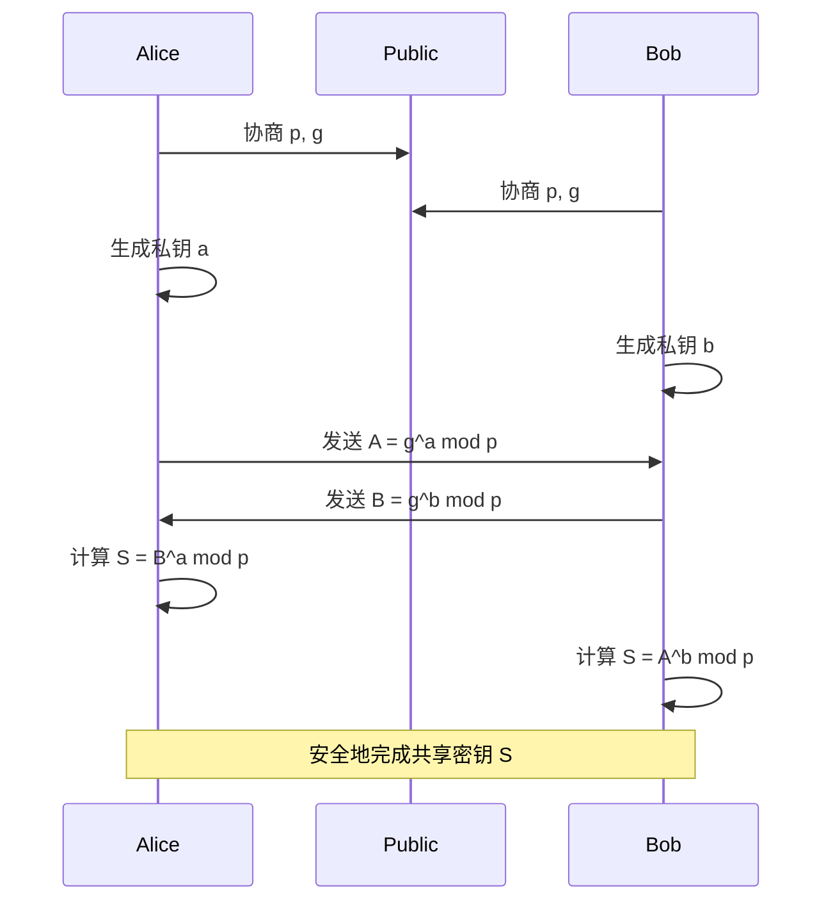
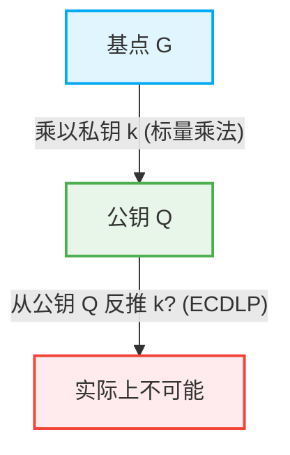

在互联网社会中，我们每天能够安全地进行通信，都要归功于“密码技术”。在线银行、电子邮件、SNS消息以及所有数字数据收发的背后，都存在着由高度数学理论支撑的安全机制。本文将详细解析奠定现代公钥密码学基础的RSA密码的数学结构，以及向提供更高效、更强大安全性的椭圆曲线密码学（ECC）的历史和数学转变。

## 1. 对称密钥密码的局限性与密钥分发问题

密码技术的历史悠久，从凯撒密码到恩尼格玛密码机，人们设计了许多密码体制。这些基本上都属于“对称密钥密码（Symmetric-key cryptography）”。在对称密钥密码中，加密和解密使用相同的密钥。

### 密钥分发问题（Key Distribution Problem）
对称密钥密码最大的弱点是“如何安全地将密钥传递给对方”。如果通信对象在地球的另一端，通过互联网发送密钥就有被窃听者夺取的风险。一旦密钥被夺走，密码就会被轻易破解。这个“密钥分发问题”是在像互联网这样的开放网络中进行安全通信的最大障碍。

## 2. 迪菲-赫尔曼密钥交换（Diffie-Hellman Key Exchange）

1976年，惠特菲尔德·迪菲（Whitfield Diffie）和马丁·赫尔曼（Martin Hellman）提出了一种解决这个密钥分发问题的突破性方法。这就是“迪菲-赫尔曼密钥交换”。通过这种方法，即使通信路径被窃听，双方也可以安全地共享一个共同的密钥。

### 数学基础：离散对数问题
迪菲-赫尔曼密钥交换的安全性依赖于“离散对数问题（Discrete Logarithm Problem）”的计算困难性。

假设公开了一个素数 $p$ 和它的原根 $g$。
爱丽丝（Alice）和鲍勃（Bob）按照以下步骤共享密钥：

1. 爱丽丝选择一个秘密整数 $a$，计算 $A = g^a \pmod p$ 并发送给鲍勃。
2. 鲍勃选择一个秘密整数 $b$，计算 $B = g^b \pmod p$ 并发送给爱丽丝。
3. 爱丽丝使用接收到的 $B$，计算 $S = B^a \pmod p$。
4. 鲍勃使用接收到的 $A$，计算 $S = A^b \pmod p$。

在这里，因为 $B^a = (g^b)^a = g^{ba} = g^{ab} = (g^a)^b = A^b \pmod p$，所以爱丽丝和鲍勃可以共享相同的秘密值 $S$。
窃听者伊芙（Eve）知道 $p, g, A, B$，但是从 $A$ 求 $a$（离散对数问题）随着数字的增大，在计算复杂度上变得极其困难。

## 3. RSA密码的诞生与欧拉定理

迪菲-赫尔曼密钥交换在共享密钥方面很有用，但它本身并不具备加密/解密和数字签名的功能。1977年，罗纳德·李维斯特（Ron Rivest）、阿迪·萨莫尔（Adi Shamir）和伦纳德·阿德曼（Leonard Adleman）三人开发了首个真正意义上的公钥密码体制——“RSA密码”。

### 公钥与私钥的非对称性
RSA密码实现了一个突破性的概念，即用于加密的“公钥”和用于解密的“私钥”是分开的。公钥可以向任何人公开，而使用它加密的消息，只有拥有相应私钥的本人才能解密。

### 数学基础：素数分解的困难性与欧拉定理
RSA密码的安全性基于巨大合数的“素数分解困难性”。

1. 选择两个非常大的素数 $p$ 和 $q$，并计算它们的乘积 $N = p \times q$。
2. 计算欧拉函数 $\phi(N) = (p-1)(q-1)$。
3. 选择一个与 $\phi(N)$ 互素的整数 $e$（这将成为公钥的一部分）。
4. 计算满足 $e \times d \equiv 1 \pmod{\phi(N)}$ 的 $d$（这将成为私钥）。

公钥是 $(N, e)$，私钥是 $d$。

#### 加密与解密过程
- **加密**: 要加密消息 $M$ 得到密文 $C$，计算 $C = M^e \pmod N$。
- **解密**: 要解密密文 $C$ 得到原始消息 $M$，计算 $M = C^d \pmod N$。

为什么这个成立呢？这依赖于欧拉定理。
根据欧拉定理，如果 $M$ 和 $N$ 互素，那么 $M^{\phi(N)} \equiv 1 \pmod N$ 成立。
因为 $e \times d = 1 + k \times \phi(N)$（$k$ 为整数），所以
$C^d = (M^e)^d = M^{ed} = M^{1 + k\phi(N)} = M \times (M^{\phi(N)})^k \equiv M \times 1^k \equiv M \pmod N$
原始消息 $M$ 被完美地恢复了。

攻击者要想从公钥 $(N, e)$ 求得私钥 $d$，就必须知道 $\phi(N)$，为此必须将 $N$ 分解为 $p$ 和 $q$。对于巨大的数字（例如2048位）进行素数分解，在目前的经典计算机上需要花费天文数字般的时间。

## 4. RSA密码的局限性：密钥长度的巨大化

尽管RSA多年来一直作为互联网安全的基石，但随着计算机处理能力的提高和素数分解算法（如普通数域筛选法）的演进，其弱点也随之暴露。

为了保持安全性，必须不断增加 $N$ 的位数（密钥长度）。过去认为512位是安全的，但1024位已被破解，现在建议密钥长度至少为2048位，如果要求更高的安全性，则建议使用3072位或4096位。

密钥长度的增加会引发以下问题：
1. **计算成本增加**: 加密和解密，特别是生成签名的计算资源需求增大。
2. **内存与带宽消耗**: 在智能手机和物联网设备等资源受限的环境中，存储和传输数千位的密钥效率低下。

为了应对这种“密钥长度膨胀”，需要一种全新的数学方法。

## 5. 椭圆曲线密码学（ECC）的优雅性

这就轮到“椭圆曲线密码学（Elliptic Curve Cryptography: ECC）”登场了。ECC于1985年由尼尔·科布利茨（Neal Koblitz）和维克托·米勒（Victor Miller）独立提出，它能够以短得多的密钥长度实现与RSA同等级别的安全性。例如，与RSA的3072位具有同等安全性的ECC，仅需256位的密钥长度即可实现。

### 椭圆曲线的数学
椭圆曲线可以用以下魏尔斯特拉斯标准型的三次方程表示：
$$ y^2 = x^3 + ax + b $$
（其中，$4a^3 + 27b^2 \neq 0$，确保曲线没有奇异点）。

在密码学中使用时，这条曲线不是定义在实数上，而是定义在有限域（例如以素数 $p$ 为模的域）上。

### 椭圆曲线上的点加法（Point Addition）
ECC最重要的特性是，可以在曲线上的两点之间定义被称为“加法”的几何运算。

如果点 $P$ 和点 $Q$ 在曲线上，且 $P \neq Q$，则画一条穿过这两点的直线，求出与曲线的另一个交点，将其关于 $x$ 轴对称移动得到的点定义为 $R = P + Q$。
如果要将点 $P$ 和点 $P$ 相加（标量乘法），则在点 $P$ 处画一条切线，同样求出交点并对称移动，得到 $2P$。

### 标量乘法与椭圆曲线离散对数问题（ECDLP）
将被称为基点的参考点 $G$ 连续相加秘密整数 $k$ 次的运算称为标量乘法。
$Q = k \times G = G + G + \dots + G$ （共k次）

在这里，
- $k$ 是“私钥”
- $Q$ 是“公钥”

给定 $G$ 和 $Q$，从中反推 $k$ 的问题被称为“椭圆曲线离散对数问题（ECDLP）”。
与普通的离散对数问题相比，目前尚未发现解决ECDLP的有效算法（亚指数时间算法），人们认为它需要完全指数级的时间。这就是为什么ECC能够以非常短的密钥提供强大安全性的数学原因。

## 6. ECC的应用与未来

目前，ECC被广泛采用作为TLS/SSL（Web浏览器的HTTPS通信）、SSH、比特币等加密货币以及许多现代消息传递应用程序（如Signal和WhatsApp）的基础技术。从RSA向ECC的过渡带来了资源的节约和性能的提升，特别是在移动和物联网普及的现代社会中，这是必不可少的。

### 量子计算机的威胁
然而，无论是RSA还是ECC，面对未来的威胁“量子计算机”都是脆弱的。如果能够执行秀尔（Shor）算法的大规模量子计算机成为现实，那么素数分解和离散对数问题都可以在多项式时间内被解开。
因此，目前针对即使是量子计算机也难以破解的“后量子密码学（Post-Quantum Cryptography: PQC）”（如格密码、多变量多项式密码等）的研究和标准化正在快速推进。

## 总结

本文从克服了对称密钥密码局限性的迪菲-赫尔曼密钥交换开始，深入探讨了基于素数分解的RSA密码的优雅结构，以及突破了密钥长度限制的椭圆曲线密码学（ECC）在几何与代数上的美感。
密码技术不仅局限于信息的隐藏，更是将最前沿的数学知识应用于现实世界基础设施的最成功范例之一。从RSA到ECC的转变，完美地展示了更纯粹的数学如何使我们的数字生活变得更加安全和高效。
