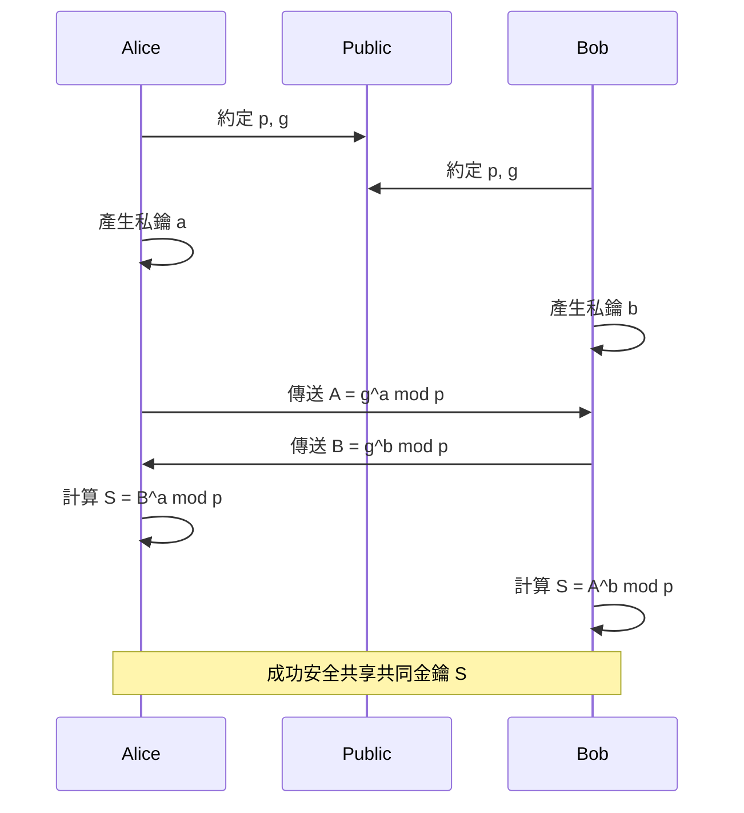
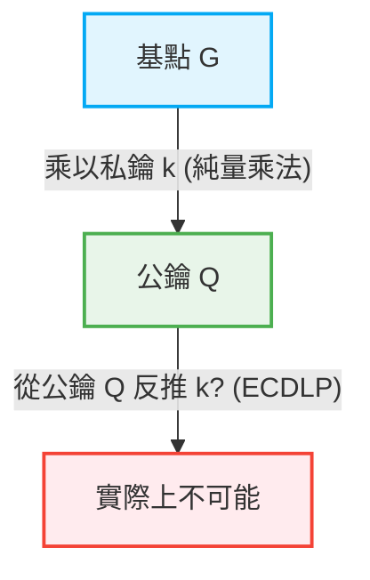

在網際網路社會中，我們每天能安全地進行通訊，皆歸功於「密碼技術」。網路銀行、電子郵件、社群媒體的訊息，以及所有數位資料收發的背後，都存在著以高度數學理論為後盾的安全機制。本文將非常詳細地解說現代公鑰密碼學奠基的 RSA 密碼數學結構，以及如何歷史性與數學性地轉向提供更高效、更強大安全性的橢圓曲線密碼學（ECC）。

## 1. 對稱密碼學的極限與金鑰分發問題

密碼技術的歷史悠久，曾經設計出許多密碼系統，如凱撒密碼和恩尼格瑪密碼機。這些基本上都被分類為「對稱密碼學 (Symmetric-key cryptography)」。在對稱密碼學中，加密和解密使用相同的金鑰。

### 金鑰分發問題 (Key Distribution Problem)
對稱密碼學最大的弱點在於「如何將金鑰安全地傳遞給對方」的問題。如果通訊對象在地球的另一端，透過網際網路傳送金鑰，會有被竊聽者奪取金鑰的危險。一旦金鑰被奪走，密碼就容易被破解。這個「金鑰分發問題」是像網際網路這樣的開放網路中安全通訊的最大障礙。

## 2. 迪菲-赫爾曼金鑰交換 (Diffie-Hellman Key Exchange)

1976 年，惠特菲爾德·迪菲和馬丁·赫爾曼發表了解決此金鑰分發問題的突破性方法，這就是「迪菲-赫爾曼金鑰交換」。透過這種方法，即使通訊路徑被竊聽，雙方也能夠安全地共享共同的密鑰。

### 數學基礎：離散對數問題
迪菲-赫爾曼金鑰交換的安全性依賴於「離散對數問題 (Discrete Logarithm Problem)」的計算困難度。

假設有一個質數 $p$ 以及它的原根 $g$ 是公開的。
愛麗絲和鮑伯透過以下步驟來共享金鑰：

1. 愛麗絲選擇一個祕密整數 $a$，計算 $A = g^a \pmod p$ 並傳送給鮑伯。
2. 鮑伯選擇一個祕密整數 $b$，計算 $B = g^b \pmod p$ 並傳送給愛麗絲。
3. 愛麗絲使用收到的 $B$，計算 $S = B^a \pmod p$。
4. 鮑伯使用收到的 $A$，計算 $S = A^b \pmod p$。

在此，$B^a = (g^b)^a = g^{ba} = g^{ab} = (g^a)^b = A^b \pmod p$，因此愛麗絲和鮑伯能共享相同的祕密值 $S$。
竊聽者伊芙雖然知道 $p, g, A, B$，但要從 $A$ 求出 $a$（離散對數問題），當數字變大時，在計算量上將會極度困難。

## 3. RSA 密碼的誕生與歐拉定理

雖然迪菲-赫爾曼金鑰交換在金鑰共享方面非常有用，但它本身並不具備加密、解密或數位簽章的功能。1977 年，羅納德·李維斯特、阿迪·薩莫爾和倫納德·阿德曼三人開發出了第一個真正的公鑰密碼系統，即「RSA 密碼」。

### 公鑰與私鑰的不對稱性
RSA 密碼實現了劃時代的概念，將用於加密的「公鑰」與用於解密的「私鑰」分開。公鑰可以對任何人公開，而使用公鑰加密的訊息，只有擁有對應私鑰的本人才能解密。

### 數學基礎：質因數分解的困難度與歐拉定理
RSA 密碼的安全性建立在巨大合成數「質因數分解的困難度」之上。

1. 選擇兩個非常大的質數 $p$ 和 $q$，並計算它們的乘積 $N = p \times q$。
2. 計算歐拉的 totient 函數 $\phi(N) = (p-1)(q-1)$。
3. 選擇與 $\phi(N)$ 互質的整數 $e$（這將成為公鑰的一部分）。
4. 計算滿足 $e \times d \equiv 1 \pmod{\phi(N)}$ 的 $d$（這將成為私鑰）。

公鑰是 $(N, e)$，私鑰是 $d$。

#### 加密與解密的過程
- **加密**: 為了將訊息 $M$ 加密以獲得密文 $C$，計算 $C = M^e \pmod N$。
- **解密**: 為了將密文 $C$ 解密以獲得原始訊息 $M$，計算 $M = C^d \pmod N$。

為什麼這樣能成立呢？這是依賴於歐拉定理。
根據歐拉定理，如果 $M$ 和 $N$ 互質，則 $M^{\phi(N)} \equiv 1 \pmod N$ 成立。
因為 $e \times d = 1 + k \times \phi(N)$（$k$ 為整數），所以：
$C^d = (M^e)^d = M^{ed} = M^{1 + k\phi(N)} = M \times (M^{\phi(N)})^k \equiv M \times 1^k \equiv M \pmod N$
這樣就能完美地還原出原始訊息 $M$。

攻擊者若想從公鑰 $(N, e)$ 求出私鑰 $d$，就必須知道 $\phi(N)$，為此就必須將 $N$ 質因數分解為 $p$ 和 $q$。對於極大的數字（例如 2048 位元）進行質因數分解，在目前的古典電腦上需要天文數字般的時間。

## 4. RSA 密碼的極限：金鑰長度的巨大化

多年來 RSA 一直作為網際網路安全的基礎運作著，但隨著電腦處理能力的提升和質因數分解演算法（如普通數體篩法等）的進化，其弱點也逐漸暴露。

為了維持安全性，必須不斷增加 $N$ 的位數（金鑰長度）。過去認為 512 位元是安全的，但 1024 位元已被破解，現在建議最低要 2048 位元，若要求更高的安全性，則推薦 3072 位元或 4096 位元的金鑰長度。

隨著金鑰長度變長，會產生以下問題：
1. **計算成本增加**: 加密和解密，特別是生成簽章所需的計算資源會增大。
2. **記憶體與頻寬的消耗**: 在智慧型手機或物聯網設備等資源受限的環境中，儲存或傳輸數千位元的金鑰效率不高。

為了解決這種「金鑰長度通膨」，我們需要一種全新的數學方法。

## 5. 橢圓曲線密碼學 (ECC) 的優雅

這時候登場的就是「橢圓曲線密碼學 (Elliptic Curve Cryptography: ECC)」。1985 年，尼爾·科布利茨與維克托·米勒各自獨立提出了 ECC，它能夠以短得多的金鑰長度實現與 RSA 同等級的安全性。例如，相當於 RSA 3072 位元安全性的水準，在 ECC 中只需短短的 256 位元金鑰長度即可達成。

### 橢圓曲線的數學
橢圓曲線是由以下維爾斯特拉斯標準式表示的三次方程式：
$$ y^2 = x^3 + ax + b $$
（其中 $4a^3 + 27b^2 \neq 0$，以確保曲線不具有奇異點）。

在密碼學應用時，此曲線不是定義在實數上，而是定義在有限體（例如以質數 $p$ 為模的體）上。

### 橢圓曲線上的點加法 (Point Addition)
ECC 最重要的特性是，可以在曲線上的點與點之間定義名為「加法」的幾何運算。

當點 $P$ 和點 $Q$ 在曲線上，且 $P \neq Q$ 時，畫一條通過這兩點的直線，求出與曲線的另一個交點，並將其對 $x$ 軸做對稱移動，這點便定義為 $R = P + Q$。
如果將點 $P$ 與點 $P$ 相加（純量乘法），則在點 $P$ 畫切線，同樣地求出交點並做對稱移動，即可得到 $2P$。

### 純量乘法與橢圓曲線離散對數問題 (ECDLP)
將被稱為基點的參考點 $G$，進行祕密整數 $k$ 次相加的運算稱為純量乘法。
$Q = k \times G = G + G + \dots + G$ (k 次)

在此：
- 將 $k$ 視為「私鑰」
- 將 $Q$ 視為「公鑰」

當給定 $G$ 和 $Q$ 時，從中反推 $k$ 的問題稱為「橢圓曲線離散對數問題 (ECDLP)」。
比起一般的離散對數問題，目前還沒找到解決 ECDLP 的高效演算法（次指數時間演算法），一般認為這需要完全指數時間。這就是 ECC 能夠以非常短的金鑰提供強大安全性的數學原因。

## 6. ECC 的應用與未來

如今，ECC 被廣泛採用作為 TLS/SSL（網頁瀏覽器的 HTTPS 通訊）、SSH、比特幣等加密貨幣，以及許多最新通訊應用程式（如 Signal 和 WhatsApp 等）的基礎技術。從 RSA 到 ECC 的轉變，帶來了資源的節省與效能的提升，這在尤其是行動裝置與物聯網普及的現代社會中是不可或缺的。

### 量子電腦的威脅
然而，對於未來的威脅「量子電腦」，RSA 與 ECC 都是脆弱的。如果能夠執行秀爾演算法的大規模量子電腦成真，那麼質因數分解和離散對數問題都能在多項式時間內被破解。
因此，現在正積極推進對即使是量子電腦也難以破解的「後量子密碼學 (Post-Quantum Cryptography: PQC)」的研究和標準化，例如晶格密碼或多變量多項式密碼等。

## 總結

本文深入探討了從克服對稱密碼學極限的迪菲-赫爾曼金鑰交換開始，到基於質因數分解的 RSA 密碼那優雅的結構，以及突破金鑰長度極限的橢圓曲線密碼學（ECC）的幾何與代數之美。
密碼技術不僅僅是隱藏資訊，更是將最尖端數學知識應用於現實世界基礎設施最成功的例子之一。從 RSA 到 ECC 的轉變，完美展示了更精煉的數學如何讓我們的數位生活變得更安全、更高效。
