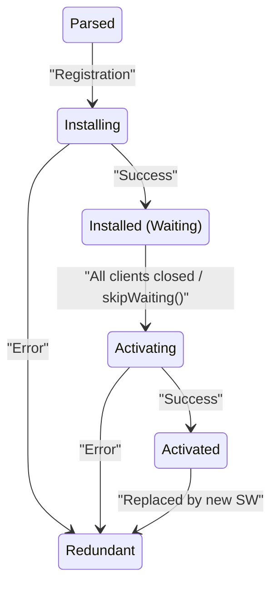
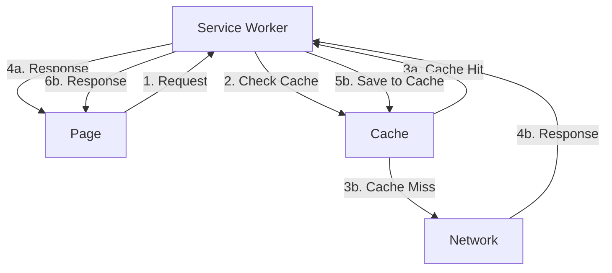
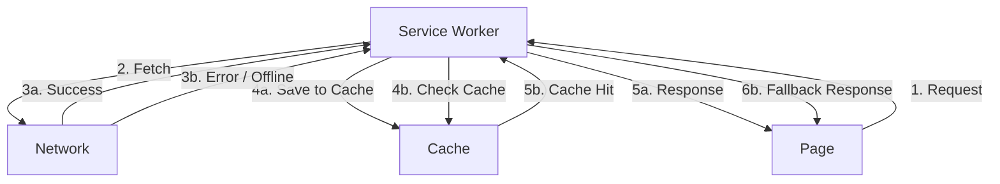
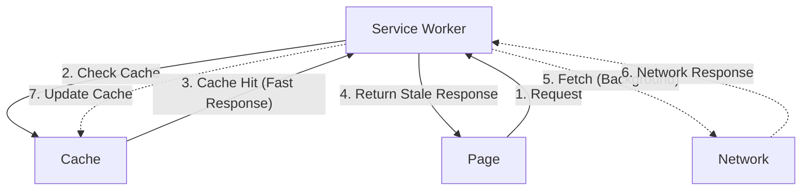

## 1. Introduction: What is PWA?

Web technology has evolved dramatically over the past few decades. Starting from a collection of links in static HTML documents, through dynamic DOM manipulation, asynchronous communication using Ajax, and the advent of SPAs (Single Page Applications), it is now possible to build applications that offer a user experience (UX) rivaling or even exceeding that of native apps. At the forefront of this evolution is **PWA (Progressive Web Apps)**.

Simply put, a PWA is "a web application that combines the accessibility of the web with the high performance and UX of a native app." With traditional web apps, it was normal to see an error screen saying "No internet connection" (like the famous dinosaur game screen in Chrome) when accessing them offline. However, by properly implementing PWA technologies, it becomes possible to launch the app, view cached content, and perform data synchronization processing in the background, even when offline.

In this article, we will provide a highly detailed and comprehensive explanation, starting from the big picture of PWA, to the core **Service Worker** lifecycle, advanced caching strategies, integration with IndexedDB, and future prospects.

---

## 2. Native Apps vs. PWA

When developing a web application, it is always a subject of debate whether to adopt a native app or a PWA. By deeply understanding the advantages and disadvantages of each, you can make the most appropriate technology choice for your project.

### 2.1. Strengths and Weaknesses of Native Apps

The greatest strength of native apps (apps developed in Swift/Objective-C for iOS, Kotlin/[Java](https://kenji.blog/en/p/programming-languages-history-paradigm-evolution/) for Android, etc.) is having full access to the OS's APIs.
This allows for the realization of advanced features that fully utilize the camera, GPS, Bluetooth, NFC, various sensors, etc. In addition, because they are optimized for the OS, rendering performance is extremely high, giving native apps an overwhelming advantage in games that heavily use complex animations and 3D graphics.

On the other hand, native apps have the following major weaknesses (challenges).

- **Development Cost and Learning Cost**: It is necessary to maintain separate codebases for iOS and Android (this can be mitigated with cross-platform frameworks like React Native or Flutter, but it never becomes completely zero).
- **App Store Review**: You cannot release an app without passing the review in Apple's App Store or Google Play, and you may sometimes have to wait several days for review when updating.
- **User Acquisition Barrier**: The process of opening an app store, searching, downloading, and installing is a significant hassle (friction) for users.

### 2.2. Challenges Solved by PWA

PWAs aim to overcome the weaknesses of native apps while leveraging the strengths of the web.

- **One Source, Multi-Use**: A single codebase developed using standard web technologies like HTML, CSS, and JavaScript runs on all devices equipped with a browser (mobile, tablet, desktop).
- **No Review Required, Immediate Updates**: Since a PWA is just a website, it does not need to pass an app store review. By simply updating the files on the server, users can always use the latest version.
- **Seamless Experience Without Installation**: Users can start using the app just by accessing a URL. If they like it, they can "Add to Home Screen" (Install), which allows them to launch it from an app icon just like a native app.
- **Sharability via Links**: The ability to share a specific screen or state as a URL is a powerful weapon unique to the web.

Of course, PWAs also have constraints. Particularly in the iOS (Safari) environment, due to Apple's policies, the implementation of Web APIs tends to be delayed, support for Push notifications has been inadequate until recently, and there are strict limitations on background operations. However, in recent years, Safari has also been strengthening its PWA support, and the gap is gradually narrowing.

---

## 3. The Three Pillars of PWA

To implement a PWA, the following three major technological elements are required.

### 3.1. HTTPS (Secure Communication)

The powerful features of PWA (Service Worker, Push notifications, Geolocation, etc.) only work in an **HTTPS** environment for security reasons (`localhost` in local development environments is permitted as an exception). This is to prevent these features from being tampered with or exploited by malicious third parties through man-in-the-middle attacks and the like.

### 3.2. Web App Manifest

The Web App Manifest (`manifest.json`) is a JSON file that provides metadata about the web app to the browser. It defines the app's icon, name, theme color, display mode, etc., controlling its native app-like appearance when installed on a device.

### 3.3. Service Worker

The Service Worker is the magic wand that elevates a PWA from a mere website to an "application." It is a JavaScript environment executed in the background by the browser and runs on a separate thread from the web page. It can intercept (proxy) network requests, manage caches, and receive Push notifications.

---

## 4. Detailed Settings of Web App Manifest

The Web App Manifest is the configuration file that could be called the face of the PWA. It determines the appearance and behavior when a user installs the app.

Below is a common example of a `manifest.json` configuration.

```json
{
  "name": "Progressive Web App Example",
  "short_name": "PWA Example",
  "description": "A comprehensive example of a Progressive Web App.",
  "start_url": "/?source=pwa",
  "display": "standalone",
  "background_color": "#ffffff",
  "theme_color": "#0055ff",
  "icons": [
    {
      "src": "/images/icons/icon-192x192.png",
      "sizes": "192x192",
      "type": "image/png",
      "purpose": "any maskable"
    },
    {
      "src": "/images/icons/icon-512x512.png",
      "sizes": "512x512",
      "type": "image/png"
    }
  ],
  "orientation": "portrait",
  "scope": "/"
}
```

### Explanation of Major Properties

- **name** and **short_name**: The name displayed in the installation prompt or below the app icon on the home screen. On the home screen where space is limited, `short_name` is used preferentially.
- **start_url**: The URL that is initially loaded when the user launches the app from the home screen icon. By adding tracking parameters (e.g., `?source=pwa`), it becomes possible to distinguish access from the PWA using access analysis tools.
- **display**: Specifies the display mode of the app.
  - `standalone`: Completely hides the browser's UI (URL bar, back button, etc.) and displays it like a native app. This is the most recommended setting.
  - `fullscreen`: Uses the entire screen and even hides the status bar (ideal for games and video apps).
  - `minimal-ui`: Displays only basic navigation UI.
  - `browser`: Displays as a normal browser tab.
- **theme_color** and **background_color**: Defines the app's theme color and the background color of the splash screen at startup.
- **icons**: An array of images used as the app's icons. It is recommended to provide multiple sizes (at least 192x192 and 512x512) to support different device resolutions. Specifying `purpose: "maskable"` optimizes icon cropping on Android, etc.

---

## 5. The Core of Service Worker and Its Lifecycle

The Service Worker is the entity that should be called the "heart" of a PWA. Unlike JavaScript executed within a traditional web page, it does not have access to the DOM. Instead, it handles things like mediating network requests, manipulating caches, and background synchronization processing.

### 5.1. Service Worker Lifecycle

A Service Worker has its own lifecycle independent of the page. Understanding this lifecycle correctly is the key to preventing unexpected caching issues (such as the screen not changing even after an update).

The Mermaid diagram below represents the state transitions of a Service Worker.



1. **Parsed**: The state where the browser has downloaded the Service Worker script and finished parsing the syntax.
2. **Installing**: The state where the `install` event is firing. This phase is primarily used to cache (Pre-caching) static assets (HTML, CSS, JS, images, etc.) essential for the application's operation. If installation fails (e.g., saving the cache fails), the Service Worker is discarded.
3. **Installed / Waiting**: Installation is complete, but it is waiting to take over because the existing older Service Worker is still actively running in other tabs. It advances to the next phase when the user closes all tabs and reopens them, or when `self.skipWaiting()` is called.
4. **Activating**: The state where the `activate` event is firing. This phase is primarily used to delete unnecessary caches created by the old Service Worker and perform cleanup.
5. **Activated**: The state where it is fully operational and can control and process `fetch` events and `push` events from the page.
6. **Redundant**: The state where installation failed, activation failed, or it was replaced by a new version of a Service Worker.

### 5.2. Registering a Service Worker

To use a Service Worker, you first need to perform the registration process from the main JavaScript thread.

```javascript
// main.js or within <script> in index.html
if ("serviceWorker" in navigator) {
  window.addEventListener("load", () => {
    navigator.serviceWorker
      .register("/sw.js", { scope: "/" })
      .then((registration) => {
        console.log("ServiceWorker registration successful with scope: ", registration.scope);
      })
      .catch((error) => {
        console.error("ServiceWorker registration failed: ", error);
      });
  });
}
```

What's important here is the scope of the Service Worker. By default, it only intercepts requests under the directory where the Service Worker file is located. That is, if it's `/sw.js`, it can hook requests to `/` for the entire site, but if placed in `/js/sw.js`, it can only hook requests under `/js/`.

---

## 6. A Complete Guide to Caching Strategies

The greatest thrill of a Service Worker is the ability to hook network requests (`fetch` events) and implement your own caching strategies. It is necessary to selectively use the appropriate caching strategy depending on the resource type (images, API responses, HTML) and application requirements.

### 6.1. Cache First

This is the most basic and fastest strategy. It first checks the cache; if it exists, it returns it, and if it doesn't exist, it goes to the network to retrieve it, saving the result in the cache. It is ideal for static resources that don't change frequently, such as image files and fonts.



### 6.2. Network First

This strategy prioritizes always getting the latest data. It first sends a request to the network, and if successful, saves the result in the cache and returns it to the page. It falls back to the cache only if network communication fails, such as when offline. It is suitable for frequently updated article data and API responses.



### 6.3. Stale-while-revalidate

A highly powerful and modern strategy that balances speed and freshness.
When a request occurs, it immediately returns the cache (stale data) to render the screen quickly. At the same time, it sends a request to the network in the background (while-revalidate) to retrieve the latest data and update the cache. The user will see the latest data upon their next visit.



### 6.4. Cache Only / Network Only

- **Cache Only**: Returns a response exclusively from the cache. If it doesn't exist, it results in an error. It is only used for specific assets guaranteed to be pre-downloaded.
- **Network Only**: Never looks at the cache and always requests from the network. It is used for communications that should not be cached, such as authentication APIs and POST requests.

---

## 7. Service Worker Implementation Example (Detailed Code Explanation)

Now, let's look at an actual implementation example of `sw.js` (Service Worker file), based on the lifecycle and caching strategies mentioned above.

### 7.1. Install Event and Pre-caching

In the `install` event, the app's shell (basic HTML, CSS, JS) is pre-cached. This allows the app's framework to be displayed instantly on subsequent visits or even when offline.

```javascript
// sw.js
const CACHE_NAME = "pwa-cache-v1";
const PRECACHE_URLS = [
  "/",
  "/index.html",
  "/css/style.css",
  "/js/app.js",
  "/images/logo.png",
  "/offline.html"
];

self.addEventListener("install", (event) => {
  console.log("[ServiceWorker] Install event");
  
  // Calling self.skipWaiting() skips the waiting state and makes it active immediately.
  self.skipWaiting();

  event.waitUntil(
    caches.open(CACHE_NAME).then((cache) => {
      console.log("[ServiceWorker] Pre-caching offline pages");
      return cache.addAll(PRECACHE_URLS);
    })
  );
});
```

### 7.2. Activate Event and Cache Cleanup

When the cache name version changes (e.g., from `pwa-cache-v1` to `v2`), you need to delete old, unnecessary caches to save storage space. This is done in the `activate` event.

```javascript
self.addEventListener("activate", (event) => {
  console.log("[ServiceWorker] Activate event");
  
  // Bring all currently open pages under control immediately with self.clients.claim().
  event.waitUntil(self.clients.claim());

  event.waitUntil(
    caches.keys().then((cacheNames) => {
      return Promise.all(
        cacheNames.map((cacheName) => {
          if (cacheName !== CACHE_NAME) {
            console.log("[ServiceWorker] Deleting old cache:", cacheName);
            return caches.delete(cacheName);
          }
        })
      );
    })
  );
});
```

### 7.3. Fetch Event Handling

This is an advanced implementation example that hooks the `fetch` event and switches strategies depending on the requested resource type. It branches processing such as Cache First for images, and Network First with fallback for HTML navigation requests.

```javascript
self.addEventListener("fetch", (event) => {
  const request = event.request;
  const url = new URL(request.url);

  // Pass POST requests and requests to external domains to the network
  if (request.method !== "GET") return;

  // HTML requests (page transitions) use Network First strategy + offline fallback
  if (request.mode === "navigate" || request.headers.get("accept").includes("text/html")) {
    event.respondWith(
      fetch(request)
        .then((response) => {
          return caches.open(CACHE_NAME).then((cache) => {
            cache.put(request, response.clone());
            return response;
          });
        })
        .catch(() => {
          // In case of a network error (offline), retrieve from cache; if not present, return the dedicated offline page
          return caches.match(request).then((cachedResponse) => {
            return cachedResponse || caches.match("/offline.html");
          });
        })
    );
    return;
  }

  // Static assets like images use Cache First strategy
  if (url.pathname.match(/\.(png|jpg|jpeg|gif|svg|css|js)$/)) {
    event.respondWith(
      caches.match(request).then((cachedResponse) => {
        if (cachedResponse) {
          return cachedResponse;
        }
        return fetch(request).then((networkResponse) => {
          return caches.open(CACHE_NAME).then((cache) => {
            cache.put(request, networkResponse.clone());
            return networkResponse;
          });
        });
      })
    );
    return;
  }

  // Apply Stale-while-revalidate to other API requests, etc.
  event.respondWith(
    caches.match(request).then((cachedResponse) => {
      const fetchPromise = fetch(request).then((networkResponse) => {
        return caches.open(CACHE_NAME).then((cache) => {
          cache.put(request, networkResponse.clone());
          return networkResponse;
        });
      });
      // If there is a cache, return it first, and continue the fetch process in the background. Wait for fetchPromise if there is no cache.
      return cachedResponse || fetchPromise;
    })
  );
});
```

---

## 8. Integration with IndexedDB: Advanced Data Management

The Service Worker's `caches` API (Cache Storage) is very well suited for storing entire HTTP responses (HTML files, images, CSS, etc.). However, it is sometimes insufficient for managing the structured data handled by the application (JSON formatted API responses, user settings data, text data posted while offline, etc.).

This is where **IndexedDB** comes in.

IndexedDB is an asynchronous, transactional [NoSQL](https://kenji.blog/en/p/nosql-database-selection-kvs-document-graph-wide-column/) database built into the browser. It can store very large amounts of data and allows for complex index searches.

### 8.1. Why is Cache Storage Alone Insufficient?

For example, suppose you add a new task in a ToDo app while offline. At this time, it is difficult to save the "POST request to add a task" itself into Cache Storage.
In requirements where offline actions are saved and re-sent when back online, coordination is necessary, such as temporarily saving task data in IndexedDB, retrieving the data from the database at the timing of background synchronization (described later), and sending it to the API.

### 8.2. Using IndexedDB within a Service Worker

It is also possible to access IndexedDB from within the Service Worker's scope. Because directly manipulating the IndexedDB API tends to make the code cumbersome, it is common to use a lightweight wrapper library called `idb` provided by Google.

For PWAs with advanced offline capabilities, such as saving a list of articles in JSON retrieved from an API into IndexedDB rather than the Cache API for granular management and querying, IndexedDB plays a crucial role.

---

## 9. Push Notifications and Background Sync

The features where PWAs come closest to native apps are Push notifications and background operations.

### 9.1. Web Push API

Web Push is a mechanism that delivers notifications to users by launching the Service Worker from the server, even if the app is not open.

1. **Subscribe**: Requests permission from the user for notifications on the browser side, retrieves subscription information for the Push service (endpoint and encryption keys), and saves it on your own server.
2. **Push**: Sends a message from your own server to the browser vendor's Push service (FCM or Apple Push Notification service).
3. **Receive (Push Event)**: When the Push service sends data to the device, the browser launches the Service Worker in the background and fires a `push` event. The Service Worker calls the `self.registration.showNotification()` method to display the OS-native notification UI.

```javascript
self.addEventListener("push", (event) => {
  const data = event.data ? event.data.json() : {};
  const title = data.title || "You have a new message";
  const options = {
    body: data.body || "Please open the app to check.",
    icon: "/images/icons/icon-192x192.png",
    badge: "/images/icons/badge.png",
  };

  event.waitUntil(self.registration.showNotification(title, options));
});
```

### 9.2. Background Sync

Suppose a user presses the send message button while offline on a subway. In a normal web app, this would result in an error, but using the Background Sync API, the browser will look for the "timing when network connection is restored" and generate a `sync` event for the Service Worker.

The app side temporarily saves data to IndexedDB when offline, and registers a sync task with the Service Worker (`registration.sync.register('send-messages')`). Later, when back online and the `sync` event fires, it retrieves the data from IndexedDB and sends it to the server. This allows users to continue using the app without ever worrying about the network status.

---

## 10. The Future and Challenges of PWA (Evolution through Project Fugu)

PWAs are continuing to evolve today. In particular, an initiative called **Project Fugu** (Web Capabilities) led by Google, Microsoft, Intel, and others is further blurring the boundary between the web and native apps.

The goal of Project Fugu is to allow safe access from the web to powerful OS features that were previously only permitted for native apps. Because of this, new APIs like the following are being implemented in browsers one after another.

- **Web Bluetooth API**: Direct communication with IoT devices
- **Web USB API** / **Web Serial API**: Connection with specialized hardware
- **File System Access API**: Direct read/write of files on the user's local file system (important for IDE and editor PWAs)
- **Contact Picker API**: Access to the device's address book data
- **Web Share Target API**: Registers a PWA as a destination in the OS's "Share Menu"

As a challenge, Apple's (iOS/Safari) support status is still cited. Apple shows a cautious stance toward many of Project Fugu's APIs due to considerations regarding privacy, security, and the App Store's business model. However, it is also true that they are gradually strengthening their PWA support in response to strong user demands, such as Web Push support in iOS 16.4.

In future web application development, there is no doubt that **PWA** will become not just an option, but an essential technological standard (baseline) to provide users with the best experience.

---

## 11. Conclusion

In this article, we have provided an in-depth explanation covering everything from the basic concepts of PWA to the complex lifecycle of Service Workers, diverse caching strategies, integration with IndexedDB, and the latest trends in web technologies.

When interacting with a Service Worker for the first time, you might be confused by its asynchronous nature and caching behavior. However, by understanding the lifecycle correctly and selecting and implementing the appropriate caching strategy, you can build amazingly fast and resilient web applications.

The experience of "working even when offline" generates a deep trust and attachment to the application for the user, beyond just being a convenient feature. By all means, please incorporate PWA technology into your own projects and draw out the maximum potential of the web.
