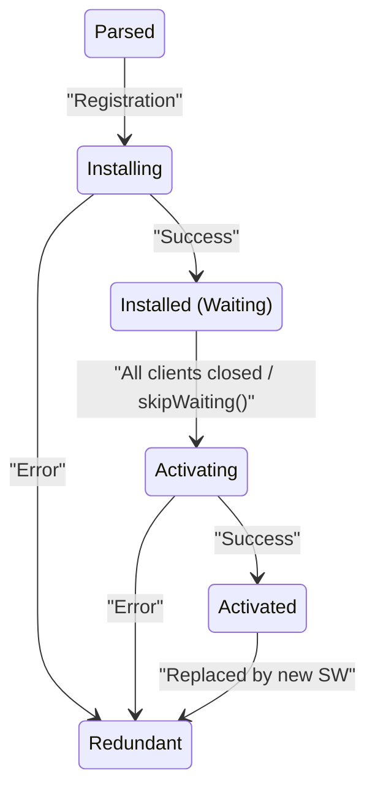
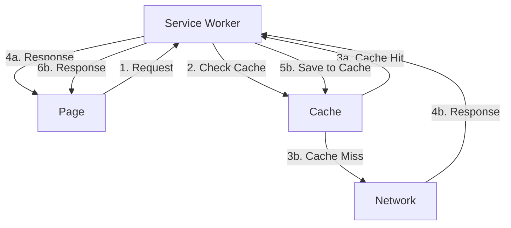
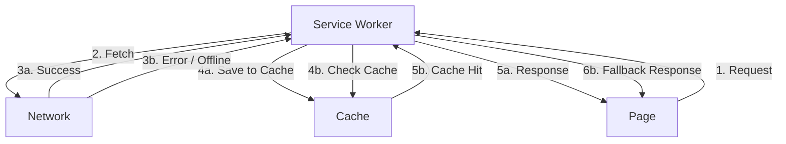
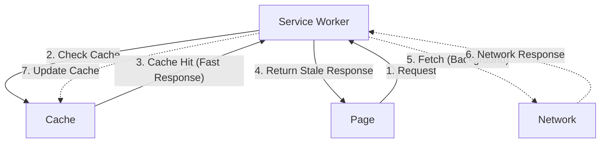

## 1. Introdução: O que é um PWA?

As tecnologias da Web evoluíram dramaticamente nas últimas décadas. Começando com uma coleção de links de documentos HTML estáticos, passando pela manipulação dinâmica do DOM, comunicação assíncrona com Ajax e o advento de SPAs (Single Page Applications), agora é possível construir aplicações que fornecem uma experiência de usuário (UX) que rivaliza com ou excede a dos aplicativos nativos. Na vanguarda desta evolução estão os **PWAs (Progressive Web Apps)**.

PWA, em suma, é "uma aplicação Web que combina a acessibilidade da Web com o alto desempenho e UX de um aplicativo nativo". Nas aplicações Web tradicionais, ao acessar offline, era normal ver uma tela de erro dizendo "Sem conexão com a Internet" (conhecida pela famosa tela do jogo do dinossauro no Chrome). No entanto, se a tecnologia PWA for implementada adequadamente, é possível iniciar o aplicativo mesmo offline, visualizar conteúdo em cache e realizar sincronização de dados em segundo plano.

Neste artigo, explicaremos de forma muito detalhada e abrangente desde a visão geral do PWA até o ciclo de vida do seu núcleo, o **Service Worker**, estratégias avançadas de cache, integração com o IndexedDB e as perspectivas futuras.

---

## 2. Aplicativos Nativos vs. PWA

Ao desenvolver uma aplicação Web, uma das discussões mais comuns é "se devemos adotar um aplicativo nativo ou um PWA". Entender profundamente as vantagens e desvantagens de cada um permite escolher a tecnologia mais adequada para o projeto.

### 2.1. Pontos fortes e fracos dos aplicativos nativos

A maior força dos aplicativos nativos (aplicativos desenvolvidos em Swift/Objective-C para iOS, Kotlin/[Java](https://kenji.blog/pt/p/programming-languages-history-paradigm-evolution/) para Android, etc.) é ter acesso total às APIs do sistema operacional (OS).
Isso permite realizar funcionalidades avançadas que fazem pleno uso de câmera, GPS, Bluetooth, NFC e vários sensores. Além disso, por serem otimizados para o sistema operacional, o desempenho de renderização é muito alto, dando aos aplicativos nativos uma vantagem esmagadora em jogos e similares que fazem uso intenso de animações complexas e gráficos 3D.

Por outro lado, os aplicativos nativos têm grandes fraquezas (desafios) como as seguintes:

- ** Custos de desenvolvimento e aprendizado **: É necessário manter bases de código separadas para iOS e Android (pode ser mitigado com frameworks multiplataforma como React Native ou Flutter, mas nunca chega a zero).
- ** Revisão na loja de aplicativos **: Não podem ser lançados sem passar pela revisão na App Store da Apple ou no Google Play, e, ao atualizar, pode haver um tempo de espera de vários dias para a revisão.
- ** Barreira de aquisição de usuários **: O processo de abrir a loja de aplicativos, pesquisar, baixar e instalar é um grande esforço (fricção) para o usuário.

### 2.2. Problemas que o PWA resolve

Os PWAs visam superar as fraquezas dos aplicativos nativos, aproveitando os pontos fortes da Web.

- ** Uma fonte, múltiplos usos **: Uma única base de código desenvolvida com tecnologias da Web padrão (HTML, CSS e JavaScript) funciona em todos os dispositivos equipados com um navegador (dispositivos móveis, tablets, desktops).
- ** Atualizações instantâneas sem revisão **: Como o PWA é apenas um site, não há necessidade de passar pela revisão da loja de aplicativos. Apenas atualizando os arquivos no servidor, os usuários podem sempre utilizar a versão mais recente.
- ** Experiência fluida sem necessidade de instalação **: Os usuários podem começar a usar o aplicativo apenas acessando o URL. Se gostarem, podem "Adicionar à tela inicial (Install)" e, em seguida, iniciá-lo pelo ícone do aplicativo, como um aplicativo nativo.
- ** Compartilhamento via links **: Ser capaz de compartilhar uma tela ou estado específico como um URL é uma arma poderosa exclusiva da Web.

Claro, os PWAs também têm limitações. Especialmente no ambiente iOS (Safari), devido às políticas da Apple, a implementação de APIs da Web tende a ser atrasada, o suporte a notificações Push era insuficiente até recentemente e existem restrições rígidas quanto à execução em segundo plano. No entanto, nos últimos anos, o Safari também tem reforçado o seu suporte a PWAs, e essa diferença está diminuindo gradualmente.

---

## 3. Os 3 pilares que compõem o PWA

Para criar um PWA, os três principais elementos tecnológicos a seguir são necessários.

### 3.1. HTTPS (Comunicação Segura)

As funções poderosas do PWA (Service Worker, notificações Push, Geolocation, etc.) funcionam apenas em ambientes **HTTPS** por razões de segurança (`localhost`, que é um ambiente de desenvolvimento local, é permitido como exceção). Isso visa evitar que essas funções sejam adulteradas ou abusadas por terceiros mal-intencionados, como em ataques man-in-the-middle.

### 3.2. Web App Manifest

O Web App Manifest (`manifest.json`) é um arquivo JSON que fornece metadados sobre o aplicativo Web para o navegador. Ele define o ícone do aplicativo, nome, cor do tema, modo de exibição, etc., controlando a aparência semelhante a um aplicativo nativo quando instalado em um dispositivo.

### 3.3. Service Worker

O Service Worker é a varinha mágica que eleva um PWA de um mero site a um "aplicativo". É um ambiente JavaScript que o navegador executa em segundo plano e funciona em uma thread separada da página Web. Ele pode interceptar (servir de proxy) solicitações de rede, gerenciar caches e receber notificações Push.

---

## 4. Configuração Detalhada do Web App Manifest

O Web App Manifest é, por assim dizer, o arquivo de configuração que representa a "cara" de um PWA. Ele determina a aparência e o comportamento quando um usuário instala o aplicativo.

Abaixo está um exemplo de configuração típica de `manifest.json`.

```json
{
  "name": "Progressive Web App Example",
  "short_name": "PWA Example",
  "description": "A comprehensive example of a Progressive Web App.",
  "start_url": "/?source=pwa",
  "display": "standalone",
  "background_color": "#ffffff",
  "theme_color": "#0055ff",
  "icons": [
    {
      "src": "/images/icons/icon-192x192.png",
      "sizes": "192x192",
      "type": "image/png",
      "purpose": "any maskable"
    },
    {
      "src": "/images/icons/icon-512x512.png",
      "sizes": "512x512",
      "type": "image/png"
    }
  ],
  "orientation": "portrait",
  "scope": "/"
}
```

### Explicação das principais propriedades

- **name** e **short_name**: Nomes exibidos no prompt de instalação ou na parte inferior do ícone do aplicativo na tela inicial. Como o espaço é limitado na tela inicial, `short_name` é usado com prioridade.
- **start_url**: O URL inicial carregado quando um usuário inicia o aplicativo pelo ícone da tela inicial. Ao adicionar parâmetros de rastreamento (ex: `?source=pwa`), o acesso a partir do PWA pode ser identificado pelas ferramentas de análise.
- **display**: Especifica o modo de exibição do aplicativo.
  - `standalone`: Oculta completamente a interface do usuário do navegador (barra de URL, botão Voltar, etc.) e a exibe como um aplicativo nativo. É a configuração mais recomendada.
  - `fullscreen`: Usa a tela inteira, ocultando até a barra de status (ideal para jogos e aplicativos de vídeo).
  - `minimal-ui`: Exibe apenas a interface de navegação básica.
  - `browser`: Exibe como uma guia normal do navegador.
- **theme_color** e **background_color**: Definem a cor do tema do aplicativo e a cor de fundo da tela de abertura (splash screen) na inicialização.
- **icons**: Uma matriz de imagens usadas como ícone do aplicativo. Para suportar diferentes resoluções de dispositivos, é recomendado fornecer vários tamanhos (no mínimo 192x192 e 512x512). Se especificar `purpose: "maskable"`, pode otimizar o recorte do ícone no Android, etc.

---

## 5. O Núcleo do Service Worker e o Ciclo de Vida

O Service Worker deve ser chamado de "coração" do PWA. Diferentemente do JavaScript executado dentro de páginas Web tradicionais, ele não tem acesso ao DOM. Em vez disso, ele atua intermediando solicitações de rede, manipulando caches e sincronizando em segundo plano.

### 5.1. O Ciclo de Vida do Service Worker

O Service Worker possui um ciclo de vida próprio, independente da página. Entender com precisão este ciclo de vida é fundamental para evitar problemas inesperados de cache (como quando você atualiza e a tela não muda).

O fluxograma Mermaid a seguir ilustra as transições de estado do Service Worker.



1. **Parsed (Analisado)**: O estado onde o navegador baixou o script do Service Worker e concluiu a análise.
2. **Installing (Instalando)**: O estado onde o evento `install` está sendo disparado. Esta fase é usada principalmente para colocar em cache (Pre-caching) os ativos estáticos (HTML, CSS, JS, imagens, etc.) essenciais para a operação da aplicação. Se a instalação falhar (por exemplo, falha ao salvar o cache), o Service Worker é descartado.
3. **Installed / Waiting (Instalado / Aguardando)**: A instalação está concluída, mas o antigo Service Worker ainda está em operação ativa em outras abas, portanto, ele está aguardando para ser substituído. Ele avançará para a próxima fase quando o usuário fechar todas as abas e abri-las novamente, ou chamando `self.skipWaiting()`.
4. **Activating (Ativando)**: O estado onde o evento `activate` está sendo disparado. Esta fase é usada principalmente para limpar caches desnecessários criados pelo antigo Service Worker.
5. **Activated (Ativo)**: Totalmente operacional, capaz de controlar e processar os eventos `fetch` ou `push` provenientes da página.
6. **Redundant (Descartado)**: O estado em que a instalação ou ativação falhou, ou foi substituído por uma nova versão do Service Worker.

### 5.2. Registrando o Service Worker

Para usar um Service Worker, você deve primeiro processar o seu registro a partir da thread principal do JavaScript.

```javascript
// main.js ou dentro de <script> no index.html
if ("serviceWorker" in navigator) {
  window.addEventListener("load", () => {
    navigator.serviceWorker
      .register("/sw.js", { scope: "/" })
      .then((registration) => {
        console.log("ServiceWorker registration successful with scope: ", registration.scope);
      })
      .catch((error) => {
        console.error("ServiceWorker registration failed: ", error);
      });
  });
}
```

O que é importante aqui é o escopo do Service Worker. Por padrão, ele intercepta apenas as solicitações feitas abaixo do diretório onde o arquivo do Service Worker está localizado. Ou seja, se for `/sw.js`, você pode capturar solicitações para `/` em todo o site, mas se você o colocar em `/js/sw.js`, só poderá interceptar solicitações abaixo de `/js/`.

---

## 6. O Guia Completo para Estratégias de Cache

A maior atração do Service Worker é que você pode interceptar as solicitações de rede (o evento `fetch`) e implementar a sua própria estratégia de cache. É necessário aplicar diferentes estratégias de cache, dependendo do tipo de recurso (imagem, resposta de API, HTML) e dos requisitos da aplicação.

### 6.1. Cache First (Prioridade ao Cache)

A estratégia mais básica e rápida. Primeiro, verifica-se o cache; se existir, ele é retornado. Se não existir, vai buscar na rede e guarda o resultado no cache. Ideal para recursos estáticos que não mudam com frequência, como arquivos de imagens e fontes.



### 6.2. Network First (Prioridade à Rede)

Uma estratégia que sempre prioriza obter os dados mais recentes. Envia a solicitação primeiro à rede, se tiver sucesso guarda o resultado no cache e retorna para a página. O fallback para o cache ocorre apenas se a comunicação de rede falhar devido a um estado offline ou semelhante. Adequado para dados de artigos atualizados com frequência ou respostas de API.



### 6.3. Stale-while-revalidate (Retornar cache antigo e atualizar em segundo plano)

Uma estratégia muito poderosa e moderna que equilibra velocidade e frescor.
Quando ocorre uma solicitação, ele retorna imediatamente o cache (dados antigos ou 'stale') para renderizar a tela rapidamente. Ao mesmo tempo, no segundo plano (while-revalidate), envia uma solicitação para a rede para obter os dados mais recentes e atualiza o cache. O usuário verá os dados mais recentes no seu próximo acesso.



### 6.4. Cache Only / Network Only

- **Cache Only (Apenas Cache)**: Retorna respostas inteiramente e apenas a partir do cache. Se não existir, gera um erro. Utilizado apenas para ativos específicos que se tem certeza de que já foram baixados antecipadamente.
- **Network Only (Apenas Rede)**: Ignora totalmente o cache e sempre faz solicitações para a rede. Usado para comunicações que não devem ser armazenadas em cache, como APIs de autenticação e requisições POST.

---

## 7. Exemplos de Implementação do Service Worker (Explicação Detalhada do Código)

Então, com base no ciclo de vida e nas estratégias de cache mencionados, vamos dar uma olhada num exemplo real de implementação do `sw.js` (arquivo do Service Worker).

### 7.1. Evento de Instalação e Pré-cache

No evento `install`, colocamos em cache o 'shell' da aplicação (HTML básico, CSS, JS) antecipadamente. Com isso, no próximo acesso ou enquanto offline, a estrutura do aplicativo pode ser exibida instantaneamente.

```javascript
// sw.js
const CACHE_NAME = "pwa-cache-v1";
const PRECACHE_URLS = [
  "/",
  "/index.html",
  "/css/style.css",
  "/js/app.js",
  "/images/logo.png",
  "/offline.html"
];

self.addEventListener("install", (event) => {
  console.log("[ServiceWorker] Install event");
  
  // Ao chamar self.skipWaiting(), nós ignoramos o estado de espera e ativamos imediatamente.
  self.skipWaiting();

  event.waitUntil(
    caches.open(CACHE_NAME).then((cache) => {
      console.log("[ServiceWorker] Pre-caching offline pages");
      return cache.addAll(PRECACHE_URLS);
    })
  );
});
```

### 7.2. Evento de Ativação e Limpeza do Cache

Ao alterar a versão do nome do cache (por exemplo, de `pwa-cache-v1` para `v2`), é necessário excluir o cache antigo e desnecessário para economizar armazenamento. Isso é feito no evento `activate`.

```javascript
self.addEventListener("activate", (event) => {
  console.log("[ServiceWorker] Activate event");
  
  // self.clients.claim() traz todas as páginas abertas atualmente para controle imediato.
  event.waitUntil(self.clients.claim());

  event.waitUntil(
    caches.keys().then((cacheNames) => {
      return Promise.all(
        cacheNames.map((cacheName) => {
          if (cacheName !== CACHE_NAME) {
            console.log("[ServiceWorker] Deleting old cache:", cacheName);
            return caches.delete(cacheName);
          }
        })
      );
    })
  );
});
```

### 7.3. Manipulação do Evento Fetch

Aqui está um exemplo de uma implementação avançada que intercepta o evento `fetch` e alterna a estratégia dependendo do tipo de recurso da requisição. Ele diverge as operações: Cache First para imagens e Network First com fallback para requisições de navegação HTML.

```javascript
self.addEventListener("fetch", (event) => {
  const request = event.request;
  const url = new URL(request.url);

  // Requisições POST e para domínios externos passam pela rede
  if (request.method !== "GET") return;

  // Solicitações HTML (transições de página) usam a estratégia Network First + Fallback Offline
  if (request.mode === "navigate" || request.headers.get("accept").includes("text/html")) {
    event.respondWith(
      fetch(request)
        .then((response) => {
          return caches.open(CACHE_NAME).then((cache) => {
            cache.put(request, response.clone());
            return response;
          });
        })
        .catch(() => {
          // Em caso de erro de rede (offline), obtenha do cache, se não estiver lá retorna a página offline dedicada
          return caches.match(request).then((cachedResponse) => {
            return cachedResponse || caches.match("/offline.html");
          });
        })
    );
    return;
  }

  // Ativos estáticos como imagens usam a estratégia Cache First
  if (url.pathname.match(/\.(png|jpg|jpeg|gif|svg|css|js)$/)) {
    event.respondWith(
      caches.match(request).then((cachedResponse) => {
        if (cachedResponse) {
          return cachedResponse;
        }
        return fetch(request).then((networkResponse) => {
          return caches.open(CACHE_NAME).then((cache) => {
            cache.put(request, networkResponse.clone());
            return networkResponse;
          });
        });
      })
    );
    return;
  }

  // Stale-while-revalidate é aplicado a outras solicitações de API, etc.
  event.respondWith(
    caches.match(request).then((cachedResponse) => {
      const fetchPromise = fetch(request).then((networkResponse) => {
        return caches.open(CACHE_NAME).then((cache) => {
          cache.put(request, networkResponse.clone());
          return networkResponse;
        });
      });
      // Se houver um cache, ele retorna primeiro e continua a busca em segundo plano. Se não, espera a fetchPromise.
      return cachedResponse || fetchPromise;
    })
  );
});
```

---

## 8. Integração com o IndexedDB: Gestão de Dados Mais Avançada

A API `caches` do Service Worker (Cache Storage) é excelente para armazenar respostas HTTP inteiras (arquivos HTML, imagens, CSS, etc.). No entanto, isso pode ser insuficiente para gerir os dados estruturados manuseados pela aplicação (como respostas da API no formato JSON, dados de configurações do utilizador, ou dados de texto submetidos em modo offline).

É aqui que entra o **IndexedDB**.

O IndexedDB é um banco de dados [NoSQL](https://kenji.blog/pt/p/nosql-database-selection-kvs-document-graph-wide-column/) transacional e assíncrono integrado ao navegador. Pode armazenar quantidades muito grandes de dados e permite pesquisas indexadas complexas.

### 8.1. Por que apenas o Cache Storage é insuficiente?

Por exemplo, num aplicativo de Tarefas (ToDo), se você adicionar uma nova tarefa enquanto estiver offline, será difícil guardar na Cache Storage a própria "solicitação POST para adicionar a tarefa".
Em cenários em que as ações realizadas offline são guardadas e depois reenviadas quando as ligações online são restabelecidas, requer a integração, onde os dados da tarefa são temporariamente guardados no IndexedDB, e na altura da sincronização em segundo plano (descrita adiante), os dados são recuperados da base de dados e enviados para a API.

### 8.2. Utilização do IndexedDB no Service Worker

Também é possível acessar o IndexedDB a partir do escopo do Service Worker. Visto que usar a API do IndexedDB diretamente tende a resultar em código complexo, é comum utilizar uma biblioteca de invólucro leve chamada `idb`, disponibilizada pela Google.

Num PWA com recursos offline avançados que, por exemplo, guarda uma lista JSON de artigos recuperada de uma API no IndexedDB (em vez da API de cache) e realiza a gestão fina e consultas, o IndexedDB desempenha um papel muito importante.

---

## 9. Notificações Push e Sincronização em Segundo Plano (Background Sync)

As funcionalidades em que o PWA mais se aproxima dos aplicativos nativos são as notificações Push e as operações em segundo plano.

### 9.1. API Web Push

O Web Push é um mecanismo que permite que mensagens sejam entregues aos usuários ativando o Service Worker do servidor, mesmo se o aplicativo não estiver aberto.

1. ** Inscrição (Subscribe) **: Pede ao usuário, no lado do navegador, permissão para receber notificações, recolhe as informações de assinatura do serviço Push (endpoint e chaves de criptografia) e salva-as no próprio servidor.
2. ** Envio (Push) **: A mensagem é enviada do próprio servidor para o serviço Push do fornecedor do navegador (FCM ou Apple Push Notification service).
3. ** Recebimento (Push Event) **: Quando o serviço Push envia dados ao dispositivo, o navegador desperta o Service Worker em segundo plano e aciona o evento `push`. O Service Worker chama o método `self.registration.showNotification()` e mostra a IU de notificação nativa do sistema operacional.

```javascript
self.addEventListener("push", (event) => {
  const data = event.data ? event.data.json() : {};
  const title = data.title || "Você tem uma nova mensagem";
  const options = {
    body: data.body || "Por favor, abra o aplicativo para verificar.",
    icon: "/images/icons/icon-192x192.png",
    badge: "/images/icons/badge.png",
  };

  event.waitUntil(self.registration.showNotification(title, options));
});
```

### 9.2. Background Sync (Sincronização em Segundo Plano)

Imagine que um usuário prime o botão de enviar uma mensagem enquanto está offline no metrô. Isto resultaria num erro em aplicativos Web normais, mas se utilizar a API de Background Sync, o navegador vai esperar pelo "momento em que a ligação à rede for restaurada" para criar um evento `sync` para o Service Worker.

O lado do aplicativo guarda temporariamente os dados no IndexedDB enquanto estiver offline e regista a tarefa de sincronização com o Service Worker (`registration.sync.register('send-messages')`). Depois, quando regressa online e o evento `sync` é acionado, ele extrai os dados do IndexedDB e envia-os para o servidor. Isso permite que os usuários continuem usando o aplicativo sem se preocupar em nada com as condições da rede.

---

## 10. O Futuro e os Desafios do PWA (A Evolução com o Project Fugu)

O PWA continua a evoluir. Em particular, a iniciativa chamada **Project Fugu** (Web Capabilities), conduzida por empresas como Google, Microsoft, Intel, entre outras, está a tornar ainda mais confusa e ténue a linha entre a Web e as aplicações nativas.

O objetivo do Project Fugu é permitir o acesso seguro a partir da Web a funcionalidades poderosas do sistema operacional que antes só eram permitidas a aplicativos nativos. Devido a isso, novas APIs, como as seguintes, estão a ser integradas uma a uma nos navegadores:

- **Web Bluetooth API**: Comunicação direta com dispositivos IoT
- **Web USB API** / **Web Serial API**: Conexões a hardwares especiais
- **File System Access API**: Leitura/escrita direta de arquivos no sistema de arquivos local do utilizador (importante para IDEs ou editores em PWA)
- **Contact Picker API**: Acesso aos dados do livro de endereços do dispositivo
- **Web Share Target API**: Registrar o PWA como um destino no menu de "Compartilhar" do sistema operacional

O que permanece como um desafio, ainda, é a situação de suporte da Apple (iOS/Safari). A Apple mostra uma postura muito prudente em relação a muitas das APIs do Project Fugu devido ao equilíbrio de compromissos entre privacidade, segurança, e o modelo de negócio da App Store. No entanto, é também um facto que estão a fortalecer gradualmente o seu suporte aos PWAs (tais como suporte Web Push a partir do iOS 16.4) em resposta à forte demanda dos utilizadores.

Não há dúvida de que os **PWAs** já não serão uma mera opção no desenvolvimento futuro de aplicações Web, mas sim o padrão tecnológico essencial (linha de base) para proporcionar a melhor experiência possível aos utilizadores.

---

## 11. Conclusão

Neste artigo, explicamos as coisas a um nível muito profundo, desde o conceito básico de PWA até ao complexo ciclo de vida do Service Worker, passando pelas variadas estratégias de cache, integrações com IndexedDB e, finalmente, olhando para as tendências tecnológicas da Web mais recentes.

Pode sentir alguma confusão no princípio perante o Service Worker, principalmente pela sua natureza assíncrona e comportamento de cache. No entanto, ao entender os seus ciclos de vida corretamente e ao escolher e implementar uma estratégia de cache adequada, é perfeitamente possível criar uma aplicação Web incrivelmente rápida e resiliente.

A experiência de ser capaz de "funcionar mesmo offline" é muito mais do que apenas uma funcionalidade conveniente, criando um nível de confiança profunda e apego à aplicação na mente dos utilizadores. Incentivamos sem dúvida que você abrace também e inclua a tecnologia PWA no seu projeto para tentar maximizar as possibilidades da Web ao máximo.
