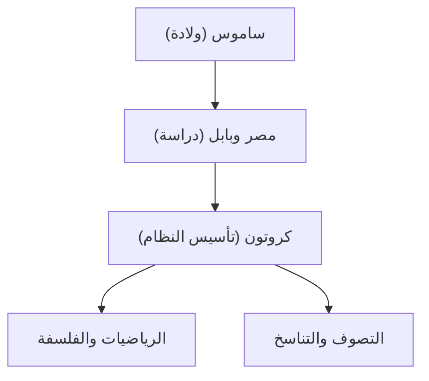

كان فيثاغورس (حوالي 570 قبل الميلاد - حوالي 495 قبل الميلاد) فيلسوفًا وعالم رياضيات يونانيًا قديمًا. أرست فلسفته القائلة بأن "كل شيء هو رقم" الأساس للرياضيات والعلوم والفلسفة الغربية. في هذا المقال، سوف نستكشف حياته وإنجازاته الرياضية بالتفصيل.

## الحياة وتأسيس النظام

ولد فيثاغورس في جزيرة ساموس في بحر إيجة، وسافر إلى مصر وبابل في سن مبكرة بحثًا عن المعرفة. درس هناك الهندسة وعلم الفلك والطقوس الدينية الصوفية. هاجر لاحقًا إلى كروتون في جنوب إيطاليا، حيث أسس مدرسته الخاصة نظامه الديني، المعروف باسم النظام الفيثاغوري.



## أعظم إنجاز في الرياضيات: مبرهنة فيثاغورس

ما يجعله الأكثر شهرة هي **مبرهنة فيثاغورس** . في المثلث القائم الزاوية، إذا كان طول الوتر $c$، والضلعان الآخران هما $a$ و $b$، فإن العلاقة التالية صحيحة:

$$
a^2 + b^2 = c^2
$$

يتم التعبير عنها بالكلمات:

$$
\text{الوتر}^2 = \text{القاعدة}^2 + \text{الارتفاع}^2
$$

تحمل هذه النظرية قيمة عملية هائلة في الهندسة المعمارية والمسح، مع إظهار جمال الإثبات المنطقي في الهندسة.

```python
# دالة لحساب الوتر باستخدام مبرهنة فيثاغورس
def calculate_hypotenuse(a, b):
    return (a**2 + b**2) ** 0.5
```

## اكتشاف الأعداد غير النسبية والأزمة في النظام

إذا طبقنا نظرية فيثاغورس على مثلث قائم الزاوية متساوي الساقين حيث $a = 1, b = 1$، فإن الوتر $c$ يصبح $\sqrt{2}$.

$$
c = \sqrt{1^2 + 1^2} = \sqrt{2} \approx 1.41421356
$$

اعتقد النظام الفيثاغوري أن "جميع الظواهر يمكن التعبير عنها كنسبة من الأعداد الصحيحة (الأعداد النسبية)". ومع ذلك، $\sqrt{2}$ هو **رقم غير نسبي** لا يمكن التعبير عنه كرقم نسبي. لقد هز هذا الاكتشاف نظرتهم إلى العالم بشكل أساسي، ويقال إن النظام منع بشدة تسريب هذه الحقيقة إلى العالم الخارجي.

## تناغم الموسيقى والرياضيات: الضبط الفيثاغوري

اكتشف فيثاغورس أن الأوتار اللطيفة (التوافق) يتم إنتاجها عندما تكون أطوال الأوتار بنسب أعداد صحيحة بسيطة (على سبيل المثال، 2:1 أو 3:2). تطور هذا الاكتشاف إلى **الضبط الفيثاغوري** ، والذي أصبح أساس نظرية الموسيقى. مفهوم "موسيقى المجالات"، الذي يفترض أن الأجرام السماوية تعزف أيضًا أوتارًا في مداراتها، أثر على علماء الفلك اللاحقين مثل كبلر.

## استنتاج

لم يكن فيثاغورس مجرد عالم رياضيات. كان مفكرا عظيما حاول أن يفهم العالم من خلال عدسة "الأرقام". تستمر تعاليمه في التألق كأصل روحي للنهج العلمية الحديثة.
