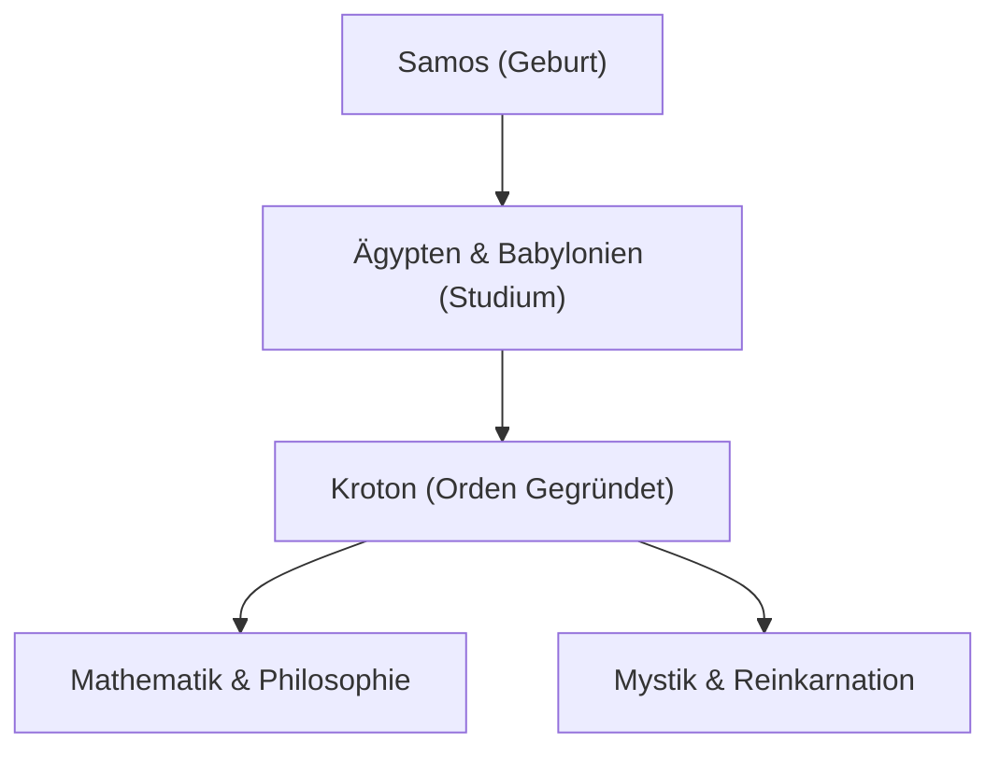

[Pythagoras](https://kenji.blog/de/p/pythagoras/) (ca. 570 v. Chr. – ca. 495 v. Chr.) war ein antiker griechischer Philosoph und Mathematiker. Seine Philosophie, dass "alles Zahl ist", legte den Grundstein für die westliche Mathematik, Wissenschaft und Philosophie. In diesem Artikel werden wir sein Leben und seine mathematischen Errungenschaften im Detail untersuchen.

## Leben und die Gründung des Ordens

Auf der ägäischen Insel Samos geboren, reiste [Pythagoras](https://kenji.blog/de/p/pythagoras/) in jungen Jahren auf der Suche nach Wissen nach Ägypten und Babylonien. Dort studierte er Geometrie, Astronomie und mystische religiöse Riten. Später wanderte er nach Kroton in Süditalien aus, wo er seine eigene Schule und religiösen Orden gründete, der als die Pythagoreer bekannt ist.



## Größte Errungenschaft in der Mathematik: Der Satz des [Pythagoras](https://kenji.blog/de/p/pythagoras/)

Was ihn am berühmtesten macht, ist der **Satz des [Pythagoras](https://kenji.blog/de/p/pythagoras/)** . In einem rechtwinkligen Dreieck, wenn die Länge der Hypotenuse $c$ ist und die anderen beiden Seiten $a$ und $b$ sind, gilt die folgende Beziehung:

$$
a^2 + b^2 = c^2
$$

In Worten ausgedrückt:

$$
\text{Hypotenuse}^2 = \text{Grundseite}^2 + \text{Höhe}^2
$$

Dieser Satz hat einen immensen praktischen Wert in der Architektur und Vermessung und demonstriert gleichzeitig die Schönheit des logischen Beweises in der Geometrie.

```python
# Funktion zur Berechnung der Hypotenuse mit dem Satz des Pythagoras
def calculate_hypotenuse(a, b):
    return (a**2 + b**2) ** 0.5
```

## Entdeckung der irrationalen Zahlen und die Krise im Orden

Wenn wir den Satz des [Pythagoras](https://kenji.blog/de/p/pythagoras/) auf ein gleichschenkliges rechtwinkliges Dreieck mit $a = 1, b = 1$ anwenden, wird die Hypotenuse $c$ zu $\sqrt{2}$.

$$
c = \sqrt{1^2 + 1^2} = \sqrt{2} \approx 1.41421356
$$

Der Orden der Pythagoreer glaubte, dass "alle Phänomene als ein Verhältnis von ganzen Zahlen (rationale Zahlen) ausgedrückt werden können". Allerdings ist $\sqrt{2}$ eine **irrationale Zahl** , die nicht als rationale Zahl ausgedrückt werden kann. Diese Entdeckung erschütterte ihr Weltbild grundlegend, und es heißt, der Orden habe strengstens verboten, diese Tatsache nach außen dringen zu lassen.

## Harmonie von Musik und Mathematik: Pythagoreische Stimmung

[Pythagoras](https://kenji.blog/de/p/pythagoras/) entdeckte, dass angenehme Akkorde (Konsonanzen) erzeugt werden, wenn die Längen der Saiten in einfachen ganzzahligen Verhältnissen stehen (z. B. 2:1 oder 3:2). Diese Entdeckung entwickelte sich zur **pythagoreischen Stimmung** , die zur Grundlage der Musiktheorie wurde. Das Konzept der "Sphärenharmonie", das postuliert, dass Himmelskörper auf ihren Umlaufbahnen ebenfalls Akkorde spielen, beeinflusste spätere Astronomen wie Kepler.

## Fazit

[Pythagoras](https://kenji.blog/de/p/pythagoras/) war nicht nur ein Mathematiker; er war ein großer Denker, der versuchte, die Welt durch die Linse der "Zahlen" zu verstehen. Seine Lehren leuchten weiterhin als spiritueller Ursprung moderner wissenschaftlicher Ansätze.

