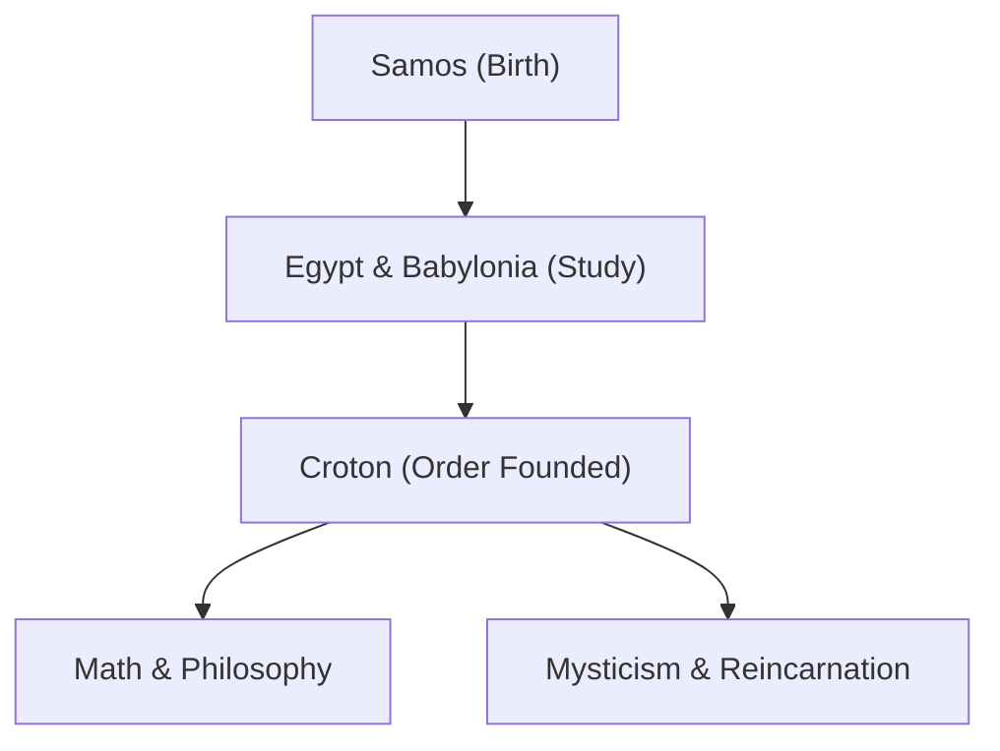

Pythagoras (c. 570 BC – c. 495 BC) was an ancient Greek philosopher and mathematician. His philosophy that "all is number" laid the foundation for Western mathematics, science, and philosophy. In this article, we will explore his life and mathematical achievements in detail.

## Life and the Founding of the Order

Born on the Aegean island of Samos, Pythagoras traveled to Egypt and Babylonia at a young age in pursuit of knowledge. There he studied geometry, astronomy, and mystical religious rites. He later migrated to Croton in southern Italy, where he founded his own school and religious order, known as the Pythagorean Order.



## Greatest Achievement in Mathematics: The Pythagorean Theorem

What makes him most famous is the **Pythagorean Theorem** . In a right-angled triangle, if the length of the hypotenuse is $c$, and the other two sides are $a$ and $b$, the following relationship holds true:

$$
a^2 + b^2 = c^2
$$

Expressed in words:

$$
\text{Hypotenuse}^2 = \text{Base}^2 + \text{Height}^2
$$

This theorem has immense practical value in architecture and surveying, while also demonstrating the beauty of logical proof in geometry.

```python
# Function to calculate the hypotenuse using the Pythagorean theorem
def calculate_hypotenuse(a, b):
    return (a**2 + b**2) ** 0.5
```

## Discovery of Irrational Numbers and Crisis in the Order

If we apply the Pythagorean theorem to an isosceles right triangle where $a = 1, b = 1$, the hypotenuse $c$ becomes $\sqrt{2}$.

$$
c = \sqrt{1^2 + 1^2} = \sqrt{2} \approx 1.41421356
$$

The Pythagorean Order believed that "all phenomena can be expressed as a ratio of integers (rational numbers)". However, $\sqrt{2}$ is an **irrational number** that cannot be expressed as a rational number. This discovery fundamentally shook their worldview, and it is said that the order strictly forbade leaking this fact to the outside world.

## Harmony of Music and Mathematics: Pythagorean Tuning

Pythagoras discovered that pleasant chords (consonances) are produced when the lengths of strings are in simple integer ratios (e.g., 2:1 or 3:2). This discovery developed into **Pythagorean tuning** , which became the foundation of music theory. The concept of the "Music of the Spheres", which posits that celestial bodies also play chords in their orbits, influenced later astronomers like Kepler.

## Conclusion

Pythagoras was not merely a mathematician; he was a great thinker who tried to understand the world through the lens of "numbers". His teachings continue to shine as the spiritual origin of modern scientific approaches.
