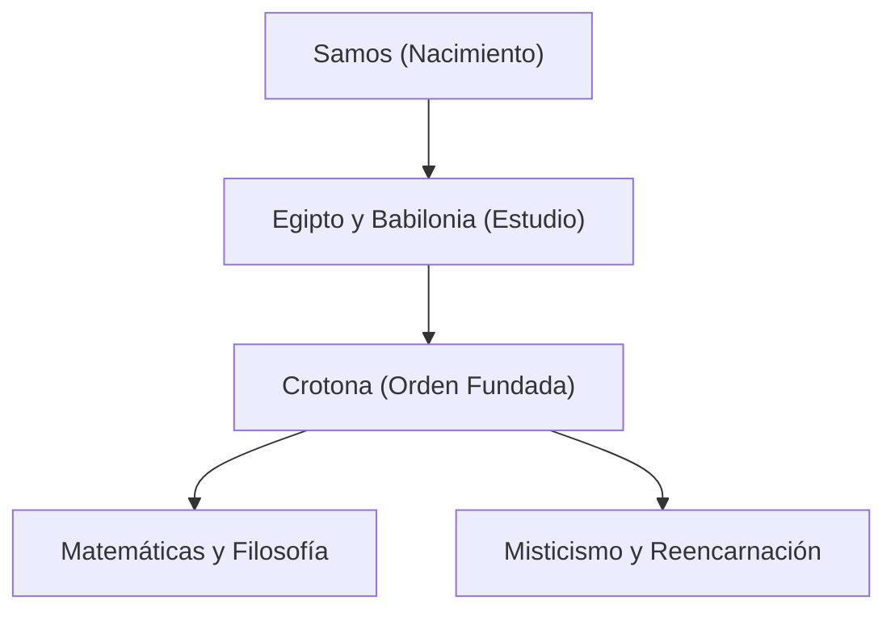

Pitágoras (c. 570 a. C. – c. 495 a. C.) fue un filósofo y matemático de la antigua Grecia. Su filosofía de que "todo es número" sentó las bases de las matemáticas, la ciencia y la filosofía occidentales. En este artículo, exploraremos en detalle su vida y sus logros matemáticos.

## Vida y fundación de la Orden

Nacido en la isla egea de Samos, Pitágoras viajó a Egipto y Babilonia a una edad temprana en busca de conocimiento. Allí estudió geometría, astronomía y ritos religiosos místicos. Más tarde emigró a Crotona, en el sur de Italia, donde fundó su propia escuela y orden religiosa, conocida como la Orden Pitagórica.



## El mayor logro en matemáticas: el teorema de Pitágoras

Lo que le hace más famoso es el **Teorema de Pitágoras** . En un triángulo rectángulo, si la longitud de la hipotenusa es $c$, y los otros dos lados son $a$ y $b$, se cumple la siguiente relación:

$$
a^2 + b^2 = c^2
$$

Expresado en palabras:

$$
\text{Hipotenusa}^2 = \text{Base}^2 + \text{Altura}^2
$$

Este teorema tiene un inmenso valor práctico en la arquitectura y la topografía, a la vez que demuestra la belleza de la demostración lógica en geometría.

```python
# Función para calcular la hipotenusa usando el teorema de Pitágoras
def calculate_hypotenuse(a, b):
    return (a**2 + b**2) ** 0.5
```

## Descubrimiento de los números irracionales y crisis en la Orden

Si aplicamos el teorema de Pitágoras a un triángulo rectángulo isósceles donde $a = 1, b = 1$, la hipotenusa $c$ se convierte en $\sqrt{2}$.

$$
c = \sqrt{1^2 + 1^2} = \sqrt{2} \approx 1.41421356
$$

La Orden Pitagórica creía que "todos los fenómenos pueden expresarse como una proporción de números enteros (números racionales)". Sin embargo, $\sqrt{2}$ es un **número irracional** que no puede expresarse como un número racional. Este descubrimiento sacudió fundamentalmente su visión del mundo, y se dice que la orden prohibió estrictamente filtrar este hecho al mundo exterior.

## Armonía de la música y las matemáticas: afinación pitagórica

Pitágoras descubrió que se producen acordes agradables (consonancias) cuando las longitudes de las cuerdas están en proporciones simples de números enteros (por ejemplo, 2:1 o 3:2). Este descubrimiento se desarrolló en la **afinación pitagórica** , que se convirtió en la base de la teoría musical. El concepto de la "Música de las esferas", que postula que los cuerpos celestes también tocan acordes en sus órbitas, influyó en astrónomos posteriores como Kepler.

## Conclusión

Pitágoras no fue simplemente un matemático; fue un gran pensador que trató de entender el mundo a través del lente de los "números". Sus enseñanzas continúan brillando como el origen espiritual de los enfoques científicos modernos.
