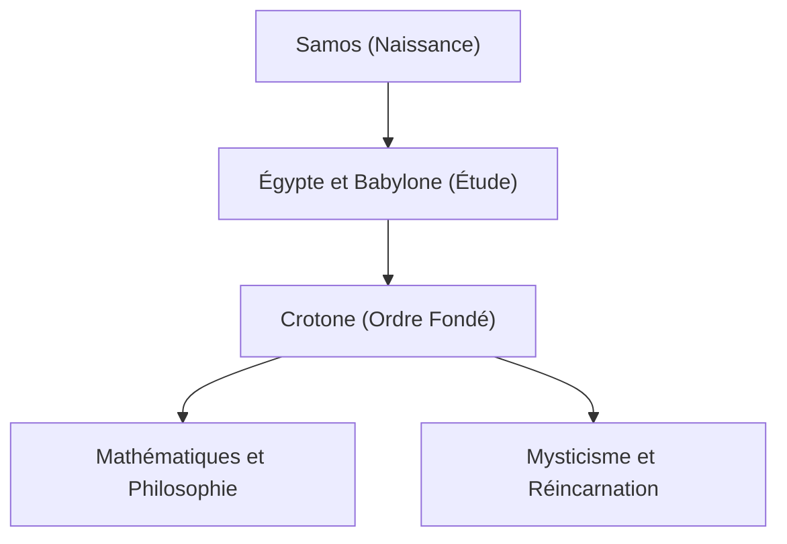

Pythagore (vers 570 av. J.-C. – vers 495 av. J.-C.) était un philosophe et mathématicien de la Grèce antique. Sa philosophie selon laquelle "tout est nombre" a jeté les bases des mathématiques, de la science et de la philosophie occidentales. Dans cet article, nous explorerons en détail sa vie et ses réalisations mathématiques.

## Vie et fondation de l'Ordre

Né sur l'île égéenne de Samos, Pythagore a voyagé en Égypte et en Babylonie dans sa jeunesse en quête de connaissances. Il y a étudié la géométrie, l'astronomie et les rites religieux mystiques. Il a ensuite émigré à Crotone, dans le sud de l'Italie, où il a fondé sa propre école et ordre religieux, connu sous le nom d'Ordre pythagoricien.



## Le plus grand accomplissement en mathématiques : Le théorème de Pythagore

Ce qui le rend le plus célèbre est le **Théorème de Pythagore** . Dans un triangle rectangle, si la longueur de l'hypoténuse est $c$, et les deux autres côtés sont $a$ et $b$, la relation suivante est vraie :

$$
a^2 + b^2 = c^2
$$

Exprimé en mots :

$$
\text{Hypoténuse}^2 = \text{Base}^2 + \text{Hauteur}^2
$$

Ce théorème a une valeur pratique immense en architecture et en arpentage, tout en démontrant la beauté de la preuve logique en géométrie.

```python
# Fonction pour calculer l'hypoténuse en utilisant le théorème de Pythagore
def calculate_hypotenuse(a, b):
    return (a**2 + b**2) ** 0.5
```

## Découverte des nombres irrationnels et crise dans l'Ordre

Si nous appliquons le théorème de Pythagore à un triangle rectangle isocèle où $a = 1, b = 1$, l'hypoténuse $c$ devient $\sqrt{2}$.

$$
c = \sqrt{1^2 + 1^2} = \sqrt{2} \approx 1.41421356
$$

L'Ordre pythagoricien croyait que "tous les phénomènes peuvent être exprimés comme un rapport d'entiers (nombres rationnels)". Cependant, $\sqrt{2}$ est un **nombre irrationnel** qui ne peut pas être exprimé comme un nombre rationnel. Cette découverte a fondamentalement ébranlé leur vision du monde, et on dit que l'ordre a strictement interdit de divulguer ce fait au monde extérieur.

## Harmonie de la musique et des mathématiques : L'accord pythagoricien

Pythagore a découvert que des accords agréables (consonances) sont produits lorsque les longueurs des cordes sont dans des rapports d'entiers simples (par exemple, 2:1 ou 3:2). Cette découverte s'est développée en **accord pythagoricien** , qui est devenu la base de la théorie musicale. Le concept de "Musique des sphères", qui postule que les corps célestes jouent également des accords sur leurs orbites, a influencé des astronomes ultérieurs comme Kepler.

## Conclusion

Pythagore n'était pas seulement un mathématicien ; c'était un grand penseur qui a essayé de comprendre le monde à travers le prisme des "nombres". Ses enseignements continuent de briller comme l'origine spirituelle des approches scientifiques modernes.

