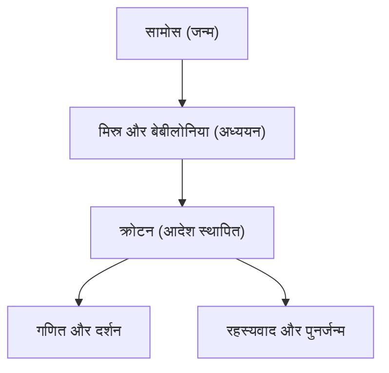

पाइथागोरस (लगभग 570 ईसा पूर्व - लगभग 495 ईसा पूर्व) एक प्राचीन यूनानी दार्शनिक और गणितज्ञ थे। उनका यह दर्शन कि "सब कुछ संख्या है" पश्चिमी गणित, विज्ञान और दर्शन की नींव रखी। इस लेख में, हम उनके जीवन और गणितीय उपलब्धियों का विस्तार से पता लगाएंगे।

## जीवन और आदेश की स्थापना

एजियन सागर में सामोस द्वीप पर जन्मे, पाइथागोरस ने कम उम्र में ज्ञान की खोज में मिस्र और बेबीलोनिया की यात्रा की। वहाँ उन्होंने ज्यामिति, खगोल विज्ञान, और रहस्यमय धार्मिक अनुष्ठानों का अध्ययन किया। बाद में वे दक्षिणी इटली के क्रोटन चले गए, जहाँ उन्होंने अपना स्वयं का स्कूल और धार्मिक आदेश स्थापित किया, जिसे पाइथागोरियन ऑर्डर के रूप में जाना जाता है।



## गणित में सबसे बड़ी उपलब्धि: पाइथागोरस प्रमेय

जो चीज उन्हें सबसे प्रसिद्ध बनाती है वह है **पाइथागोरस प्रमेय** । एक समकोण त्रिभुज में, यदि कर्ण की लंबाई $c$ है, और अन्य दो भुजाएँ $a$ और $b$ हैं, तो निम्नलिखित संबंध सत्य है:

$$
a^2 + b^2 = c^2
$$

शब्दों में व्यक्त किया गया:

$$
\text{कर्ण}^2 = \text{आधार}^2 + \text{लंब}^2
$$

वास्तुकला और सर्वेक्षण में इस प्रमेय का अत्यधिक व्यावहारिक मूल्य है, जबकि यह ज्यामिति में तार्किक प्रमाण की सुंदरता को भी प्रदर्शित करता है।

```python
# पाइथागोरस प्रमेय का उपयोग करके कर्ण की गणना करने के लिए फ़ंक्शन
def calculate_hypotenuse(a, b):
    return (a**2 + b**2) ** 0.5
```

## अपरिमेय संख्याओं की खोज और आदेश में संकट

यदि हम पाइथागोरस प्रमेय को एक समद्विबाहु समकोण त्रिभुज पर लागू करते हैं जहाँ $a = 1, b = 1$ है, तो कर्ण $c$, $\sqrt{2}$ बन जाता है।

$$
c = \sqrt{1^2 + 1^2} = \sqrt{2} \approx 1.41421356
$$

पाइथागोरियन ऑर्डर का मानना था कि "सभी घटनाओं को पूर्णांक (परिमेय संख्याओं) के अनुपात के रूप में व्यक्त किया जा सकता है"। हालाँकि, $\sqrt{2}$ एक **अपरिमेय संख्या** है जिसे परिमेय संख्या के रूप में व्यक्त नहीं किया जा सकता है। इस खोज ने उनके विश्वदृष्टिकोण को मौलिक रूप से हिला दिया, और कहा जाता है कि आदेश ने इस तथ्य को बाहरी दुनिया में लीक करने से सख्ती से मना कर दिया।

## संगीत और गणित का सामंजस्य: पाइथागोरियन ट्यूनिंग

पाइथागोरस ने खोज की कि जब तारों की लंबाई सरल पूर्णांक अनुपातों (उदाहरण के लिए, 2:1 या 3:2) में होती है, तो सुखद तार (व्यंजन) उत्पन्न होते हैं। यह खोज **पाइथागोरियन ट्यूनिंग** में विकसित हुई, जो संगीत सिद्धांत की नींव बन गई। "संगीत के क्षेत्रों" की अवधारणा, जो यह मानती है कि आकाशीय पिंड भी अपनी कक्षाओं में तार बजाते हैं, ने केप्लर जैसे बाद के खगोलविदों को प्रभावित किया।

## निष्कर्ष

पाइथागोरस केवल एक गणितज्ञ नहीं थे; वे एक महान विचारक थे जिन्होंने "संख्याओं" के लेंस के माध्यम से दुनिया को समझने की कोशिश की। उनकी शिक्षाएँ आधुनिक वैज्ञानिक दृष्टिकोणों के आध्यात्मिक मूल के रूप में आज भी चमकती हैं।

