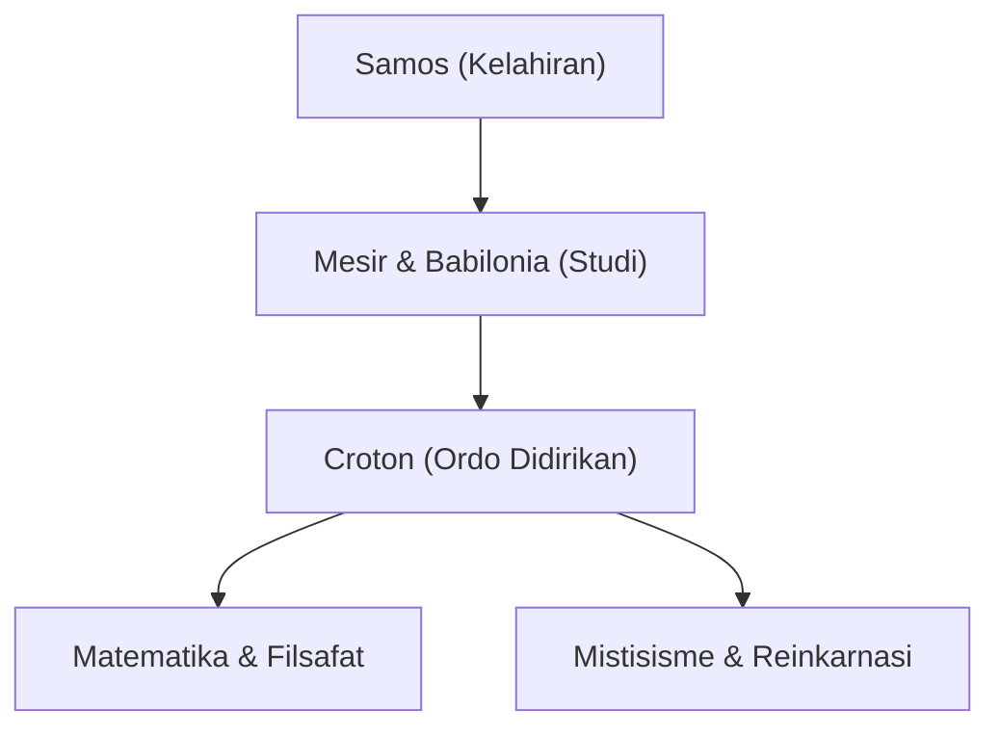

[Pythagoras](https://kenji.blog/id/p/pythagoras/) (sekitar 570 SM – sekitar 495 SM) adalah seorang filsuf dan matematikawan Yunani kuno. Filosofinya bahwa "semuanya adalah angka" meletakkan dasar bagi matematika, sains, dan filsafat Barat. Dalam artikel ini, kita akan mengeksplorasi kehidupan dan pencapaian matematikanya secara rinci.

## Kehidupan dan Pendirian Ordo

Lahir di pulau Aegea Samos, [Pythagoras](https://kenji.blog/id/p/pythagoras/) melakukan perjalanan ke Mesir dan Babilonia di usia muda untuk mencari pengetahuan. Di sana ia mempelajari geometri, astronomi, dan ritus keagamaan mistis. Ia kemudian bermigrasi ke Croton di Italia selatan, di mana ia mendirikan sekolah dan ordo keagamaannya sendiri, yang dikenal sebagai Ordo [Pythagoras](https://kenji.blog/id/p/pythagoras/).



## Pencapaian Terbesar dalam Matematika: Teorema [Pythagoras](https://kenji.blog/id/p/pythagoras/)

Yang paling membuatnya terkenal adalah **Teorema [Pythagoras](https://kenji.blog/id/p/pythagoras/)** . Dalam segitiga siku-siku, jika panjang sisi miring adalah $c$, dan dua sisi lainnya adalah $a$ dan $b$, maka hubungan berikut ini berlaku:

$$
a^2 + b^2 = c^2
$$

Dinyatakan dengan kata-kata:

$$
\text{Sisi Miring}^2 = \text{Alas}^2 + \text{Tinggi}^2
$$

Teorema ini memiliki nilai praktis yang sangat besar dalam arsitektur dan survei, sekaligus menunjukkan keindahan bukti logis dalam geometri.

```python
# Fungsi untuk menghitung sisi miring menggunakan teorema Pythagoras
def calculate_hypotenuse(a, b):
    return (a**2 + b**2) ** 0.5
```

## Penemuan Bilangan Irasional dan Krisis dalam Ordo

Jika kita menerapkan teorema [Pythagoras](https://kenji.blog/id/p/pythagoras/) pada segitiga siku-siku sama kaki di mana $a = 1, b = 1$, sisi miring $c$ menjadi $\sqrt{2}$.

$$
c = \sqrt{1^2 + 1^2} = \sqrt{2} \approx 1.41421356
$$

Ordo [Pythagoras](https://kenji.blog/id/p/pythagoras/) percaya bahwa "semua fenomena dapat diekspresikan sebagai rasio bilangan bulat (bilangan rasional)". Namun, $\sqrt{2}$ adalah **bilangan irasional** yang tidak dapat diekspresikan sebagai bilangan rasional. Penemuan ini secara mendasar mengguncang pandangan dunia mereka, dan dikatakan bahwa ordo tersebut secara ketat melarang membocorkan fakta ini ke dunia luar.

## Harmoni Musik dan Matematika: Penalaan [Pythagoras](https://kenji.blog/id/p/pythagoras/)

[Pythagoras](https://kenji.blog/id/p/pythagoras/) menemukan bahwa akord yang menyenangkan (konsonan) dihasilkan ketika panjang senar berada dalam rasio bilangan bulat sederhana (misalnya, 2:1 atau 3:2). Penemuan ini berkembang menjadi **penalaan [Pythagoras](https://kenji.blog/id/p/pythagoras/)** , yang menjadi fondasi teori musik. Konsep "Musik Bola Langit", yang berpendapat bahwa benda-benda angkasa juga memainkan akord di orbitnya, memengaruhi para astronom berikutnya seperti Kepler.

## Kesimpulan

[Pythagoras](https://kenji.blog/id/p/pythagoras/) bukan hanya seorang matematikawan; ia adalah seorang pemikir hebat yang mencoba memahami dunia melalui lensa "angka". Ajarannya terus bersinar sebagai asal mula spiritual dari pendekatan ilmiah modern.

