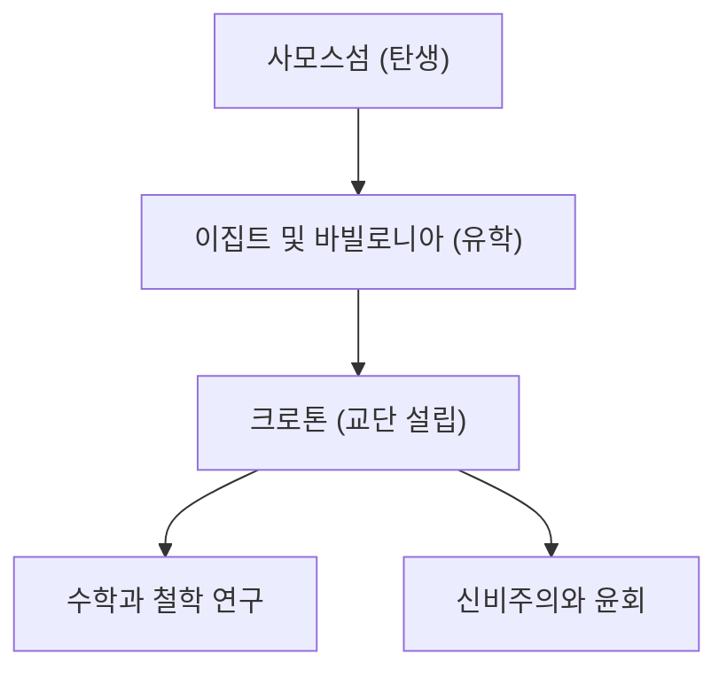

피타고라스(기원전 570년경 - 기원전 495년경)는 고대 그리스의 철학자이자 수학자입니다. "만물은 수이다"라는 그의 사상은 서양의 수학, 과학, 철학의 기초를 다졌습니다. 본 기사에서는 그의 생애와 수학적 업적에 대해 자세히 살펴보겠습니다.

## 생애와 교단의 설립

에게해의 사모스섬에서 태어난 피타고라스는 젊은 시절 지식을 찾아 이집트와 바빌로니아로 여행을 떠났습니다. 그곳에서 기하학, 천문학, 그리고 신비주의적인 종교 의식을 배웠습니다. 이후 남부 이탈리아의 크로톤으로 이주하여 자신만의 학파 및 종교 교단인 ['피타고라스](https://kenji.blog/ko/p/pythagoras/) 교단'을 설립했습니다.



## 수학에서의 최대 업적: 피타고라스의 정리

그의 이름을 가장 유명하게 만든 것은 **피타고라스의 정리** 입니다. 직각삼각형에서 빗변의 길이를 $c$, 다른 두 변의 길이를 $a$와 $b$라고 할 때 다음과 같은 관계가 성립합니다.

$$
a^2 + b^2 = c^2
$$

말로 표현하면 다음과 같습니다.

$$
\text{빗변}^2 = \text{밑변}^2 + \text{높이}^2
$$

이 정리는 건축이나 측량에서 매우 실용적인 가치를 지니며, 동시에 기하학의 논리적 증명의 아름다움을 보여줍니다.

```python
# 피타고라스 정리를 사용하여 빗변을 계산하는 함수
def calculate_hypotenuse(a, b):
    return (a**2 + b**2) ** 0.5
```

## 무리수의 발견과 교단의 위기

피타고라스의 정리를 $a = 1, b = 1$인 직각이등변삼각형에 적용하면, 빗변 $c$는 $\sqrt{2}$가 됩니다.

$$
c = \sqrt{1^2 + 1^2} = \sqrt{2} \approx 1.41421356
$$

피타고라스 교단은 "모든 현상은 정수와 정수의 비(유리수)로 나타낼 수 있다"고 믿었습니다. 그러나 $\sqrt{2}$는 유리수로 나타낼 수 없는 **무리수** 입니다. 이 발견은 그들의 우주관을 근본적으로 뒤흔드는 것이었으며, 교단은 이 사실을 외부에 누설하지 않도록 엄격히 금지했다고 전해집니다.

## 음악과 수학의 조화: 피타고라스 음률

피타고라스는 현의 길이가 단순한 정수비(예: 2:1 또는 3:2)일 때 듣기 좋은 화음(협화음)이 발생한다는 것을 발견했습니다. 이 발견은 음악 이론의 기초가 되는 **피타고라스 음률** 로 발전했습니다. 우주의 천체들 또한 그 궤도에서 화음을 연주하고 있다는 '천구의 음악'이라는 개념은 훗날 천문학자 케플러에게도 영향을 미쳤습니다.

## 결론

피타고라스는 단순한 수학자가 아니라, 세상을 '수'라는 렌즈를 통해 이해하려고 했던 위대한 사상가였습니다. 그의 가르침은 현대 과학적 접근법의 정신적 기원으로 지금도 여전히 빛나고 있습니다.

