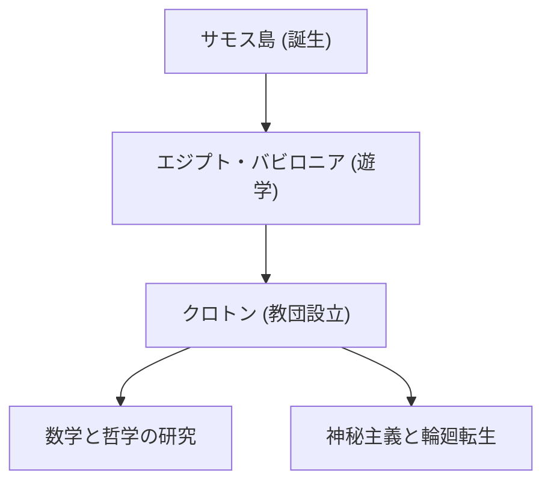

[ピタゴラス](https://kenji.blog/p/pythagoras/)（紀元前570年頃 - 紀元前495年頃）は、古代ギリシャの哲学者であり数学者です。「万物は数である」という彼の思想は、西洋の数学、科学、哲学の基礎を築きました。本記事では、彼の生涯と数学的業績について詳細に解説します。

## 生涯と教団の設立

エーゲ海のサモス島に生まれた[ピタゴラス](https://kenji.blog/p/pythagoras/)は、若くして知識を求め、エジプトやバビロニアへと旅立ちました。そこで幾何学、天文学、そして神秘主義的な宗教儀式を学びました。その後、南イタリアのクロトンに移住し、独自の学派および宗教教団である「[ピタゴラス](https://kenji.blog/p/pythagoras/)教団」を設立しました。



## 数学における最大の功績：[ピタゴラス](https://kenji.blog/p/pythagoras/)の定理

彼の名前を最もよく知らしめているのが **[ピタゴラス](https://kenji.blog/p/pythagoras/)の定理** です。直角三角形において、斜辺の長さを $c$ 、他の2辺を $a$ と $b$ としたとき、以下の関係が成り立ちます。

$$
a^2 + b^2 = c^2
$$

言葉で表すと以下のようになります。

$$
\text{斜辺}^2 = \text{底辺}^2 + \text{高さ}^2
$$

この定理は、建築や測量において極めて実用的な価値を持つと同時に、幾何学の論理的証明の美しさを示しています。

```python
# ピタゴラスの定理を用いて斜辺を計算する関数
def calculate_hypotenuse(a, b):
    return (a**2 + b**2) ** 0.5
```

## 無理数の発見と教団の危機

[ピタゴラス](https://kenji.blog/p/pythagoras/)の定理を $a = 1, b = 1$ の直角二等辺三角形に適用すると、斜辺 $c$ は $\sqrt{2}$ となります。

$$
c = \sqrt{1^2 + 1^2} = \sqrt{2} \approx 1.41421356
$$

[ピタゴラス](https://kenji.blog/p/pythagoras/)教団は「すべての事象は整数と整数の比（有理数）で表せる」と信じていました。しかし、$\sqrt{2}$ は有理数として表すことができない **無理数** です。この発見は彼らの宇宙観を根本から揺るがすものであり、教団はこの事実を外部に漏らさないよう固く禁じたと言われています。

## 音楽と数学の調和：[ピタゴラス](https://kenji.blog/p/pythagoras/)音律

[ピタゴラス](https://kenji.blog/p/pythagoras/)は、弦の長さが単純な整数比（例えば2:1や3:2）であるときに、心地よい和音（協和音）が生じることを発見しました。この発見は、音楽理論の基礎となる **[ピタゴラス](https://kenji.blog/p/pythagoras/)音律** へと発展しました。宇宙の天体もまた、その軌道において和音を奏でているという「天球の音楽」という概念は、後の天文学者ケプラーにも影響を与えました。

## まとめ

[ピタゴラス](https://kenji.blog/p/pythagoras/)は、単なる数学者ではなく、世界を「数」というレンズを通して理解しようとした偉大な思想家でした。彼の教えは、現代の科学的アプローチの精神的な起源として、今もなお輝き続けています。

