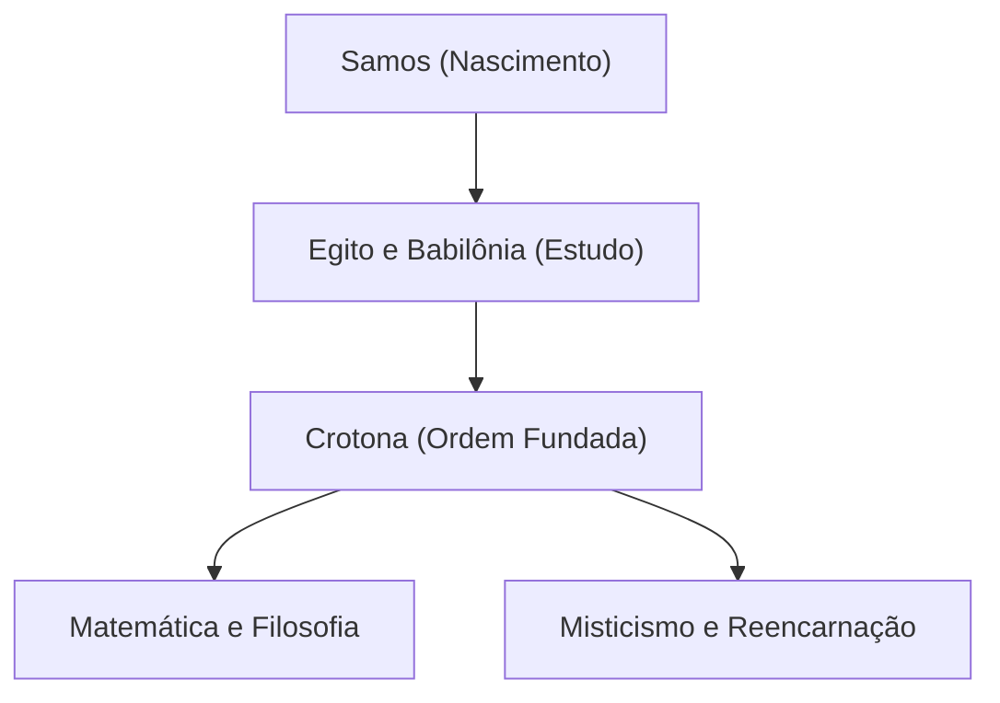

Pitágoras (c. 570 a.C. – c. 495 a.C.) foi um filósofo e matemático da Grécia Antiga. A sua filosofia de que "tudo é número" lançou as bases da matemática, da ciência e da filosofia ocidentais. Neste artigo, exploraremos detalhadamente a sua vida e as suas realizações matemáticas.

## Vida e a Fundação da Ordem

Nascido na ilha egéia de Samos, Pitágoras viajou para o Egito e para a Babilônia ainda jovem em busca de conhecimento. Lá ele estudou geometria, astronomia e ritos religiosos místicos. Mais tarde, emigrou para Crotona, no sul da Itália, onde fundou a sua própria escola e ordem religiosa, conhecida como a Ordem Pitagórica.



## A Maior Conquista na Matemática: O Teorema de Pitágoras

O que o torna mais famoso é o **Teorema de Pitágoras** . Num triângulo retângulo, se o comprimento da hipotenusa for $c$, e os outros dois lados forem $a$ e $b$, verifica-se a seguinte relação:

$$
a^2 + b^2 = c^2
$$

Expresso em palavras:

$$
\text{Hipotenusa}^2 = \text{Base}^2 + \text{Altura}^2
$$

Este teorema tem um imenso valor prático na arquitetura e na topografia, ao mesmo tempo que demonstra a beleza da prova lógica na geometria.

```python
# Função para calcular a hipotenusa usando o teorema de Pitágoras
def calculate_hypotenuse(a, b):
    return (a**2 + b**2) ** 0.5
```

## Descoberta dos Números Irracionais e a Crise na Ordem

Se aplicarmos o teorema de Pitágoras a um triângulo retângulo isósceles onde $a = 1, b = 1$, a hipotenusa $c$ torna-se $\sqrt{2}$.

$$
c = \sqrt{1^2 + 1^2} = \sqrt{2} \approx 1.41421356
$$

A Ordem Pitagórica acreditava que "todos os fenômenos podem ser expressos como uma proporção de números inteiros (números racionais)". No entanto, $\sqrt{2}$ é um **número irracional** que não pode ser expresso como um número racional. Esta descoberta abalou fundamentalmente a sua visão de mundo, e diz-se que a ordem proibiu estritamente o vazamento deste fato para o mundo exterior.

## Harmonia da Música e da Matemática: Afinação Pitagórica

Pitágoras descobriu que acordes agradáveis (consonâncias) são produzidos quando os comprimentos das cordas estão em proporções simples de números inteiros (por exemplo, 2:1 ou 3:2). Esta descoberta transformou-se na **afinação pitagórica** , que se tornou a base da teoria musical. O conceito da "Música das Esferas", que postula que os corpos celestes também tocam acordes em suas órbitas, influenciou astrônomos posteriores como Kepler.

## Conclusão

Pitágoras não foi apenas um matemático; foi um grande pensador que tentou entender o mundo através das lentes dos "números". Os seus ensinamentos continuam a brilhar como a origem espiritual das abordagens científicas modernas.

