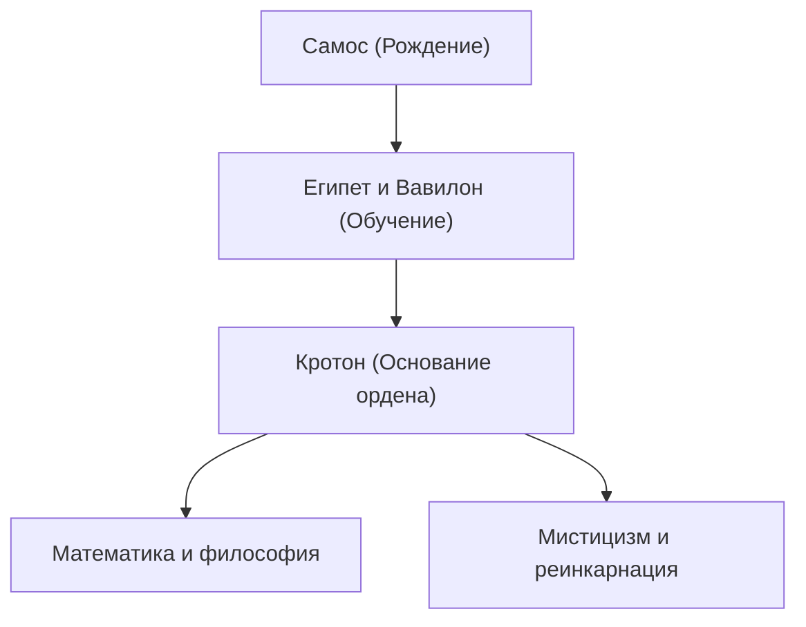

Пифагор (ок. 570 г. до н.э. – ок. 495 г. до н.э.) был древнегреческим философом и математиком. Его философия, гласящая, что «все есть число», заложила основу западной математики, науки и философии. В этой статье мы подробно рассмотрим его жизнь и математические достижения.

## Жизнь и основание ордена

Родившись на эгейском острове Самос, Пифагор в юном возрасте отправился в Египет и Вавилон в поисках знаний. Там он изучал геометрию, астрономию и мистические религиозные обряды. Позже он переселился в Кротон на юге Италии, где основал собственную школу и религиозный орден, известный как Пифагорейский орден.



## Величайшее достижение в математике: Теорема Пифагора

Самым известным его достижением является **Теорема Пифагора** . В прямоугольном треугольнике, если длина гипотенузы равна $c$, а два других катета равны $a$ и $b$, выполняется следующее соотношение:

$$
a^2 + b^2 = c^2
$$

Выражаясь словами:

$$
\text{Гипотенуза}^2 = \text{Основание}^2 + \text{Высота}^2
$$

Эта теорема имеет огромное практическое значение в архитектуре и геодезии, а также демонстрирует красоту логического доказательства в геометрии.

```python
# Функция для вычисления гипотенузы с использованием теоремы Пифагора
def calculate_hypotenuse(a, b):
    return (a**2 + b**2) ** 0.5
```

## Открытие иррациональных чисел и кризис в ордене

Если применить теорему Пифагора к равнобедренному прямоугольному треугольнику, где $a = 1, b = 1$, гипотенуза $c$ становится равной $\sqrt{2}$.

$$
c = \sqrt{1^2 + 1^2} = \sqrt{2} \approx 1.41421356
$$

Пифагорейский орден верил, что «все явления могут быть выражены в виде отношения целых чисел (рациональных чисел)». Однако $\sqrt{2}$ является **иррациональным числом** , которое не может быть выражено как рациональное число. Это открытие в корне потрясло их мировоззрение, и, как говорят, орден строго запретил разглашать этот факт внешнему миру.

## Гармония музыки и математики: Пифагорейский строй

Пифагор обнаружил, что приятные аккорды (консонансы) возникают, когда длины струн соотносятся как простые целые числа (например, 2:1 или 3:2). Это открытие переросло в **пифагорейский строй** , который стал основой музыкальной теории. Концепция «Музыки сфер», согласно которой небесные тела также исполняют аккорды на своих орбитах, оказала влияние на более поздних астрономов, таких как Кеплер.

## Заключение

Пифагор был не просто математиком; он был великим мыслителем, пытавшимся понять мир через призму «чисел». Его учения продолжают сиять как духовный исток современных научных подходов.
