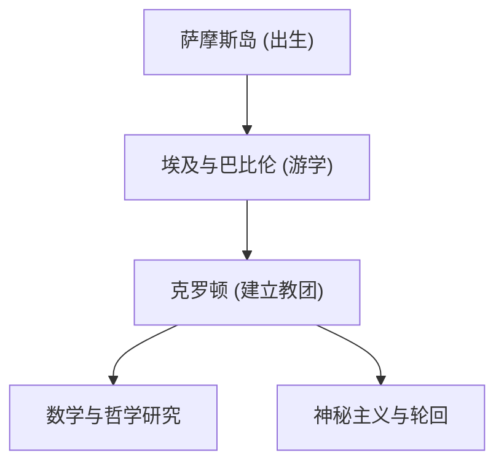

毕达哥拉斯（约公元前570年 - 约公元前495年）是古希腊哲学家和数学家。他的“万物皆数”的思想奠定了西方数学、科学和哲学的基础。在本文中，我们将详细探讨他的生平及数学成就。

## 生平与教团的建立

毕达哥拉斯出生在爱琴海的萨摩斯岛，年轻时为了追求知识，曾游历埃及和巴比伦。在那里，他学习了几何学、天文学以及神秘主义的宗教仪式。随后，他移居意大利南部的克罗顿，建立了自己的学派和宗教教团，被称为“毕达哥拉斯教团”。



## 数学上的最大成就：毕达哥拉斯定理

使他最为著名的是 **毕达哥拉斯定理** 。在直角三角形中，如果斜边的长度为 $c$，另外两条边的长度分别为 $a$ 和 $b$，则存在以下关系：

$$
a^2 + b^2 = c^2
$$

用文字表达如下：

$$
\text{斜边}^2 = \text{底边}^2 + \text{高}^2
$$

这个定理在建筑和测量中具有极大的实用价值，同时也展示了几何学逻辑证明之美。

```python
# 使用毕达哥拉斯定理计算斜边的函数
def calculate_hypotenuse(a, b):
    return (a**2 + b**2) ** 0.5
```

## 无理数的发现与教团危机

如果将毕达哥拉斯定理应用于 $a = 1, b = 1$ 的等腰直角三角形，斜边 $c$ 将变为 $\sqrt{2}$。

$$
c = \sqrt{1^2 + 1^2} = \sqrt{2} \approx 1.41421356
$$

毕达哥拉斯教团认为“所有现象都可以表示为整数的比例（有理数）”。然而，$\sqrt{2}$ 是一个无法表示为有理数的 **无理数** 。这一发现从根本上动摇了他们的世界观，据说教团严禁将这一事实泄露给外界。

## 音乐与数学的和谐：毕达哥拉斯音律

毕达哥拉斯发现，当琴弦的长度呈现简单的整数比（例如 2:1 或 3:2）时，会产生悦耳的和弦（协和音）。这一发现发展成了音乐理论的基础，即 **毕达哥拉斯音律** 。天体在其轨道上也同样奏响和弦的“天体音乐”这一概念，对后来的天文学家开普勒也产生了影响。

## 总结

毕达哥拉斯不仅是一位数学家，更是一位试图通过“数字”的视角来理解世界的伟大思想家。他的教诲作为现代科学方法的精神源泉，至今依然闪耀着光芒。

