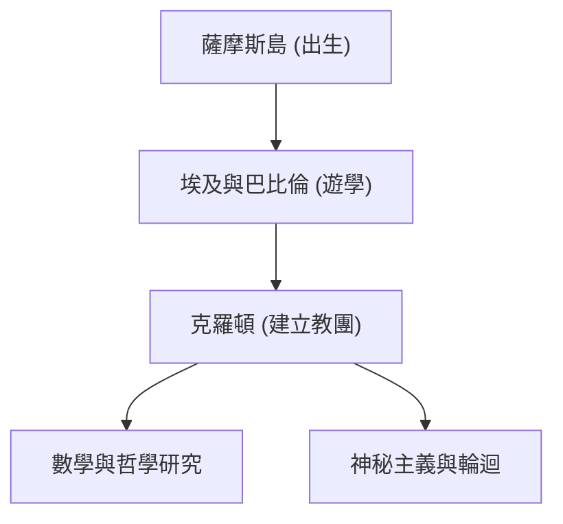

畢達哥拉斯（約公元前570年 - 約公元前495年）是古希臘哲學家和數學家。他的「萬物皆數」的思想奠定了西方數學、科學和哲學的基礎。在本文中，我們將詳細探討他的生平及數學成就。

## 生平與教團的建立

畢達哥拉斯出生在愛琴海的薩摩斯島，年輕時為了追求知識，曾遊歷埃及和巴比倫。在那裡，他學習了幾何學、天文學以及神秘主義的宗教儀式。隨後，他移居義大利南部的克羅頓，建立了自己的學派和宗教教團，被稱為「畢達哥拉斯教團」。



## 數學上的最大成就：畢達哥拉斯定理

使他最為著名的是 **畢達哥拉斯定理** 。在直角三角形中，如果斜邊的長度為 $c$，另外兩條邊的長度分別為 $a$ 和 $b$，則存在以下關係：

$$
a^2 + b^2 = c^2
$$

用文字表達如下：

$$
\text{斜邊}^2 = \text{底邊}^2 + \text{高}^2
$$

這個定理在建築和測量中具有極大的實用價值，同時也展示了幾何學邏輯證明之美。

```python
# 使用畢達哥拉斯定理計算斜邊的函式
def calculate_hypotenuse(a, b):
    return (a**2 + b**2) ** 0.5
```

## 無理數的發現與教團危機

如果將畢達哥拉斯定理應用於 $a = 1, b = 1$ 的等腰直角三角形，斜邊 $c$ 將變為 $\sqrt{2}$。

$$
c = \sqrt{1^2 + 1^2} = \sqrt{2} \approx 1.41421356
$$

畢達哥拉斯教團認為「所有現象都可以表示為整數的比例（有理數）」。然而，$\sqrt{2}$ 是一個無法表示為有理數的 **無理數** 。這一發現從根本上動搖了他們的世界觀，據說教團嚴禁將這一事實洩露給外界。

## 音樂與數學的和諧：畢達哥拉斯音律

畢達哥拉斯發現，當琴弦的長度呈現簡單的整數比（例如 2:1 或 3:2）時，會產生悅耳的和弦（協和音）。這一發現發展成了音樂理論的基礎，即 **畢達哥拉斯音律** 。天體在其軌道上也同樣奏響和弦的「天體音樂」這一概念，對後來的天文學家克卜勒也產生了影響。

## 總結

畢達哥拉斯不僅是一位數學家，更是一位試圖透過「數字」的視角來理解世界的偉大思想家。他的教誨作為現代科學方法的精神源泉，至今依然閃耀著光芒。

