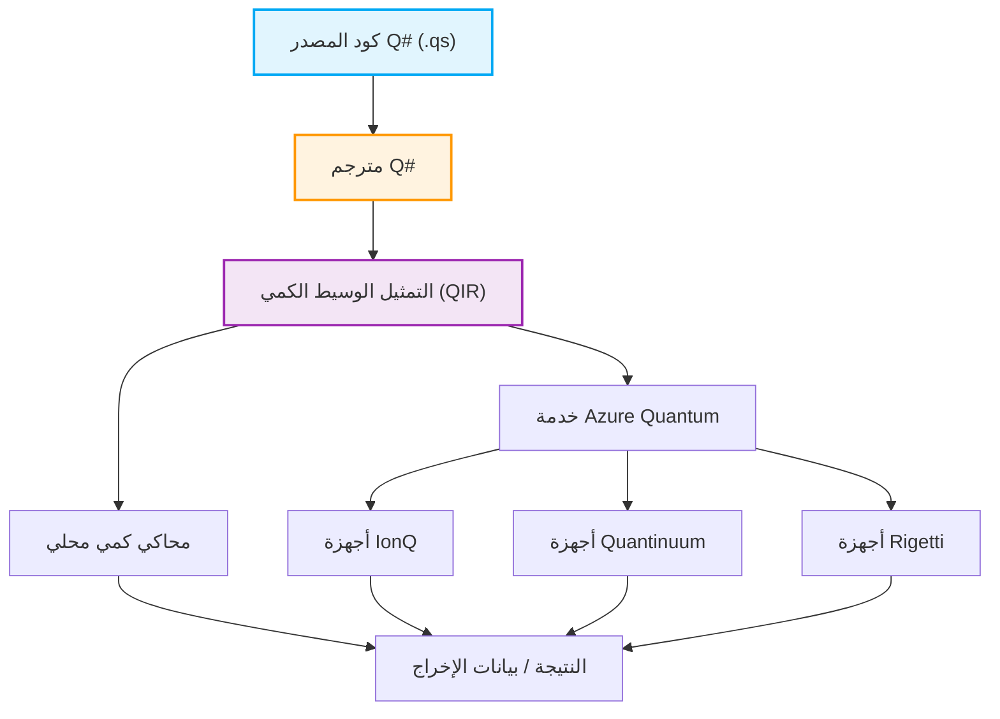

## 1. مقدمة: فجر الحوسبة الكمية ونموذج جديد للبرمجة

في السنوات الأخيرة، كان الابتكار التكنولوجي في مجال الحوسبة الكمية، سواء في الأجهزة أو البرمجيات، ملحوظًا. في حين أن أجهزة الكمبيوتر الكلاسيكية (مثل أجهزة الكمبيوتر الشخصية والهواتف الذكية وأجهزة الكمبيوتر العملاقة التي نستخدمها يوميًا) تعالج المعلومات كمجموعة من البتات المحددة إما "0" أو "1"، تستخدم أجهزة الكمبيوتر الكمية ظواهر فيزيائية خاصة بميكانيكا الكم مثل "التراكب" (Superposition) و"التشابك الكمي" (Entanglement) مباشرة كأساس لمعالجة المعلومات. وقد أظهر هذا إمكانية تحقيق سرعات حسابية لفئات معينة من المشاكل لا يمكن لأجهزة الكمبيوتر الكلاسيكية الوصول إليها حتى لو استغرقت وقتًا يعادل عمر الكون، وهو ما يُعرف باسم "التفوق الكمي" (Quantum Supremacy) أو "الميزة الكمية" (Quantum Advantage). على سبيل المثال، من المتوقع حدوث انخفاض كبير في التعقيد الحسابي في مجالات مثل تحليل الأعداد الكبيرة إلى عواملها الأولية (خوارزمية شور)، والبحث السريع في قواعد البيانات (خوارزمية غروفر)، ومحاكاة الكيمياء الكمية (خوارزمية VQE)، ومشاكل التحسين التوافقي، وحتى في عمليات معينة للتعلم الآلي (التعلم الآلي الكمي).

ومع ذلك، من أجل تحويل هذه الإمكانات المذهلة لأجهزة الكمبيوتر الكمية إلى تطبيقات واقعية، فإن التقدم في الأجهزة المادية (مثل الكيوبتات فائقة التوصيل أو المصائد الأيونية) وحده غير كافٍ. من الضروري وجود "لغة برمجة كمية" لتصميم الدوائر الكمية بدقة ووصف الخوارزميات الكمية دون أخطاء وبكفاءة، إلى جانب بيئة قوية للتطوير والتنفيذ وتصحيح الأخطاء. لغات البرمجة الكلاسيكية (مثل C++، Python، Java، إلخ) ممتازة في تجريد سلوك بنية وحدة المعالجة المركزية الكلاسيكية، ولكنها لم تُصمم لوصف التلاعب بالحالات الكمية بشكل طبيعي، والتي تتميز بطبيعتها غير الحتمية وسعاتها الاحتمالية المركبة.

في هذه المقالة، من بين العديد من بيئات البرمجة الكمية، سنسلط الضوء على "مجموعة تطوير الكم" (Quantum Development Kit - QDK)، والتي تدفع بها شركة مايكروسوفت بقوة ويتم تطويرها كمصدر مفتوح، ولغة البرمجة المخصصة الأساسية التابعة لها "Q#" (كيو شارب).

كـ لغة خاصة بالمجال (DSL) متخصصة في وصف الخوارزميات الكمية، تم تصميم Q# من الصفر مع استيعاب أفضل أجزاء من C# و F# و Python. إنها تتميز بقدرات قوية تسمح بدمج سلس لتدفق التحكم الكلاسيكي (مثل عبارات if وحلقات for) والعمليات الكمية (تطبيق البوابات والقياسات). في هذه المقالة، بدءًا من النماذج الرياضية الأساسية للحوسبة الكمية، سنشرح بالتفصيل وبشكل شامل الخصائص اللغوية لـ Q#، ومقارنة فلسفة تصميمها مع Qiskit في Python، وبناء "حالة بيل" (حالة التشابك الكمي) وقياسها باستخدام الكود الفعلي، وحتى طرق دمجها مع اللغات الكلاسيكية (Python و C#). بحلول الوقت الذي تنتهي فيه من قراءة هذه المقالة، ستكون قد فهمت أساسيات البرمجة الكمية ومستعدًا للبدء في كتابة كود Q# في بيئتك الخاصة.

## 2. الأساس الرياضي للحوسبة الكمية: الحالات، التراكب، والتشابك

من أجل فهم بناء الجملة وميزات Q# بعمق وكتابة برامج كمية فعالة، من الضروري أولاً تنظيم المعرفة الرياضية الأساسية (وخاصة الجبر الخطي) وراء الحالات الكمية وعمليات البوابات الكمية. هنا، سنستعرض النماذج الرياضية الأساسية اللازمة للبرمجة الكمية.

### 2.1 الكيوبت (Qubit) وحالة التراكب

في حين أن البت الكلاسيكي (Classical Bit) يمكن أن يأخذ فقط إحدى الحالتين $0$ أو $1$، يتم تمثيل الكيوبت (Qubit) كـ "تركيبة خطية" (Linear Combination)، أو "تراكب"، من الحالتين $|0\rangle$ و $|1\rangle$. يتم وصف هذه الحالة باستخدام تدوين برا-كيت (تدوين ديراك) والمعاملات المركبة $\alpha$ و $\beta$ على النحو التالي:

$$ |\psi\rangle = \alpha|0\rangle + \beta|1\rangle $$

هنا، $\alpha$ و $\beta$ هي أعداد مركبة تُعرف باسم "السعات الاحتمالية" (Probability Amplitude). عند قياس هذا الكيوبت، فإن احتمال رصد الحالة $|0\rangle$ هو $|\alpha|^2$، واحتمال رصد الحالة $|1\rangle$ هو $|\beta|^2$. كقيد فيزيائي، يجب أن يكون مجموع احتمالات رصد جميع الحالات الممكنة دائمًا $1$، لذلك يجب أن يفي بالشرط التالي المعروف باسم "شرط التسوية" (Normalization Condition):

$$ |\alpha|^2 + |\beta|^2 = 1 $$

غالبًا ما يتم تصور حالة الكيوبت كنقطة على سطح كرة الوحدة في فضاء ثلاثي الأبعاد تُعرف باسم "كرة بلوخ" (Bloch Sphere). يتوافق القطب الشمالي مع $|0\rangle$، والقطب الجنوبي مع $|1\rangle$، وتمثل النقاط على خط الاستواء حالات يتراكب فيها $|0\rangle$ و $|1\rangle$ باحتمالات متساوية (على سبيل المثال، الحالة ذات الطور 0 هي $|+\rangle = \frac{1}{\sqrt{2}}(|0\rangle + |1\rangle)$، والحالة ذات الطور $\pi/2$ هي $|i\rangle = \frac{1}{\sqrt{2}}(|0\rangle + i|1\rangle)$). يمكن فهم عمليات البوابات الكمية هندسيًا كعمليات دوران على كرة بلوخ هذه.

### 2.2 الكيوبتات المتعددة، الجداء الموتري، والتشابك الكمي

تظهر القوة الحقيقية للحوسبة الكمية عند الجمع بين عدة كيوبتات. يتم وصف حالة النظام المكون من كيوبتات متعددة من خلال "الجداء الموتري" (Tensor Product) لمساحات الحالة للكيوبتات الفردية. على سبيل المثال، حالة النظام بأكمله المكون من اثنين من الكيوبتات هي كما يلي:

$$ |\psi\rangle = \alpha_{00}|00\rangle + \alpha_{01}|01\rangle + \alpha_{10}|10\rangle + \alpha_{11}|11\rangle $$

هنا أيضًا يسري شرط التسوية $\sum_{i,j} |\alpha_{ij}|^2 = 1$. النقطة المهمة هي أنه لوصف نظام مكون من n كيوبت بالكامل، نحتاج إلى $2^n$ من السعات المركبة. على سبيل المثال، حتى في نظام مكون من 50 كيوبتًا فقط، لتمثيل حالته، نحتاج إلى حوالي $2^{50} \approx 10^{15}$ عدد مركب، وهو ما يتجاوز بكثير سعة الذاكرة لأسرع أجهزة الكمبيوتر العملاقة في العالم حاليًا. هذا أحد الأسباب التي تجعل أجهزة الكمبيوتر الكمية تتمتع بميزة أسية على أجهزة الكمبيوتر الكلاسيكية.

يشير "التشابك الكمي" (Entanglement) إلى حالة في نظام متعدد الكيوبتات حيث لا يمكن تحليل الحالة ببساطة كجداء موتري لحالات الكيوبتات الفردية. واحدة من أشهر حالات التشابك وأهمها هي "حالة بيل" (Bell State) التالية:

$$ |\Phi^+\rangle = \frac{1}{\sqrt{2}}(|00\rangle + |11\rangle) $$

في هذه الحالة، في اللحظة التي نقيس فيها أحد الكيوبتات ونحصل على $0$ (أو $1$)، يتم تحديد حالة الكيوبت الآخر فورًا إلى $0$ (أو $1$) بغض النظر عن المسافة بينهما. هذا الارتباط غير المحلي، الذي أطلق عليه أينشتاين "التأثير الشبحي عن بعد"، هو مورد أساسي في النقل الآني الكمي، التشفير فائق الكثافة، اتصالات التشفير الكمي، بالإضافة إلى التنفيذ الفعال للعديد من الخوارزميات الكمية. في الأقسام اللاحقة، سنقوم فعليًا بإنشاء حالة بيل هذه باستخدام Q#.

### 2.3 عمليات البوابات الكمية والمصفوفات الوحدوية

تسمى العمليات التي تغير الحالة الكمية (والتي تعادل بوابات AND و OR و NOT في الدوائر المنطقية الكلاسيكية) بالبوابات الكمية. رياضيًا، يتم تمثيل البوابة الكمية كمصفوفة من الأعداد المركبة التي تعمل كضرب مصفوفة لمتجه الحالة الكمية. وفقًا لمسلمات ميكانيكا الكم، يجب أن تكون هذه المصفوفات دائمًا "مصفوفات وحدوية" (Unitary Matrix، وهي المصفوفة التي تلبي شرط $U^\dagger U = I$، حيث $U^\dagger$ هي المصفوفة المرافقة و $I$ هي مصفوفة الوحدة). نتيجة لذلك، تكون جميع العمليات الكمية باستثناء القياس "قابلة للعكس" (Reversible).

بوابات الكيوبت المفردة التمثيلية:
- **بوابة Pauli-X (بوابة NOT)**: تعكس $|0\rangle$ إلى $|1\rangle$، و $|1\rangle$ إلى $|0\rangle$.
$$ X = \begin{pmatrix} 0 & 1 \\ 1 & 0 \end{pmatrix} $$
- **بوابة Pauli-Z (بوابة إزاحة الطور)**: تترك $|0\rangle$ كما هو، وتعكس إشارة $|1\rangle$ (تضيف $\pi$ إلى الطور النسبي).
$$ Z = \begin{pmatrix} 1 & 0 \\ 0 & -1 \end{pmatrix} $$
- **بوابة Hadamard (بوابة H)**: تحول حالة حتمية إلى حالة تراكب.
$$ H = \frac{1}{\sqrt{2}} \begin{pmatrix} 1 & 1 \\ 1 & -1 \end{pmatrix} $$

بوابات الكيوبت المزدوجة التمثيلية:
- **بوابة CNOT (بوابة NOT المحكومة)**: تطبق بوابة X (عملية NOT) على الكيوبت المستهدف (Target Qubit) فقط عندما يكون كيوبت التحكم (Control Qubit) في حالة $|1\rangle$.
$$ CNOT = \begin{pmatrix} 1 & 0 & 0 & 0 \\ 0 & 1 & 0 & 0 \\ 0 & 0 & 0 & 1 \\ 0 & 0 & 1 & 0 \end{pmatrix} $$

يمكن القول إن الخوارزمية الكمية هي تصميم لعملية تحقيق العملية الحسابية المطلوبة من خلال الجمع بين هذه المصفوفات الوحدوية الأساسية.

## 3. ما هي مجموعة تطوير الكم من مايكروسوفت (QDK)؟

مجموعة تطوير الكم (QDK) التي تقدمها مايكروسوفت هي مجموعة أدوات شاملة لدعم تطوير برمجيات الحوسبة الكمية. وهي تدعم دورة حياة التطوير بأكملها، من تصميم الخوارزميات الكمية، وتصحيح الأخطاء، والتحسين، إلى تنفيذها على أجهزة المحاكاة أو الأجهزة الكمية الفعلية.

تتضمن QDK العناصر الرئيسية التالية:

1. **مترجم وبيئة تشغيل Q#**: يقوم بتحليل الكود المكتوب بلغة Q# بدقة عالية، وتحسينه، وتحويله إلى تنسيق قابل للتنفيذ (مثل QIR) على المحاكي أو الأجهزة الكمية الفعلية (عبر Azure Quantum). يقوم مترجم Q# بإجراء تحليل ثابت خاص بالحسابات الكمية، مثل التحقق من نقاء الدوال وإدارة دورة حياة الكيوبتات.
2. **محاكي كمي**: يتضمن "محاكي الحالة الكاملة" (Full State Simulator) الذي يحاكي تطور الحالة الكمية على جهاز المطور المحلي. يتيح ذلك اختبار وتصحيح الأخطاء بسرعة للخوارزميات صغيرة الحجم على نطاق عشرات الكيوبتات محليًا. علاوة على ذلك، يتم توفير "مقدر الموارد" (Resource Estimator) لتقدير متطلبات الموارد للدوائر واسعة النطاق (آلاف إلى ملايين الكيوبتات).
3. **مكتبات غنية**: توفر المكتبة القياسية لـ Q# (Standard Library) وحدات بناء متقدمة مختلفة، تتراوح من البوابات الكمية الأساسية (H، X، Y، Z، CNOT، إلخ) إلى العمليات الحسابية المعقدة (مثل الجامع الكمي)، وتضخيم السعة (Amplitude Amplification)، وخوارزمية تقدير الطور الكمي (Quantum Phase Estimation). يجنب هذا المطورين إعادة اختراع العجلة.
4. **تكامل بيئة التطوير المتكاملة (IDE)**: تتوفر إضافات لـ Visual Studio و Visual Studio Code، مما يوفر ميزات لا غنى عنها في تطوير البرمجيات الحديثة، مثل تمييز بناء الجملة، وإكمال الكود (IntelliSense)، وإمكانيات تصحيح الأخطاء القوية، والتكامل مع أطر الاختبار.

يُظهر مخطط Mermaid التالي سير العمل من وقت كتابة برنامج Q# حتى تنفيذه على الأجهزة.



الميزة الرائعة لهذه البنية هي أنها تجرد تمامًا الاختلافات في بنيات الأجهزة الأساسية (الكيوبتات فائقة التوصيل، المصائد الأيونية، الكيوبتات الطوبولوجية، الكيوبتات الضوئية، إلخ) من خلال تمريرها عبر تمثيل وسيط يسمى QIR (التمثيل الوسيط الكمي) والمبني على LLVM. يمكن للمطورين التركيز على التصميم المنطقي البحت للخوارزمية دون القلق بشأن التفاصيل المادية للأجهزة (مجموعة البوابات الأصلية والطوبولوجيا الخاصة بكل جهاز). ستقوم مسارات المترجم بعد طبقة QIR بنقل البوابات المحسنة تلقائيًا إلى الأجهزة المستهدفة.

## 4. Q# مقابل Python/Qiskit: لماذا نحتاج إلى لغة جديدة؟

عند تعلم البرمجة الكمية، فإن أول ما يواجهه الكثير من الناس هو "Qiskit"، وهو إطار عمل قائم على Python تم تطويره بواسطة IBM، نظرًا لسهولة استخدامه وانتشار لغة Python. في حين أن Qiskit هي أيضًا أداة قوية ومستخدمة على نطاق واسع، إلا أن فلسفة التصميم الأساسية (النموذج) تختلف اختلافًا كبيرًا عن Q# الخاصة بمايكروسوفت.

### نهج Qiskit (بناء كائنات الدوائر باستخدام Python)
Qiskit هي في جوهرها "مكتبة واجهة برمجة تطبيقات (API) لـ Python لبناء الدوائر الكمية". عندما يقوم المطور بتنفيذ نص Python، يتم تجميع تسلسل البوابات الكمية (كائن الدائرة) تدريجيًا في الذاكرة. بعد إضافة جميع البوابات، يتم أخيرًا إرسال (Submit) كائن الدائرة الضخم هذا إلى الواجهة الخلفية (المحاكي المحلي أو جهاز حقيقي على السحابة) للتنفيذ.
هذا النهج الميتا-برمجي له ميزة كبيرة تتمثل في سهولة التكامل للغاية مع النظام البيئي الحالي لـ Python (مثل مكتبات التعلم الآلي NumPy و SciPy و PyTorch وأدوات التصور). ومع ذلك، عندما يتعلق الأمر بالتعبير عن "الدوائر الديناميكية" (Dynamic Circuits) ذات التدفق التحكمي المعقد الذي يمزج بين الكلاسيكي والكمي، مثل "قياس كيوبت معين، وإذا كانت النتيجة فقط 1، قم بتطبيق عملية وحدوية معقدة محددة على مجموعة أخرى من الكيوبتات، ثم قم بتشغيل حلقة while"، لا يمكن استخدام عبارات if وحلقات for الأصلية في Python (لأنها يتم تقييمها "في وقت بناء الدائرة"). ينتج عن هذا الحاجة إلى استخدام تعليمات التحكم الخاصة بـ Qiskit، مما يجعل الكود غالبًا معقدًا للغاية وغير بديهي.

### نهج Q# (لغة خاصة بالمجال تضع الكم أولاً)
من ناحية أخرى، فإن Q# هي لغة مجمعة قائمة بذاتها صُممت من الصفر للتعامل مع الحوسبة الكمية نفسها كـ "مواطن من الدرجة الأولى" (First-class citizen). داخل Q#، يمكن وصف عمليات تخصيص الكيوبتات، وتطبيق البوابات، والقياس بشكل طبيعي وسلس داخل قاعدة كود واحدة، وبنفس الطريقة تمامًا مثل معالجة المتغيرات الكلاسيكية، وعبارات if، وحلقات المعالجة.
يقوم مترجم Q# بتحليل الكود بأكمله بشكل ثابت ويحدد الأجزاء التي يجب تنفيذها على أجهزة الحوسبة الكلاسيكية (وحدة المعالجة المركزية المضيفة أو إلكترونيات التحكم) والأجزاء التي يجب تنفيذها على المعالج المساعد الكمي (QPU)، ويقوم بإجراء تحسينات متقدمة. يتيح ذلك تحقيق مستوى أعلى من النمطية وقابلية القراءة وقابلية الصيانة و "أمان الكتابة" (Type Safety) في تنفيذ الخوارزميات الكمية المعقدة واسعة النطاق. Q# هي لغة "لكتابة الخوارزميات" وليس "لكتابة الدوائر".

## 5. نظرة متعمقة على بناء الجملة الأساسي لـ Q# ومفاهيمها المميزة

يتمتع بناء جملة Q# بتصميم مصقول للغاية، حيث يجمع بين بنية الكتلة باستخدام الأقواس المعقوفة `{}` كما في C#، وعناصر البرمجة الوظيفية من F#، واستنتاج الأنواع (Type Inference) القوي. هنا، سنشرح بالتفصيل الكلمات الرئيسية والمفاهيم المهمة لفهم Q# بعمق.

### 5.1 التمييز الصارم بين `operation` و `function`
في Q#، يتم التمييز بدقة بين نوعين لتعريف الكتل البرمجية (الروتينات الفرعية): `operation` و `function`. ينبع هذا من مفهوم "النقاء" (Purity) في البرمجة الوظيفية.
- **`function`**: هي دالة نقية تؤدي فقط حسابات كلاسيكية حتمية (Deterministic). إذا تم إعطاؤها نفس معاملات الإدخال، فسترجع دائمًا نفس نتيجة الإخراج بغض النظر عن عدد مرات تنفيذها. داخل `function`، ستؤدي العمليات الكمية (العمليات المصحوبة بآثار جانبية) مثل تخصيص الكيوبتات، وتطبيق البوابات، والقياس إلى حدوث خطأ في الترجمة. تُستخدم للحسابات الرياضية وتحويلات البيانات.
- **`operation`**: هو روتين غير حتمي (Non-deterministic) يتضمن حسابات كمية. يحتوي على عمليات على الكيوبتات أو قياسات، وحتى مع نفس الإدخال، قد تتغير النتيجة بسبب الطبيعة الاحتمالية لميكانيكا الكم (مثل انهيار الدالة الموجية بسبب القياس). يتم تعريف جميع الأجزاء الأساسية للخوارزميات الكمية على أنها `operation`.

### 5.2 نوع `Qubit` وإدارة دورة الحياة باستخدام الكلمة الرئيسية `use`
في Q#، يتم التعامل مع الكيوبتات ككائنات "مبهمة" (Opaque) من النوع `Qubit`. يُمنع المطورون عمدًا من القراءة المباشرة أو إعادة كتابة السعات الاحتمالية للحالة الداخلية (مثل قيم $\alpha$ و $\beta$) داخل البرنامج (يتوافق هذا مع "مشكلة القياس" في الأنظمة الكمية المادية الحقيقية). الطريقة الوحيدة للتفاعل مع الكيوبتات هي استدعاء عمليات البوابات الكمية أو دوال القياس المتوفرة.

لتخصيص (Allocate) كيوبتات جديدة داخل البرنامج، استخدم الكلمة الرئيسية `use` (في الإصدارات القديمة من Q# كانت تسمى `using`). تحدد كتلة `use` بوضوح نطاق الكيوبت ودورة حياته.
كقاعدة هامة، عند الخروج من كتلة `use`، يجب أن تعود جميع الكيوبتات المخصصة بداخلها بالكامل إلى الحالة $|0\rangle$ (وإلا سيحدث استثناء في وقت التشغيل). تعد هذه آلية أمان قوية في Q# لضمان إعادة استخدام الكيوبتات ومنع تسرب الذاكرة.

### 5.3 القياس `M` و `MResetZ` المفيدة
تتم عملية القياس (Measurement) لتحويل الحالة الكمية إلى معلومات كلاسيكية (0 أو 1) من خلال العملية الأساسية `M`. يتم إرجاع نتيجة القياس في أساس Z (الأساس القياسي) كنوع تعداد (Enum) يُسمى `Result` (القيم هي `Zero` أو `One`).
ومع ذلك، كما ذكرنا سابقًا، عند تحرير الكيوبت، يجب أن يكون في الحالة $|0\rangle$. إذا قمنا فقط بالقياس `M`، وإذا كانت النتيجة `One`، فإن الكيوبت سيكون قد انهار إلى الحالة $|1\rangle$. لذلك، في الكود العملي، يتم استخدام العملية القياسية المفيدة `MResetZ` بشكل متكرر للغاية، والتي تعيد ضبط حالة الكيوبت بشكل موثوق إلى $|0\rangle$ فور إجراء القياس.

### 5.4 عدم قابلية المتغيرات للتغيير (Immutability) و `mutable`
تأثرت Q# بشدة بالبرمجة الوظيفية، لذا فإن جميع المتغيرات افتراضيًا غير قابلة للتغيير (Immutable). بمجرد ربط المتغير باستخدام الكلمة الرئيسية `let`، لا يمكن تغيير قيمته بعد ذلك. يساعد هذا في تقليل الآثار الجانبية غير المقصودة في المعالجة المتوازية والخوارزميات الكمية.
إذا كنت بحاجة إلى الإعلان عن متغير يجب تحديث قيمته، مثل عداد الحلقة أو حساب تراكمي، فيمكنك استخدام الكلمة الرئيسية `mutable` صراحةً، واستخدام الكلمة الرئيسية `set` لتحديث القيمة.

## 6. التدريب العملي: إنشاء حالة بيل (التشابك الكمي) وقياسها باستخدام Q#

الآن، دعونا نجمع كل المعرفة التي تعلمناها حتى الآن ونستخدم Q# فعليًا لإنشاء "حالة بيل" (Bell State) التي شرحناها في القسم الرياضي سابقًا، وكتابة برنامج لقياسها. هذه خطوة مهمة جدًا يمكن اعتبارها "مرحبًا بالعالم" (Hello World) في البرمجة الكمية.

### تصميم الدائرة الكمية وشرحها
إليك الخطوات القياسية للدائرة الكمية لإنشاء حالة بيل $\frac{1}{\sqrt{2}}(|00\rangle + |11\rangle)$:
1. قم بإعداد اثنين من الكيوبتات $q_0$ و $q_1$ في الحالة الابتدائية $|00\rangle$.
2. قم بتطبيق بوابة هادامارد (بوابة $H$) على $q_0$. يؤدي هذا إلى وضع $q_0$ في حالة تراكب متساوية الاحتمال بين $|0\rangle$ و $|1\rangle$، وهي $\frac{1}{\sqrt{2}}(|0\rangle + |1\rangle)$. في هذه المرحلة، حالة النظام بأكمله هي $\frac{1}{\sqrt{2}}(|0\rangle + |1\rangle) \otimes |0\rangle = \frac{1}{\sqrt{2}}(|00\rangle + |10\rangle)$.
3. قم بتطبيق بوابة CNOT (NOT المحكومة) باستخدام $q_0$ ككيوبت تحكم (Control) و $q_1$ ككيوبت مستهدف (Target). هذا يعكس $q_1$ فقط عندما يكون $q_0$ في حالة $|1\rangle$. نتيجة لذلك، تبقى الحالة $|00\rangle$ كما هي $|00\rangle$، بينما تتغير الحالة $|10\rangle$ إلى $|11\rangle$، وتكون الحالة النهائية للنظام بأكمله $\frac{1}{\sqrt{2}}(|00\rangle + |11\rangle)$. وبذلك يكتمل إنشاء حالة التشابك ذات الارتباط المثالي.

### كود التنفيذ باستخدام Q#

الكود التالي هو مثال عملي للتنفيذ يستخدم Q# لإنشاء حالة بيل وتكرار تجربة القياس لعدد محدد من المرات لجمع الإحصائيات (توزيع الاحتمالات).

```qsharp
namespace Quantum.BellState {
    
    // استيراد مساحات الأسماء الضرورية
    open Microsoft.Quantum.Intrinsic;
    open Microsoft.Quantum.Canon;
    open Microsoft.Quantum.Measurement;
    open Microsoft.Quantum.Diagnostics;

    /// # Summary
    /// يولد حالة بيل واحدة ويقيس اثنين من الكيوبتات في أساس Z.
    ///
    /// # Output
    /// (Result, Result): نتائج قياس qubit1 و qubit2. إذا كانت في حالة بيل، فستكون متطابقة دائمًا.
    operation GenerateAndMeasureBellState() : (Result, Result) {
        
        // تخصيص اثنين من الكيوبتات (تكون الحالة الابتدائية تلقائيًا |00>)
        use (q1, q2) = (Qubit(), Qubit());
        
        // تطبيق بوابة هادامارد على q1 لإنشاء حالة تراكب
        H(q1);
        
        // تطبيق بوابة CNOT مع q1 ككيوبت تحكم و q2 ككيوبت مستهدف
        // يؤدي هذا إلى إنشاء تشابك كمي (Entanglement) بين q1 و q2
        CNOT(q1, q2);
        
        // كطريقة لتصحيح الأخطاء أثناء التطوير، يمكنك تفريغ متجه الحالة في المحاكي للتحقق منه
        // DumpMachine(); // أزل التعليق إذا لزم الأمر

        // إجراء القياس، وفي نفس الوقت إعادة تعيين حالة الكيوبت إلى |0> لتحريره بأمان
        let res1 = MResetZ(q1);
        let res2 = MResetZ(q2);
        
        // إرجاع زوج من نتائج القياس
        return (res1, res2);
    }

    /// # Summary
    /// الروتين الرئيسي الذي ينفذ تجربة إنشاء حالة بيل وقياسها عدة مرات ويجمع إحصائيات النتائج.
    ///
    /// # Input
    /// ## count
    /// عدد مرات تكرار التجربة (مثال: 1000 مرة)
    ///
    /// # Output
    /// (Int, Int, Int, Int): عدد المرات التي تم فيها رصد (00, 01, 10, 11) على التوالي
    @EntryPoint()
    operation RunBellStateExperiment(count: Int) : (Int, Int, Int, Int) {
        
        // تهيئة المتغيرات القابلة للتغيير (mutable) لعد مرات الرصد
        mutable num00 = 0;
        mutable num01 = 0;
        mutable num10 = 0;
        mutable num11 = 0;

        // تدوير حلقة التجربة بالعدد المحدد من المرات
        for _ in 1..count {
            // إنشاء حالة بيل واستقبال نتائج القياس
            let (r1, r2) = GenerateAndMeasureBellState();
            
            // حساب أنماط النتائج
            if r1 == Zero and r2 == Zero {
                set num00 += 1;
            } elif r1 == Zero and r2 == One {
                set num01 += 1;
            } elif r1 == One and r2 == Zero {
                set num10 += 1;
            } else { // حالة r1 == One and r2 == One
                set num11 += 1;
            }
        }

        // إخراج المعلومات الإحصائية المجمعة كرسالة إلى وحدة التحكم
        Message($"--- Experiment Results ---");
        Message($"Total runs: {count}");
        Message($"00 observed: {num00}");
        Message($"01 observed: {num01}");
        Message($"10 observed: {num10}");
        Message($"11 observed: {num11}");

        return (num00, num01, num10, num11);
    }
}
```

### شرح الكود والتحقق من التشغيل
- `namespace`: كما هو الحال في Java و C#، يعد هذا إعلانًا لمساحة اسم (Namespace) لتنظيم البرنامج منطقيًا ومنع تعارض الأسماء.
- `open`: يستورد المكتبات (الوحدات) الضرورية. تحتوي `Microsoft.Quantum.Intrinsic` على البوابات الكمية الأساسية مثل H و X و Y و Z و CNOT، بينما تحتوي `Microsoft.Quantum.Measurement` على وظائف مفيدة متعلقة بالقياس مثل `MResetZ`.
- `use (q1, q2) = (Qubit(), Qubit());`: يخصص اثنين من الكيوبتات بشكل ديناميكي.
- `H(q1); CNOT(q1, q2);`: هذان السطران هما الجزء الأساسي الذي يولد التشابك الكمي. يمكن كتابتهما ببساطة وبديهية شديدة.
- `let res1 = MResetZ(q1);`: كما ذكرنا سابقًا، يقوم `MResetZ` بربط نتيجة القياس بمتغير وفي الوقت نفسه يعيد ضبط حالة الكيوبت قسراً إلى $|0\rangle$. يسمح هذا بتحرير الكيوبت بأمان عند نهاية كتلة `use`.
- `@EntryPoint()`: بإضافة هذه السمة، فإنها تشير للمترجم إلى أن هذه العملية هي نقطة البداية لتنفيذ البرنامج (مشابهة لدالة main في لغة C).

نظريًا، الحالة المتولدة هي حالة بيل $\frac{1}{\sqrt{2}}(|00\rangle + |11\rangle)$، لذلك إذا قمنا بتشغيل هذا البرنامج لعدد كافٍ من المرات (على سبيل المثال 10,000 مرة)، فسيتم رصد `00` و `11` بنسبة تقارب 50% لكل منهما (حوالي 5,000 مرة)، بينما سيتم رصد `01` و `10` بصفر مرة (إذا لم يكن هناك خطأ نظري، فلن يتم رصدهما على الإطلاق). هذا دليل على أن الكيوبتات لهما ارتباط قوي (متشابكان).

## 7. التكامل السلس مع اللغات المضيفة (Python / C#)

يمكن تشغيل Q# بمفردها (كتطبيق Q# مستقل) من خلال تحديد `@EntryPoint()` كما رأينا في المثال السابق، ولكن في حالات الاستخدام للبحث أو تطوير المؤسسات الفعلي، يتم استخدامها ارتباطًا وثيقًا بالعمليات الكلاسيكية مثل واجهة المستخدم الرسومية للواجهة الأمامية، واسترجاع البيانات من قواعد البيانات الضخمة، وحلقات تحسين التعلم الآلي (مثل تحديثات المعلمات في VQE). لذلك، توفر Q# قابلية تشغيل بيني (Interoperability) متطورة للغاية بحيث يمكن استدعاؤها وتنفيذها بسهولة تامة مباشرة من اللغات المضيفة مثل Python أو C# (.NET).

### 7.1 مثال على الاستدعاء من Python: لعلماء البيانات
لاستدعاء Q# من لغة Python، التي تتمتع بحصة ساحقة في عالم علوم البيانات والتعلم الآلي وأبحاث الفيزياء، يتم استخدام حزمة Python `qsharp`. كما أن لديها توافقًا عاليًا مع Jupyter Notebook، مما يجعلها مثالية للدمج مع التطوير التفاعلي وتصور البيانات.

```python
# 1. استيراد وحدة التكامل مع Q# الضرورية
import qsharp

# 2. استيراد عمليات Q# مباشرة، وكأنها دالة في Python
# (يقوم المترجم تلقائيًا بالربط والترجمة في الخلفية)
from Quantum.BellState import RunBellStateExperiment

# 3. استدعاؤها وتنفيذها من نص Python (باستخدام المحاكي)
count = 1000
print(f"Starting quantum simulation for {count} iterations...")

# يتم تنفيذها على المحاكي المحلي عن طريق استدعاء الدالة simulate()
result = RunBellStateExperiment.simulate(count=count)

# استقبال صف النتائج، وتنسيقها وإخراجها في جانب Python
print("\n--- Simulation Results ---")
print(f"|00> : {result[0]} (Expected ~500)")
print(f"|01> : {result[1]} (Expected 0)")
print(f"|10> : {result[2]} (Expected 0)")
print(f"|11> : {result[3]} (Expected ~500)")
```
بهذه الطريقة، نظرًا لأن مترجم Q# والمترجم الفوري يولدون بشكل شفاف روابط عبر C API في الخلفية، يمكن لجانب كود Python التعامل مع الخوارزمية الكمية كمجرد دالة صندوق أسود واحدة، وبناء خوارزمية هجينة بين الكلاسيكي والكمي بسهولة بالغة.

### 7.2 مثال على الاستدعاء من C#: لتطوير المؤسسات
يمكن دمج كود Q# بنفس الطريقة تمامًا من C#، وهو لغة قوية في تطوير الأنظمة الخلفية واسعة النطاق وتطبيقات المؤسسات. من خلال وضع مشروع Q# (.csproj) ومشروع C# داخل نفس الحل (Solution) وإنشاء علاقة مرجعية، سيتم إنشاء فئة غلاف (Class Wrapper) لـ C# تلقائيًا أثناء البناء.

```csharp
using System;
using System.Threading.Tasks;
using Microsoft.Quantum.Simulation.Simulators; // مساحة اسم المحاكي الكمي
using Quantum.BellState; // مساحة الاسم المعرفة في Q#

namespace QuantumRunner
{
    class Program
    {
        static async Task Main(string[] args)
        {
            // إنشاء مثيل لمحاكي الحالة الكاملة الكمي
            // يدير الموارد بشكل مناسب باستخدام عبارة using لأنه يطبق IDisposable
            using var sim = new QuantumSimulator();
            
            long count = 1000;
            Console.WriteLine($"Running {count} iterations of Bell State generation...");

            // ينفذ عملية Q# بشكل غير متزامن. يتم إنشاء الطريقة Run تلقائيًا.
            // نمرر sim كهدف التنفيذ، ونمرر count كوسيطة.
            var result = await RunBellStateExperiment.Run(sim, count);

            // يتم إرجاع النتيجة كـ ValueTuple في C#
            Console.WriteLine($"|00>: {result.Item1}");
            Console.WriteLine($"|01>: {result.Item2}");
            Console.WriteLine($"|10>: {result.Item3}");
            Console.WriteLine($"|11>: {result.Item4}");
        }
    }
}
```
هنا، لأغراض التطوير، نستخدم فئة `QuantumSimulator` المحلية، ولكن عند الانتقال إلى بيئة الإنتاج، تحتاج فقط إلى استبدال جزء إنشاء مثيل المحاكي بمزود هدف سحابي (Cloud Target Provider) يشير إلى مساحة عمل Azure Quantum (على سبيل المثال، كائن جهاز لـ IonQ أو Quantinuum). يصبح من الممكن تنفيذ الخوارزمية على الأجهزة الكمية الفعلية على السحابة دون إجراء أي تغييرات على كود Q# أو منطق العمل. هذه هي القيمة الحقيقية لـ QDK.

## 8. مواضيع متقدمة: الميزات التي تجسد فلسفة تصميم Q#

لقد رأينا الاستخدام الأساسي لـ Q#، ولكن الآن دعونا نتعمق قليلاً في الميزات الأكثر تقدمًا لـ Q# وفلسفة تصميمها. هذه الميزات هي التي تجعل Q# أكثر من مجرد "بديل لـ Python"، بل لغة كمية حقيقية خاصة بالمجال.

### 8.1 الإنشاء التلقائي للعملية العكسية (Adjoint) والعملية المحكومة (Controlled)
إحدى الميزات الرئيسية للحسابات الكمية هي "قابلية العكس" (Reversibility) المستمدة من "الوحدوية" (Unitarity). جميع العمليات الأساسية باستثناء القياس هي مصفوفات وحدوية، وبالتالي يوجد دائمًا مصفوفة عكسية (عملية عكسية) يمكنها إعادة الحالة إلى ما كانت عليه. في Q#، يتم توفير معدّلات دالية (Functor Modifiers) قوية تسمى `Adjoint` (العملية المرافقة/العكسية) و `Controlled` (العملية المحكومة) لدعم هذا كميزة من الدرجة الأولى على مستوى اللغة.

بالنسبة لعملية كمية معينة `Op`، دون الحاجة إلى حساب المصفوفة يدويًا أو عكس ترتيب البوابات لتنفيذ العملية العكسية، من خلال مجرد إضافة كلمات رئيسية معينة إلى توقيع الدالة، سيقوم مترجم Q# تلقائيًا بإنشاء `Adjoint Op`. وبالمثل، يمكن إنشاء `Controlled Op` تلقائيًا، وهي عملية شرطية تنفذ `Op` فقط عندما تكون جميع كيوبتات التحكم المحددة في الحالة $|1\rangle$.

```qsharp
// بإضافة is Adj + Ctl ، يتم توجيه المترجم لإنشاء العملية العكسية والمحكومة تلقائيًا
operation MyComplexSubroutine(qubits: Qubit[]) : Unit is Adj + Ctl {
    // اكتب هنا تسلسل بوابات كمية معقدة للغاية
    // مثال: مزيج من H، T، CNOT، أو أي إزاحة طور اختيارية
    // ...
}

// مثال على الجانب المستدعي
operation UseMyOp(controlQubit: Qubit, targetQubits: Qubit[]) : Unit {
    
    // استدعاء عادي
    MyComplexSubroutine(targetQubits);
    
    // تنفيذ العملية العكسية: إرجاع الحالة بالكامل إلى حالتها الأصلية (مفيد جدًا لإلغاء الحساب - Uncomputation)
    Adjoint MyComplexSubroutine(targetQubits);
    
    // تنفيذ العملية المحكومة: تنفيذ الروتين الفرعي المعقد فقط عندما يكون controlQubit في حالة |1>
    Controlled MyComplexSubroutine([controlQubit], targetQubits);
    
    // علاوة على ذلك، يمكن إجراء مجموعات مثل العملية العكسية للعملية المحكومة!
    Controlled Adjoint MyComplexSubroutine([controlQubit], targetQubits);
}
```
تُبسط هذه الميزة بشكل كبير عملية تنفيذ الخوارزميات المتقدمة التي تستخدم بكثرة الروتينات الفرعية المعقدة وعملياتها العكسية (لإلغاء الحساب غير المرغوب فيه: Uncomputation)، مثل تنفيذ أوراكل (Oracle) في خوارزمية غروفر أو خوارزمية شور لتحليل العوامل، مما يقلل بشكل كبير من الأخطاء البشرية والثغرات. بالمقارنة مع Qiskit، وهو نموذج بناء للدوائر، يمكن القول إن هذه واحدة من أعظم نقاط القوة لـ Q# كلغة لوصف الخوارزميات.

### 8.2 تقدير الموارد (Resource Estimation) والتحضير للمستقبل
توجد أجهزة الكمبيوتر الكمية الحالية في مرحلة تطور تُعرف باسم "NISQ" (الكم ذو المقياس المتوسط الصاخب - Noisy Intermediate-Scale Quantum)، حيث يتراوح عدد الكيوبتات المتاحة من العشرات إلى المئات فقط، وتكون معدلات الخطأ مرتفعة. ومع ذلك، بالنظر إلى عصر "الحواسيب الكمية المتسامحة مع الأخطاء" (FTQC - Fault-Tolerant Quantum Computer) في المستقبل، من المهم للغاية أن نقدر مسبقًا بدقة "كم عدد الكيوبتات المنطقية المطلوبة فعليًا" لتنفيذ خوارزمية جديدة، و "كم عدد المرات التي سيتم فيها استخدام بوابة T أو بوابة توفولي عالية التكلفة في تصحيح الأخطاء"، و "كم سيكون وقت التنفيذ".

تتضمن QDK "مقدر الموارد" (Resource Estimator) كأحد أهداف بيئة التنفيذ. باستخدام هذا، يمكنك تحليل المسار المنطقي للكود على الفور وحساب متطلبات الموارد وإنتاجها للخوارزميات واسعة النطاق، دون تشغيل الكود على الأجهزة الفعلية أو محاكيات الحالة الكاملة الثقيلة. يتيح ذلك لمصممي الخوارزميات والباحثين تكرار عملية التحسين بسرعة حتى للخوارزميات المستقبلية التي قد تتطلب آلاف أو عشرات الآلاف من الكيوبتات، ليس فقط بناءً على التعقيد الحسابي النظري، بل على مستوى عدد البوابات المحددة.

## 9. الخاتمة: التوقعات لمهندسي البرمجيات في الجيل القادم

تتحول الحوسبة الكمية بسرعة من مفهوم نظري بحت كان موجودًا فقط في أذهان علماء الفيزياء مثل أينشتاين وشرودنغر وفاينمان، إلى مجال هندسي وتنفيذي ملموس يمكن لأي شخص في العالم الوصول إليه عبر متصفح أو سطر الأوامر من خلال البنية التحتية السحابية (Azure Quantum، AWS Braket، IBM Quantum، إلخ). إن سرعة تطور الأجهزة مذهلة، ويتوقع العديد من الخبراء أنه سيأتي يوم في غضون بضع سنوات يتم فيه إثبات الميزة الكمية "المفيدة".

لغة Q# من مايكروسوفت المقدمة في هذه المقالة قد جلبت بشكل جميل الممارسات الممتازة التي تطورت على مدى عقود في عالم البرمجة الكلاسيكية (الكتابة القوية (Strong Typing)، عناصر البرمجة الوظيفية، النمطية (Modularization)، التغليف (Encapsulation)، الدعم المتقدم من IDE) إلى العالم الجديد تمامًا للبرمجة الكمية. من خلال تعلم Q# وتنفيذ الخوارزميات الكمية، يمكننا اكتساب رؤى عميقة تعيدنا إلى جذور علوم الكمبيوتر والفيزياء، مثل "ما هي الحالة؟"، "ما هي الملاحظة والقياس؟"، و "كيف تنتشر المعلومات عبر الفضاء؟". هذه تجربة مثيرة فكريًا تتجاوز مجرد تعزيز المهارات.

في المستقبل القريب، تمامًا كما يستفيد مهندسو التعلم الآلي اليوم بشكل طبيعي من قدرة الحوسبة المتوازية لوحدات معالجة الرسومات (GPU) باستخدام PyTorch و TensorFlow، سيستغل "مهندسو البرمجيات الكمية" في الجيل القادم القدرات الحسابية الفائقة لوحدات المعالجة الكمية (QPU) باستخدام Q# و Qiskit، ومن المؤكد أنه سيأتي عصر يتم فيه التصدي لتحديات هائلة على مستوى البشرية، مثل اكتشاف مواد جديدة من خلال علوم المواد، ومحاكاة الجزيئات لاكتشاف الأدوية، ونمذجة تغير المناخ، وتحسين المخاطر في التمويل.

بالنسبة لأولئك المطورين الذين يعملون حاليًا بشكل أساسي في تطبيقات الويب الكلاسيكية، أو تطبيقات الهاتف المحمول، أو تحليل البيانات، نرجو منكم اغتنام هذه الفرصة للدخول إلى عالم البرمجة الكمية. في البداية، قد تشعرون بالارتباك بسبب الظواهر غير البديهية الخاصة بميكانيكا الكم (التراكب، التشابك، السلوك الاحتمالي). ومع ذلك، فإن لغة مخصصة مصقولة مثل Q# وسلسلة أدوات قوية مثل QDK ستدعم بالتأكيد وبقوة منحنى التعلم الخاص بكم.

## 10. روابط مرجعية للتعلم المتعمق

إليك بعض الموارد الممتازة لمواصلة رحلتك في البرمجة الكمية:

- [الوثائق الرسمية لـ Microsoft Azure Quantum](https://learn.microsoft.com/azure/quantum/) : بوابة الوثائق الشاملة لـ QDK و Azure Quantum.
- [دليل مستخدم Q# والمراجع](https://learn.microsoft.com/azure/quantum/user-guide/) : مرجع كامل لقواعد النحو، ونظام الأنواع، والمكتبة القياسية لـ Q#.
- [Quantum Katas](https://quantum.microsoft.com/en-us/experience/quantum-katas) : مجموعة من البرامج التعليمية مفتوحة المصدر تقدمها مايكروسوفت. إنها مورد رائع للتعلم الذاتي التفاعلي للمفاهيم الأساسية للحوسبة الكمية (البوابات الكمية، القياس، بناء الخوارزميات) أثناء كتابة كود Q# الفعلي بأسلوب التطوير القائم على الاختبار (TDD).
- [مستودع Q# على GitHub](https://github.com/microsoft/qsharp-compiler) : يتم تطوير مترجم لغة Q# والمكتبة القياسية بنشاط كمصدر مفتوح. لا غنى عن زيارته لمن يهتم بالهيكل الداخلي للمترجم.

لا يزال مستقبل الحوسبة الكمية في بداياته وهو مليء بالإمكانيات اللانهائية. بقلب مستعد للاستمتاع بنموذج برمجة جديد، نرجو منكم تحدي أنفسكم بالبرمجة في Q#!
