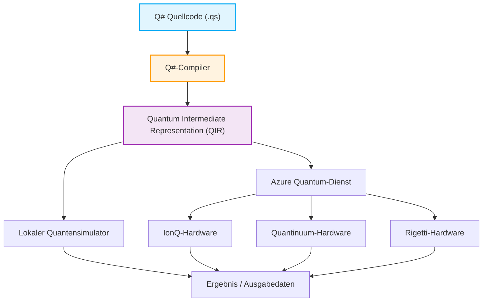

## 1. Einführung: Die Morgendämmerung des Quantencomputings und ein neues Programmierparadigma

In den letzten Jahren waren die technologischen Innovationen im Bereich Hardware und Software für Quantencomputing bemerkenswert. Während klassische Computer (die PCs, Smartphones, Supercomputer usw., die wir heute täglich nutzen) Informationen mit Kombinationen festgelegter Bits wie "0" oder "1" verarbeiten, nutzen Quantencomputer physikalische Phänomene, die für die Quantenmechanik spezifisch sind, wie "Superposition" (Überlagerung) und "Entanglement" (Quantenverschränkung), direkt als Grundlage für die Informationsverarbeitung. Dadurch wird das Potenzial aufgezeigt, Berechnungsgeschwindigkeiten für bestimmte Klassen von Problemen zu erreichen, die für klassische Computer selbst in einer Zeitspanne, die dem Alter des Universums entspricht, unerreichbar wären, d. h. "Quantum Supremacy" (Quantenüberlegenheit) oder "Quantum Advantage" (Quantenvorteil). Beispielsweise werden dramatische Reduzierungen des Rechenaufwands bei der Faktorisierung riesiger Zahlen (Shor-Algorithmus), der schnellen Suche in Datenbanken (Grover-Algorithmus), der quantenchemischen Simulation (VQE-Algorithmus), bei kombinatorischen Optimierungsproblemen und sogar bei bestimmten Prozessen des maschinellen Lernens (Quantum Machine Learning) erwartet.

Um dieses erstaunliche Potenzial von Quantencomputern in realen Anwendungen zu nutzen, reichen jedoch physikalische Hardware-Fortschritte (wie supraleitende Qubits oder Ionenfallen) allein nicht aus. Eine "Quantenprogrammiersprache" und eine robuste Entwicklungs-, Ausführungs- und Debugging-Umgebung sind unerlässlich, um Quantenschaltkreise präzise zu entwerfen und Quantenalgorithmen fehlerfrei und effizient zu beschreiben. Klassische Programmiersprachen (wie C++, Python, Java usw.) eignen sich hervorragend, um das Verhalten klassischer CPU-Architekturen zu abstrahieren, sie sind jedoch nicht dafür ausgelegt, die Operationen nichtdeterministischer Quantenzustände mit komplexen Amplituden auf natürliche Weise zu beschreiben.

In diesem Artikel konzentrieren wir uns unter den vielen Quantenprogrammierumgebungen auf das Quantum Development Kit (QDK), das von Microsoft stark vorangetrieben und als Open Source entwickelt wird, sowie auf die dedizierte Programmiersprache "Q#" (Q-Sharp), die sein Herzstück bildet.

Q# wurde von Grund auf als eine domänenspezifische Sprache (Domain Specific Language: DSL) entwickelt, die auf die Beschreibung von Quantenalgorithmen spezialisiert ist, und integriert dabei die besten Aspekte von C#, F# und Python. Es verfügt über leistungsstarke Funktionen, um den klassischen Kontrollfluss (wie if-Anweisungen und for-Schleifen) und Quantenoperationen (Anwendung von Gattern und Messungen) nahtlos zu integrieren. In diesem Artikel werden wir von den grundlegenden mathematischen Modellen des Quantencomputings ausgehen und eine sehr detaillierte Erklärung liefern, die die sprachlichen Merkmale von Q#, einen Vergleich der Designphilosophien mit Pythons Qiskit usw., den Aufbau und die Messung von "Bell-Zuständen" (Quantenverschränkung) mit tatsächlichem Code sowie die Methoden der Integration mit klassischen Sprachen (Python und C#) abdeckt. Wenn Sie diesen Artikel zu Ende gelesen haben, werden Sie die Grundlagen der Quantenprogrammierung verstehen und bereit sein, eigenen Q#-Code in Ihrer Umgebung zu schreiben.

## 2. Mathematische Grundlagen des Quantencomputings: Zustände, Superposition und Verschränkung

Um die Syntax und die Funktionen von Q# tiefgreifend zu verstehen und effektive Quantenprogramme zu schreiben, ist es zunächst notwendig, das grundlegende mathematische Wissen (insbesondere die lineare Algebra) hinter Quantenzuständen und Quanten-Gate-Operationen zu ordnen. Hier geben wir einen Überblick über die wesentlichen mathematischen Modelle, die für die Quantenprogrammierung erforderlich sind.

### 2.1 Quantenbits (Qubits) und Superpositionszustände

Während ein klassisches Bit (Classical Bit) nur den Zustand $0$ oder $1$ annehmen kann, wird ein Quantenbit (Qubit) als Linearkombination (Linear Combination) der Zustände $|0\rangle$ und $|1\rangle$, also als "Superposition" (Überlagerung), dargestellt. Dieser Zustand wird unter Verwendung der Bra-Ket-Notation (Dirac-Notation) und der komplexen Koeffizienten $\alpha$ und $\beta$ wie folgt beschrieben:

$$ |\psi\rangle = \alpha|0\rangle + \beta|1\rangle $$

Hierbei sind $\alpha$ und $\beta$ komplexe Zahlen (Complex Numbers), die Wahrscheinlichkeitsamplituden (Probability Amplitude) genannt werden. Die Wahrscheinlichkeit, bei einer Messung dieses Qubits den Zustand $|0\rangle$ zu beobachten, beträgt $|\alpha|^2$, und die Wahrscheinlichkeit, den Zustand $|1\rangle$ zu beobachten, beträgt $|\beta|^2$. Als physikalische Einschränkung muss die Summe der Wahrscheinlichkeiten zur Beobachtung aller möglichen Zustände immer $1$ betragen, weshalb die folgende Normierungsbedingung (Normalization Condition) erfüllt sein muss:

$$ |\alpha|^2 + |\beta|^2 = 1 $$

Der Zustand eines Qubits wird häufig visuell als Punkt auf der Oberfläche einer Einheitskugel in einem dreidimensionalen Raum dargestellt, die als "Bloch-Kugel" (Bloch Sphere) bezeichnet wird. Der Nordpol entspricht $|0\rangle$ und der Südpol $|1\rangle$, während Punkte auf dem Äquator Zustände darstellen, bei denen $|0\rangle$ und $|1\rangle$ mit gleicher Wahrscheinlichkeit überlagert sind (z. B. $|+\rangle = \frac{1}{\sqrt{2}}(|0\rangle + |1\rangle)$ für einen Zustand mit Phase 0 oder $|i\rangle = \frac{1}{\sqrt{2}}(|0\rangle + i|1\rangle)$ für Phase $\pi/2$). Operationen von Quantengattern können geometrisch als Rotationsoperationen auf dieser Bloch-Kugel verstanden werden.

### 2.2 Mehrere Qubits, Tensorprodukt und Quantenverschränkung

Die wahre Macht des Quantencomputings entfaltet sich, wenn mehrere Qubits miteinander kombiniert werden. Der Zustand eines Systems, das aus mehreren Qubits besteht, wird durch das "Tensorprodukt" (Tensor Product) der Zustandsräume der einzelnen Qubits beschrieben. Beispielsweise sieht der Gesamtzustand eines Systems, das aus zwei Qubits besteht, wie folgt aus:

$$ |\psi\rangle = \alpha_{00}|00\rangle + \alpha_{01}|01\rangle + \alpha_{10}|10\rangle + \alpha_{11}|11\rangle $$

Auch hier gilt die Normierungsbedingung $\sum_{i,j} |\alpha_{ij}|^2 = 1$. Der wichtige Punkt ist, dass zur vollständigen Beschreibung eines Systems von n Qubits $2^n$ komplexe Amplituden benötigt werden. Selbst für ein System von nur 50 Qubits werden zur Darstellung seines Zustands $2^{50} \approx 10^{15}$ komplexe Zahlen benötigt, was die Speicherkapazität der schnellsten Supercomputer der Welt bei weitem übersteigt. Dies ist einer der Gründe, warum Quantencomputer einen exponentiellen Vorteil gegenüber klassischen Computern haben.

"Quantenverschränkung" (Entanglement) bezeichnet in solchen Zuständen mehrerer Qubits einen Zustand, der nicht einfach als Tensorprodukt der Zustände der einzelnen Qubits zerlegt (faktorisiert) werden kann. Einer der bekanntesten und wichtigsten verschränkten Zustände ist der folgende "Bell-Zustand" (Bell State):

$$ |\Phi^+\rangle = \frac{1}{\sqrt{2}}(|00\rangle + |11\rangle) $$

In diesem Zustand wird, wenn eines der Qubits gemessen wird und man $0$ (oder $1$) erhält, der Zustand des anderen Qubits augenblicklich und unabhängig von der Entfernung ebenfalls auf $0$ (oder $1$) festgelegt. Diese nicht-lokale Korrelation, die Einstein als "spukhafte Fernwirkung" bezeichnete, ist eine grundlegende Ressource für Quantenteleportation, superdichte Kodierung, Quantenkryptographie und die effiziente Ausführung vieler Quantenalgorithmen. In späteren Abschnitten werden wir tatsächlich Q# verwenden, um diesen Bell-Zustand zu erzeugen.

### 2.3 Quanten-Gate-Operationen und unitäre Matrizen

Operationen, die Quantenzustände verändern (entsprechend den AND-, OR-, NOT-Gattern in klassischen Logikschaltungen), werden Quantengatter (Quantum Gates) genannt. Mathematisch werden Quantengatter als Matrizen aus komplexen Zahlen dargestellt, die durch Matrixmultiplikation auf den Vektor des Quantenzustands wirken. Gemäß den Axiomen der Quantenmechanik müssen diese Matrizen stets unitäre Matrizen (Unitary Matrix, Matrizen, die $U^\dagger U = I$ erfüllen, wobei $U^\dagger$ die adjungierte Matrix und $I$ die Einheitsmatrix ist) sein. Dadurch sind alle Quantenoperationen außer der Messung reversibel (Reversible).

Typische Einzel-Qubit-Gatter:
- **Pauli-X-Gatter (NOT-Gatter)**: Kehrt $|0\rangle$ in $|1\rangle$ um und $|1\rangle$ in $|0\rangle$.
$$ X = \begin{pmatrix} 0 & 1 \\ 1 & 0 \end{pmatrix} $$
- **Pauli-Z-Gatter (Phasenverschiebungs-Gatter)**: Belässt $|0\rangle$ unverändert und kehrt das Vorzeichen von $|1\rangle$ um (fügt der relativen Phase $\pi$ hinzu).
$$ Z = \begin{pmatrix} 1 & 0 \\ 0 & -1 \end{pmatrix} $$
- **Hadamard-Gatter (H-Gatter)**: Wandelt einen deterministischen Zustand in einen Superpositionszustand um.
$$ H = \frac{1}{\sqrt{2}} \begin{pmatrix} 1 & 1 \\ 1 & -1 \end{pmatrix} $$

Typische Zwei-Qubit-Gatter:
- **CNOT-Gatter (Controlled-NOT-Gatter)**: Wendet ein X-Gatter (NOT-Operation) auf das Ziel-Qubit (Target Qubit) nur dann an, wenn das Kontroll-Qubit (Control Qubit) $|1\rangle$ ist.
$$ CNOT = \begin{pmatrix} 1 & 0 & 0 & 0 \\ 0 & 1 & 0 & 0 \\ 0 & 0 & 0 & 1 \\ 0 & 0 & 1 & 0 \end{pmatrix} $$

Ein Quantenalgorithmus kann als das Design eines Prozesses verstanden werden, der diese grundlegenden unitären Matrizen kombiniert, um die gewünschte Berechnung durchzuführen.

## 3. Was ist das Microsoft Quantum Development Kit (QDK)?

Das von Microsoft angebotene Quantum Development Kit (QDK) ist ein umfassendes Toolset zur Unterstützung der Softwareentwicklung für das Quantencomputing. Es unterstützt den gesamten Entwicklungslebenszyklus vom Entwurf von Quantenalgorithmen über das Debugging und die Optimierung bis hin zur Ausführung auf Simulatoren oder realer Quantenhardware.

Das QDK enthält die folgenden Hauptelemente:

1. **Q#-Compiler und Laufzeitumgebung**: Analysiert und optimiert stark den in der Sprache Q# geschriebenen Code und wandelt ihn in ein Format (wie QIR) um, das auf einem Simulator oder tatsächlicher Quantenhardware (über Azure Quantum) ausgeführt werden kann. Der Q#-Compiler führt statische Analysen durch, die spezifisch für Quantenberechnungen sind, wie z. B. die Überprüfung der Reinheit von Funktionen und das Lebenszyklusmanagement von Qubits.
2. **Quantensimulator**: Enthält einen Full-State-Simulator, der die Entwicklung von Quantenzuständen auf der lokalen Maschine des Entwicklers simuliert. Dadurch können kleine Algorithmen im Umfang von einigen Dutzend Qubits lokal und schnell getestet und debuggt werden. Darüber hinaus wird ein Ressourcenschätzer (Resource Estimator) bereitgestellt, um die Ressourcenanforderungen für groß angelegte Schaltungen (Tausende bis Millionen von Qubits) abzuschätzen.
3. **Umfangreiche Bibliothek**: Die Q#-Standardbibliothek (Standard Library) stellt verschiedene fortschrittliche Bausteine zur Verfügung, die von grundlegenden Quantengattern (H, X, Y, Z, CNOT usw.) über komplexe arithmetische Operationen (wie Quanten-Addierer) bis hin zu Amplification-Algorithmen (Amplitude Amplification) und dem Quanten-Phasenschätzungs-Algorithmus (Quantum Phase Estimation) reichen. Dadurch wird verhindert, dass Entwickler das Rad neu erfinden müssen.
4. **Integration mit Entwicklungsumgebungen (IDE)**: Erweiterungen für Visual Studio und Visual Studio Code sind verfügbar, die wesentliche Funktionen für die moderne Softwareentwicklung bieten, wie Syntaxhervorhebung, Code-Vervollständigung (IntelliSense), leistungsstarkes Debugging und die Integration mit Test-Frameworks.

Im Folgenden sehen Sie ein Mermaid-Diagramm, das den Workflow von der Erstellung eines Q#-Programms bis zu dessen Ausführung auf der Hardware zeigt.



Das absolut Herausragende an dieser Architektur ist, dass sie durch eine LLVM-basierte Zwischendarstellung namens QIR (Quantum Intermediate Representation) die Unterschiede in den zugrunde liegenden Hardware-Architekturen (supraleitende Qubits, Ionenfallen, topologische Qubits, Photonen usw.) vollständig abstrahiert. Entwickler können sich auf das reine logische Design von Algorithmen konzentrieren, ohne sich um physikalische Hardware-Details (hardware-spezifische native Gatter-Sets und Topologien) kümmern zu müssen. Compiler-Pässe nach der QIR-Schicht führen automatisch eine auf die Ziel-Hardware optimierte Transpilierung von Gattern durch.

## 4. Q# vs. Python/Qiskit: Warum brauchen wir eine neue Sprache?

Wenn viele Menschen Quantenprogrammierung lernen, kommen sie aufgrund der Einfachheit und der großen Verbreitung von Python oft zuerst mit dem von IBM entwickelten Python-basierten Framework "Qiskit" in Berührung. Obwohl Qiskit ebenfalls ein sehr mächtiges und weit verbreitetes Werkzeug ist, unterscheidet sich seine grundlegende Designphilosophie (Paradigma) erheblich von Microsofts Q#.

### Qiskit-Ansatz (Aufbau von Schaltungsobjekten in Python)
Qiskit ist im Wesentlichen "eine Python-API-Bibliothek zum Aufbau von Quantenschaltkreisen". Wenn ein Entwickler ein Python-Skript ausführt, wird nach und nach eine Sequenz von Quantengattern (Schaltungsobjekt) im Speicher zusammengebaut. Nachdem alle Gatter hinzugefügt wurden, wird das massive Schaltungsobjekt am Ende an ein Backend (einen lokalen Simulator oder eine echte Maschine in der Cloud) zur Ausführung gesendet (Submit).
Dieser metaprogrammatische Ansatz hat den großen Vorteil, dass er sehr leicht mit dem bestehenden Python-Ökosystem (Machine-Learning-Bibliotheken wie NumPy, SciPy, PyTorch oder Visualisierungstools) integriert werden kann. Wenn es jedoch darum geht, einen komplexen Kontrollfluss zu beschreiben, der Klassisches und Quanten vermischt – zum Beispiel "messe ein Qubit und nur wenn das Ergebnis 1 ist, wende eine bestimmte komplexe unitäre Operation auf eine andere Qubit-Gruppe an und führe dann eine while-Schleife aus" –, können native Python-if-Anweisungen und -for-Schleifen nicht verwendet werden (weil sie während der "Schaltungserstellung" evaluiert würden). Es wird notwendig, spezifische Steuerungsbefehle von Qiskit zu verwenden, was den Code oft sehr komplex und unintuitiv macht.

### Q#-Ansatz (Quantum-First Domain-Specific Language)
Andererseits ist Q# eine eigenständige kompilierte Sprache, die von Grund auf entwickelt wurde, um die Quantenberechnung selbst als First-Class-Citizen (Bürger erster Klasse) zu behandeln. In Q# können Prozesse wie Qubit-Zuweisung, Gatter-Operationen und Messungen natürlich und nahtlos in derselben Codebasis beschrieben werden, mit demselben Gefühl wie bei klassischen Variablenoperationen, if-Anweisungen und Schleifenverarbeitungen.
Der Q#-Compiler analysiert den gesamten Code statisch und entscheidet, welche Teile auf klassischen Rechengeräten (Host-CPUs und Steuerelektronik) und welche auf Quanten-Koprozessoren (QPUs) ausgeführt werden sollen, und führt hochgradige Optimierungen durch. Dies erreicht eine höhere Modularität, Lesbarkeit, Wartbarkeit und Typsicherheit (Type Safety) bei der Implementierung großer und komplexer Quantenalgorithmen. Q# ist keine Sprache zum "Schreiben von Schaltungen", sondern zum "Schreiben von Algorithmen".

## 5. Q# Grundlagen der Syntax und vertiefende Betrachtung charakteristischer Konzepte

Die Syntax von Q# hat ein sehr elegantes Design, das eine Blockstruktur mit geschweiften Klammern `{}` aus C#, Elemente der funktionalen Programmierung aus F# und starke Typableitung kombiniert. Hier erklären wir detailliert die wichtigsten Schlüsselwörter und Konzepte zum tiefen Verständnis von Q#.

### 5.1 Strikte Unterscheidung zwischen `operation` und `function`
In Q# werden zwei Arten zur Definition von Verarbeitungsblöcken (Subroutinen) strikt unterschieden: `operation` und `function`. Dies leitet sich vom Konzept der "Reinheit" (Purity) in der funktionalen Programmierung ab.
- **`function`**: Eine reine Funktion, die nur deterministische (Deterministic) klassische Berechnungen durchführt. Wenn dieselben Eingabeparameter angegeben werden, wird immer das gleiche Ausgabeergebnis zurückgegeben, unabhängig davon, wie oft sie ausgeführt wird. Innerhalb einer `function` führen quantenmechanische Operationen (Operationen mit Nebenwirkungen) wie Qubit-Zuweisung, Anwendung von Gattern oder Messungen zu einem Kompilierungsfehler. Sie wird für mathematische Berechnungen von Funktionen, Datenumwandlungen usw. verwendet.
- **`operation`**: Eine nichtdeterministische (Non-deterministic) Routine, die Quantenberechnungen einschließt. Sie beinhaltet Qubit-Manipulationen oder Messungen, und selbst bei derselben Eingabe kann sich das Ergebnis aufgrund der probabilistischen Natur der Quantenmechanik (wie dem Kollaps der Wellenfunktion durch Messung) ändern. Alle wesentlichen Teile eines Quantenalgorithmus werden als `operation` definiert.

### 5.2 Der `Qubit`-Typ und Lebenszyklusmanagement mit dem Schlüsselwort `use`
In Q# werden Qubits als "undurchsichtige" (Opaque) Objekte des Typs `Qubit` behandelt. Es ist dem Entwickler absichtlich untersagt, die Wahrscheinlichkeitsamplituden ihres internen Zustands (zum Beispiel die Werte von $\alpha$ oder $\beta$) direkt aus dem Programm auszulesen oder zu überschreiben (dies entspricht dem "Messproblem" in physikalisch realen Quantensystemen). Die einzige Möglichkeit, mit Qubits zu interagieren, besteht darin, die bereitgestellten Quanten-Gate-Operationen oder Messfunktionen aufzurufen.

Um ein Qubit im Programm neu zuzuweisen (zu allozieren), wird das Schlüsselwort `use` verwendet (in älteren Versionen von Q# wurde dies `using` genannt). Der `use`-Block definiert klar den Gültigkeitsbereich und den Lebenszyklus des Qubits.
Als wichtige Regel gilt: Beim Verlassen des `use`-Blocks müssen alle darin zugewiesenen Qubits wieder vollständig in den Zustand $|0\rangle$ zurückgekehrt sein (andernfalls tritt eine Laufzeitausnahme auf). Dies ist ein starker Sicherheitsmechanismus in Q#, der die Wiederverwendung von Qubits sicherstellt und Speicherlecks verhindert.

### 5.3 Messung `M` und nützliches `MResetZ`
Die Messoperation (Measurement) zur Umwandlung eines Quantenzustands in klassische Information (0 oder 1) wird mit der grundlegenden Operation `M` durchgeführt. Das Messergebnis in der Z-Basis (Standardbasis) wird als Aufzählungstyp `Result` (Werte sind `Zero` oder `One`) zurückgegeben.
Wie bereits erwähnt, ist es jedoch erforderlich, dass sich ein Qubit beim Freigeben im Zustand $|0\rangle$ befindet. Wenn man einfach eine Messung `M` durchführt und das Ergebnis `One` war, ist das Qubit in den Zustand $|1\rangle$ kollabiert. Aus diesem Grund wird im praktischen Code sehr häufig eine praktische Standardoperation namens `MResetZ` verwendet, die den Zustand des Qubits unmittelbar nach der Messung zuverlässig auf $|0\rangle$ zurücksetzt.

### 5.4 Unveränderlichkeit von Variablen (Immutability) und `mutable`
In Q#, das stark von funktionaler Programmierung beeinflusst ist, sind standardmäßig alle Variablen unveränderlich (Immutable). Eine einmal mit dem Schlüsselwort `let` gebundene Variable kann ihren Wert danach nicht mehr ändern. Dies reduziert unbeabsichtigte Nebenwirkungen bei der Parallelverarbeitung oder in Quantenalgorithmen.
Wenn Sie eine Variable deklarieren müssen, deren Wert aktualisiert werden muss, z. B. als Schleifenzähler oder für akkumulative Berechnungen, müssen Sie explizit das Schlüsselwort `mutable` verwenden und zur Aktualisierung des Wertes das Schlüsselwort `set` nutzen.

## 6. Praxis: Einen Bell-Zustand (Quantenverschränkung) mit Q# erstellen und messen

Lassen Sie uns nun all das bisher gelernte Wissen zusammenführen und tatsächlich ein Programm schreiben, um mit Q# den im Mathematik-Abschnitt erklärten "Bell-Zustand" (Bell State) zu erstellen und ihn dann zu messen. Dies ist ein sehr wichtiger Schritt, der als das "Hello World" der Quantenprogrammierung bezeichnet werden kann.

### Design und Erklärung der Quantenschaltung
Die standardmäßigen Verfahren für Quantenschaltungen zur Erzeugung des Bell-Zustands $\frac{1}{\sqrt{2}}(|00\rangle + |11\rangle)$ sind wie folgt:
1. Bereiten Sie zwei Qubits $q_0$ und $q_1$ im Ausgangszustand $|00\rangle$ vor.
2. Wenden Sie ein Hadamard-Gatter ($H$-Gatter) auf $q_0$ an. Dadurch befindet sich $q_0$ in einem Superpositionszustand $\frac{1}{\sqrt{2}}(|0\rangle + |1\rangle)$, bei dem $|0\rangle$ und $|1\rangle$ gleich wahrscheinlich sind. Der Zustand des gesamten Systems zu diesem Zeitpunkt ist $\frac{1}{\sqrt{2}}(|0\rangle + |1\rangle) \otimes |0\rangle = \frac{1}{\sqrt{2}}(|00\rangle + |10\rangle)$.
3. Wenden Sie ein CNOT-Gatter (Controlled-NOT) an, wobei $q_0$ das Kontroll-Qubit (Control) und $q_1$ das Ziel-Qubit (Target) ist. Dadurch wird $q_1$ nur dann invertiert, wenn $q_0$ $|1\rangle$ ist. Infolgedessen bleibt der Zustand $|00\rangle$ als $|00\rangle$, während der Zustand $|10\rangle$ zu $|11\rangle$ wird. Der Endzustand des gesamten Systems wird somit zu $\frac{1}{\sqrt{2}}(|00\rangle + |11\rangle)$. Dies schließt die Erzeugung des verschränkten Zustands mit perfekter Korrelation ab.

### Implementierungscode mit Q#

Der folgende Code ist ein praktisches Implementierungsbeispiel, das Q# verwendet, um einen Bell-Zustand zu erzeugen, das Messexperiment eine bestimmte Anzahl von Malen zu wiederholen und seine Statistik (Wahrscheinlichkeitsverteilung) zu erhalten.

```qsharp
namespace Quantum.BellState {
    
    // Importieren Sie die benötigten Namespaces
    open Microsoft.Quantum.Intrinsic;
    open Microsoft.Quantum.Canon;
    open Microsoft.Quantum.Measurement;
    open Microsoft.Quantum.Diagnostics;

    /// # Summary
    /// Generiert einen einzelnen Bell-Zustand und misst zwei Qubits in der Z-Basis.
    ///
    /// # Output
    /// (Result, Result): Messergebnisse von qubit1 und qubit2. Bei einem Bell-Zustand stimmen diese immer überein.
    operation GenerateAndMeasureBellState() : (Result, Result) {
        
        // Weisen Sie 2 Qubits zu (der Anfangszustand ist automatisch |00>)
        use (q1, q2) = (Qubit(), Qubit());
        
        // Wenden Sie das Hadamard-Gatter auf q1 an, um einen Superpositionszustand zu erzeugen
        H(q1);
        
        // Wenden Sie das CNOT-Gatter an, wobei q1 das Kontroll-Qubit und q2 das Ziel-Qubit ist
        // Dies erzeugt eine Quantenverschränkung (Entanglement) zwischen q1 und q2
        CNOT(q1, q2);
        
        // Als Debugging während der Entwicklung können Sie den Zustandsvektor im Simulator dumpen, um ihn zu überprüfen
        // DumpMachine(); // Bei Bedarf einkommentieren
        
        // Führen Sie die Messung durch und setzen Sie den Zustand gleichzeitig auf |0> zurück, um die Qubits sicher freizugeben
        let res1 = MResetZ(q1);
        let res2 = MResetZ(q2);
        
        // Geben Sie das Paar der Messergebnisse zurück
        return (res1, res2);
    }

    /// # Summary
    /// Die Hauptroutine, die das Experiment zur Erzeugung und Messung des Bell-Zustands mehrmals ausführt und die Statistik der Ergebnisse sammelt.
    ///
    /// # Input
    /// ## count
    /// Die Anzahl der Wiederholungen des Experiments (z.B.: 1000 Mal)
    ///
    /// # Output
    /// (Int, Int, Int, Int): Die Häufigkeit, mit der jeweils (00, 01, 10, 11) beobachtet wurde
    @EntryPoint()
    operation RunBellStateExperiment(count: Int) : (Int, Int, Int, Int) {
        
        // Initialisieren Sie veränderbare (mutable) Variablen, um die Beobachtungshäufigkeit zu zählen
        mutable num00 = 0;
        mutable num01 = 0;
        mutable num10 = 0;
        mutable num11 = 0;

        // Führen Sie die Experimentierschleife in der angegebenen Anzahl aus
        for _ in 1..count {
            // Erzeugen Sie den Bell-Zustand und erhalten Sie die Messergebnisse
            let (r1, r2) = GenerateAndMeasureBellState();
            
            // Zählen Sie die Ergebnismuster hoch
            if r1 == Zero and r2 == Zero {
                set num00 += 1;
            } elif r1 == Zero and r2 == One {
                set num01 += 1;
            } elif r1 == One and r2 == Zero {
                set num10 += 1;
            } else { // Fall r1 == One und r2 == One
                set num11 += 1;
            }
        }

        // Geben Sie die gesammelten Statistiken als Nachrichten auf der Konsole aus
        Message($"--- Experiment Results ---");
        Message($"Total runs: {count}");
        Message($"00 observed: {num00}");
        Message($"01 observed: {num01}");
        Message($"10 observed: {num10}");
        Message($"11 observed: {num11}");

        return (num00, num01, num10, num11);
    }
}
```

### Codeerklärung und Funktionsprüfung
- `namespace`: Wie in Java oder C# handelt es sich hierbei um eine Namespace-Deklaration, um das Programm logisch zu strukturieren und Namenskonflikte zu vermeiden.
- `open`: Importiert die benötigten Bibliotheken (Module). `Microsoft.Quantum.Intrinsic` enthält grundlegende Quantengatter wie H, X, Y, Z und CNOT, und `Microsoft.Quantum.Measurement` enthält praktische messbezogene Funktionen wie `MResetZ`.
- `use (q1, q2) = (Qubit(), Qubit());`: Weist dynamisch 2 Qubits zu.
- `H(q1); CNOT(q1, q2);`: Diese zwei Zeilen sind der Kernbestandteil, der genau die Quantenverschränkung erzeugt. Sie sind sehr einfach und intuitiv geschrieben.
- `let res1 = MResetZ(q1);`: Wie zuvor beschrieben, bindet `MResetZ` das Messergebnis an eine Variable und erzwingt gleichzeitig, dass der Zustand des Qubits auf $|0\rangle$ zurückgesetzt wird. Dadurch können die Qubits am Ende des `use`-Blocks sicher freigegeben werden.
- `@EntryPoint()`: Durch Hinzufügen dieses Attributs wird dem Compiler signalisiert, dass diese Operation der Startpunkt der Programmausführung ist (ähnlich der main-Funktion in C).

Da der generierte Zustand theoretisch der Bell-Zustand $\frac{1}{\sqrt{2}}(|00\rangle + |11\rangle)$ ist, sollten, wenn dieses Programm ausreichend oft (z. B. 10.000 Mal) ausgeführt wird, `00` und `11` jeweils zu etwa 50 % (ca. 5.000 Mal) beobachtet werden, und `01` sowie `10` sollten 0 Mal beobachtet werden (bei Abwesenheit theoretischer Fehler überhaupt nicht beobachtet werden). Dies ist der Beweis, dass die beiden Qubits stark korreliert (verschränkt) sind.

## 7. Nahtlose Integration mit Host-Sprachen (Python / C#)

Wie im vorherigen Beispiel gezeigt, kann Q# unabhängig als Standalone-Anwendung mit `@EntryPoint()` ausgeführt werden. In realen Anwendungsfällen der Unternehmensentwicklung oder Forschung wird es jedoch in enger Kombination mit klassischen Verarbeitungen verwendet, wie z. B. Front-End-GUIs, Datenabruf aus riesigen Datenbanken oder Optimierungsschleifen für maschinelles Lernen (z. B. Aktualisierung von VQE-Parametern). Daher bietet Q# eine ausgefeilte Interoperabilität (Interoperability), die den direkten Aufruf und die Ausführung aus Host-Sprachen wie Python und C# (.NET) extrem einfach macht.

### 7.1 Beispiel für den Aufruf von Python aus: Für Data Scientists
Um Q# aus Python aufzurufen, das in der Welt der Datenwissenschaft, des maschinellen Lernens und der physikalischen Forschung eine überwältigende Marktstellung hat, verwendet man das Python-Paket `qsharp`. Es hat eine hohe Affinität zu Jupyter Notebooks und ist ideal für die Kombination mit interaktiver Entwicklung und Datenvisualisierung.

```python
# 1. Importieren Sie das benötigte Q#-Integrationsmodul
import qsharp

# 2. Importieren Sie Q#-Operationen direkt so, als wären sie Python-Funktionen
# (Der Compiler kümmert sich im Hintergrund automatisch um das Binding und die Kompilierung)
from Quantum.BellState import RunBellStateExperiment

# 3. Aufruf und Ausführung aus einem Python-Skript (Verwendung eines Simulators)
count = 1000
print(f"Starting quantum simulation for {count} iterations...")

# Durch Aufruf der simulate() Methode wird es auf dem lokalen Simulator ausgeführt
result = RunBellStateExperiment.simulate(count=count)

# Erhalten Sie das Tupel der Ergebnisse, formatieren und geben Sie es auf der Python-Seite aus
print("\n--- Simulation Results ---")
print(f"|00> : {result[0]} (Expected ~500)")
print(f"|01> : {result[1]} (Expected 0)")
print(f"|10> : {result[2]} (Expected 0)")
print(f"|11> : {result[3]} (Expected ~500)")
```
Dadurch, dass der Q#-Compiler und -Interpreter im Hintergrund transparent über eine C-API dynamisch Bindings generieren, können Quantenalgorithmen auf der Python-Code-Seite einfach als Blackbox-Funktionen behandelt und hybride Algorithmen aus klassischem und Quantencode extrem leicht erstellt werden.

### 7.2 Beispiel für den Aufruf von C# aus: Für die Unternehmensentwicklung
Genauso ist es möglich, Q#-Code aus C# zu integrieren, das bei der Entwicklung groß angelegter Backend-Systeme und Enterprise-Anwendungen sehr leistungsstark ist. Durch die Platzierung eines Q#-Projekts (.csproj) und eines C#-Projekts innerhalb derselben Solution und das Festlegen einer Referenzbeziehung wird während des Build-Prozesses automatisch ein C#-Klassen-Wrapper generiert.

```csharp
using System;
using System.Threading.Tasks;
using Microsoft.Quantum.Simulation.Simulators; // Namespace für Quantensimulatoren
using Quantum.BellState; // Namespace, der in Q# definiert wurde

namespace QuantumRunner
{
    class Program
    {
        static async Task Main(string[] args)
        {
            // Erstellt eine Instanz eines Full-State-Quantensimulators
            // Da es IDisposable implementiert, wird die Ressourcenverwaltung mit einem using-Statement korrekt gehandhabt
            using var sim = new QuantumSimulator();
            
            long count = 1000;
            Console.WriteLine($"Running {count} iterations of Bell State generation...");

            // Führt die Q#-Operation asynchron aus. Die Run-Methode wird automatisch generiert.
            // Übergeben Sie sim als Ausführungsziel und count als Argument.
            var result = await RunBellStateExperiment.Run(sim, count);

            // Die Ergebnisse werden als C# ValueTuple zurückgegeben
            Console.WriteLine($"|00>: {result.Item1}");
            Console.WriteLine($"|01>: {result.Item2}");
            Console.WriteLine($"|10>: {result.Item3}");
            Console.WriteLine($"|11>: {result.Item4}");
        }
    }
}
```
Hier verwenden wir zu Entwicklungszwecken die lokale `QuantumSimulator`-Klasse, aber beim Wechsel in eine Produktionsumgebung muss lediglich der Teil der Instanzerstellung dieses Simulators durch einen Cloud-Zielprovider (z. B. Maschinenobjekte von IonQ oder Quantinuum) ersetzt werden, der auf einen Azure-Quantum-Arbeitsbereich verweist. Es wird möglich, Algorithmen auf echter Quantenhardware in der Cloud auszuführen, ohne den Q#-Code oder die Geschäftslogik ändern zu müssen. Dies ist der wahre Wert des QDK.

## 8. Fortgeschrittene Themen: Funktionen, die die Designphilosophie von Q# verkörpern

Wir haben die grundlegende Verwendung von Q# betrachtet, aber lassen Sie uns nun ein wenig tiefer in die fortgeschritteneren Funktionen von Q# und die zugrunde liegende Designphilosophie eintauchen. Diese Funktionen sind genau das, was Q# zu einer echten domänenspezifischen Sprache für Quanten macht und mehr als nur eine "Alternative zu Python" ist.

### 8.1 Automatische Generierung von umgekehrten Operationen (Adjoint) und kontrollierten Operationen (Controlled)
Eines der Hauptmerkmale der Quantenberechnung ist die "Reversibilität" (Reversibility), die aus der Unitarität (Unitarity) abgeleitet ist. Alle grundlegenden Operationen außer der Messung sind unitäre Matrizen, daher existiert immer eine inverse Matrix (umgekehrte Operation) und sie können rückgängig gemacht werden. In Q# werden leistungsstarke Funktor-Modifikatoren bereitgestellt, die als First-Class-Funktionen auf Sprachebene unterstützt werden: `Adjoint` (Adjungierte/Umgekehrte Operation) und `Controlled` (Kontrollierte Operation).

Für eine Quantenoperation `Op` müssen Sie die entgegengesetzte Operation (die Operation zum Rückgängigmachen) nicht manuell durch Berechnen von Matrizen oder Umkehren der Gatterreihenfolge implementieren. Durch das bloße Hinzufügen bestimmter Schlüsselwörter zur Signatur der Funktion generiert der Q#-Compiler automatisch `Adjoint Op`. In ähnlicher Weise kann auch eine bedingte Operation `Controlled Op`, die `Op` nur dann ausführt, wenn eine bestimmte Gruppe von Qubits alle $|1\rangle$ ist, automatisch generiert werden.

```qsharp
// Durch Hinzufügen von is Adj + Ctl weisen wir den Compiler an, automatisch umgekehrte und kontrollierte Operationen zu generieren
operation MyComplexSubroutine(qubits: Qubit[]) : Unit is Adj + Ctl {
    // Hier wird eine sehr komplexe Sequenz von Quantengattern beschrieben
    // Beispiel: Eine Kombination aus H, T, CNOT, beliebigen Phasenverschiebungen usw.
    // ...
}

// Beispiel für den Aufrufer
operation UseMyOp(controlQubit: Qubit, targetQubits: Qubit[]) : Unit {
    
    // Normaler Aufruf
    MyComplexSubroutine(targetQubits);
    
    // Ausführen der umgekehrten Operation: Den ursprünglichen Zustand vollständig wiederherstellen (sehr nützlich für Uncomputation)
    Adjoint MyComplexSubroutine(targetQubits);
    
    // Ausführen einer kontrollierten Operation: Die komplexe Subroutine wird nur ausgeführt, wenn controlQubit |1> ist
    Controlled MyComplexSubroutine([controlQubit], targetQubits);
    
    // Darüber hinaus ist eine Kombination wie die Umkehrung einer kontrollierten Operation möglich!
    Controlled Adjoint MyComplexSubroutine([controlQubit], targetQubits);
}
```
Mit dieser Funktion wird die Implementierung fortschrittlicher Algorithmen, die häufig komplexe Unterroutinen und deren Umkehrungen (Uncomputation zum Lösen unerwünschter Verschränkungen) verwenden, wie etwa Orakelimplementierungen in Grovers Suchalgorithmus oder in Shors Faktorisierungsalgorithmus, drastisch vereinfacht, wodurch der Spielraum für menschliche Fehler oder Bugs deutlich verringert wird. Dies kann als eine der größten Stärken von Q# als Sprache zur Beschreibung von Algorithmen bezeichnet werden, insbesondere im Vergleich zu Frameworks zum Aufbau von Schaltungen wie Qiskit.

### 8.2 Ressourcenschätzung (Resource Estimation) und die Vorbereitung auf die Zukunft
Aktuelle Quantencomputer befinden sich in einer Entwicklungsphase, die "NISQ (Noisy Intermediate-Scale Quantum)" genannt wird, bei der die Anzahl der verfügbaren Qubits mit wenigen Dutzend bis Hunderten gering und die Fehlerrate hoch ist. Wenn wir jedoch auf die Ära der zukünftigen fehlertoleranten Quantencomputer (FTQC: Fault-Tolerant Quantum Computer) blicken, wird es enorm wichtig, genau im Voraus abzuschätzen: "Wie viele logische Qubits werden benötigt, um einen neuen Algorithmus auszuführen?", "Wie oft werden T-Gatter und Toffoli-Gatter verwendet, deren Fehlerkorrekturkosten sehr hoch sind?" und "Wie lang wird die Ausführungszeit sein?".

Das QDK enthält einen "Resource Estimator" als eines der Ausführungsziele. Mit diesem können die logischen Pfade des Codes analysiert und die Ressourcenanforderungen für große Algorithmen sofort berechnet und ausgegeben werden, ohne dass der Code auf einer echten Maschine oder einem schwerfälligen Full-State-Simulator ausgeführt werden muss. Dadurch wird es für Algorithmenentwickler und Forscher möglich, schnell Iterationen für die Optimierung nicht nur der theoretischen Komplexität, sondern auf der Ebene der konkreten Gatteranzahl durchzuführen, selbst bei zukünftigen Algorithmen, die Tausende oder Zehntausende von Qubits erfordern.

## 9. Schlusswort: Erwartungen an die nächste Generation von Software-Ingenieuren

Das Quantencomputing geht rasant von rein theoretischen Konzepten im Kopf von Physikern wie Einstein, Schrödinger und Feynman in einen konkreten Implementierungsbereich der Technik über, auf den heute über Cloud-Infrastrukturen (Azure Quantum, AWS Braket, IBM Quantum usw.) von jedermann auf der Welt via Browser oder Kommandozeile zugegriffen werden kann. Die Evolutionsgeschwindigkeit der Hardware ist erstaunlich, und viele Experten sagen voraus, dass der Tag, an dem ein "nützlicher" Quantenvorteil bewiesen wird, in wenigen Jahren kommen wird.

Die in diesem Artikel vorgestellte Microsoft Q#-Sprache hat hervorragende Praktiken, die über Jahrzehnte in der Welt der klassischen Programmierung kultiviert wurden (starke Typisierung, funktionale Programmierelemente, Modularisierung, Kapselung, erweiterte IDE-Unterstützung), wunderbar in die völlig neue Welt der Quantenprogrammierung eingebracht. Beim Lernen von Q# und dem Implementieren von Quantenalgorithmen können wir tiefe Einblicke gewinnen, die auf die Fundamente der Informatik und Physik zurückgehen, wie "Was ist ein Zustand?", "Was ist eine Beobachtung?" und "Wie breitet sich Information im Raum aus?". Das ist mehr als nur eine Kompetenzentwicklung – es ist eine zutiefst intellektuell aufregende Erfahrung.

In naher Zukunft, genau wie Machine-Learning-Ingenieure heute auf ganz natürliche Weise PyTorch und TensorFlow nutzen, um die parallelen Rechenkapazitäten von GPUs voll auszuschöpfen, wird sicherlich die Zeit kommen, in der "Quantum Software Engineers" der nächsten Generation Q# und Qiskit nutzen, um die transzendentale Rechenleistung von QPUs (Quantum Processing Units) abzurufen und sich Herausforderungen in menschheitlichem Maßstab zu stellen, wie die Entdeckung neuer Materialien durch Materialwissenschaft, Molekularsimulationen in der Arzneimittelforschung, Klimawandelmodellierung und Risikooptimierung in der Finanzwelt.

Selbst wenn Sie ein Softwareentwickler sind, der derzeit hauptsächlich mit klassischen Webanwendungen, mobilen Apps oder Datenanalysen arbeitet, bitten wir Sie, diese Gelegenheit zu nutzen, um die Welt der Quantenprogrammierung zu betreten. Anfangs mögen die für die Quantenmechanik typischen Phänomene (Superposition, Verschränkung, probabilistisches Verhalten) kontraintuitiv wirken. Aber eine ausgeklügelte dedizierte Sprache wie Q# und eine leistungsstarke Toolchain wie das QDK werden Ihre Lernkurve sicherlich stark unterstützen.

## 10. Links für weiteres Lernen

Hier sind einige großartige Ressourcen, um Ihre Reise in die Quantenprogrammierung fortzusetzen:

- [Offizielle Microsoft Azure Quantum Dokumentation](https://learn.microsoft.com/azure/quantum/) : Ein umfassendes Dokumentationsportal für das QDK und Azure Quantum.
- [Q# Benutzerhandbuch und Referenz](https://learn.microsoft.com/azure/quantum/user-guide/) : Eine vollständige Referenz für die Q#-Syntax, das Typsystem und die Standardbibliotheken.
- [Quantum Katas](https://quantum.microsoft.com/en-us/experience/quantum-katas) : Eine Sammlung von Open-Source-Tutorials, die von Microsoft bereitgestellt werden. Es ist eine hervorragende Ressource, um die grundlegenden Konzepte des Quantencomputings (Quantengatter, Messungen, Konstruktion von Algorithmen) im Format der testgetriebenen Entwicklung (TDD) interaktiv und beim Schreiben von Q#-Code selbst zu lernen.
- [Q# GitHub-Repository](https://github.com/microsoft/qsharp-compiler) : Der Q#-Sprachcompiler und die Standardbibliothek selbst werden ebenfalls aktiv als Open Source entwickelt. Ein Muss für alle, die sich für die internen Mechanismen des Compilers interessieren.

Die Zukunft des Quantencomputings hat gerade erst begonnen und ist voller endloser Möglichkeiten. Fordern Sie sich mit dem Programmieren in Q# heraus und bewahren Sie sich dabei den Spaß an neuen Programmierparadigmen!
