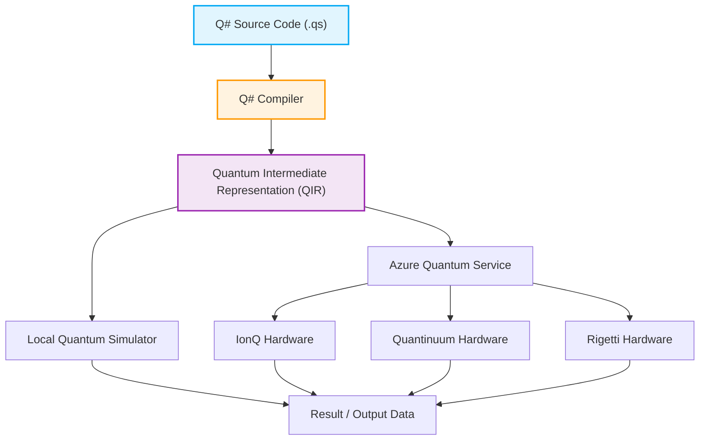

## 1. Introduction: The Dawn of Quantum Computing and a New Paradigm of Programming

In recent years, technological innovations in hardware and software in the field of quantum computing have been remarkable. While classical computers (such as the PCs, smartphones, and supercomputers we use daily) process information using combinations of deterministic bits that are either "0" or "1", quantum computers directly utilize physical phenomena unique to quantum mechanics, such as "Superposition" and "Entanglement", as the foundation of information processing. This has shown the potential to achieve computational speeds for specific classes of problems that would be unreachable for classical computers even over the lifespan of the universe, a concept known as "Quantum Supremacy" or "Quantum Advantage". For example, dramatic reductions in computational complexity are expected in areas like factoring enormous numbers (Shor's algorithm), high-speed database searches (Grover's algorithm), quantum chemistry simulations (VQE algorithm), combinatorial optimization problems, and even specific processes in machine learning (Quantum Machine Learning).

However, in order to draw out this astonishing potential of quantum computers as real-world applications, advances in physical hardware (such as superconducting qubits and ion traps) alone are not enough. A "quantum programming language" to accurately design quantum circuits and describe quantum algorithms flawlessly and efficiently, along with a robust development, execution, and debugging environment to support it, are indispensable. Classical programming languages (like C++, Python, Java, etc.) excel at abstracting the behavior of classical CPU architectures but were not designed to naturally describe the manipulation of non-deterministic quantum states with complex amplitudes.

In this article, among the many quantum programming environments, we will focus on the "Quantum Development Kit (QDK)", which is strongly promoted and developed as open-source by Microsoft, and its core, the dedicated programming language "Q#".

Q# was designed from scratch as a Domain Specific Language (DSL) specialized for describing quantum algorithms, absorbing the best parts of C#, F#, and Python. It features powerful capabilities that seamlessly integrate classical control flow (like if statements and for loops) with quantum operations (like applying gates and measurements). In this article, starting from the foundational mathematical models of quantum computing, we will thoroughly and deeply explain the linguistic features of Q#, comparisons of design philosophies with Python's Qiskit, the actual coding to construct and measure a "Bell State (quantum entanglement)", and even methods of integration with classical languages (Python and C#). By the time you finish reading this article, you will have understood the basics of quantum programming and be ready to start writing Q# code in your own environment.

## 2. Mathematical Foundations of Quantum Computing: State, Superposition, and Entanglement

To deeply understand the syntax and features of Q# and write effective quantum programs, you first need to organize the mathematical foundational knowledge (especially linear algebra) behind quantum states and quantum gate operations. Here, we will overview the fundamental mathematical models essential for quantum programming.

### 2.1 Qubits and Superposition States

While a Classical Bit can only take one of the states $0$ or $1$, a quantum bit (Qubit) is represented as a Linear Combination, or "superposition", of the states $|0\rangle$ and $|1\rangle$. Using bra-ket notation (Dirac notation) and complex coefficients $\alpha$ and $\beta$, this state is described as follows:

$$ |\psi\rangle = \alpha|0\rangle + \beta|1\rangle $$

Here, $\alpha$ and $\beta$ are Complex Numbers called Probability Amplitudes, and when this qubit is measured, the probability of observing the state $|0\rangle$ is $|\alpha|^2$, and the probability of observing the state $|1\rangle$ is $|\beta|^2$. As a physical constraint, the sum of the probabilities of observing all possible states must always be $1$, so the following Normalization Condition must be satisfied:

$$ |\alpha|^2 + |\beta|^2 = 1 $$

The state of a qubit is often visualized as a point on the surface of a unit sphere in 3D space called the "Bloch Sphere". The north pole corresponds to $|0\rangle$ and the south pole to $|1\rangle$, while points on the equator represent states where $|0\rangle$ and $|1\rangle$ are superposed with equal probability (for example, the state with phase 0, $|+\rangle = \frac{1}{\sqrt{2}}(|0\rangle + |1\rangle)$, or the state with phase $\pi/2$, $|i\rangle = \frac{1}{\sqrt{2}}(|0\rangle + i|1\rangle)$). Operations of quantum gates can be geometrically understood as rotation operations on this Bloch sphere.

### 2.2 Multiple Qubits, Tensor Products, and Quantum Entanglement

The true power of quantum computing is unleashed when multiple qubits are combined. The state of a system consisting of multiple qubits is described by the "Tensor Product" of the state spaces of the individual qubits. For instance, the overall state of a two-qubit system looks like this:

$$ |\psi\rangle = \alpha_{00}|00\rangle + \alpha_{01}|01\rangle + \alpha_{10}|10\rangle + \alpha_{11}|11\rangle $$

Here again, the normalization condition $\sum_{i,j} |\alpha_{ij}|^2 = 1$ holds. The important point is that to fully describe a system of n qubits, $2^n$ complex amplitudes are required. For example, even for a system of just 50 qubits, representing its state requires $2^{50} \approx 10^{15}$ complex numbers, which far exceeds the memory capacity of today's fastest supercomputers. This is one of the reasons why quantum computers have an exponential advantage over classical computers.

"Quantum Entanglement" refers to a state in such multi-qubit systems that cannot be simply decomposed (factored) as a tensor product of the states of individual qubits. One of the most famous and important entangled states is the following "Bell State":

$$ |\Phi^+\rangle = \frac{1}{\sqrt{2}}(|00\rangle + |11\rangle) $$

In this state, the moment one of the qubits is measured and yields $0$ (or $1$), the state of the other qubit is instantaneously determined to be $0$ (or $1$), regardless of distance. This non-local correlation, which Einstein called "spooky action at a distance", is a fundamental resource in quantum teleportation, superdense coding, quantum cryptography, and the efficient execution of many quantum algorithms. In later sections, we will actually create this Bell state using Q#.

### 2.3 Quantum Gate Operations and Unitary Matrices

Operations that change quantum states (equivalent to AND, OR, and NOT gates in classical logic circuits) are called quantum gates. Mathematically, a quantum gate is represented as a matrix of complex numbers and acts as a matrix multiplication on the vector of the quantum state. According to the axioms of quantum mechanics, these matrices must always be Unitary Matrices (matrices satisfying $U^\dagger U = I$, where $U^\dagger$ is the adjoint matrix and $I$ is the identity matrix). Consequently, all quantum operations other than measurements are Reversible.

Typical single-qubit gates:
- **Pauli-X Gate (NOT Gate)**: Flips $|0\rangle$ to $|1\rangle$ and $|1\rangle$ to $|0\rangle$.
$$ X = \begin{pmatrix} 0 & 1 \\ 1 & 0 \end{pmatrix} $$
- **Pauli-Z Gate (Phase Shift Gate)**: Leaves $|0\rangle$ unchanged and flips the sign of $|1\rangle$ (adds $\pi$ to the relative phase).
$$ Z = \begin{pmatrix} 1 & 0 \\ 0 & -1 \end{pmatrix} $$
- **Hadamard Gate (H Gate)**: Converts deterministic states into superposition states.
$$ H = \frac{1}{\sqrt{2}} \begin{pmatrix} 1 & 1 \\ 1 & -1 \end{pmatrix} $$

Typical two-qubit gates:
- **CNOT Gate (Controlled-NOT Gate)**: Applies an X gate (NOT operation) to the Target Qubit only when the Control Qubit is $|1\rangle$.
$$ CNOT = \begin{pmatrix} 1 & 0 & 0 & 0 \\ 0 & 1 & 0 & 0 \\ 0 & 0 & 0 & 1 \\ 0 & 0 & 1 & 0 \end{pmatrix} $$

Quantum algorithms can be said to be the design of processes that combine these basic unitary matrices to realize a desired computation.

## 3. What is the Microsoft Quantum Development Kit (QDK)?

The Quantum Development Kit (QDK) provided by Microsoft is a comprehensive toolset designed to support the software development of quantum computing. It supports the entire development lifecycle, from designing, debugging, and optimizing quantum algorithms, to executing them on simulators or actual hardware.

The QDK includes the following key elements:

1. **Q# Compiler and Execution Environment**: It heavily analyzes and optimizes code written in the Q# language, transforming it into formats (like QIR) executable on simulators or actual quantum hardware (via Azure Quantum). The Q# compiler performs static analysis specific to quantum computation, such as checking function purity and managing the lifecycle of qubits.
2. **Quantum Simulator**: It includes a Full State Simulator that simulates the evolution of quantum states on the developer's local machine. This allows you to rapidly test and debug small-scale algorithms up to a few dozen qubits locally. Additionally, a Resource Estimator is provided to estimate resource requirements for large-scale circuits (thousands to millions of qubits).
3. **Rich Libraries**: The Q# Standard Library offers various advanced building blocks, ranging from basic quantum gates (H, X, Y, Z, CNOT, etc.) to complex arithmetic operations (like quantum adders), Amplitude Amplification, and Quantum Phase Estimation algorithms. This saves developers from reinventing the wheel.
4. **Integrated Development Environment (IDE) Integration**: Extensions for Visual Studio and Visual Studio Code are provided, allowing you to use indispensable features for modern software development, such as syntax highlighting, code completion (IntelliSense), powerful debugging tools, and integration with testing frameworks.

Below is a Mermaid diagram showing the workflow from writing a Q# program to its execution on hardware.



The extremely brilliant part of this architecture is that by going through an LLVM-based intermediate representation called QIR (Quantum Intermediate Representation), it completely abstracts away the differences in underlying hardware architectures (superconducting qubits, ion traps, topological qubits, photonic quantum, etc.). Developers can focus entirely on the pure logical design of their algorithms without worrying about the physical details of the hardware (the specific native gate sets and topology of each hardware). The compiler passes beyond the QIR layer automatically perform transpilation of gates optimized for the target hardware.

## 4. Q# vs Python/Qiskit: Why Do We Need a New Language?

When learning quantum programming, due to its accessibility and the widespread use of Python, many people first interact with "Qiskit", a Python-based framework developed by IBM. Qiskit is an incredibly powerful and widely used tool, but its fundamental design philosophy (paradigm) differs greatly from Microsoft's Q#.

### The Qiskit Approach (Building Circuit Objects with Python)
Qiskit is essentially a "Python API library for building quantum circuits". As developers execute a Python script, a sequence of quantum gates (a circuit object) is gradually assembled in memory. After adding all the gates, you finally Submit that massive circuit object to a backend (a local simulator or an actual machine on the cloud) for execution.
This metaprogramming-like approach has the major advantage of being extremely easy to integrate with the existing Python ecosystem (machine learning libraries like NumPy, SciPy, PyTorch, and visualization tools). However, when expressing complex control flows where classical and quantum elements are mixed—for instance, Dynamic Circuits like "measure a qubit, and only if the result is 1, apply a specific complex unitary operation to another group of qubits, and run a while loop"—you cannot use Python's native if statements or for loops (because they get evaluated during "circuit construction time"). You end up having to use Qiskit's own special control instructions, making the code highly complex and unintuitive.

### The Q# Approach (A Quantum-First Domain Specific Language)
On the other hand, Q# is a standalone compiled language designed from the ground up to treat quantum computation itself as a First-class citizen. In Q#, you can describe quantum bit allocation, gate operations, and measurements naturally and seamlessly within the same codebase, with the exact same feel as classical variable operations, if statements, and loops.
The Q# compiler statically analyzes the entire code, determines which parts should run on a classical computing device (host CPU or control electronics) and which parts on a quantum coprocessor (QPU), and performs heavy optimization. This allows for higher modularity, readability, maintainability, and Type Safety when implementing large-scale and complex quantum algorithms. Q# is a language not for "writing circuits", but for "writing algorithms".

## 5. Deep Dive into Q#'s Basic Syntax and Distinctive Concepts

The syntax of Q# is a highly refined design, resembling a combination of the block structure using C#'s curly braces `{}`, the elements of functional programming from F#, and powerful type inference. Here, we will detail the important keywords and concepts necessary for a deep understanding of Q#.

### 5.1 Strict Distinction Between `operation` and `function`
In Q#, `operation` and `function` are strictly separated to define blocks of processing (subroutines). This stems from the concept of "Purity" in functional programming.
- **`function`**: A pure function that performs only Deterministic classical computation. Given the same input parameters, it will always return the exact same output result, no matter how many times it is executed. Inside a `function`, quantum operations (operations with side effects) such as qubit allocation, gate application, or measurement will result in a compile error. It is used for mathematical function calculations and data transformations.
- **`operation`**: A non-deterministic routine that includes quantum computation. It involves qubit manipulation and measurements, meaning that even with the same input, the result may vary due to the probabilistic nature of quantum mechanics (like the collapse of the wave function upon measurement). The core parts of a quantum algorithm are all defined as `operation`s.

### 5.2 The `Qubit` Type and Lifecycle Management with the `use` Keyword
In Q#, qubits are treated as "Opaque" objects of the `Qubit` type. Developers are intentionally prohibited from directly reading or rewriting the probability amplitudes of their internal state (e.g., the values of $\alpha$ or $\beta$) within the program (this aligns with the "measurement problem" in actual physical quantum systems). The only way to interact with a qubit is by invoking the provided quantum gate operations and measurement functions.

To allocate a new qubit within a program, you use the `use` keyword (it was called `using` in older versions of Q#). The `use` block clearly defines the scope and lifecycle of the qubit.
An important rule is that upon exiting a `use` block, all qubits allocated within it must be completely returned to the $|0\rangle$ state (otherwise, a runtime exception will occur). This is a strong safety mechanism in Q# to ensure qubit reuse and prevent memory leaks.

### 5.3 Measurement `M` and the Convenient `MResetZ`
Measurement operations, which convert quantum states into classical information (0 or 1), are performed with the basic operation called `M`. The measurement result in the Z-basis (standard basis) is returned as an enumerated `Result` type (with values `Zero` or `One`).
However, as mentioned earlier, qubits are required to be in the $|0\rangle$ state when released. If you simply perform a measurement `M`, and the result happens to be `One`, the qubit collapses to the $|1\rangle$ state. Therefore, in practical code, a convenient standard operation called `MResetZ` is very frequently used to securely reset the state of the qubit back to $|0\rangle$ immediately after the measurement.

### 5.4 Variable Immutability and `mutable`
Strongly influenced by functional programming, all variables in Q# are Immutable by default. A variable once bound with the `let` keyword cannot have its value changed thereafter. This helps reduce unintended side effects in parallel processing and quantum algorithms.
If you need to declare a variable whose value needs to be updated, such as a loop counter or accumulator, you explicitly use the `mutable` keyword, and use the `set` keyword to update the value.

## 6. Practice: Creating and Measuring a Bell State (Quantum Entanglement) in Q#

Now, let's bring together all the knowledge we've learned so far and write a program in Q# to actually create and measure the "Bell State" explained in the math section. This is a very important step, essentially the "Hello World" of quantum programming.

### Designing and Explaining the Quantum Circuit
The standard quantum circuit procedure to create the Bell state $\frac{1}{\sqrt{2}}(|00\rangle + |11\rangle)$ is as follows:
1. Prepare two qubits $q_0$ and $q_1$ in the initial state $|00\rangle$.
2. Apply a Hadamard gate (an $H$ gate) to $q_0$. This puts $q_0$ into an equal superposition of $|0\rangle$ and $|1\rangle$, $\frac{1}{\sqrt{2}}(|0\rangle + |1\rangle)$. At this point, the entire system's state is $\frac{1}{\sqrt{2}}(|0\rangle + |1\rangle) \otimes |0\rangle = \frac{1}{\sqrt{2}}(|00\rangle + |10\rangle)$.
3. Apply a CNOT (Controlled-NOT) gate using $q_0$ as the control bit and $q_1$ as the target bit. As a result, $q_1$ flips only when $q_0$ is $|1\rangle$. Consequently, the state $|00\rangle$ remains $|00\rangle$, and the state $|10\rangle$ becomes $|11\rangle$, making the final overall system state $\frac{1}{\sqrt{2}}(|00\rangle + |11\rangle)$. This marks the completion of a fully correlated entangled state.

### Implementation Code in Q#

The following code is a practical implementation example that uses Q# to generate a Bell state, repeats the measurement experiment a specified number of times, and gathers its statistics (probability distribution).

```qsharp
namespace Quantum.BellState {
    
    // Import necessary namespaces
    open Microsoft.Quantum.Intrinsic;
    open Microsoft.Quantum.Canon;
    open Microsoft.Quantum.Measurement;
    open Microsoft.Quantum.Diagnostics;

    /// # Summary
    /// Generates a single Bell state and measures two qubits in the Z-basis.
    ///
    /// # Output
    /// (Result, Result): The measurement results of qubit1 and qubit2. If it is a Bell state, they will always match.
    operation GenerateAndMeasureBellState() : (Result, Result) {
        
        // Allocate two qubits (initial state is automatically |00>)
        use (q1, q2) = (Qubit(), Qubit());
        
        // Apply a Hadamard gate to q1 to create a superposition state
        H(q1);
        
        // Apply a CNOT gate with q1 as control and q2 as target
        // This generates quantum entanglement between q1 and q2
        CNOT(q1, q2);
        
        // As a debug step during development, you can dump the state vector in the simulator to verify
        // DumpMachine(); // Uncomment if necessary

        // Measure, and simultaneously reset the state to |0> to safely release the qubits
        let res1 = MResetZ(q1);
        let res2 = MResetZ(q2);
        
        // Return the pair of measurement results
        return (res1, res2);
    }

    /// # Summary
    /// The main routine that executes the Bell state generation and measurement experiment multiple times and collects the statistics of the results.
    ///
    /// # Input
    /// ## count
    /// The number of times to repeat the experiment (e.g., 1000 times)
    ///
    /// # Output
    /// (Int, Int, Int, Int): The number of times (00, 01, 10, 11) were observed respectively
    @EntryPoint()
    operation RunBellStateExperiment(count: Int) : (Int, Int, Int, Int) {
        
        // Initialize mutable variables to count observations
        mutable num00 = 0;
        mutable num01 = 0;
        mutable num10 = 0;
        mutable num11 = 0;

        // Run the experiment loop for the specified count
        for _ in 1..count {
            // Generate the Bell state and receive the measurement results
            let (r1, r2) = GenerateAndMeasureBellState();
            
            // Increment the count for the resulting pattern
            if r1 == Zero and r2 == Zero {
                set num00 += 1;
            } elif r1 == Zero and r2 == One {
                set num01 += 1;
            } elif r1 == One and r2 == Zero {
                set num10 += 1;
            } else { // In case of r1 == One and r2 == One
                set num11 += 1;
            }
        }

        // Output the gathered statistics as messages to the console
        Message($"--- Experiment Results ---");
        Message($"Total runs: {count}");
        Message($"00 observed: {num00}");
        Message($"01 observed: {num01}");
        Message($"10 observed: {num10}");
        Message($"11 observed: {num11}");

        return (num00, num01, num10, num11);
    }
}
```

### Code Explanation and Execution Verification
- `namespace`: Similar to Java or C#, this is a namespace declaration to logically organize programs and prevent naming collisions.
- `open`: Imports required libraries (modules). `Microsoft.Quantum.Intrinsic` includes basic quantum gates like H, X, Y, Z, and CNOT, while `Microsoft.Quantum.Measurement` contains convenient measurement-related features like `MResetZ`.
- `use (q1, q2) = (Qubit(), Qubit());`: Dynamically allocates two qubits.
- `H(q1); CNOT(q1, q2);`: These two lines are the very core that generates quantum entanglement. It can be written very simply and intuitively.
- `let res1 = MResetZ(q1);`: As mentioned earlier, `MResetZ` binds the measurement result to a variable while forcibly resetting the qubit's state to $|0\rangle$. This allows the qubits to be safely released at the end of the `use` block.
- `@EntryPoint()`: Adding this attribute indicates to the compiler that this operation is the starting point of the program's execution (much like the main function in C).

In theory, since the generated state is the Bell state $\frac{1}{\sqrt{2}}(|00\rangle + |11\rangle)$, if you run this program enough times (say, 10,000 times), you should observe `00` and `11` roughly 50% of the time each (around 5,000 times), and `01` and `10` will be 0 times (not observed at all, barring theoretical error). This serves as proof that the two qubits have a strong correlation (are entangled).

## 7. Seamless Integration with Host Languages (Python / C#)

While Q# can be run standalone by specifying an `@EntryPoint()` as in the previous example (a Q# standalone application), in actual enterprise development or research use cases, it is used closely integrated with classical processing, such as GUI front-ends, fetching data from massive databases, and machine learning optimization loops (like parameter updates for VQE). Therefore, Q# offers sophisticated Interoperability, allowing it to be effortlessly called and executed directly from host languages like Python or C# (.NET).

### 7.1 Example of Calling from Python: For Data Scientists
To call Q# from Python, which holds a dominant share in the worlds of data science, machine learning, and physics research, you use the `qsharp` Python package. It also has high affinity with Jupyter Notebooks, making it perfect to combine with interactive development and data visualization.

```python
# 1. Import the necessary Q# integration module
import qsharp

# 2. Import Q# operations directly as if they were Python functions
# (The compiler automatically handles binding and compilation in the background)
from Quantum.BellState import RunBellStateExperiment

# 3. Call and execute it from a Python script (using the simulator)
count = 1000
print(f"Starting quantum simulation for {count} iterations...")

# Calling the simulate() method executes it on the local simulator
result = RunBellStateExperiment.simulate(count=count)

# Receive the result tuple, format it on the Python side, and output
print("\n--- Simulation Results ---")
print(f"|00> : {result[0]} (Expected ~500)")
print(f"|01> : {result[1]} (Expected 0)")
print(f"|10> : {result[2]} (Expected 0)")
print(f"|11> : {result[3]} (Expected ~500)")
```
In this way, because the Q# compiler and interpreter transparently generate bindings on the fly via C APIs in the background, you can treat quantum algorithms as just another black-box function from the Python code side, allowing you to easily build classical-quantum hybrid algorithms.

### 7.2 Example of Calling from C#: For Enterprise Development
You can integrate Q# code just as seamlessly from C#, which is powerful in large-scale backend systems and enterprise application development. By placing a Q# project (.csproj) and a C# project within the same solution and creating a reference relationship, C# class wrappers are automatically generated at build time.

```csharp
using System;
using System.Threading.Tasks;
using Microsoft.Quantum.Simulation.Simulators; // Namespace for the quantum simulator
using Quantum.BellState; // Namespace defined in Q#

namespace QuantumRunner
{
    class Program
    {
        static async Task Main(string[] args)
        {
            // Create an instance of the full-state quantum simulator
            // Since it implements IDisposable, we manage resources properly with a using statement
            using var sim = new QuantumSimulator();
            
            long count = 1000;
            Console.WriteLine($"Running {count} iterations of Bell State generation...");

            // Execute the Q# operation asynchronously. The Run method is auto-generated.
            // Pass 'sim' as the execution target, and 'count' as the argument.
            var result = await RunBellStateExperiment.Run(sim, count);

            // The result is returned as a C# ValueTuple
            Console.WriteLine($"|00>: {result.Item1}");
            Console.WriteLine($"|01>: {result.Item2}");
            Console.WriteLine($"|10>: {result.Item3}");
            Console.WriteLine($"|11>: {result.Item4}");
        }
    }
}
```
Here, we are using the local `QuantumSimulator` class for development purposes, but when moving to a production environment, you simply need to replace the instantiation part of this simulator with a cloud target provider pointing to an Azure Quantum workspace (for instance, an IonQ or Quantinuum machine object). Without changing any of the Q# code or business logic, it becomes possible to execute the algorithm on actual quantum hardware in the cloud. This is the true power of the QDK.

## 8. Advanced Topics: Feature Sets Embodying Q#'s Design Philosophy

We have seen the basic usage of Q#, but now let's dive a bit deeper into the more advanced features of Q# and the design philosophy behind them. It is these features that make Q# a true quantum domain-specific language, rather than just a "Python alternative".

### 8.1 Automatic Generation of Adjoint and Controlled Operations
One of the major characteristics of quantum computation is "Reversibility", which stems from Unitarity. All basic operations except for measurements are unitary matrices, and therefore invariably have inverse matrices (inverse operations) and can be reversed. Q# provides powerful functor modifiers, `Adjoint` and `Controlled`, which support this as a first-class language feature.

For a given quantum operation `Op`, instead of manually calculating the matrix or reversing the sequence of gates to implement its inverse operation, you can just add specific keywords to the function's signature, and the Q# compiler will automatically generate `Adjoint Op` for you. Similarly, a conditional operation `Controlled Op`, which executes `Op` only when a specific group of qubits are all $|1\rangle$, can also be auto-generated.

```qsharp
// By appending 'is Adj + Ctl', you instruct the compiler to auto-generate the inverse and controlled operations
operation MyComplexSubroutine(qubits: Qubit[]) : Unit is Adj + Ctl {
    // Write a highly complex sequence of quantum gates here
    // e.g.: combinations of H, T, CNOT, arbitrary phase shifts, etc.
    // ...
}

// Example of caller side
operation UseMyOp(controlQubit: Qubit, targetQubits: Qubit[]) : Unit {
    
    // Normal call
    MyComplexSubroutine(targetQubits);
    
    // Executing the inverse operation: completely rewinding back to the original state (very useful for uncomputation)
    Adjoint MyComplexSubroutine(targetQubits);
    
    // Executing the controlled operation: run the complex subroutine only when controlQubit is |1>
    Controlled MyComplexSubroutine([controlQubit], targetQubits);
    
    // Furthermore, combinations like the inverse of a controlled operation are also possible!
    Controlled Adjoint MyComplexSubroutine([controlQubit], targetQubits);
}
```
Thanks to this feature, implementing advanced algorithms that frequently use complex subroutines and their inverse operations (Uncomputation, used to disentangle unnecessary correlations) — such as the oracle implementation of Grover's search algorithm or Shor's factoring algorithm — is dramatically simplified, greatly reducing the room for human error and bugs. Compared to circuit-building models like Qiskit, this can be considered one of the biggest strengths of Q# as an algorithm description language.

### 8.2 Resource Estimation and Preparing for the Future
Current quantum computers are in a developmental stage called "NISQ (Noisy Intermediate-Scale Quantum)", where the number of available qubits is small (tens to hundreds) and error rates are high. However, looking ahead to the era of Fault-Tolerant Quantum Computers (FTQC), to run a new algorithm, it becomes critically important to accurately estimate in advance: "Exactly how many logical qubits are needed?", "How many times will T gates or Toffoli gates, which are very costly in error correction, be used?", and "How long will the execution take?"

The QDK incorporates a "Resource Estimator" as one of its execution environment targets. By using this, rather than running the code on an actual machine or a heavy full-state simulator, you can analyze the logical paths of the code to instantly calculate and output the resource requirements of large-scale algorithms. This allows algorithm designers and researchers to rapidly iterate on optimizations at the specific gate count level, not just theoretical complexity, even for future algorithms requiring thousands or tens of thousands of qubits.

## 9. Conclusion: Expectations for Next-Generation Software Engineers

Quantum computing is rapidly transitioning from purely theoretical concepts that once resided in the minds of physicists like Einstein, Schrödinger, and Feynman, into a concrete domain of engineering implementation accessible to anyone in the world via browsers and command lines through cloud infrastructure (Azure Quantum, AWS Braket, IBM Quantum, etc.). The speed of hardware evolution is staggering, and many experts predict that the day we prove "useful" quantum advantage will arrive within a few years.

The Microsoft Q# language introduced in this article beautifully brought the excellent practices cultivated over decades in the classical programming world (strong typing, functional programming elements, modularization, encapsulation, and advanced IDE support) into the entirely new world of quantum programming. In the process of learning Q# and implementing quantum algorithms, we can gain deep insights that return to the roots of computer science and physics, such as "What is state?", "What is measurement?", and "How does information propagate through space?". This is an experience accompanied by tremendous intellectual excitement that transcends mere skill improvement.

In the near future, just as current machine learning engineers naturally draw out the parallel computing power of GPUs using PyTorch and TensorFlow, the era will surely come where next-generation "quantum software engineers" use Q# and Qiskit to unleash the transcendental computing power of QPUs (Quantum Processing Units) to tackle massive human-scale challenges: discovering new materials via materials science, molecular simulation in drug discovery, climate change modeling, and risk optimization in finance.

For software developers currently focusing mainly on classical web applications, mobile apps, or data analysis, I encourage you to take this opportunity to step into the world of quantum programming. At first, you might be bewildered by phenomena unique to quantum mechanics that defy intuition (superposition, entanglement, probabilistic behavior). However, the refined dedicated language that is Q# and the powerful toolchain that is the QDK will surely and strongly support your learning curve.

## 10. Reference Links for Deeper Learning

Here are some excellent resources to continue your quantum programming journey.

- [Microsoft Azure Quantum Official Documentation](https://learn.microsoft.com/azure/quantum/) : A comprehensive documentation portal for QDK and Azure Quantum.
- [Q# User Guide and Reference](https://learn.microsoft.com/azure/quantum/user-guide/) : A complete reference for Q#'s syntax, type system, and standard libraries.
- [Quantum Katas](https://quantum.microsoft.com/en-us/experience/quantum-katas) : A collection of open-source tutorials provided by Microsoft. It is a fantastic resource where you can interactively self-study the basic concepts of quantum computing (quantum gates, measurements, algorithm construction) by actually writing Q# code in a Test-Driven Development (TDD) format.
- [Q# GitHub Repository](https://github.com/microsoft/qsharp-compiler) : The Q# language compiler and standard library themselves are actively developed as open source. A must-see for those interested in the internal structure of the compiler.

The future of quantum computing has just begun and is full of infinite possibilities. I invite you to embrace a mindset that enjoys new programming paradigms, and by all means, challenge yourself with programming in Q#!
