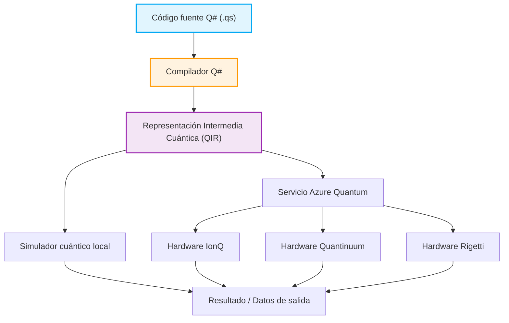

## 1. Introducción: El amanecer de la computación cuántica y un nuevo paradigma de programación

En los últimos años, la innovación tecnológica en hardware y software dentro del campo de la computación cuántica ha sido notable. Mientras que las computadoras clásicas (las PC, teléfonos inteligentes y supercomputadoras que utilizamos a diario hoy en día) procesan información con combinaciones definidas de bits en estado "0" o "1", las computadoras cuánticas utilizan directamente fenómenos físicos exclusivos de la mecánica cuántica como base para el procesamiento de información, tales como la "Superposición" (Superposition) y el "Entrelazamiento cuántico" (Entanglement). Esto ha demostrado la posibilidad de lograr una velocidad de cálculo inalcanzable para una computadora clásica, incluso si tardara la edad del universo, para una clase específica de problemas; es decir, alcanzar la "Supremacía cuántica" (Quantum Supremacy) o la "Ventaja cuántica" (Quantum Advantage). Por ejemplo, se espera una reducción dramática en la complejidad computacional en problemas como la factorización de números enormes (algoritmo de Shor), búsquedas rápidas en bases de datos (algoritmo de Grover), simulación de química cuántica (algoritmo VQE), problemas de optimización combinatoria, e incluso en ciertos procesos de aprendizaje automático (Quantum Machine Learning).

Sin embargo, para aprovechar este asombroso potencial de las computadoras cuánticas como aplicaciones reales, no basta solo con los avances en hardware físico (como los qubits superconductores o trampas de iones). Es indispensable contar con un "lenguaje de programación cuántica" para diseñar circuitos cuánticos con precisión y escribir algoritmos cuánticos sin errores y de manera eficiente, junto con un entorno de desarrollo, ejecución y depuración sólido que lo respalde. Los lenguajes de programación clásicos (como C++, Python, Java, etc.) son excelentes para abstraer el funcionamiento de la arquitectura de la CPU clásica, pero no están diseñados para describir de forma natural la manipulación de estados cuánticos, que son no deterministas y poseen amplitudes complejas.

En este artículo, de entre los numerosos entornos de programación cuántica, nos enfocaremos en el "Quantum Development Kit (QDK)", un kit de desarrollo cuántico impulsado fuertemente por Microsoft y desarrollado como código abierto, y en su núcleo: el lenguaje de programación dedicado "Q#".

Q# fue diseñado desde cero como un Lenguaje Específico de Dominio (Domain Specific Language: DSL) especializado en la escritura de algoritmos cuánticos, absorbiendo los mejores aspectos de C#, F# y Python. Cuenta con características poderosas que integran de forma fluida el flujo de control clásico (como sentencias if o bucles for) con operaciones cuánticas (aplicación de compuertas y mediciones). En este artículo, partiremos de los modelos matemáticos básicos de la computación cuántica y explicaremos exhaustiva y detalladamente las características lingüísticas de Q#, su filosofía de diseño en comparación con herramientas como Qiskit de Python, la construcción y medición del "Estado de Bell (Bell State: estado entrelazado)" mediante código real, e incluso los métodos de integración con lenguajes clásicos (Python o C#). Para cuando termines de leer este artículo, comprenderás los fundamentos de la programación cuántica y estarás listo para comenzar a escribir código en Q# en tu propio entorno.

## 2. Fundamentos matemáticos de la computación cuántica: Estados, superposición y entrelazamiento

Para comprender a fondo la sintaxis y las funciones de Q# y poder escribir programas cuánticos efectivos, es necesario primero repasar los conocimientos matemáticos básicos (especialmente el álgebra lineal) que se encuentran detrás de los estados cuánticos y las operaciones de compuertas cuánticas. Aquí revisaremos los modelos matemáticos fundamentales e indispensables para la programación cuántica.

### 2.1 Qubits (Bits cuánticos) y el estado de superposición

Mientras que un bit clásico solo puede tomar el estado de $0$ o $1$, un qubit (bit cuántico) se representa como una combinación lineal (Linear Combination) de los estados $|0\rangle$ y $|1\rangle$, es decir, una "superposición". Este estado se describe utilizando la notación bra-ket (notación de Dirac) y los coeficientes complejos $\alpha$ y $\beta$ de la siguiente manera:

$$ |\psi\rangle = \alpha|0\rangle + \beta|1\rangle $$

Aquí, $\alpha$ y $\beta$ son números complejos (Complex Numbers) llamados amplitudes de probabilidad (Probability Amplitude). Al medir este qubit, la probabilidad de observar el estado $|0\rangle$ es $|\alpha|^2$ y la probabilidad de observar el estado $|1\rangle$ es $|\beta|^2$. Como restricción física, la suma de las probabilidades de observar todos los estados posibles debe ser siempre igual a $1$, por lo que se debe cumplir la siguiente condición de normalización (Normalization Condition):

$$ |\alpha|^2 + |\beta|^2 = 1 $$

El estado de un qubit a menudo se visualiza como un punto en la superficie de una esfera unitaria en un espacio tridimensional llamada "Esfera de Bloch" (Bloch Sphere). El polo norte corresponde a $|0\rangle$ y el polo sur a $|1\rangle$, y los puntos en el ecuador representan estados en los que $|0\rangle$ y $|1\rangle$ están superpuestos con igual probabilidad (por ejemplo, $|+\rangle = \frac{1}{\sqrt{2}}(|0\rangle + |1\rangle)$ con fase 0, o $|i\rangle = \frac{1}{\sqrt{2}}(|0\rangle + i|1\rangle)$ con fase $\pi/2$). Las operaciones de compuertas cuánticas pueden entenderse geométricamente como rotaciones en esta esfera de Bloch.

### 2.2 Múltiples qubits, producto tensorial y entrelazamiento cuántico

El verdadero poder de la computación cuántica se manifiesta al combinar múltiples qubits. El estado de un sistema compuesto por múltiples qubits se describe mediante el "producto tensorial" (Tensor Product) de los espacios de estado de los qubits individuales. Por ejemplo, el estado de todo un sistema compuesto por dos qubits es el siguiente:

$$ |\psi\rangle = \alpha_{00}|00\rangle + \alpha_{01}|01\rangle + \alpha_{10}|10\rangle + \alpha_{11}|11\rangle $$

Aquí también se cumple la condición de normalización $\sum_{i,j} |\alpha_{ij}|^2 = 1$. El punto importante es que, para describir completamente un sistema de n qubits, se necesitan $2^n$ amplitudes complejas. Por ejemplo, para un sistema de solo 50 qubits, representar su estado requiere unos $2^{50} \approx 10^{15}$ números complejos, lo cual supera con creces la capacidad de memoria de las supercomputadoras más rápidas del mundo actual. Esta es una de las razones por las que las computadoras cuánticas poseen una ventaja exponencial sobre las computadoras clásicas.

El "entrelazamiento cuántico" (Entanglement) se refiere a aquellos estados de múltiples qubits que no pueden descomponerse simplemente (factorizarse) como el producto tensorial de los estados de los qubits individuales. Uno de los estados entrelazados más famosos e importantes es el siguiente "Estado de Bell" (Bell State):

$$ |\Phi^+\rangle = \frac{1}{\sqrt{2}}(|00\rangle + |11\rangle) $$

En este estado, en el instante en que se mide un qubit y se obtiene $0$ (o $1$), el estado del otro qubit queda determinado instantáneamente como $0$ (o $1$), independientemente de la distancia. Esta correlación no local, que Einstein llamó "espeluznante acción a distancia", se convierte en un recurso fundamental para la teletransportación cuántica, la codificación superdensa, la comunicación cuántica criptográfica, e incluso la ejecución eficiente de muchos algoritmos cuánticos. En una sección posterior, construiremos este estado de Bell utilizando Q#.

### 2.3 Operaciones de compuertas cuánticas y matrices unitarias

Las operaciones que cambian los estados cuánticos (equivalentes a las compuertas AND, OR, NOT en los circuitos lógicos clásicos) se denominan compuertas cuánticas. Matemáticamente, una compuerta cuántica se representa como una matriz de números complejos y actúa como una multiplicación de matriz sobre el vector del estado cuántico. Según los axiomas de la mecánica cuántica, estas matrices deben ser siempre matrices unitarias (Unitary Matrix, una matriz que cumple $U^\dagger U = I$, donde $U^\dagger$ es la matriz adjunta e $I$ es la matriz identidad). Debido a esto, todas las operaciones cuánticas, excepto las mediciones, son reversibles (Reversible).

Compuertas representativas de un solo qubit:
- **Compuerta Pauli-X (Compuerta NOT)**: Invierte $|0\rangle$ a $|1\rangle$, y $|1\rangle$ a $|0\rangle$.
$$ X = \begin{pmatrix} 0 & 1 \\ 1 & 0 \end{pmatrix} $$
- **Compuerta Pauli-Z (Compuerta de cambio de fase)**: Deja $|0\rangle$ intacto e invierte el signo de $|1\rangle$ (añade $\pi$ a la fase relativa).
$$ Z = \begin{pmatrix} 1 & 0 \\ 0 & -1 \end{pmatrix} $$
- **Compuerta de Hadamard (Compuerta H)**: Convierte un estado determinista en un estado de superposición.
$$ H = \frac{1}{\sqrt{2}} \begin{pmatrix} 1 & 1 \\ 1 & -1 \end{pmatrix} $$

Compuertas representativas de dos qubits:
- **Compuerta CNOT (Compuerta NOT controlada)**: Aplica una compuerta X (operación NOT) al qubit objetivo (Target Qubit) solo cuando el qubit de control (Control Qubit) es $|1\rangle$.
$$ CNOT = \begin{pmatrix} 1 & 0 & 0 & 0 \\ 0 & 1 & 0 & 0 \\ 0 & 0 & 0 & 1 \\ 0 & 0 & 1 & 0 \end{pmatrix} $$

Los algoritmos cuánticos pueden considerarse como el diseño de un proceso que combina estas matrices unitarias básicas para lograr el cálculo deseado.

## 3. ¿Qué es Microsoft Quantum Development Kit (QDK)?

El Quantum Development Kit (QDK) proporcionado por Microsoft es un conjunto integral de herramientas para apoyar el desarrollo de software de computación cuántica. Da soporte a todo el ciclo de vida del desarrollo, desde el diseño, depuración y optimización de algoritmos cuánticos, hasta su ejecución en simuladores o en hardware real.

El QDK incluye los siguientes elementos principales:

1. **Compilador Q# y entorno de ejecución**: Analiza altamente y optimiza el código escrito en lenguaje Q# y lo convierte en un formato ejecutable (como QIR) en simuladores o hardware cuántico real (a través de Azure Quantum). El compilador Q# realiza un análisis estático específico para la computación cuántica, como la comprobación de la pureza de las funciones y la gestión del ciclo de vida de los qubits.
2. **Simuladores cuánticos**: Incluye un simulador de estado completo (Full State Simulator) que simula la evolución de los estados cuánticos en la máquina local del desarrollador. Esto permite probar y depurar rápidamente algoritmos a pequeña escala de decenas de qubits. Además, proporciona un estimador de recursos (Resource Estimator) para calcular los requisitos de recursos de circuitos a gran escala (de miles a millones de qubits).
3. **Bibliotecas completas**: La biblioteca estándar de Q# (Standard Library) proporciona varios bloques de construcción avanzados, que van desde las compuertas cuánticas básicas (H, X, Y, Z, CNOT, etc.) y operaciones aritméticas complejas (como sumadores cuánticos), hasta la amplificación de la amplitud (Amplitude Amplification) y algoritmos de estimación de la fase cuántica (Quantum Phase Estimation). Esto permite a los desarrolladores evitar reinventar la rueda.
4. **Integración con Entornos de Desarrollo Integrado (IDE)**: Se proporcionan extensiones para Visual Studio y Visual Studio Code, permitiendo el uso de funciones esenciales para el desarrollo de software moderno, como el resaltado de sintaxis, el autocompletado de código (IntelliSense), potentes herramientas de depuración y la integración con marcos de pruebas.

A continuación se muestra un diagrama Mermaid que ilustra el flujo de trabajo desde que se escribe un programa Q# hasta que se ejecuta en el hardware.



Un aspecto extremadamente destacado de esta arquitectura es que abstrae completamente las diferencias en las arquitecturas de hardware subyacentes (qubits superconductores, trampas de iones, qubits topológicos, cuantos de luz, etc.) al pasar por una representación intermedia basada en LLVM llamada QIR (Quantum Intermediate Representation). Los desarrolladores pueden centrarse en el diseño puramente lógico de los algoritmos sin tener que preocuparse por los detalles físicos del hardware (topologías o conjuntos de compuertas nativas específicas de cada hardware). Los pasos del compilador después de la capa QIR realizan una transpilación de compuertas optimizada automáticamente para el hardware objetivo.

## 4. Q# vs Python/Qiskit: ¿Por qué necesitamos un nuevo lenguaje?

Al aprender programación cuántica, la mayoría de las personas entran en contacto primero con "Qiskit", un framework basado en Python desarrollado por IBM, debido a su facilidad de uso y la popularidad de Python. Aunque Qiskit es una herramienta muy poderosa y ampliamente utilizada, su filosofía de diseño (paradigma) difiere fundamentalmente de la de Q# de Microsoft.

### El enfoque de Qiskit (Construcción de objetos de circuitos con Python)
Qiskit es esencialmente una "biblioteca API de Python para construir circuitos cuánticos". Cuando un desarrollador ejecuta un script de Python, una secuencia de compuertas cuánticas (objeto de circuito) se ensambla gradualmente en la memoria. Después de añadir todas las compuertas, ese enorme objeto de circuito finalmente se envía (Submit) al backend (un simulador local o un dispositivo real en la nube) para su ejecución.
Este enfoque de metaprogramación tiene la gran ventaja de que es extremadamente fácil integrarse con el ecosistema de Python existente (bibliotecas de aprendizaje automático como NumPy, SciPy, PyTorch, y herramientas de visualización). Sin embargo, cuando se trata de expresar circuitos dinámicos (Dynamic Circuits) con flujos de control complejos que mezclan lo clásico y lo cuántico, por ejemplo: "medir un qubit y, solo si el resultado fue 1, aplicar una operación unitaria compleja específica a otro grupo de qubits, y luego realizar un bucle while", no se pueden utilizar las sentencias if o for nativas de Python (porque se evalúan en el momento de la "construcción del circuito"). Se hace necesario utilizar instrucciones de control especiales propias de Qiskit, lo que hace que el código a menudo se vuelva muy complejo y poco intuitivo.

### El enfoque de Q# (Lenguaje Específico de Dominio de primer nivel cuántico)
Por otro lado, Q# es un lenguaje compilado independiente diseñado desde cero para tratar la computación cuántica en sí misma como un ciudadano de primera clase (First-class citizen). Dentro de Q#, la asignación de qubits, las operaciones de compuertas y las mediciones se pueden escribir de forma natural y fluida en una misma base de código, sintiéndose exactamente igual que manipular variables clásicas o escribir declaraciones if y bucles.
El compilador Q# analiza estáticamente todo el código, determina qué partes deben ejecutarse en un dispositivo de computación clásico (CPU anfitriona o electrónica de control) y cuáles deben ejecutarse en un coprocesador cuántico (QPU), realizando optimizaciones avanzadas. Esto permite una mayor modularidad, legibilidad, facilidad de mantenimiento y seguridad de tipos (Type Safety) al implementar algoritmos cuánticos grandes y complejos. Q# no es un lenguaje para "escribir circuitos", sino para "escribir algoritmos".

## 5. Profundizando en la sintaxis básica y los conceptos característicos de Q#

La sintaxis de Q# tiene un diseño muy pulido que parece combinar la estructura de bloques de C# con llaves `{}`, elementos de programación funcional de F# y una potente inferencia de tipos. Aquí explicaremos en detalle los conceptos y palabras clave más importantes para comprender profundamente Q#.

### 5.1 La estricta distinción entre `operation` y `function`
En Q#, se hace una distinción rigurosa entre dos tipos para definir rutinas (bloques de procesamiento): `operation` y `function`. Esto proviene del concepto de "pureza" (Purity) en la programación funcional.
- **`function`**: Es una función pura que solo realiza cálculos clásicos deterministas (Deterministic). Si se dan los mismos parámetros de entrada, siempre devolverá el mismo resultado de salida, sin importar cuántas veces se ejecute. Dentro de una `function`, las operaciones cuánticas (que conllevan efectos secundarios) como la asignación de qubits, la aplicación de compuertas o las mediciones darán lugar a un error de compilación. Se utiliza para cálculos matemáticos o transformaciones de datos.
- **`operation`**: Es una rutina no determinista (Non-deterministic) que incluye computación cuántica. Al contener operaciones y mediciones en qubits, incluso con la misma entrada, el resultado puede cambiar debido a la naturaleza probabilística de la mecánica cuántica (como el colapso de la función de onda debido a la medición). Todas las partes centrales de un algoritmo cuántico se definen como `operation`.

### 5.2 El tipo `Qubit` y la gestión del ciclo de vida con la palabra clave `use`
En Q#, un qubit se trata como un objeto "opaco" (Opaque) de tipo `Qubit`. Se prohíbe intencionalmente que los desarrolladores lean o modifiquen directamente las amplitudes de probabilidad de su estado interno (por ejemplo, los valores de $\alpha$ y $\beta$) dentro del programa (esto es coherente con el "problema de la medición" en los sistemas cuánticos físicos reales). La única forma de interactuar con los qubits es llamando a las operaciones de compuertas cuánticas o funciones de medición proporcionadas.

Para asignar (alocar) un nuevo qubit dentro de un programa, se utiliza la palabra clave `use` (en versiones anteriores de Q# se llamaba `using`). El bloque `use` define claramente el alcance y el ciclo de vida del qubit.
Una regla importante es que, al salir de un bloque `use`, todos los qubits asignados dentro de él deben haber vuelto por completo a su estado inicial $|0\rangle$ (de lo contrario, se producirá una excepción en tiempo de ejecución). Este es un poderoso mecanismo de seguridad de Q# para garantizar la reutilización de los qubits y prevenir fugas de memoria.

### 5.3 Medición `M` y la conveniente `MResetZ`
La operación de medición (Measurement) para convertir el estado cuántico en información clásica (0 o 1) se realiza mediante la operación básica `M`. El resultado de la medición en la base Z (base estándar) se devuelve como un tipo de enumeración `Result` (con valores `Zero` o `One`).
Sin embargo, como se mencionó anteriormente, al liberar un qubit, se requiere que esté en el estado $|0\rangle$. Si simplemente se realiza una medición `M` y el resultado fue `One`, el estado del qubit ha colapsado a $|1\rangle$. Por lo tanto, en el código práctico, se usa con mucha frecuencia la conveniente operación estándar llamada `MResetZ`, que resetea el estado del qubit de forma segura a $|0\rangle$ justo después de realizar la medición.

### 5.4 Inmutabilidad de las variables (Immutability) y `mutable`
En Q#, que está fuertemente influenciado por la programación funcional, todas las variables son inmutables (Immutable) por defecto. Una vez que se asocia un valor a una variable utilizando la palabra clave `let`, su valor no se puede cambiar después. Esto reduce los efectos secundarios no deseados en el procesamiento paralelo y los algoritmos cuánticos.
Si se necesita declarar una variable cuyo valor debe actualizarse, como un contador de bucle o un cálculo acumulativo, se utiliza explícitamente la palabra clave `mutable` y, para actualizar el valor, se utiliza la palabra clave `set`.

## 6. Práctica: Crear y medir un Estado de Bell (Entrelazamiento cuántico) con Q#

Ahora que hemos reunido el conocimiento necesario, utilicemos Q# para crear el "Estado de Bell" (Bell State) que explicamos en la sección de matemáticas y escribamos un programa para medirlo. Este es un paso muy importante que podría considerarse el "Hola Mundo" de la programación cuántica.

### Diseño y explicación del circuito cuántico
El procedimiento estándar de un circuito cuántico para crear el estado de Bell $\frac{1}{\sqrt{2}}(|00\rangle + |11\rangle)$ es el siguiente:
1. Se preparan dos qubits $q_0$ y $q_1$ en el estado inicial $|00\rangle$.
2. Se aplica una compuerta de Hadamard (compuerta $H$) a $q_0$. Esto deja a $q_0$ en un estado de superposición de $|0\rangle$ y $|1\rangle$ con igual probabilidad: $\frac{1}{\sqrt{2}}(|0\rangle + |1\rangle)$. En este punto, el estado de todo el sistema es $\frac{1}{\sqrt{2}}(|0\rangle + |1\rangle) \otimes |0\rangle = \frac{1}{\sqrt{2}}(|00\rangle + |10\rangle)$.
3. Se aplica una compuerta CNOT (NOT controlada) usando $q_0$ como el bit de control (Control) y $q_1$ como el bit objetivo (Target). Esto invierte $q_1$ solo cuando $q_0$ es $|1\rangle$. Como resultado, el estado $|00\rangle$ permanece como $|00\rangle$, pero el estado $|10\rangle$ cambia a $|11\rangle$, y el estado final de todo el sistema se convierte en $\frac{1}{\sqrt{2}}(|00\rangle + |11\rangle)$. Esto completa la creación del estado entrelazado con una correlación perfecta.

### Código de implementación en Q#

El siguiente código es un ejemplo práctico de implementación que genera un estado de Bell usando Q# y repite el experimento de medición un número especificado de veces para obtener sus estadísticas (distribución de probabilidad).

```qsharp
namespace Quantum.BellState {
    
    // Importamos los espacios de nombres necesarios
    open Microsoft.Quantum.Intrinsic;
    open Microsoft.Quantum.Canon;
    open Microsoft.Quantum.Measurement;
    open Microsoft.Quantum.Diagnostics;

    /// # Summary
    /// Genera un único estado de Bell y mide dos qubits en la base Z.
    ///
    /// # Output
    /// (Result, Result): Resultados de medición de qubit1 y qubit2. Si es un estado de Bell, siempre coincidirán.
    operation GenerateAndMeasureBellState() : (Result, Result) {
        
        // Asignamos 2 qubits (el estado inicial es automáticamente |00>)
        use (q1, q2) = (Qubit(), Qubit());
        
        // Aplicamos la compuerta de Hadamard a q1 para crear un estado de superposición
        H(q1);
        
        // Aplicamos una compuerta CNOT usando q1 como control y q2 como objetivo
        // Esto genera entrelazamiento cuántico (entanglement) entre q1 y q2
        CNOT(q1, q2);
        
        // Para depurar durante el desarrollo, podemos volcar el vector de estado en el simulador
        // DumpMachine(); // Descomentar si es necesario

        // Realizamos la medición y, al mismo tiempo, reseteamos de forma segura el estado a |0>
        let res1 = MResetZ(q1);
        let res2 = MResetZ(q2);
        
        // Devolvemos el par de resultados medidos
        return (res1, res2);
    }

    /// # Summary
    /// Rutina principal que ejecuta el experimento de generación y medición del estado de Bell repetidas veces y recopila las estadísticas de los resultados.
    ///
    /// # Input
    /// ## count
    /// Número de veces que se repetirá el experimento (por ejemplo, 1000 veces)
    ///
    /// # Output
    /// (Int, Int, Int, Int): Número de veces que se observó cada caso (00, 01, 10, 11) respectivamente
    @EntryPoint()
    operation RunBellStateExperiment(count: Int) : (Int, Int, Int, Int) {
        
        // Inicializamos variables mutables (modificables) para contar las ocurrencias
        mutable num00 = 0;
        mutable num01 = 0;
        mutable num10 = 0;
        mutable num11 = 0;

        // Ejecutamos el bucle del experimento la cantidad de veces especificada
        for _ in 1..count {
            // Generamos el estado de Bell y recibimos los resultados de la medición
            let (r1, r2) = GenerateAndMeasureBellState();
            
            // Incrementamos los contadores según el patrón de resultados
            if r1 == Zero and r2 == Zero {
                set num00 += 1;
            } elif r1 == Zero and r2 == One {
                set num01 += 1;
            } elif r1 == One and r2 == Zero {
                set num10 += 1;
            } else { // Caso r1 == One and r2 == One
                set num11 += 1;
            }
        }

        // Mostramos las estadísticas recopiladas como un mensaje en la consola
        Message($"--- Resultados del Experimento ---");
        Message($"Ejecuciones totales: {count}");
        Message($"00 observado: {num00}");
        Message($"01 observado: {num01}");
        Message($"10 observado: {num10}");
        Message($"11 observado: {num11}");

        return (num00, num01, num10, num11);
    }
}
```

### Explicación del código y verificación de funcionamiento
- `namespace`: Al igual que en Java o C#, es la declaración del espacio de nombres para organizar lógicamente el programa y evitar conflictos de nombres.
- `open`: Importa las bibliotecas (módulos) necesarias. `Microsoft.Quantum.Intrinsic` contiene las compuertas cuánticas básicas como H, X, Y, Z, CNOT, etc., y `Microsoft.Quantum.Measurement` incluye funciones útiles para la medición, como `MResetZ`.
- `use (q1, q2) = (Qubit(), Qubit());`: Se están asignando (alocando) dinámicamente dos qubits.
- `H(q1); CNOT(q1, q2);`: Estas dos líneas son exactamente el núcleo que genera el entrelazamiento cuántico. Se puede escribir de forma muy sencilla e intuitiva.
- `let res1 = MResetZ(q1);`: Como se mencionó antes, `MResetZ` vincula el resultado de la medición a la variable y simultáneamente fuerza el restablecimiento del qubit al estado $|0\rangle$. Esto permite liberar los qubits de forma segura al finalizar el bloque `use`.
- `@EntryPoint()`: Al añadir este atributo, indicamos al compilador que esta operación es el punto de inicio de ejecución del programa (similar a la función `main` en el lenguaje C).

En teoría, el estado generado es el estado de Bell $\frac{1}{\sqrt{2}}(|00\rangle + |11\rangle)$, por lo que, si ejecutamos este programa suficientes veces (por ejemplo, 10,000 veces), deberíamos observar `00` y `11` aproximadamente un 50% de las veces cada uno (alrededor de 5,000 veces), mientras que `01` y `10` se observarán 0 veces (no se observarán en absoluto si no hay errores teóricos). Esta es la prueba de que los dos qubits tienen una fuerte correlación (están entrelazados).

## 7. Integración fluida con lenguajes anfitriones (Python / C#)

Como vimos en el ejemplo anterior, Q# puede ejecutarse por sí solo indicando el punto de entrada `@EntryPoint()` (Aplicación independiente de Q#). Sin embargo, en casos de uso de investigación y desarrollo empresarial real, a menudo se usa en estrecha colaboración con procesos clásicos, como una interfaz gráfica (GUI) frontend, la obtención de datos desde enormes bases de datos, o bucles de optimización en aprendizaje automático (como la actualización de parámetros en VQE). Debido a esto, Q# ofrece una interoperabilidad (Interoperability) refinada para que pueda ser invocado directamente desde lenguajes anfitriones como Python o C# (.NET) de una manera extremadamente fácil.

### 7.1 Ejemplo de invocación desde Python: Para científicos de datos
Para llamar a Q# desde Python, que tiene una cuota de mercado abrumadora en ciencia de datos, aprendizaje automático e investigación física, se utiliza el paquete de Python `qsharp`. También tiene una alta afinidad con Jupyter Notebook, siendo ideal para combinar con desarrollo interactivo y visualización de datos.

```python
# 1. Importar el módulo necesario para integrar Q#
import qsharp

# 2. Importar operaciones de Q# directamente como si fueran funciones de Python
# (El compilador realiza el enlace (binding) y la compilación en segundo plano de forma automática)
from Quantum.BellState import RunBellStateExperiment

# 3. Invocar la ejecución desde un script de Python (usando el simulador)
count = 1000
print(f"Starting quantum simulation for {count} iterations...")

# Al llamar al método simulate(), se ejecuta en el simulador local
result = RunBellStateExperiment.simulate(count=count)

# Se recibe la tupla de resultados, que Python formatea y muestra
print("\n--- Simulation Results ---")
print(f"|00> : {result[0]} (Expected ~500)")
print(f"|01> : {result[1]} (Expected 0)")
print(f"|10> : {result[2]} (Expected 0)")
print(f"|11> : {result[3]} (Expected ~500)")
```
Dado que el compilador y el intérprete de Q# generan enlaces dinámicos de forma transparente en segundo plano a través de una API en C, desde el código Python un algoritmo cuántico se trata como una simple función de caja negra, lo que hace extremadamente sencillo construir algoritmos híbridos clásico-cuánticos.

### 7.2 Ejemplo de invocación desde C#: Para el desarrollo empresarial
Se puede integrar código de Q# exactamente de la misma forma utilizando C#, lo cual es muy potente en sistemas backend a gran escala o en el desarrollo de aplicaciones empresariales. Al ubicar un proyecto de Q# (.csproj) en la misma solución que un proyecto de C# y establecer referencias entre ellos, se genera automáticamente una clase envoltura (wrapper) para C# al momento de la compilación.

```csharp
using System;
using System.Threading.Tasks;
using Microsoft.Quantum.Simulation.Simulators; // Espacio de nombres del simulador cuántico
using Quantum.BellState; // Espacio de nombres definido en Q#

namespace QuantumRunner
{
    class Program
    {
        static async Task Main(string[] args)
        {
            // Instanciar el simulador cuántico de estado completo
            // Como implementa IDisposable, gestionamos correctamente los recursos con 'using'
            using var sim = new QuantumSimulator();
            
            long count = 1000;
            Console.WriteLine($"Running {count} iterations of Bell State generation...");

            // Se ejecuta asíncronamente la operación de Q#. El método Run se genera automáticamente.
            // Le pasamos 'sim' como destino de ejecución y 'count' como argumento.
            var result = await RunBellStateExperiment.Run(sim, count);

            // Los resultados se devuelven como una ValueTuple en C#
            Console.WriteLine($"|00>: {result.Item1}");
            Console.WriteLine($"|01>: {result.Item2}");
            Console.WriteLine($"|10>: {result.Item3}");
            Console.WriteLine($"|11>: {result.Item4}");
        }
    }
}
```
Aquí se utiliza la clase local `QuantumSimulator` para propósitos de desarrollo, pero al momento de transicionar al entorno de producción, la parte donde se crea la instancia de este simulador simplemente se reemplaza con un objeto de proveedor de hardware en la nube que apunte al espacio de trabajo de Azure Quantum (por ejemplo, los objetos de máquina de IonQ o Quantinuum). Sin modificar en lo más mínimo la lógica de negocio ni el código del lado de Q#, es posible ejecutar el algoritmo en un hardware cuántico real en la nube. ¡Esa es la verdadera esencia de QDK!

## 8. Temas avanzados: Características que encarnan la filosofía de diseño de Q#

Hemos visto el uso básico de Q#, pero ahora profundicemos un poco más en las funcionalidades avanzadas y la filosofía de diseño de Q#. Estas características son los elementos que hacen de Q# algo más que un simple "reemplazo de Python": un verdadero lenguaje específico de dominio cuántico.

### 8.1 Generación automática de operaciones inversas (Adjoint) y operaciones controladas (Controlled)
Una de las grandes características de la computación cuántica es la "reversibilidad" (Reversibility) derivada de la unitariedad (Unitarity). Todas las operaciones fundamentales, a excepción de las mediciones, son matrices unitarias, por lo tanto, siempre existe una matriz inversa (operación inversa) que permite deshacerlas. Q# proporciona potentes modificadores funcionales llamados `Adjoint` (adjunto/operación inversa) y `Controlled` (operación controlada) que respaldan esto como una característica de primera clase a nivel de lenguaje.

Para una operación cuántica dada `Op`, el desarrollador no tiene que calcular la matriz de la operación inversa o invertir el orden de las compuertas a mano para implementarla. Con solo añadir ciertas palabras clave a la firma de la función, el compilador Q# generará automáticamente `Adjoint Op`. Además, también es posible generar automáticamente la operación condicional `Controlled Op`, que ejecuta `Op` solo si todos los qubits del grupo especificado están en estado $|1\rangle$.

```qsharp
// Al añadir 'is Adj + Ctl', indicamos al compilador que genere automáticamente las operaciones inversas y controladas
operation MyComplexSubroutine(qubits: Qubit[]) : Unit is Adj + Ctl {
    // Aquí se escribe una secuencia de compuertas cuánticas muy complejas
    // Ejemplo: combinaciones de H, T, CNOT y desplazamientos de fase arbitrarios, etc.
    // ...
}

// Ejemplo desde el lado que invoca la función
operation UseMyOp(controlQubit: Qubit, targetQubits: Qubit[]) : Unit {
    
    // Invocación normal
    MyComplexSubroutine(targetQubits);
    
    // Ejecución de la operación inversa: Revierte completamente al estado original (muy útil para "descomputación")
    Adjoint MyComplexSubroutine(targetQubits);
    
    // Ejecución de la operación controlada: Solo ejecuta la subrutina compleja si 'controlQubit' es |1>
    Controlled MyComplexSubroutine([controlQubit], targetQubits);
    
    // Además, ¡también es posible combinar esto, por ejemplo con la inversa de la operación controlada!
    Controlled Adjoint MyComplexSubroutine([controlQubit], targetQubits);
}
```
Gracias a esta función, la implementación de subrutinas complejas, como la implementación del oráculo en el algoritmo de búsqueda de Grover o el algoritmo de factorización de Shor, y sus correspondientes operaciones inversas (para deshacer el entrelazamiento innecesario, también conocido como "descomputación": Uncomputation), se simplifica drásticamente y se reduce enormemente el margen para introducir errores humanos o fallos. Esta es una de las mayores ventajas que Q#, como lenguaje descriptivo de algoritmos, tiene frente a otras herramientas como Qiskit (un modelo de construcción de circuitos).

### 8.2 Estimación de recursos (Resource Estimation) y la preparación para el futuro
Las computadoras cuánticas actuales se encuentran en una fase de desarrollo conocida como "NISQ" (Noisy Intermediate-Scale Quantum), donde la cantidad de qubits disponibles es escasa (de decenas a cientos) y las tasas de error son altas. Sin embargo, mirando hacia el futuro y hacia la era de las computadoras cuánticas tolerantes a fallos (FTQC: Fault-Tolerant Quantum Computer), al ejecutar un nuevo algoritmo, será extremadamente importante prever de forma precisa: "¿Cuántos qubits lógicos se necesitan realmente?", "¿Cuántas veces se usarán compuertas como T o Toffoli, que tienen un costo altísimo en términos de corrección de errores?" o "¿Cuánto durará el tiempo de ejecución?".

El QDK incluye el "Estimador de recursos" (Resource Estimator) como uno de los objetivos del entorno de ejecución. Al usar esto, en lugar de ejecutar el código en un hardware real o en un simulador de estado completo intensivo, el programa puede analizar las rutas lógicas del código para calcular y reportar instantáneamente los recursos requeridos para algoritmos a gran escala. Gracias a esto, los investigadores y diseñadores de algoritmos pueden iterar rápidamente sobre las optimizaciones, no solo a nivel de la complejidad computacional teórica, sino a nivel de la cantidad específica de compuertas requeridas, incluso para los algoritmos del futuro que requerirán miles o millones de qubits.

## 9. Conclusión: Expectativas para la próxima generación de ingenieros de software

La computación cuántica está migrando rápidamente de ser un puro concepto teórico confinado a las mentes de físicos como Einstein, Schrödinger y Feynman, a ser ahora un campo de implementación práctica de la ingeniería accesible para cualquier persona en el mundo a través del navegador o la línea de comandos, gracias a la infraestructura en la nube (Azure Quantum, AWS Braket, IBM Quantum, etc.). La velocidad a la que evoluciona el hardware es asombrosa, y muchos expertos predicen que el día en que se demuestre una ventaja cuántica "útil" está a solo unos pocos años de distancia.

El lenguaje Q# de Microsoft, presentado en este artículo, ha introducido maravillosamente las mejores prácticas (tipado fuerte, elementos de programación funcional, modularidad, encapsulación y potentes herramientas de asistencia de IDE) desarrolladas durante décadas en el mundo de la programación clásica al área completamente nueva de la programación cuántica. Al aprender Q# y durante el proceso de implementar algoritmos cuánticos, podemos obtener perspectivas profundas sobre la raíz misma de las ciencias de la computación y la física: preguntas como "¿Qué es un estado?", "¿Qué significa medir?" o "¿Cómo se propaga la información a través del espacio?". Esto va mucho más allá de simplemente adquirir nuevas habilidades; es una experiencia que conlleva un tremendo estímulo intelectual.

En un futuro cercano, de la misma manera que los ingenieros de aprendizaje automático actuales aprovechan las capacidades de cálculo paralelo de las GPUs con normalidad usando PyTorch o TensorFlow, la nueva generación de "ingenieros de software cuántico" extraerá la capacidad computacional trascendental de las QPU (Quantum Processing Unit) utilizando herramientas como Q# o Qiskit para enfrentar desafíos de la humanidad a gran escala. Veremos el descubrimiento de nuevos materiales mediante las ciencias de materiales, simulaciones moleculares aplicadas a la creación de fármacos, modelados sobre el cambio climático y la optimización de riesgos financieros, entre otros.

Para todos los desarrolladores de software que hoy se dedican principalmente a crear aplicaciones web clásicas, aplicaciones móviles o al análisis de datos, los invito a entrar al mundo de la programación cuántica con esta gran oportunidad. Es normal sentirse confundido al principio debido a los fenómenos contraintuitivos propios de la mecánica cuántica (superposición, entrelazamiento y comportamientos probabilísticos). Sin embargo, el refinado lenguaje dedicado Q# y la robusta cadena de herramientas QDK proporcionarán un respaldo certero y potente a lo largo de tu curva de aprendizaje.

## 10. Referencias y enlaces para aprender más en profundidad

A continuación te presentamos algunos de los mejores recursos para continuar tu viaje por la programación cuántica.

- [Documentación oficial de Microsoft Azure Quantum](https://learn.microsoft.com/azure/quantum/) : Portal de documentación completo para el QDK y Azure Quantum.
- [Guía de usuario y referencia de Q#](https://learn.microsoft.com/azure/quantum/user-guide/) : Referencia completa de la sintaxis, el sistema de tipos y la biblioteca estándar de Q#.
- [Quantum Katas](https://quantum.microsoft.com/en-us/experience/quantum-katas) : Un conjunto de tutoriales de código abierto que ofrece Microsoft. Con un enfoque basado en Desarrollo Dirigido por Pruebas (TDD), es un excelente recurso para auto-estudiar de forma interactiva los conceptos básicos de computación cuántica (compuertas, mediciones y construcción de algoritmos) mientras escribes tu propio código en Q#.
- [Repositorio en GitHub de Q#](https://github.com/microsoft/qsharp-compiler) : El compilador del lenguaje Q# y su biblioteca estándar se desarrollan activamente bajo código abierto. Es de lectura obligada para cualquiera que esté interesado en cómo funcionan internamente los compiladores.

El futuro de la computación cuántica apenas ha comenzado y está lleno de infinitas posibilidades. ¡Espero que asumas el desafío de programar con Q# con una mentalidad abierta a disfrutar de este nuevo paradigma de programación!
