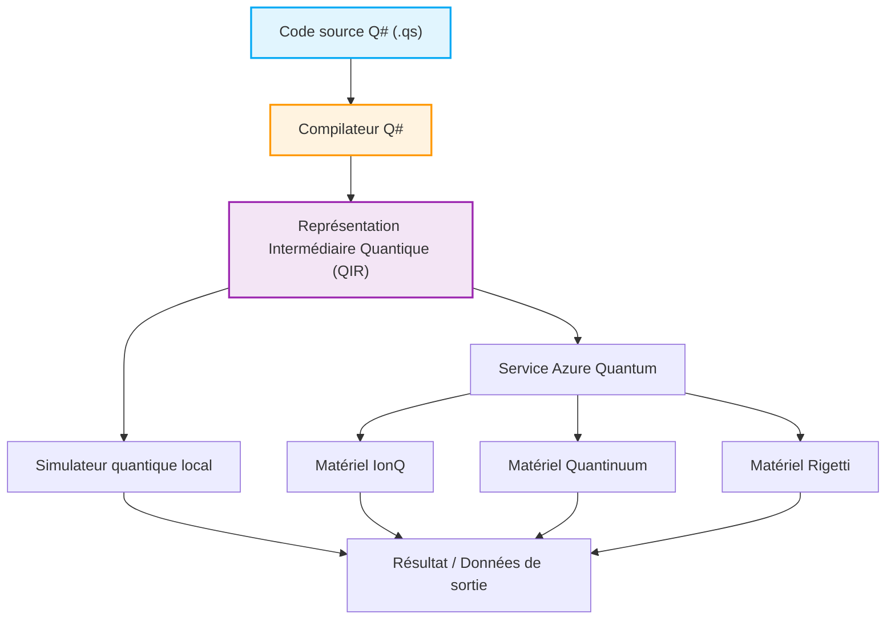

## 1. Introduction : L'aube de l'informatique quantique et un nouveau paradigme de programmation

Ces dernières années, l'innovation technologique dans le domaine de l'informatique quantique, tant au niveau du matériel que des logiciels, a été remarquable. Alors que les ordinateurs classiques (tels que les PC, les smartphones et les superordinateurs que nous utilisons au quotidien) traitent l'information à l'aide de combinaisons de bits définies comme « 0 » ou « 1 », les ordinateurs quantiques exploitent directement des phénomènes physiques propres à la mécanique quantique, tels que la « superposition » (Superposition) et l'« intrication quantique » (Entanglement), comme fondement du traitement de l'information. Cela suggère la possibilité, pour certaines classes de problèmes, d'atteindre des vitesses de calcul inaccessibles pour les ordinateurs classiques même sur une durée équivalente à l'âge de l'univers, réalisant ainsi la « suprématie quantique » (Quantum Supremacy) ou l'« avantage quantique » (Quantum Advantage). Par exemple, une réduction spectaculaire de la complexité des calculs est attendue dans des domaines tels que la factorisation de très grands nombres (algorithme de Shor), la recherche rapide dans les bases de données (algorithme de Grover), la simulation de la chimie quantique (algorithme VQE), les problèmes d'optimisation combinatoire, ainsi que certains processus d'apprentissage automatique (Quantum Machine Learning).

Cependant, pour libérer l'incroyable potentiel des ordinateurs quantiques dans des applications concrètes, les progrès matériels (comme les qubits supraconducteurs ou les pièges à ions) ne suffisent pas. Un « langage de programmation quantique » capable de concevoir précisément des circuits quantiques et de décrire les algorithmes quantiques sans erreur et de manière efficace, soutenu par un environnement de développement, d'exécution et de débogage robuste, est indispensable. Les langages de programmation classiques (tels que C++, Python, Java, etc.) excellent dans l'abstraction du fonctionnement de l'architecture des CPU classiques, mais ils ne sont pas conçus pour décrire naturellement la manipulation d'états quantiques non déterministes aux amplitudes complexes.

Dans cet article, parmi les nombreux environnements de programmation quantique, nous nous concentrerons sur le Quantum Development Kit (QDK), un kit de développement fortement promu par Microsoft et développé en open source, ainsi que sur son langage de programmation dédié, le 'Q#' (Q-sharp), qui en constitue le cœur.

Q# a été conçu de zéro en tant que langage dédié (Domain Specific Language : DSL) spécialisé dans la description d'algorithmes quantiques, tout en absorbant les meilleurs éléments de C#, F# et Python. Il dispose de fonctionnalités puissantes permettant d'intégrer de manière transparente les flux de contrôle classiques (comme les instructions if ou les boucles for) et les opérations quantiques (application de portes et mesures). Cet article part des modèles mathématiques fondamentaux de l'informatique quantique pour expliquer en détail et de manière approfondie les caractéristiques du langage Q#, la comparaison de sa philosophie de conception avec des outils comme Qiskit de Python, la construction et la mesure d'un « état de Bell » (Bell State : état d'intrication quantique) à travers du code réel, jusqu'aux méthodes d'intégration avec des langages classiques (Python et C#). À la fin de cette lecture, vous aurez compris les bases de la programmation quantique et serez prêt à commencer à écrire du code Q# dans votre propre environnement.

## 2. Les fondements mathématiques de l'informatique quantique : État, Superposition et Intrication

Afin de comprendre en profondeur la syntaxe et les fonctionnalités de Q# et d'écrire des programmes quantiques efficaces, il est d'abord nécessaire de revoir les connaissances mathématiques fondamentales (en particulier l'algèbre linéaire) qui sous-tendent les états quantiques et les opérations des portes quantiques. Nous présentons ici les modèles mathématiques essentiels à la programmation quantique.

### 2.1 Qubit et état de superposition

Alors qu'un bit classique ne peut prendre que l'état $0$ ou $1$, un qubit est représenté par une combinaison linéaire (Linear Combination), c'est-à-dire une « superposition », des états $|0\rangle$ et $|1\rangle$. Cet état est décrit à l'aide de la notation bra-ket (notation de Dirac) et des coefficients complexes $\alpha$ et $\beta$ de la manière suivante :

$$ |\psi\rangle = \alpha|0\rangle + \beta|1\rangle $$

Ici, $\alpha$ et $\beta$ sont des nombres complexes (Complex Numbers) appelés amplitudes de probabilité (Probability Amplitude). Lorsqu'on mesure ce qubit, la probabilité d'observer l'état $|0\rangle$ est $|\alpha|^2$, et celle d'observer l'état $|1\rangle$ est $|\beta|^2$. Comme contrainte physique, la somme des probabilités d'observer tous les états possibles doit toujours être égale à $1$, il est donc nécessaire de satisfaire la condition de normalisation (Normalization Condition) suivante :

$$ |\alpha|^2 + |\beta|^2 = 1 $$

L'état d'un qubit est souvent visualisé comme un point sur la surface d'une sphère de rayon unitaire dans un espace tridimensionnel, appelée « sphère de Bloch » (Bloch Sphere). Le pôle Nord correspond à $|0\rangle$ et le pôle Sud à $|1\rangle$. Les points sur l'équateur représentent les états de superposition équiprobable de $|0\rangle$ et $|1\rangle$ (par exemple, $|+\rangle = \frac{1}{\sqrt{2}}(|0\rangle + |1\rangle)$ avec une phase de 0, ou $|i\rangle = \frac{1}{\sqrt{2}}(|0\rangle + i|1\rangle)$ avec une phase de $\pi/2$). Les opérations des portes quantiques peuvent être comprises géométriquement comme des rotations sur cette sphère de Bloch.

### 2.2 Qubits multiples, produit tensoriel et intrication quantique

La véritable puissance de l'informatique quantique se révèle lorsque l'on combine plusieurs qubits. L'état d'un système composé de plusieurs qubits est décrit par le « produit tensoriel » (Tensor Product) des espaces d'états des qubits individuels. Par exemple, l'état global d'un système composé de deux qubits s'écrit ainsi :

$$ |\psi\rangle = \alpha_{00}|00\rangle + \alpha_{01}|01\rangle + \alpha_{10}|10\rangle + \alpha_{11}|11\rangle $$

Ici aussi, la condition de normalisation $\sum_{i,j} |\alpha_{ij}|^2 = 1$ s'applique. Le point important est que, pour décrire complètement un système de n qubits, $2^n$ amplitudes complexes sont nécessaires. Par exemple, pour exprimer l'état d'un système de seulement 50 qubits, il faut environ $2^{50} \approx 10^{15}$ nombres complexes, ce qui dépasse largement la capacité de mémoire des superordinateurs les plus rapides du monde actuel. C'est l'une des raisons pour lesquelles les ordinateurs quantiques possèdent un avantage exponentiel sur les ordinateurs classiques.

L'« intrication quantique » (Entanglement) désigne les états de plusieurs qubits qui ne peuvent pas être simplement décomposés (ou factorisés) comme le produit tensoriel des états de qubits individuels. L'un des états intriqués les plus célèbres et importants est l'« état de Bell » (Bell State) suivant :

$$ |\Phi^+\rangle = \frac{1}{\sqrt{2}}(|00\rangle + |11\rangle) $$

Dans cet état, dès l'instant où l'on mesure l'un des qubits et que l'on obtient $0$ (ou $1$), l'état de l'autre qubit se fixe instantanément à $0$ (ou $1$), quelle que soit la distance qui les sépare. Cette corrélation non locale, qu'Einstein appelait « action fantôme à distance », constitue une ressource fondamentale pour la téléportation quantique, le codage superdense, la cryptographie quantique, ainsi que pour l'exécution efficace de nombreux algorithmes quantiques. Dans les sections suivantes, nous utiliserons Q# pour créer cet état de Bell.

### 2.3 Opérations des portes quantiques et matrices unitaires

Les opérations modifiant les états quantiques (l'équivalent des portes AND, OR et NOT dans les circuits logiques classiques) sont appelées portes quantiques. Mathématiquement, les portes quantiques sont représentées par des matrices complexes et agissent par multiplication matricielle sur le vecteur de l'état quantique. Selon les axiomes de la mécanique quantique, ces matrices doivent impérativement être des matrices unitaires (Unitary Matrix, des matrices satisfaisant $U^\dagger U = I$, où $U^\dagger$ est la matrice adjointe et $I$ la matrice identité). Par conséquent, à l'exception de la mesure, toutes les opérations quantiques sont réversibles (Reversible).

Portes à un qubit représentatives :
- **Porte Pauli-X (Porte NOT)** : Inverse $|0\rangle$ en $|1\rangle$ et $|1\rangle$ en $|0\rangle$.
$$ X = \begin{pmatrix} 0 & 1 \\ 1 & 0 \end{pmatrix} $$
- **Porte Pauli-Z (Porte de déphasage)** : Laisse $|0\rangle$ inchangé et inverse le signe de $|1\rangle$ (ajoute $\pi$ à la phase relative).
$$ Z = \begin{pmatrix} 1 & 0 \\ 0 & -1 \end{pmatrix} $$
- **Porte de Hadamard (Porte H)** : Convertit un état déterministe en un état de superposition.
$$ H = \frac{1}{\sqrt{2}} \begin{pmatrix} 1 & 1 \\ 1 & -1 \end{pmatrix} $$

Portes à deux qubits représentatives :
- **Porte CNOT (Porte NOT contrôlée)** : Applique la porte X (opération NOT) au qubit cible (Target Qubit) uniquement lorsque le qubit de contrôle (Control Qubit) est $|1\rangle$.
$$ CNOT = \begin{pmatrix} 1 & 0 & 0 & 0 \\ 0 & 1 & 0 & 0 \\ 0 & 0 & 0 & 1 \\ 0 & 0 & 1 & 0 \end{pmatrix} $$

On peut dire que l'algorithme quantique est la conception d'un processus visant à réaliser une opération souhaitée en combinant ces matrices unitaires fondamentales.

## 3. Qu'est-ce que le Microsoft Quantum Development Kit (QDK) ?

Le Quantum Development Kit (QDK) fourni par Microsoft est un ensemble complet d'outils conçu pour faciliter le développement de logiciels d'informatique quantique. Il prend en charge l'ensemble du cycle de vie du développement, de la conception et du débogage d'algorithmes quantiques à leur optimisation, jusqu'à leur exécution sur des simulateurs ou sur du matériel quantique réel.

Le QDK comprend les principaux éléments suivants :

1. **Compilateur Q# et environnement d'exécution** : Il analyse en profondeur le code écrit en langage Q#, l'optimise et le convertit dans un format exécutable (comme QIR) sur un simulateur ou un matériel quantique réel (via Azure Quantum). Le compilateur Q# effectue des analyses statiques spécifiques au calcul quantique, telles que la vérification de la pureté des fonctions et la gestion du cycle de vie des qubits.
2. **Simulateur quantique** : Il inclut un simulateur d'état complet (Full State Simulator) qui simule l'évolution des états quantiques sur la machine locale du développeur. Cela permet de tester et de déboguer rapidement des algorithmes à petite échelle (quelques dizaines de qubits). En outre, un estimateur de ressources (Resource Estimator) est fourni pour estimer les besoins en ressources de circuits à grande échelle (de milliers à des millions de qubits).
3. **Bibliothèques riches** : La bibliothèque standard de Q# (Standard Library) propose divers blocs de construction avancés, allant des portes quantiques de base (H, X, Y, Z, CNOT, etc.) à des opérations arithmétiques complexes (additionneur quantique, etc.), en passant par l'amplification d'amplitude (Amplitude Amplification) et l'algorithme d'estimation de phase quantique (Quantum Phase Estimation). Cela évite aux développeurs de réinventer la roue.
4. **Intégration de l'environnement de développement intégré (IDE)** : Des extensions pour Visual Studio et Visual Studio Code sont disponibles, offrant les fonctionnalités essentielles au développement logiciel moderne telles que la coloration syntaxique, la complétion de code (IntelliSense), de puissantes capacités de débogage et l'intégration de frameworks de test.

Voici un diagramme Mermaid montrant le flux de travail depuis l'écriture d'un programme Q# jusqu'à son exécution sur le matériel :



L'avantage majeur de cette architecture est qu'en passant par la QIR (Quantum Intermediate Representation), une représentation intermédiaire basée sur LLVM, elle fait totalement abstraction des différences d'architectures matérielles sous-jacentes (qubits supraconducteurs, pièges à ions, qubits topologiques, qubits photoniques, etc.). Les développeurs peuvent se concentrer sur la conception logique pure de l'algorithme sans se soucier des détails physiques du matériel (la topologie ou l'ensemble de portes natives spécifiques à chaque matériel). Les passes de compilation au-delà de la couche QIR effectuent automatiquement la transpilation vers les portes optimisées pour le matériel cible.

## 4. Q# vs Python/Qiskit : Pourquoi un nouveau langage est-il nécessaire ?

Lorsque l'on apprend la programmation quantique, le framework basé sur Python « Qiskit », développé par IBM, est souvent le premier avec lequel beaucoup interagissent, en raison de sa simplicité d'utilisation et de la popularité de Python. Qiskit est un outil très puissant et largement utilisé, mais sa philosophie de conception (paradigme) est fondamentalement différente du Q# de Microsoft.

### L'approche Qiskit (Construction d'objets circuits en Python)
Qiskit est essentiellement « une bibliothèque d'API Python pour construire des circuits quantiques ». Lorsque le développeur exécute le script Python, une séquence de portes quantiques (un objet circuit) est progressivement assemblée en mémoire. Une fois toutes les portes ajoutées, l'objet circuit gigantesque est finalement envoyé (Submit) et exécuté sur un backend (un simulateur local ou une vraie machine dans le cloud).
Cette approche méta-programmatique présente l'énorme avantage de s'intégrer extrêmement facilement à l'écosystème Python existant (bibliothèques d'apprentissage automatique comme NumPy, SciPy, PyTorch et outils de visualisation). Cependant, pour exprimer des circuits dynamiques (Dynamic Circuits) avec un flux de contrôle complexe mêlant le classique et le quantique, tel que « mesurer un certain qubit et, seulement si le résultat est 1, appliquer une opération unitaire complexe à un autre groupe de qubits et exécuter une boucle while », les instructions natives `if` et `for` de Python ne peuvent pas être utilisées (car elles sont évaluées au moment de la « construction du circuit »). Il devient alors nécessaire d'utiliser les instructions de contrôle spécifiques de Qiskit, ce qui rend souvent le code très complexe et peu intuitif.

### L'approche Q# (Un langage dédié « Quantum First »)
D'autre part, Q# est un langage compilé autonome conçu à partir de zéro pour traiter le calcul quantique comme un citoyen de première classe (First-class citizen). Dans Q#, on peut écrire de manière naturelle et transparente dans une même base de code l'allocation de qubits, l'application de portes et les mesures, avec la même aisance que la manipulation de variables classiques, les instructions `if` et les boucles.
Le compilateur Q# analyse statiquement l'ensemble du code, détermine quelles parties doivent s'exécuter sur les dispositifs de calcul classiques (CPU hôte ou électronique de contrôle) et quelles parties doivent s'exécuter sur le coprocesseur quantique (QPU), tout en appliquant des optimisations avancées. Cela permet une modularité, une lisibilité, une maintenabilité et une sécurité de typage (Type Safety) accrues dans l'implémentation d'algorithmes quantiques complexes et à grande échelle. Q# n'est pas un langage pour « écrire des circuits » mais pour « écrire des algorithmes ».

## 5. Plongée dans la syntaxe de base et les concepts distinctifs de Q#

La syntaxe de Q# a un design très élégant, combinant la structure de blocs de C# avec les accolades `{}`, des éléments de programmation fonctionnelle issus de F# et une puissante inférence de types. Nous expliquerons ici en détail les mots-clés et concepts essentiels pour comprendre Q# en profondeur.

### 5.1 Distinction stricte entre `operation` et `function`
Dans Q#, pour définir un bloc de traitement (sous-routine), on utilise strictement deux types de structures : `operation` et `function`. Cela découle du concept de « pureté » (Purity) de la programmation fonctionnelle.
- **`function`** : Ce sont des fonctions pures qui n'effectuent que des calculs classiques de manière déterministe (Deterministic). Pour les mêmes paramètres d'entrée, elles renverront toujours le même résultat à chaque exécution. À l'intérieur d'une `function`, les opérations quantiques (qui impliquent des effets secondaires) telles que l'allocation de qubits, l'application de portes et la mesure, provoquent une erreur de compilation. Elles sont utilisées pour le calcul de fonctions mathématiques, la transformation de données, etc.
- **`operation`** : Ce sont des routines non déterministes (Non-deterministic) incluant des calculs quantiques. Elles incluent les manipulations et mesures de qubits. Même avec la même entrée, le résultat peut changer en raison des propriétés probabilistes de la mécanique quantique (comme l'effondrement de la fonction d'onde par la mesure). Toutes les parties centrales des algorithmes quantiques sont définies comme des `operation`.

### 5.2 Le type `Qubit` et la gestion du cycle de vie via le mot-clé `use`
Dans Q#, les qubits sont manipulés comme des objets « opaques » (Opaque) de type `Qubit`. Il est intentionnellement interdit au développeur de lire ou de modifier directement les amplitudes de probabilité de leur état interne (comme les valeurs de $\alpha$ ou $\beta$) dans le programme (cela correspond au « problème de la mesure » dans les systèmes quantiques réels). La seule façon d'interagir avec les qubits est d'appeler les opérations de portes quantiques et les fonctions de mesure fournies.

Pour allouer dynamiquement un nouveau qubit dans le programme, on utilise le mot-clé `use` (qui s'appelait `using` dans les anciennes versions de Q#). Le bloc `use` définit clairement la portée et le cycle de vie du qubit.
Une règle cruciale stipule que, à la sortie d'un bloc `use`, tous les qubits qui y ont été alloués doivent impérativement être retournés à l'état $|0\rangle$ (sinon, une exception d'exécution se produit). C'est un puissant mécanisme de sécurité de Q# visant à garantir la réutilisation des qubits et à éviter les fuites de mémoire.

### 5.3 Mesure `M` et fonction pratique `MResetZ`
L'opération de mesure (Measurement), qui convertit un état quantique en information classique (0 ou 1), est effectuée à l'aide de l'opération de base `M`. Le résultat de la mesure dans la base Z (la base standard) est renvoyé sous la forme d'un type énuméré `Result` (dont les valeurs sont `Zero` ou `One`).
Cependant, comme mentionné précédemment, il est exigé que les qubits soient dans l'état $|0\rangle$ lorsqu'ils sont libérés. Si l'on effectue simplement une mesure `M` et que le résultat est `One`, le qubit s'est effondré dans l'état $|1\rangle$. Pour cette raison, dans le code pratique, on utilise très fréquemment l'opération standard et bien pratique `MResetZ`, qui réinitialise avec certitude l'état du qubit à $|0\rangle$ immédiatement après la mesure.

### 5.4 Immutabilité des variables (Immutability) et `mutable`
Fortement influencé par la programmation fonctionnelle, Q# rend toutes les variables immuables (Immutable) par défaut. Une fois qu'une variable est liée avec le mot-clé `let`, sa valeur ne peut plus être modifiée par la suite. Cela réduit les effets secondaires non désirés dans le traitement parallèle et les algorithmes quantiques.
Si vous devez déclarer une variable dont la valeur doit être mise à jour, comme un compteur de boucle ou un calcul cumulatif, vous devez utiliser explicitement le mot-clé `mutable`, et la mise à jour de la valeur s'effectue avec le mot-clé `set`.

## 6. Pratique : Créer et mesurer un état de Bell (intrication quantique) avec Q#

Maintenant, en mobilisant toutes les connaissances acquises jusqu'ici, écrivons un programme en utilisant réellement Q# pour créer l'« état de Bell » (Bell State) décrit dans la section mathématique, et le mesurer. Il s'agit d'une étape très importante, comparable au « Hello World » de la programmation quantique.

### Conception et explication du circuit quantique
La procédure standard du circuit quantique pour générer l'état de Bell $\frac{1}{\sqrt{2}}(|00\rangle + |11\rangle)$ est la suivante :
1. Préparez deux qubits $q_0$ et $q_1$ dans l'état initial $|00\rangle$.
2. Appliquez une porte de Hadamard (porte $H$) à $q_0$. Ainsi, $q_0$ passe dans un état de superposition équiprobable $\frac{1}{\sqrt{2}}(|0\rangle + |1\rangle)$ des états $|0\rangle$ et $|1\rangle$. L'état global du système à ce stade est $\frac{1}{\sqrt{2}}(|0\rangle + |1\rangle) \otimes |0\rangle = \frac{1}{\sqrt{2}}(|00\rangle + |10\rangle)$.
3. Appliquez une porte CNOT (NOT contrôlée) avec $q_0$ comme qubit de contrôle (Control) et $q_1$ comme qubit cible (Target). Ainsi, $q_1$ s'inverse uniquement lorsque $q_0$ vaut $|1\rangle$. En conséquence, l'état $|00\rangle$ reste $|00\rangle$, et l'état $|10\rangle$ devient $|11\rangle$. L'état final du système global devient $\frac{1}{\sqrt{2}}(|00\rangle + |11\rangle)$. Voici la création d'un état intriqué parfaitement corrélé.

### Code d'implémentation en Q#

Le code suivant est un exemple pratique d'implémentation utilisant Q# pour générer un état de Bell, répéter l'expérience de mesure un certain nombre de fois spécifié et collecter ces statistiques (distribution de probabilité).

```qsharp
namespace Quantum.BellState {
    
    // Importer les espaces de noms nécessaires
    open Microsoft.Quantum.Intrinsic;
    open Microsoft.Quantum.Canon;
    open Microsoft.Quantum.Measurement;
    open Microsoft.Quantum.Diagnostics;

    /// # Summary
    /// Génère un seul état de Bell et mesure les deux qubits dans la base Z.
    ///
    /// # Output
    /// (Result, Result) : résultats de mesure du qubit1 et du qubit2. S'il s'agit d'un état de Bell, ils correspondront toujours.
    operation GenerateAndMeasureBellState() : (Result, Result) {
        
        // Allouer deux qubits (l'état initial est automatiquement |00>)
        use (q1, q2) = (Qubit(), Qubit());
        
        // Appliquer une porte de Hadamard sur q1 pour créer un état de superposition
        H(q1);
        
        // Appliquer la porte CNOT avec q1 comme qubit de contrôle et q2 comme qubit cible
        // Cela génère une intrication quantique (entanglement) entre q1 et q2
        CNOT(q1, q2);
        
        // Pour le débogage en cours de développement, vous pouvez dumper le vecteur d'état dans le simulateur pour vérification
        // DumpMachine(); // Décommentez si nécessaire

        // Effectuer la mesure, puis réinitialiser l'état à |0> pour libérer les qubits en toute sécurité
        let res1 = MResetZ(q1);
        let res2 = MResetZ(q2);
        
        // Renvoyer la paire de résultats de mesure
        return (res1, res2);
    }

    /// # Summary
    /// Routine principale pour exécuter l'expérience de génération et de mesure de l'état de Bell plusieurs fois et collecter des statistiques de résultats.
    ///
    /// # Input
    /// ## count
    /// Nombre de répétitions de l'expérience (ex : 1000 fois)
    ///
    /// # Output
    /// (Int, Int, Int, Int) : le nombre de fois où (00, 01, 10, 11) a été observé, respectivement
    @EntryPoint()
    operation RunBellStateExperiment(count: Int) : (Int, Int, Int, Int) {
        
        // Initialiser les variables mutables (modifiables) pour compter le nombre d'observations
        mutable num00 = 0;
        mutable num01 = 0;
        mutable num10 = 0;
        mutable num11 = 0;

        // Boucle de l'expérience exécutée pour le nombre de fois spécifié
        for _ in 1..count {
            // Générer l'état de Bell et recevoir les résultats de la mesure
            let (r1, r2) = GenerateAndMeasureBellState();
            
            // Compter le modèle de résultat
            if r1 == Zero and r2 == Zero {
                set num00 += 1;
            } elif r1 == Zero and r2 == One {
                set num01 += 1;
            } elif r1 == One and r2 == Zero {
                set num10 += 1;
            } else { // Cas de r1 == One and r2 == One
                set num11 += 1;
            }
        }

        // Afficher les informations statistiques collectées en tant que message dans la console
        Message($"--- Résultats de l'expérience ---");
        Message($"Total des exécutions : {count}");
        Message($"00 observés : {num00}");
        Message($"01 observés : {num01}");
        Message($"10 observés : {num10}");
        Message($"11 observés : {num11}");

        return (num00, num01, num10, num11);
    }
}
```

### Explication du code et vérification du fonctionnement
- `namespace` : Tout comme en Java ou C#, il s'agit de la déclaration de l'espace de noms pour organiser logiquement le programme et éviter les conflits de noms.
- `open` : Importe les bibliothèques (modules) nécessaires. `Microsoft.Quantum.Intrinsic` contient les portes quantiques de base telles que H, X, Y, Z, CNOT, et `Microsoft.Quantum.Measurement` contient des fonctions de mesure pratiques telles que `MResetZ`.
- `use (q1, q2) = (Qubit(), Qubit());` : Alloue dynamiquement deux qubits.
- `H(q1); CNOT(q1, q2);` : Ces deux lignes constituent précisément le cœur de la génération de l'intrication quantique. Cela s'écrit de manière très simple et intuitive.
- `let res1 = MResetZ(q1);` : Comme mentionné précédemment, `MResetZ` lie le résultat de la mesure à une variable et réinitialise simultanément l'état du qubit de force à $|0\rangle$. Cela permet de libérer le qubit en toute sécurité à la fin du bloc `use`.
- `@EntryPoint()` : L'ajout de cet attribut indique au compilateur que cette opération est le point de départ de l'exécution du programme (équivalent à la fonction main en C).

Théoriquement, puisque l'état généré est l'état de Bell $\frac{1}{\sqrt{2}}(|00\rangle + |11\rangle)$, si l'on exécute ce programme un nombre suffisant de fois (par exemple 10 000 fois), `00` et `11` devraient être observés chacun à environ 50 % (autour de 5 000 fois), et `01` et `10` à 0 fois (s'il n'y a pas d'erreur théorique, ils ne devraient jamais être observés). Ceci est la preuve que les deux qubits sont fortement corrélés (intriqués).

## 7. Intégration transparente avec les langages hôtes (Python / C#)

Il est possible d'exécuter Q# seul en spécifiant `@EntryPoint()` comme dans l'exemple ci-dessus (application Q# autonome). Cependant, dans les cas d'utilisation réels de développement d'entreprise ou de recherche, Q# est utilisé en combinaison étroite avec des traitements classiques, tels qu'une interface graphique (GUI) front-end, la récupération de données à partir de bases de données massives, ou les boucles d'optimisation d'apprentissage automatique (comme la mise à jour des paramètres du VQE). Par conséquent, Q# offre une interopérabilité sophistiquée (Interoperability) pour qu'il puisse être très facilement appelé et exécuté directement à partir du langage hôte Python ou C# (.NET).

### 7.1 Exemple d'appel depuis Python : Pour les Data Scientists
Pour appeler Q# depuis Python, qui possède une part de marché écrasante dans le monde de la science des données, de l'apprentissage automatique et de la recherche en physique, vous utilisez le package Python `qsharp`. Il offre une grande affinité avec Jupyter Notebook, ce qui le rend idéal pour le développement interactif et la combinaison avec la visualisation de données.

```python
# 1. Importation des modules d'intégration Q# nécessaires
import qsharp

# 2. Importer directement l'opération Q# comme s'il s'agissait d'une fonction Python
# (Le compilateur effectue automatiquement la liaison et la compilation en arrière-plan)
from Quantum.BellState import RunBellStateExperiment

# 3. Appeler et exécuter à partir du script Python (en utilisant le simulateur)
count = 1000
print(f"Démarrage de la simulation quantique pour {count} itérations...")

# Appelez la méthode simulate() pour exécuter sur le simulateur local
result = RunBellStateExperiment.simulate(count=count)

# Recevoir le tuple de résultats et le formater pour la sortie côté Python
print("\n--- Résultats de la simulation ---")
print(f"|00> : {result[0]} (Attendu ~500)")
print(f"|01> : {result[1]} (Attendu 0)")
print(f"|10> : {result[2]} (Attendu 0)")
print(f"|11> : {result[3]} (Attendu ~500)")
```
Comme le compilateur et l'interpréteur Q# génèrent dynamiquement en arrière-plan des liaisons via l'API C de manière transparente, vous pouvez traiter les algorithmes quantiques comme de simples fonctions de boîte noire du côté du code Python, et construire extrêmement facilement des algorithmes hybrides classique-quantique.

### 7.2 Exemple d'appel depuis C# : Pour le développement d'entreprise
Vous pouvez tout aussi bien intégrer du code Q# depuis C#, qui est très performant dans le développement de systèmes back-end à grande échelle et d'applications d'entreprise. En plaçant le projet Q# (.csproj) et le projet C# dans la même solution et en établissant une référence entre eux, une classe enveloppe pour C# est automatiquement générée lors de la compilation.

```csharp
using System;
using System.Threading.Tasks;
using Microsoft.Quantum.Simulation.Simulators; // Espace de noms du simulateur quantique
using Quantum.BellState; // Espace de noms défini en Q#

namespace QuantumRunner
{
    class Program
    {
        static async Task Main(string[] args)
        {
            // Instanciation du simulateur quantique à état complet
            // Implémente IDisposable, donc on gère correctement les ressources avec l'instruction using
            using var sim = new QuantumSimulator();
            
            long count = 1000;
            Console.WriteLine($"Exécution de {count} itérations de la génération de l'état de Bell...");

            // Exécute l'opération Q# de manière asynchrone. La méthode Run est générée automatiquement.
            // Passe sim comme cible d'exécution, et count comme argument.
            var result = await RunBellStateExperiment.Run(sim, count);

            // Le résultat est renvoyé sous la forme d'un ValueTuple C#
            Console.WriteLine($"|00>: {result.Item1}");
            Console.WriteLine($"|01>: {result.Item2}");
            Console.WriteLine($"|10>: {result.Item3}");
            Console.WriteLine($"|11>: {result.Item4}");
        }
    }
}
```
Nous utilisons ici la classe locale `QuantumSimulator` à des fins de développement, mais lors du passage en production, il suffit de remplacer la partie instanciant ce simulateur par un fournisseur cible cloud pointant vers un espace de travail Azure Quantum (par exemple, un objet machine d'IonQ ou Quantinuum). Il devient possible d'exécuter l'algorithme sur de véritables machines quantiques dans le cloud sans avoir à modifier le moindre code ou logique métier côté Q#. C'est la véritable valeur ajoutée du QDK.

## 8. Sujets avancés : Les fonctionnalités qui incarnent la philosophie de conception de Q#

Nous avons vu les utilisations de base de Q#, mais approfondissons un peu plus les fonctionnalités avancées de Q# et sa philosophie de conception. Ces fonctionnalités font de Q# bien plus qu'une simple « alternative à Python », mais un véritable langage dédié au domaine quantique.

### 8.1 Génération automatique d'opérations adjointes (Adjoint) et contrôlées (Controlled)
L'une des caractéristiques majeures du calcul quantique est la « réversibilité » (Reversibility) qui découle de l'unitarité (Unitarity). À l'exception de la mesure, toutes les opérations fondamentales sont des matrices unitaires, ce qui signifie qu'elles ont toujours une matrice inverse (opération inverse) et peuvent être annulées. Q# prend cela en charge en tant que fonctionnalité de première classe au niveau du langage grâce à de puissants modificateurs de foncteurs appelés `Adjoint` (opération adjointe/inverse) et `Controlled` (opération contrôlée).

Pour une opération quantique `Op`, plutôt que d'avoir à implémenter manuellement son opération inverse (l'opération de retour) en calculant les matrices ou en inversant l'ordre des portes, le compilateur Q# génère automatiquement `Adjoint Op` par simple ajout d'un mot-clé spécifique à la signature de la fonction. De même, une opération conditionnelle `Controlled Op`, qui n'exécute `Op` que si tous les qubits d'un groupe spécifique sont à $|1\rangle$, peut également être générée automatiquement.

```qsharp
// En ajoutant "is Adj + Ctl", on indique au compilateur de générer automatiquement les opérations inverses et contrôlées
operation MyComplexSubroutine(qubits: Qubit[]) : Unit is Adj + Ctl {
    // Insérez ici une séquence de portes quantiques très complexe
    // Exemple : combinaisons de H, T, CNOT, déphasages arbitraires, etc.
    // ...
}

// Exemple du côté de l'appelant
operation UseMyOp(controlQubit: Qubit, targetQubits: Qubit[]) : Unit {
    
    // Appel normal
    MyComplexSubroutine(targetQubits);
    
    // Exécution de l'opération inverse : retour complet à l'état précédent (très utile pour la décomputation)
    Adjoint MyComplexSubroutine(targetQubits);
    
    // Exécution de l'opération contrôlée : exécute la sous-routine complexe uniquement lorsque controlQubit est |1>
    Controlled MyComplexSubroutine([controlQubit], targetQubits);
    
    // De plus, des combinaisons telles que l'inverse d'une opération contrôlée sont possibles !
    Controlled Adjoint MyComplexSubroutine([controlQubit], targetQubits);
}
```
Grâce à cette fonctionnalité, l'implémentation d'algorithmes avancés qui utilisent fréquemment des sous-routines complexes et leurs inverses (la décomputation pour défaire les intrications inutiles : Uncomputation), comme l'implémentation de l'oracle de l'algorithme de recherche de Grover ou l'algorithme de factorisation de Shor, est drastiquement simplifiée. Cela réduit considérablement les erreurs humaines et la possibilité d'introduire des bugs. On peut dire que c'est l'un des plus grands atouts de Q# en tant que langage de description d'algorithmes, comparé à Qiskit qui est un modèle de construction de circuits.

### 8.2 Estimation des ressources (Resource Estimation) et préparation pour l'avenir
Les ordinateurs quantiques actuels sont dans une phase de développement appelée « NISQ (Noisy Intermediate-Scale Quantum) », où le nombre de qubits disponibles est faible (de l'ordre de plusieurs dizaines à plusieurs centaines) et le taux d'erreur élevé. Cependant, dans la perspective de l'ère des ordinateurs quantiques tolérants aux pannes (FTQC : Fault-Tolerant Quantum Computer), il est crucial d'estimer avec précision et à l'avance « combien de qubits logiques seront nécessaires pour exécuter un nouvel algorithme », « combien de fois des portes coûteuses en correction d'erreurs, comme les portes T ou Toffoli, seront utilisées » et « quel sera le temps d'exécution ».

Le QDK intègre un « Estimateur de ressources » (Resource Estimator) comme l'une de ses cibles d'exécution. En l'utilisant, on peut analyser le chemin logique du code pour calculer et produire instantanément les besoins en ressources d'un algorithme à grande échelle, sans avoir besoin d'exécuter le code sur une machine réelle ou un simulateur d'état complet gourmand. Ainsi, les concepteurs d'algorithmes et les chercheurs peuvent itérer rapidement sur des optimisations spécifiques au niveau du nombre de portes, et non plus seulement de la complexité théorique, même pour des algorithmes du futur nécessitant des milliers ou des dizaines de milliers de qubits.

## 9. Conclusion : Les attentes envers les ingénieurs logiciels de la prochaine génération

L'informatique quantique est en train de passer rapidement de concepts purement théoriques, autrefois dans l'esprit de physiciens comme Einstein, Schrödinger et Feynman, à un domaine d'ingénierie concrète accessible à quiconque dans le monde entier via un navigateur ou une ligne de commande, par l'intermédiaire de l'infrastructure cloud (Azure Quantum, AWS Braket, IBM Quantum, etc.). La vitesse d'évolution du matériel est impressionnante, et de nombreux experts prédisent que le jour où l'avantage quantique « utile » sera démontré arrivera dans quelques années.

Le langage Q# de Microsoft présenté dans cet article a introduit avec élégance, dans le tout nouveau monde de la programmation quantique, les meilleures pratiques (typage fort, éléments de programmation fonctionnelle, modularité, encapsulation et assistance avancée de l'IDE) cultivées dans le monde de la programmation classique pendant des décennies. En apprenant Q# et en implémentant des algorithmes quantiques, nous pouvons acquérir des réflexions profondes qui nous ramènent aux fondements de l'informatique et de la physique, telles que « Qu'est-ce qu'un état ? », « Qu'est-ce qu'une observation ? » et « Comment l'information se propage-t-elle dans l'espace ? ». Il s'agit d'une expérience intellectuellement très stimulante, qui va au-delà de la simple amélioration de compétences.

Dans un avenir proche, tout comme les ingénieurs en apprentissage automatique actuels utilisent PyTorch ou TensorFlow pour exploiter naturellement la puissance de calcul parallèle des GPU, la prochaine génération d'« ingénieurs logiciels quantiques » utilisera Q# ou Qiskit pour exploiter la puissance de calcul transcendante des QPU (Quantum Processing Unit). Ils s'attaqueront à des défis majeurs à l'échelle de l'humanité, tels que la découverte de nouveaux matériaux via la science des matériaux, la simulation moléculaire pour le développement de médicaments, la modélisation du changement climatique et l'optimisation des risques financiers.

Aux développeurs de logiciels qui travaillent actuellement principalement sur des applications Web classiques, des applications mobiles ou de l'analyse de données, nous vous invitons à profiter de cette opportunité pour faire vos premiers pas dans le monde de la programmation quantique. Au début, vous serez peut-être désorienté par les phénomènes contre-intuitifs propres à la mécanique quantique (superposition, intrication, comportement probabiliste). Cependant, un langage spécialisé et raffiné comme Q# et une chaîne d'outils puissante comme le QDK soutiendront de manière fiable et forte votre courbe d'apprentissage.

## 10. Liens de référence pour aller plus loin

Voici d'excellentes ressources pour poursuivre votre voyage dans la programmation quantique.

- [Documentation officielle de Microsoft Azure Quantum](https://learn.microsoft.com/azure/quantum/) : Portail de documentation complet sur QDK et Azure Quantum.
- [Guide d'utilisation et référence de Q#](https://learn.microsoft.com/azure/quantum/user-guide/) : Référence complète de la syntaxe de Q#, du système de types et de la bibliothèque standard.
- [Quantum Katas](https://quantum.microsoft.com/en-us/experience/quantum-katas) : Ensemble de tutoriels open source fournis par Microsoft. C'est une excellente ressource qui vous permet d'apprendre de manière interactive les concepts fondamentaux de l'informatique quantique (portes quantiques, mesure, construction d'algorithmes) tout en écrivant du code Q# sous la forme d'un développement piloté par les tests (TDD).
- [Dépôt GitHub Q#](https://github.com/microsoft/qsharp-compiler) : Le compilateur du langage Q# et sa bibliothèque standard sont également développés activement en open source. C'est un incontournable pour ceux qui s'intéressent à l'architecture interne du compilateur.

L'avenir de l'informatique quantique ne fait que commencer et regorge de possibilités infinies. N'hésitez pas à relever le défi de programmer en Q# avec l'enthousiasme de découvrir un nouveau paradigme de programmation !
