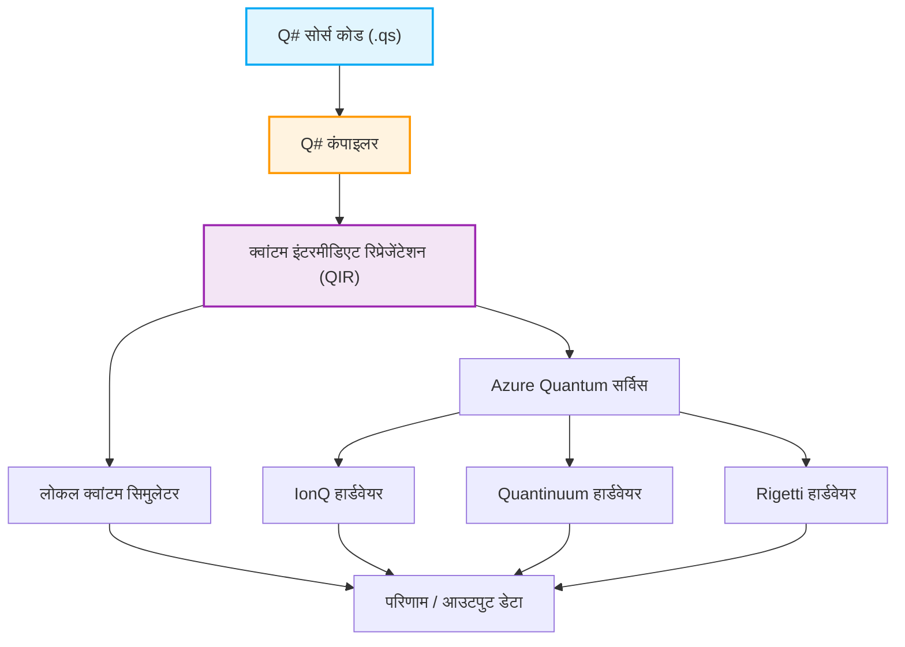

## 1. प्रस्तावना: क्वांटम कंप्यूटिंग की सुबह और प्रोग्रामिंग का नया प्रतिमान (Paradigm)

हाल के वर्षों में, क्वांटम कंप्यूटिंग के क्षेत्र में हार्डवेयर और सॉफ्टवेयर तकनीकी नवाचार उल्लेखनीय रहे हैं। जबकि क्लासिकल कंप्यूटर (जैसे कि पीसी, स्मार्टफोन और सुपरकंप्यूटर जो हम वर्तमान में प्रतिदिन उपयोग करते हैं) सूचनाओं को '0' या '1' के निश्चित बिट संयोजनों के रूप में संसाधित करते हैं, क्वांटम कंप्यूटर सूचना प्रसंस्करण के आधार के रूप में क्वांटम यांत्रिकी की विशिष्ट भौतिक घटनाओं, जैसे 'सुपरपोज़िशन (Superposition)' और 'क्वांटम उलझाव (Entanglement)' का सीधे उपयोग करते हैं। नतीजतन, समस्याओं के विशिष्ट वर्गों के लिए, यह एक ऐसी कम्प्यूटेशनल गति प्राप्त करने की क्षमता दिखाता है जो क्लासिकल कंप्यूटरों के लिए ब्रह्मांड के जीवनकाल जितना समय लेने पर भी अप्राप्य होगी, जिसे 'क्वांटम वर्चस्व (Quantum Supremacy)' या 'क्वांटम लाभ (Quantum Advantage)' कहा जाता है। उदाहरण के लिए, बड़ी संख्याओं का गुणनखंडन (Shor's algorithm), तेज़ डेटाबेस खोज (Grover's algorithm), क्वांटम रसायन विज्ञान सिमुलेशन (VQE algorithm), कॉम्बिनेटोरियल अनुकूलन समस्याएँ, और यहाँ तक कि मशीन लर्निंग की विशिष्ट प्रक्रियाओं (Quantum Machine Learning) में गणना के समय में भारी कमी की उम्मीद है।

हालाँकि, क्वांटम कंप्यूटरों की इस अद्भुत क्षमता को वास्तविक दुनिया के अनुप्रयोगों में लाने के लिए, केवल भौतिक हार्डवेयर (जैसे सुपरकंडक्टिंग क्यूबिट्स और आयन ट्रैप) में प्रगति पर्याप्त नहीं है। क्वांटम सर्किट को सटीक रूप से डिज़ाइन करने और क्वांटम एल्गोरिदम को त्रुटियों के बिना और कुशलता से लिखने के लिए एक 'क्वांटम प्रोग्रामिंग भाषा' और इसका समर्थन करने वाले एक मजबूत विकास, निष्पादन और डिबगिंग वातावरण का होना आवश्यक है। जबकि शास्त्रीय प्रोग्रामिंग भाषाएं (C++, Python, Java, आदि) शास्त्रीय CPU आर्किटेक्चर के व्यवहार को अमूर्त (abstract) करने में उत्कृष्ट हैं, उन्हें क्वांटम अवस्थाओं के संचालन को स्वाभाविक रूप से वर्णित करने के लिए डिज़ाइन नहीं किया गया है, जो गैर-नियतात्मक (non-deterministic) हैं और जिनमें सम्मिश्र (complex) आयाम होते हैं।

इस लेख में, हम क्वांटम विकास किट 'Quantum Development Kit (QDK)' पर ध्यान केंद्रित करेंगे, जिसे Microsoft द्वारा सक्रिय रूप से प्रचारित और ओपन सोर्स के रूप में विकसित किया जा रहा है, और इसकी मुख्य समर्पित प्रोग्रामिंग भाषा 'Q# (क्यू-शार्प)', जो कई क्वांटम प्रोग्रामिंग वातावरणों के बीच एक प्रमुख भूमिका निभाती है।

Q#, क्वांटम एल्गोरिदम लिखने के लिए समर्पित एक डोमेन-विशिष्ट भाषा (Domain Specific Language: DSL) के रूप में, C#, F#, और Python के सर्वोत्तम भागों को अवशोषित करते हुए शून्य से डिज़ाइन की गई थी। इसमें शास्त्रीय नियंत्रण प्रवाह (control flow जैसे if स्टेटमेंट और for लूप) और क्वांटम संचालन (गेट लागू करना और मापन) को निर्बाध रूप से एकीकृत करने की शक्तिशाली क्षमताएं हैं। इस लेख में, हम क्वांटम कंप्यूटिंग के मूलभूत गणितीय मॉडल से शुरू करके, Q# की भाषाई विशेषताओं, Python के Qiskit के साथ डिजाइन दर्शन की तुलना, वास्तविक कोड के साथ 'बेल स्टेट (Bell State: क्वांटम उलझाव अवस्था)' के निर्माण और मापन, और यहाँ तक कि शास्त्रीय भाषाओं (Python और C#) के साथ एकीकरण के तरीकों के बारे में गहराई से और बहुत विस्तार से बताएंगे। इस लेख को पूरा पढ़ने तक, आप क्वांटम प्रोग्रामिंग के मूल सिद्धांतों को समझ चुके होंगे और अपने स्वयं के वातावरण में Q# कोड लिखना शुरू करने के लिए तैयार होंगे।

## 2. क्वांटम कंप्यूटिंग की गणितीय नींव: अवस्थाएँ, सुपरपोज़िशन, और उलझाव

Q# के सिंटैक्स और कार्यक्षमता को गहराई से समझने और प्रभावी क्वांटम प्रोग्राम लिखने के लिए, क्वांटम अवस्थाओं और क्वांटम गेट संचालन के पीछे बुनियादी गणितीय ज्ञान (विशेष रूप से रेखीय बीजगणित) को स्पष्ट करना आवश्यक है। यहाँ, हम क्वांटम प्रोग्रामिंग के लिए आवश्यक मूलभूत गणितीय मॉडल का अवलोकन करेंगे।

### 2.1 क्वांटम बिट (Qubit) और सुपरपोज़िशन अवस्था

जबकि एक शास्त्रीय बिट (Classical Bit) केवल $0$ या $1$ की अवस्था ले सकता है, एक क्वांटम बिट (Qubit) अवस्थाओं $|0\rangle$ और $|1\rangle$ के रैखिक संयोजन (Linear Combination), यानी 'सुपरपोज़िशन' के रूप में व्यक्त किया जाता है। इस अवस्था को ब्रा-केट नोटेशन (Dirac notation) और सम्मिश्र गुणांक $\alpha$ तथा $\beta$ का उपयोग करके निम्नलिखित रूप में लिखा जाता है:

$$ |\psi\rangle = \alpha|0\rangle + \beta|1\rangle $$

यहाँ, $\alpha$ और $\beta$ प्रायिकता आयाम (Probability Amplitudes) कहलाने वाली सम्मिश्र संख्याएँ (Complex Numbers) हैं। जब इस क्यूबिट को मापा जाता है, तो अवस्था $|0\rangle$ के अवलोकन की प्रायिकता $|\alpha|^2$ है, और अवस्था $|1\rangle$ के अवलोकन की प्रायिकता $|\beta|^2$ है। भौतिक बाधाओं के रूप में, सभी संभावित अवस्थाओं का निरीक्षण करने की प्रायिकताओं का योग हमेशा $1$ होना चाहिए, इसलिए इसे निम्नलिखित सामान्यीकरण शर्त (Normalization Condition) को पूरा करना चाहिए:

$$ |\alpha|^2 + |\beta|^2 = 1 $$

एक क्यूबिट की अवस्था को अक्सर 'ब्लोच स्फीयर (Bloch Sphere)' नामक 3D स्पेस में एक इकाई गोले की सतह पर एक बिंदु के रूप में देखा जाता है। उत्तरी ध्रुव $|0\rangle$ से मेल खाता है, दक्षिणी ध्रुव $|1\rangle$ से, और भूमध्य रेखा पर स्थित बिंदु उन अवस्थाओं का प्रतिनिधित्व करते हैं जहाँ $|0\rangle$ और $|1\rangle$ समान प्रायिकता के साथ सुपरपोज़ होते हैं (उदाहरण के लिए, 0 फेज वाली अवस्था $|+\rangle = \frac{1}{\sqrt{2}}(|0\rangle + |1\rangle)$ या $\pi/2$ फेज वाली अवस्था $|i\rangle = \frac{1}{\sqrt{2}}(|0\rangle + i|1\rangle)$ आदि)। क्वांटम गेट संचालन को इस ब्लोच स्फीयर पर रोटेशन संचालन के रूप में ज्यामितीय रूप से समझा जा सकता है।

### 2.2 मल्टी-क्यूबिट्स, टेंसर उत्पाद, और क्वांटम उलझाव

क्वांटम कंप्यूटिंग की वास्तविक शक्ति तब सामने आती है जब कई क्यूबिट्स को मिलाया जाता है। कई क्यूबिट्स से बनी प्रणाली की अवस्था को व्यक्तिगत क्यूबिट्स के अवस्था स्थानों के 'टेंसर उत्पाद (Tensor Product)' द्वारा वर्णित किया जाता है। उदाहरण के लिए, दो क्यूबिट्स से बनी संपूर्ण प्रणाली की अवस्था इस प्रकार है:

$$ |\psi\rangle = \alpha_{00}|00\rangle + \alpha_{01}|01\rangle + \alpha_{10}|10\rangle + \alpha_{11}|11\rangle $$

यहाँ भी सामान्यीकरण शर्त $\sum_{i,j} |\alpha_{ij}|^2 = 1$ लागू होती है। महत्वपूर्ण बात यह है कि n क्यूबिट्स के सिस्टम का पूरी तरह से वर्णन करने के लिए, $2^n$ सम्मिश्र आयामों की आवश्यकता होती है। उदाहरण के लिए, भले ही यह केवल 50 क्यूबिट्स का सिस्टम हो, इसकी अवस्था का प्रतिनिधित्व करने के लिए $2^{50} \approx 10^{15}$ सम्मिश्र संख्याओं की आवश्यकता होगी, जो वर्तमान में दुनिया के सबसे तेज़ सुपरकंप्यूटर की मेमोरी क्षमता से कहीं अधिक है। यही एक कारण है कि क्वांटम कंप्यूटरों को शास्त्रीय कंप्यूटरों पर घातीय लाभ (exponential advantage) प्राप्त है।

'क्वांटम उलझाव (Entanglement)' ऐसी बहु-क्यूबिट अवस्थाओं को संदर्भित करता है जिन्हें व्यक्तिगत क्यूबिट अवस्थाओं के टेंसर उत्पाद के रूप में आसानी से विघटित (गुणनखंडित) नहीं किया जा सकता है। सबसे प्रसिद्ध और महत्वपूर्ण उलझी हुई अवस्थाओं में से एक निम्नलिखित 'बेल अवस्था (Bell State)' है:

$$ |\Phi^+\rangle = \frac{1}{\sqrt{2}}(|00\rangle + |11\rangle) $$

इस अवस्था में, जैसे ही एक क्यूबिट को मापा जाता है और परिणाम $0$ (या $1$) प्राप्त होता है, दूसरे क्यूबिट की अवस्था भी तुरंत दूरी की परवाह किए बिना $0$ (या $1$) के रूप में निर्धारित हो जाती है। यह गैर-स्थानीय सहसंबंध, जिसे आइंस्टीन ने 'दूरी पर डरावनी कार्रवाई (spooky action at a distance)' कहा था, क्वांटम टेलीपोर्टेशन, सुपर-डेंस कोडिंग, क्वांटम क्रिप्टोग्राफ़िक संचार और कई क्वांटम एल्गोरिदम के कुशल निष्पादन में एक मौलिक संसाधन बन जाता है। बाद के अनुभाग में, हम वास्तव में Q# का उपयोग करके इस बेल स्टेट का निर्माण करेंगे।

### 2.3 क्वांटम गेट संचालन और एकात्मक (Unitary) मैट्रिक्स

क्वांटम अवस्थाओं को बदलने वाले संचालन (शास्त्रीय लॉजिक सर्किट में AND, OR, NOT गेट्स के बराबर) को क्वांटम गेट्स कहा जाता है। गणितीय रूप से, क्वांटम गेट्स को सम्मिश्र संख्याओं के मैट्रिक्स के रूप में दर्शाया जाता है, और ये मैट्रिक्स गुणन के रूप में क्वांटम अवस्था के वेक्टर पर कार्य करते हैं। क्वांटम यांत्रिकी के सिद्धांतों के अनुसार, ये मैट्रिक्स हमेशा एकात्मक मैट्रिक्स (Unitary Matrix, वे मैट्रिक्स जो $U^\dagger U = I$ को संतुष्ट करते हैं, जहाँ $U^\dagger$ आसन्न (adjoint) मैट्रिक्स है और $I$ पहचान (identity) मैट्रिक्स है) होने चाहिए। नतीजतन, मापन के अलावा सभी क्वांटम संचालन उत्क्रमणीय (Reversible) होते हैं।

विशिष्ट एकल-क्यूबिट गेट्स:
- **Pauli-X गेट (NOT गेट)**: $|0\rangle$ को $|1\rangle$ में और $|1\rangle$ को $|0\rangle$ में फ़्लिप करता है।
$$ X = \begin{pmatrix} 0 & 1 \\ 1 & 0 \end{pmatrix} $$
- **Pauli-Z गेट (फेज शिफ्ट गेट)**: $|0\rangle$ को अपरिवर्तित छोड़ देता है, लेकिन $|1\rangle$ के चिह्न को उल्टा कर देता है (सापेक्ष फेज में $\pi$ जोड़ता है)।
$$ Z = \begin{pmatrix} 1 & 0 \\ 0 & -1 \end{pmatrix} $$
- **Hadamard गेट (H गेट)**: एक निश्चित अवस्था को सुपरपोज़िशन अवस्था में परिवर्तित करता है।
$$ H = \frac{1}{\sqrt{2}} \begin{pmatrix} 1 & 1 \\ 1 & -1 \end{pmatrix} $$

विशिष्ट दो-क्यूबिट गेट्स:
- **CNOT गेट (कंट्रोल्ड-NOT गेट)**: X गेट (NOT ऑपरेशन) को लक्ष्य बिट (Target Qubit) पर केवल तभी लागू करता है जब नियंत्रण बिट (Control Qubit) $|1\rangle$ हो।
$$ CNOT = \begin{pmatrix} 1 & 0 & 0 & 0 \\ 0 & 1 & 0 & 0 \\ 0 & 0 & 0 & 1 \\ 0 & 0 & 1 & 0 \end{pmatrix} $$

क्वांटम एल्गोरिदम को वांछित संचालन प्राप्त करने के लिए इन मूल एकात्मक मैट्रिक्स को संयोजित करने की प्रक्रिया के डिजाइन के रूप में वर्णित किया जा सकता है।

## 3. Microsoft Quantum Development Kit (QDK) क्या है

Microsoft द्वारा प्रदान किया गया Quantum Development Kit (QDK) क्वांटम कंप्यूटिंग सॉफ्टवेयर विकास का समर्थन करने के लिए एक व्यापक टूलसेट है। यह क्वांटम एल्गोरिदम डिजाइन से लेकर डिबगिंग, अनुकूलन और सिमुलेटर या वास्तविक हार्डवेयर पर निष्पादन तक, पूरे विकास जीवनचक्र का समर्थन करता है।

QDK में निम्नलिखित प्रमुख तत्व शामिल हैं:

1. **Q# कंपाइलर और रनटाइम पर्यावरण**: Q# भाषा में लिखे गए कोड का अत्यधिक विश्लेषण और अनुकूलन किया जाता है, और फिर इसे सिमुलेटर या वास्तविक क्वांटम हार्डवेयर (Azure Quantum के माध्यम से) पर निष्पादन योग्य प्रारूप (जैसे QIR) में परिवर्तित किया जाता है। Q# कंपाइलर क्वांटम कंप्यूटिंग के लिए विशिष्ट स्थिर (static) विश्लेषण करता है, जैसे कार्यों की शुद्धता (purity) की जांच करना और क्यूबिट्स के जीवनचक्र का प्रबंधन करना।
2. **क्वांटम सिमुलेटर**: इसमें एक फुल-स्टेट सिमुलेटर (Full State Simulator) शामिल है जो डेवलपर की स्थानीय मशीन पर क्वांटम अवस्थाओं के विकास का अनुकरण करता है। यह आपको स्थानीय स्तर पर उच्च गति पर दर्जनों क्यूबिट्स के छोटे पैमाने के एल्गोरिदम का परीक्षण और डिबग करने की अनुमति देता है। इसके अलावा, बड़े पैमाने के सर्किट (हजारों से लाखों क्यूबिट्स) की संसाधन आवश्यकताओं का अनुमान लगाने के लिए एक रिसोर्स एस्टिमेटर (Resource Estimator) भी प्रदान किया गया है।
3. **समृद्ध लाइब्रेरी**: Q# स्टैंडर्ड लाइब्रेरी (Standard Library) विभिन्न प्रकार के उन्नत बिल्डिंग ब्लॉक प्रदान करती है, जिसमें बुनियादी क्वांटम गेट (H, X, Y, Z, CNOT, आदि) से लेकर जटिल अंकगणितीय संचालन (क्वांटम एडर आदि), एम्प्लिट्यूड एम्प्लीफिकेशन (Amplitude Amplification), और क्वांटम फेज एस्टिमेशन एल्गोरिदम (Quantum Phase Estimation) शामिल हैं। यह डेवलपर्स को पहिया का फिर से आविष्कार करने से बचाता है।
4. **इंटीग्रेटेड डेवलपमेंट एनवायरनमेंट (IDE) एकीकरण**: Visual Studio और Visual Studio Code के लिए एक्सटेंशन प्रदान किए गए हैं, जो आधुनिक सॉफ्टवेयर विकास के लिए आवश्यक सुविधाओं जैसे सिंटैक्स हाइलाइटिंग, कोड पूर्णता (IntelliSense), शक्तिशाली डिबगिंग क्षमताओं और परीक्षण फ्रेमवर्क के साथ एकीकरण तक पहुंच प्रदान करते हैं।

नीचे एक Mermaid डायग्राम दिया गया है जो Q# प्रोग्राम के लिखे जाने से लेकर हार्डवेयर पर निष्पादित होने तक के वर्कफ़्लो को दर्शाता है।



इस आर्किटेक्चर के बारे में सबसे उत्कृष्ट बिंदु यह है कि यह QIR (क्वांटम इंटरमीडिएट रिप्रेजेंटेशन), जो कि LLVM-आधारित इंटरमीडिएट रिप्रेजेंटेशन है, से गुजरकर अंतर्निहित हार्डवेयर आर्किटेक्चर (सुपरकंडक्टिंग क्यूबिट्स, आयन ट्रैप, टोपोलॉजिकल क्यूबिट्स, फोटोनिक क्वांटम आदि) में अंतर को पूरी तरह से अमूर्त (abstract) कर देता है। डेवलपर्स हार्डवेयर के भौतिक विवरण (प्रत्येक हार्डवेयर के लिए विशिष्ट देशी गेट सेट और टोपोलॉजी) के बारे में चिंता किए बिना एल्गोरिदम के शुद्ध तार्किक डिजाइन पर ध्यान केंद्रित कर सकते हैं। QIR लेयर के बाद कंपाइलर पास स्वचालित रूप से लक्ष्य हार्डवेयर के लिए अनुकूलित गेट्स का ट्रांसपाइलेशन करते हैं।

## 4. Q# बनाम Python/Qiskit: एक नई भाषा की आवश्यकता क्यों है?

क्वांटम प्रोग्रामिंग सीखते समय, कई लोग पहली बार जिस चीज का सामना करते हैं वह है 'Qiskit', IBM द्वारा विकसित एक Python-आधारित फ्रेमवर्क, जो इसकी सुविधा और Python की लोकप्रियता के कारण है। जबकि Qiskit एक अत्यंत शक्तिशाली और व्यापक रूप से उपयोग किया जाने वाला टूल भी है, इसका मूल डिज़ाइन दर्शन (पैराडाइम) Microsoft के Q# से बहुत अलग है।

### Qiskit दृष्टिकोण (Python के माध्यम से सर्किट ऑब्जेक्ट्स का निर्माण)
Qiskit अनिवार्य रूप से 'क्वांटम सर्किट बनाने के लिए एक Python API लाइब्रेरी' है। जब एक डेवलपर Python स्क्रिप्ट चलाता है, तो क्वांटम गेट्स का एक क्रम (सर्किट ऑब्जेक्ट) धीरे-धीरे मेमोरी में इकट्ठा हो जाता है। सभी गेट जोड़े जाने के बाद, अंत में वह विशाल सर्किट ऑब्जेक्ट निष्पादन के लिए बैकएंड (स्थानीय सिमुलेटर या क्लाउड में वास्तविक मशीन) को सबमिट (Submit) किया जाता है।
इस मेटा-प्रोग्रामिंग-जैसे दृष्टिकोण का मुख्य लाभ यह है कि इसे मौजूदा Python पारिस्थितिकी तंत्र (NumPy, SciPy, PyTorch, और विज़ुअलाइज़ेशन टूल जैसी मशीन लर्निंग लाइब्रेरी) के साथ आसानी से एकीकृत किया जा सकता है। हालाँकि, जब एक जटिल नियंत्रण प्रवाह का प्रतिनिधित्व करने की बात आती है जो शास्त्रीय और क्वांटम को मिलाता है, उदाहरण के लिए "एक विशिष्ट क्यूबिट को मापें, और केवल यदि परिणाम 1 है, तो अन्य क्यूबिट्स के समूह पर एक विशिष्ट जटिल एकात्मक ऑपरेशन लागू करें, और एक while लूप चलाएं", आप Python के देशी if स्टेटमेंट और for लूप का उपयोग नहीं कर सकते हैं (क्योंकि उनका मूल्यांकन "सर्किट निर्माण के समय" किया जाएगा), और आपको Qiskit के स्वयं के विशेष नियंत्रण निर्देशों का उपयोग करना होगा, जो कोड को बहुत जटिल और गैर-सहज बनाता है।

### Q# दृष्टिकोण (एक क्वांटम-फर्स्ट डोमेन विशिष्ट भाषा)
दूसरी ओर, Q# एक स्टैंडअलोन संकलित भाषा है जिसे क्वांटम कंप्यूटिंग को प्रथम-श्रेणी के नागरिक (First-class citizen) के रूप में मानने के लिए खरोंच से डिज़ाइन किया गया है। Q# में, आप शास्त्रीय चर संचालन, if स्टेटमेंट और लूप प्रोसेसिंग के समान ही एक ही कोडबेस के भीतर स्वाभाविक और निर्बाध रूप से क्यूबिट आवंटन, गेट संचालन और मापन जैसी प्रक्रियाओं का वर्णन कर सकते हैं।
Q# कंपाइलर पूरे कोड का सांख्यिक रूप से (statically) विश्लेषण करता है और यह निर्धारित करता है कि कौन से भाग क्लासिकल कंप्यूटिंग डिवाइस (होस्ट सीपीयू या नियंत्रण इलेक्ट्रॉनिक्स) पर चलने चाहिए और कौन से भाग क्वांटम को-प्रोसेसर (QPU) पर चलने चाहिए, तथा उच्च स्तरीय अनुकूलन करता है। यह बड़े पैमाने के जटिल क्वांटम एल्गोरिदम के कार्यान्वयन में उच्च मॉड्यूलरिटी, पठनीयता, रखरखाव और टाइप सुरक्षा (Type Safety) को सक्षम बनाता है। Q# "सर्किट लिखने" के लिए भाषा नहीं है, बल्कि "एल्गोरिदम लिखने" के लिए एक भाषा है।

## 5. Q# का मूल सिंटैक्स और विशिष्ट अवधारणाओं में गहराई से उतरना

Q# का सिंटैक्स C# के कर्ली ब्रेसिज़ `{}` के साथ ब्लॉक संरचनाओं, F# के कार्यात्मक प्रोग्रामिंग तत्वों, और शक्तिशाली प्रकार अनुमान (type inference) को मिलाकर एक बहुत ही परिष्कृत डिज़ाइन है। यहाँ, हम Q# को गहराई से समझने के लिए महत्वपूर्ण कीवर्ड और अवधारणाओं की विस्तार से व्याख्या करेंगे।

### 5.1 `operation` और `function` का सख्त भेद
Q# में, प्रसंस्करण के ब्लॉकों (सबरूटीन) को परिभाषित करने के लिए दो प्रकारों का कड़ाई से उपयोग किया जाता है: `operation` और `function`। यह कार्यात्मक प्रोग्रामिंग में 'शुद्धता (Purity)' की अवधारणा से उपजा है।
- **`function`**: यह एक शुद्ध फ़ंक्शन है जो केवल नियतात्मक (Deterministic) शास्त्रीय गणना करता है। यदि आप समान इनपुट पैरामीटर प्रदान करते हैं, तो यह हमेशा वही आउटपुट परिणाम लौटाएगा, चाहे इसे कितनी भी बार निष्पादित किया जाए। `function` के अंदर, क्वांटम संचालन (साइड इफ़ेक्ट वाले संचालन) जैसे क्यूबिट आवंटित करना, गेट लगाना या मापना, संकलन त्रुटि (compile error) का कारण बनेंगे। इसका उपयोग गणितीय कार्यों की गणना या डेटा को बदलने के लिए किया जाता है।
- **`operation`**: यह एक गैर-नियतात्मक (Non-deterministic) रूटीन है जिसमें क्वांटम गणना शामिल है। इसमें क्वांटम बिट संचालन और मापन शामिल हैं, और समान इनपुट के साथ भी, क्वांटम यांत्रिकी की संभाव्य प्रकृति (जैसे मापन के कारण वेव फ़ंक्शन का ढहना) के कारण परिणाम बदल सकते हैं। क्वांटम एल्गोरिदम के सभी मुख्य भाग `operation` के रूप में परिभाषित किए गए हैं।

### 5.2 `Qubit` प्रकार और `use` कीवर्ड के साथ जीवनचक्र प्रबंधन
Q# में, क्यूबिट्स को `Qubit` प्रकार के 'अपारदर्शी (Opaque)' ऑब्जेक्ट के रूप में माना जाता है। डेवलपर्स को जानबूझकर सीधे उनके आंतरिक अवस्था की प्रायिकता आयाम (जैसे $\alpha$ या $\beta$ मान) को पढ़ने या फिर से लिखने से मना किया जाता है (यह भौतिक वास्तविकता के क्वांटम सिस्टम में 'मापन समस्या' के अनुरूप है)। क्यूबिट के साथ बातचीत करने का एकमात्र तरीका प्रदान किए गए क्वांटम गेट संचालन या मापन कार्यों को कॉल करना है।

किसी प्रोग्राम के भीतर नए क्वांटम बिट्स को आवंटित (allocate) करने के लिए, `use` कीवर्ड का उपयोग किया जाता है (Q# के पुराने संस्करणों में इसे `using` कहा जाता था)। `use` ब्लॉक क्यूबिट के दायरे (scope) और जीवनचक्र को स्पष्ट रूप से परिभाषित करता है।
एक महत्वपूर्ण नियम के रूप में, जब आप किसी `use` ब्लॉक से बाहर निकलते हैं, तो उस ब्लॉक के अंदर आवंटित किए गए सभी क्यूबिट्स पूरी तरह से $|0\rangle$ अवस्था में वापस आने चाहिए (अन्यथा रनटाइम अपवाद (exception) होगा)। यह क्यूबिट्स के पुन: उपयोग को सुनिश्चित करने और मेमोरी लीक को रोकने के लिए Q# का एक शक्तिशाली सुरक्षा तंत्र है।

### 5.3 मापन `M` और सुविधाजनक `MResetZ`
क्वांटम अवस्थाओं को शास्त्रीय जानकारी (0 या 1) में परिवर्तित करने के लिए मापन (Measurement) ऑपरेशन `M` नामक मूल ऑपरेशन का उपयोग करके किया जाता है। Z-आधार (मानक आधार) में माप परिणाम एक गणना (enum) प्रकार, `Result` प्रकार (जिसका मान `Zero` या `One` होता है) के रूप में वापस किया जाता है।
हालाँकि, जैसा कि पहले उल्लेख किया गया है, क्यूबिट्स को रिलीज़ करते समय $|0\rangle$ अवस्था में होने की आवश्यकता होती है। यदि आप केवल मापन `M` करते हैं और परिणाम `One` आता है, तो क्यूबिट $|1\rangle$ अवस्था में ढह गया है। इसलिए, व्यावहारिक कोड में, एक सुविधाजनक मानक ऑपरेशन जिसे `MResetZ` कहा जाता है, जिसका उपयोग माप करने के तुरंत बाद क्यूबिट की अवस्था को विश्वसनीय रूप से $|0\rangle$ पर रीसेट करने के लिए किया जाता है, बहुत बार किया जाता है।

### 5.4 चर की अपरिवर्तनीयता (Immutability) और `mutable`
चूंकि Q# कार्यात्मक प्रोग्रामिंग से काफी प्रभावित है, इसलिए डिफ़ॉल्ट रूप से सभी चर अपरिवर्तनीय (Immutable) होते हैं। एक बार जब कोई चर `let` कीवर्ड के साथ बांध दिया जाता है, तो उसके बाद इसका मान बदला नहीं जा सकता है। यह समानांतर प्रसंस्करण (parallel processing) और क्वांटम एल्गोरिदम में अनपेक्षित दुष्प्रभावों (side effects) को कम करता है।
यदि आप किसी ऐसे चर की घोषणा करना चाहते हैं जिसके मान को अपडेट करने की आवश्यकता है, जैसे कि लूप काउंटर या संचयी गणना, तो स्पष्ट रूप से `mutable` कीवर्ड का उपयोग करें, और मान को अपडेट करने के लिए `set` कीवर्ड का उपयोग करें।

## 6. अभ्यास: Q# के साथ बेल अवस्था (क्वांटम उलझाव) बनाना और मापना

तो चलिए अब तक सीखे गए ज्ञान का उपयोग करके वास्तव में Q# का उपयोग करके 'बेल स्टेट (Bell State)' बनाते हैं, जिसे हमने गणित अनुभाग में समझाया था, और इसे मापने के लिए एक प्रोग्राम लिखते हैं। यह क्वांटम प्रोग्रामिंग में 'Hello World' कहे जा सकने वाले एक बहुत ही महत्वपूर्ण कदम है।

### क्वांटम सर्किट का डिज़ाइन और स्पष्टीकरण
बेल अवस्था $\frac{1}{\sqrt{2}}(|00\rangle + |11\rangle)$ बनाने के लिए मानक क्वांटम सर्किट प्रक्रिया इस प्रकार है:
1. प्रारंभिक अवस्था $|00\rangle$ में दो क्यूबिट $q_0$ और $q_1$ तैयार करें।
2. $q_0$ पर Hadamard गेट ($H$ गेट) लागू करें। इसके परिणामस्वरूप, $q_0$ समान प्रायिकता के साथ $|0\rangle$ और $|1\rangle$ की सुपरपोज़िशन अवस्था $\frac{1}{\sqrt{2}}(|0\rangle + |1\rangle)$ में आ जाता है। इस बिंदु पर संपूर्ण सिस्टम की अवस्था $\frac{1}{\sqrt{2}}(|0\rangle + |1\rangle) \otimes |0\rangle = \frac{1}{\sqrt{2}}(|00\rangle + |10\rangle)$ है।
3. CNOT (नियंत्रित-NOT) गेट को $q_0$ को नियंत्रण बिट (Control) और $q_1$ को लक्ष्य बिट (Target) के रूप में सेट करके लागू करें। यह $q_1$ को तभी फ़्लिप करता है जब $q_0$ $|1\rangle$ हो। नतीजतन, अवस्था $|00\rangle$ $|00\rangle$ बनी रहती है, अवस्था $|10\rangle$ $|11\rangle$ में बदल जाती है, और संपूर्ण सिस्टम की अंतिम अवस्था $\frac{1}{\sqrt{2}}(|00\rangle + |11\rangle)$ हो जाती है। यह पूर्ण सहसंबंध के साथ उलझी हुई अवस्था का पूर्ण रूप है।

### Q# के साथ कार्यान्वयन कोड

नीचे एक व्यावहारिक कार्यान्वयन उदाहरण दिया गया है जो बेल अवस्था उत्पन्न करने और एक निर्दिष्ट संख्या में मापन प्रयोगों को दोहराकर इसके आँकड़े (प्रायिकता वितरण) प्राप्त करने के लिए Q# का उपयोग करता है।

```qsharp
namespace Quantum.BellState {
    
    // आवश्यक नेमस्पेस को आयात (import) करें
    open Microsoft.Quantum.Intrinsic;
    open Microsoft.Quantum.Canon;
    open Microsoft.Quantum.Measurement;
    open Microsoft.Quantum.Diagnostics;

    /// # Summary
    /// एक बेल अवस्था उत्पन्न करता है और Z आधार में दो क्यूबिट्स को मापता है।
    ///
    /// # Output
    /// (Result, Result): qubit1 और qubit2 के माप परिणाम। यदि यह बेल स्टेट है, तो वे हमेशा मेल खाएंगे।
    operation GenerateAndMeasureBellState() : (Result, Result) {
        
        // 2 क्यूबिट्स आवंटित करें (प्रारंभिक अवस्था स्वचालित रूप से |00> है)
        use (q1, q2) = (Qubit(), Qubit());
        
        // q1 पर Hadamard गेट लागू करें ताकि सुपरपोज़िशन अवस्था बन सके
        H(q1);
        
        // q1 को कंट्रोल बिट और q2 को टारगेट बिट के रूप में उपयोग करके CNOT गेट लागू करें
        // यह q1 और q2 के बीच क्वांटम उलझाव (एंटैंगलमेंट) उत्पन्न करता है
        CNOT(q1, q2);
        
        // विकास के दौरान डिबगिंग के लिए, आप जाँच करने हेतु सिमुलेटर के भीतर स्टेट वेक्टर को डंप कर सकते हैं
        // DumpMachine(); // आवश्यकतानुसार कमेंट हटाएँ
        
        // मापन करें और साथ ही क्यूबिट्स को सुरक्षित रूप से रिलीज़ करने के लिए अवस्था को |0> पर रीसेट करें
        let res1 = MResetZ(q1);
        let res2 = MResetZ(q2);
        
        // माप परिणामों की जोड़ी लौटाएँ
        return (res1, res2);
    }

    /// # Summary
    /// मुख्य रूटीन जो बेल स्टेट जनरेशन और मापन प्रयोगों को कई बार चलाता है, और परिणामों के आँकड़े एकत्र करता है।
    ///
    /// # Input
    /// ## count
    /// प्रयोग को दोहराने की संख्या (उदाहरण: 1000 बार)
    ///
    /// # Output
    /// (Int, Int, Int, Int): क्रमशः (00, 01, 10, 11) के देखे जाने की संख्या
    @EntryPoint()
    operation RunBellStateExperiment(count: Int) : (Int, Int, Int, Int) {
        
        // अवलोकन की संख्या गिनने के लिए परिवर्तनशील (mutable) चरों को आरंभ करें
        mutable num00 = 0;
        mutable num01 = 0;
        mutable num10 = 0;
        mutable num11 = 0;

        // प्रयोग लूप को निर्दिष्ट संख्या में चलाएँ
        for _ in 1..count {
            // बेल अवस्था उत्पन्न करें और माप परिणाम प्राप्त करें
            let (r1, r2) = GenerateAndMeasureBellState();
            
            // परिणाम पैटर्न की गिनती बढ़ाएँ
            if r1 == Zero and r2 == Zero {
                set num00 += 1;
            } elif r1 == Zero and r2 == One {
                set num01 += 1;
            } elif r1 == One and r2 == Zero {
                set num10 += 1;
            } else { // r1 == One and r2 == One के मामले में
                set num11 += 1;
            }
        }

        // एकत्र किए गए आँकड़ों को कंसोल पर एक संदेश के रूप में आउटपुट करें
        Message($"--- Experiment Results ---");
        Message($"Total runs: {count}");
        Message($"00 observed: {num00}");
        Message($"01 observed: {num01}");
        Message($"10 observed: {num10}");
        Message($"11 observed: {num11}");

        return (num00, num01, num10, num11);
    }
}
```

### कोड स्पष्टीकरण और ऑपरेशन जाँच
- `namespace`: Java या C# के समान, यह तार्किक रूप से प्रोग्राम को व्यवस्थित करने और नाम टकराव (name collisions) को रोकने के लिए नेमस्पेस की घोषणा है।
- `open`: आवश्यक लाइब्रेरी (मॉड्यूल) आयात करता है। `Microsoft.Quantum.Intrinsic` में H, X, Y, Z, और CNOT जैसे मूलभूत क्वांटम गेट्स शामिल हैं, और `Microsoft.Quantum.Measurement` में `MResetZ` जैसे सुविधाजनक मापन-संबंधित कार्य शामिल हैं।
- `use (q1, q2) = (Qubit(), Qubit());`: गतिशील रूप से 2 क्यूबिट आवंटित करता है।
- `H(q1); CNOT(q1, q2);`: ये दो पंक्तियाँ मुख्य भाग हैं जो क्वांटम उलझाव उत्पन्न करती हैं। इसे बहुत ही सरल और सहजता से लिखा जा सकता है।
- `let res1 = MResetZ(q1);`: जैसा कि पहले उल्लेख किया गया है, `MResetZ` माप परिणाम को एक चर से बांधता है और साथ ही क्यूबिट की अवस्था को बलपूर्वक $|0\rangle$ पर रीसेट करता है। यह `use` ब्लॉक के अंत में क्यूबिट्स को सुरक्षित रूप से मुक्त करने की अनुमति देता है।
- `@EntryPoint()`: इस विशेषता को जोड़ने से कंपाइलर को पता चलता है कि यह ऑपरेशन प्रोग्राम के निष्पादन का प्रारंभिक बिंदु है (जैसे C भाषा में main फ़ंक्शन)।

सिद्धांत रूप में, चूंकि उत्पन्न अवस्था बेल अवस्था $\frac{1}{\sqrt{2}}(|00\rangle + |11\rangle)$ है, यदि आप इस प्रोग्राम को पर्याप्त बार (उदाहरण के लिए 10,000 बार) चलाते हैं, तो `00` और `11` प्रत्येक लगभग 50% (लगभग 5,000 बार) देखे जाएंगे, और `01` और `10` 0 बार देखे जाएंगे (सिद्धांत रूप में, यदि कोई त्रुटि न हो तो वे बिल्कुल नहीं देखे जाने चाहिए)। यह इस बात का प्रमाण है कि दोनों क्यूबिट्स के बीच गहरा सहसंबंध (उलझाव) है।

## 7. होस्ट भाषाओं (Python / C#) के साथ सहज एकीकरण

जबकि पिछले उदाहरण में दिखाए गए अनुसार Q# को `@EntryPoint()` निर्दिष्ट करके स्टैंडअलोन चलाया जा सकता है, वास्तविक दुनिया के उद्यम विकास या अनुसंधान उपयोग के मामलों में इसका उपयोग अक्सर फ्रंट-एंड GUI, विशाल डेटाबेस से डेटा पुनर्प्राप्ति, या मशीन लर्निंग ऑप्टिमाइज़ेशन लूप (जैसे VQE के लिए पैरामीटर अपडेट) जैसे शास्त्रीय प्रसंस्करण के साथ निकट संयोजन में किया जाता है। इसलिए, Q# एक परिष्कृत इंटरऑपरेबिलिटी (Interoperability) प्रदान करता है जो सीधे होस्ट भाषाओं, जैसे कि Python या C# (.NET) से इसे कॉल करना और निष्पादित करना अत्यंत आसान बनाता है।

### 7.1 Python से कॉल करने का उदाहरण: डेटा वैज्ञानिकों के लिए
डेटा विज्ञान, मशीन लर्निंग और भौतिकी अनुसंधान की दुनिया में भारी हिस्सेदारी वाले Python से Q# को कॉल करने के लिए, `qsharp` Python पैकेज का उपयोग किया जाता है। इसकी Jupyter Notebook के साथ उच्च अनुकूलता है, जो इसे संवादात्मक विकास और डेटा विज़ुअलाइज़ेशन के साथ संयोजन के लिए आदर्श बनाती है।

```python
# 1. आवश्यक Q# एकीकरण मॉड्यूल आयात करें
import qsharp

# 2. Q# संचालन को सीधे ऐसे आयात करें मानो वे Python कार्य हों
# (कंपाइलर पृष्ठभूमि में स्वचालित रूप से बाइंडिंग और संकलन को संभालता है)
from Quantum.BellState import RunBellStateExperiment

# 3. Python स्क्रिप्ट से कॉल करके निष्पादित करें (सिमुलेटर का उपयोग करके)
count = 1000
print(f"Starting quantum simulation for {count} iterations...")

# simulate() विधि को कॉल करके इसे स्थानीय सिमुलेटर पर चलाएँ
result = RunBellStateExperiment.simulate(count=count)

# परिणामों का टपल प्राप्त करें, इसे प्रारूपित करें और Python पक्ष पर आउटपुट दें
print("\n--- Simulation Results ---")
print(f"|00> : {result[0]} (Expected ~500)")
print(f"|01> : {result[1]} (Expected 0)")
print(f"|10> : {result[2]} (Expected 0)")
print(f"|11> : {result[3]} (Expected ~500)")
```
इस तरह, चूंकि Q# कंपाइलर और इंटरप्रेटर C API के माध्यम से पारदर्शी रूप से पृष्ठभूमि में गतिशील रूप से बाइंडिंग उत्पन्न करते हैं, Python कोड पक्ष से आप क्वांटम एल्गोरिदम को सिर्फ एक ब्लैक-बॉक्स फ़ंक्शन के रूप में मान सकते हैं, और शास्त्रीय-क्वांटम हाइब्रिड एल्गोरिदम का निर्माण करना बहुत आसान हो जाता है।

### 7.2 C# से कॉल करने का उदाहरण: एंटरप्राइज़ विकास के लिए
आप ठीक उसी तरह से शक्तिशाली C# से Q# कोड को एकीकृत कर सकते हैं, जिसका उपयोग अक्सर बड़े पैमाने के बैकएंड सिस्टम और एंटरप्राइज़ एप्लिकेशन विकास में किया जाता है। Q# प्रोजेक्ट (.csproj) और C# प्रोजेक्ट को एक ही समाधान में रखकर और उनके बीच संदर्भ बनाकर, C# के लिए क्लास रैपर निर्माण के समय स्वचालित रूप से उत्पन्न हो जाते हैं।

```csharp
using System;
using System.Threading.Tasks;
using Microsoft.Quantum.Simulation.Simulators; // क्वांटम सिमुलेटर नेमस्पेस
using Quantum.BellState; // Q# में परिभाषित नेमस्पेस

namespace QuantumRunner
{
    class Program
    {
        static async Task Main(string[] args)
        {
            // फुल-स्टेट क्वांटम सिमुलेटर का उदाहरण (Instance) बनाएँ
            // चूंकि यह IDisposable को लागू करता है, उचित संसाधन प्रबंधन के लिए using कथन का उपयोग करें
            using var sim = new QuantumSimulator();
            
            long count = 1000;
            Console.WriteLine($"Running {count} iterations of Bell State generation...");

            // Q# ऑपरेशन को असिंक्रोनस रूप से निष्पादित करें। Run विधि स्वतः उत्पन्न होती है।
            // sim को निष्पादन लक्ष्य के रूप में पास करें, और count को तर्क (argument) के रूप में पास करें।
            var result = await RunBellStateExperiment.Run(sim, count);

            // परिणाम C# ValueTuple के रूप में लौटाया जाता है
            Console.WriteLine($"|00>: {result.Item1}");
            Console.WriteLine($"|01>: {result.Item2}");
            Console.WriteLine($"|10>: {result.Item3}");
            Console.WriteLine($"|11>: {result.Item4}");
        }
    }
}
```
यहाँ, विकास के उद्देश्यों के लिए स्थानीय `QuantumSimulator` वर्ग का उपयोग किया जाता है, लेकिन जब आप उत्पादन वातावरण में जाते हैं, तो आपको बस इस सिमुलेटर इंस्टेंटिएशन भाग को क्लाउड लक्ष्य प्रदाता (उदाहरण के लिए, IonQ या Quantinuum की मशीन ऑब्जेक्ट्स) से बदलना होगा जो Azure Quantum वर्कस्पेस को इंगित करता है। आप Q# कोड या व्यावसायिक तर्क को बिल्कुल भी बदले बिना क्लाउड में वास्तविक क्वांटम हार्डवेयर पर एल्गोरिदम निष्पादित कर सकते हैं। यह QDK का असली सार है।

## 8. उन्नत विषय: Q# के डिजाइन दर्शन को मूर्त रूप देने वाली विशेषताएं

हमने Q# के मूल उपयोग को देखा है, लेकिन आइए यहाँ कुछ अधिक उन्नत सुविधाओं और डिजाइन दर्शन में गहराई से गोता लगाएँ। यही वे विशेषताएँ हैं जो Q# को सिर्फ 'Python के विकल्प' से बढ़कर एक सच्चा क्वांटम डोमेन-विशिष्ट भाषा बनाती हैं।

### 8.1 स्वचालित व्युत्क्रम (Adjoint) और नियंत्रित संचालन (Controlled) उत्पादन
क्वांटम कंप्यूटिंग की प्रमुख विशेषताओं में से एक एकात्मकता (Unitarity) से प्राप्त 'उत्क्रमणीयता (Reversibility)' है। मापन को छोड़कर सभी मूलभूत संचालन एकात्मक मैट्रिक्स हैं, जिसका अर्थ है कि उनका हमेशा एक व्युत्क्रम (प्रतिलोम मैट्रिक्स) होता है और उन्हें उलटा किया जा सकता है। Q# शक्तिशाली फ़ंक्टर संशोधक (functor modifiers) `Adjoint` (व्युत्क्रम/आसन्न) और `Controlled` (नियंत्रित संचालन) प्रदान करता है जो इसे भाषा-स्तर की प्रथम-श्रेणी की सुविधा के रूप में समर्थन करते हैं।

किसी दिए गए क्वांटम ऑपरेशन `Op` के लिए, आपको मैन्युअल रूप से मैट्रिक्स की गणना करने या उसके रिवर्स (अनडू) ऑपरेशन को लागू करने के लिए गेट्स के क्रम को उलटने की आवश्यकता नहीं है। बस फ़ंक्शन हस्ताक्षर (signature) में विशिष्ट कीवर्ड जोड़ें, और Q# कंपाइलर स्वचालित रूप से आपके लिए `Adjoint Op` उत्पन्न करेगा। इसके अलावा, एक सशर्त संचालन `Controlled Op` जो `Op` को केवल तभी निष्पादित करता है जब सभी विशिष्ट क्यूबिट्स $|1\rangle$ हों, स्वचालित रूप से उसी तरह उत्पन्न किया जा सकता है।

```qsharp
// 'is Adj + Ctl' जोड़कर, यह कंपाइलर को व्युत्क्रम और नियंत्रित संचालन स्वचालित रूप से उत्पन्न करने का निर्देश देता है
operation MyComplexSubroutine(qubits: Qubit[]) : Unit is Adj + Ctl {
    // यहाँ एक बहुत ही जटिल क्वांटम गेट अनुक्रम का वर्णन करें
    // उदाहरण: H, T, CNOT, मनमाने चरण बदलाव (arbitrary phase shift) आदि का संयोजन।
    // ...
}

// कॉलिंग साइड का उदाहरण
operation UseMyOp(controlQubit: Qubit, targetQubits: Qubit[]) : Unit {
    
    // सामान्य कॉल
    MyComplexSubroutine(targetQubits);
    
    // व्युत्क्रम संचालन का निष्पादन: इसे पूरी तरह से इसकी मूल स्थिति में रिवाइंड करें (uncomputation के लिए बहुत उपयोगी)
    Adjoint MyComplexSubroutine(targetQubits);
    
    // नियंत्रित संचालन का निष्पादन: केवल तभी जटिल सबरूटीन चलाएँ जब controlQubit |1> हो
    Controlled MyComplexSubroutine([controlQubit], targetQubits);
    
    // इसके अलावा, नियंत्रित संचालन के व्युत्क्रम संचालन जैसे संयोजन भी संभव हैं!
    Controlled Adjoint MyComplexSubroutine([controlQubit], targetQubits);
}
```
इस सुविधा के साथ, उन्नत एल्गोरिदम का कार्यान्वयन जो अक्सर जटिल सबरूटीन और उनके व्युत्क्रम संचालन (uncomputation: अनावश्यक उलझाव को सुलझाने के लिए) का उपयोग करते हैं, जैसे कि ग्रोवर के खोज एल्गोरिदम के ओरेकल कार्यान्वयन और शोर के फैक्टरिंग एल्गोरिदम को नाटकीय रूप से सरल बनाया गया है, और यह मानव त्रुटियों और बगों के लिए जगह को काफी कम कर देता है। Qiskit जैसे सर्किट बिल्डिंग मॉडल की तुलना में इसे एल्गोरिदम विवरण भाषा के रूप में Q# की सबसे बड़ी ताकतों में से एक कहा जा सकता है।

### 8.2 संसाधन अनुमान (Resource Estimation) और भविष्य की तैयारी
वर्तमान क्वांटम कंप्यूटर विकास के चरण में हैं जिन्हें "NISQ (Noisy Intermediate-Scale Quantum)" कहा जाता है, जहाँ उपलब्ध क्यूबिट्स की संख्या केवल कुछ दर्जन से कुछ सौ तक छोटी है, और त्रुटि दर उच्च है। हालाँकि, भविष्य के दोष-सहिष्णु क्वांटम कंप्यूटरों (FTQC: Fault-Tolerant Quantum Computer) के युग की प्रतीक्षा करते हुए, पहले से सटीक अनुमान लगाना अत्यंत महत्वपूर्ण हो जाता है कि किसी नए एल्गोरिदम को चलाने के लिए "कितने तार्किक क्यूबिट्स की आवश्यकता होगी", "त्रुटि सुधार में बहुत महंगे T गेट्स या Toffoli गेट्स का कितनी बार उपयोग किया जाएगा", और "निष्पादन समय क्या होगा"।

QDK में निष्पादन परिवेश लक्ष्यों में से एक के रूप में एक "रिसोर्स एस्टिमेटर (Resource Estimator)" शामिल है। इसका उपयोग करके, कोड के तार्किक पथ का विश्लेषण करके भारी-भरकम फुल-स्टेट सिमुलेटर या वास्तविक मशीन पर चलाए बिना बड़े पैमाने के एल्गोरिदम के लिए आवश्यक संसाधनों की तुरंत गणना और आउटपुट करना संभव है। यह एल्गोरिदम डिजाइनरों और शोधकर्ताओं को हजारों या दसियों हजार क्यूबिट्स की आवश्यकता वाले भविष्य के एल्गोरिदम के लिए भी न केवल सैद्धांतिक कम्प्यूटेशनल जटिलता के मामले में, बल्कि विशिष्ट गेट-स्तरीय अनुकूलन पर तेजी से पुनरावृत्ति (iterate) करने की अनुमति देता है।

## 9. निष्कर्ष: सॉफ्टवेयर इंजीनियरों की अगली पीढ़ी से उम्मीदें

क्वांटम कंप्यूटिंग आइंस्टीन, श्रोडिंगर और फेनमैन जैसे भौतिकविदों के दिमाग में एक शुद्ध सैद्धांतिक अवधारणा से तेजी से क्लाउड इन्फ्रास्ट्रक्चर (Azure Quantum, AWS Braket, IBM Quantum, आदि) के माध्यम से एक ठोस इंजीनियरिंग कार्यान्वयन डोमेन में बदल रही है, जिसे दुनिया में कोई भी व्यक्ति ब्राउज़र या कमांड लाइन से एक्सेस कर सकता है। हार्डवेयर के विकास की गति आश्चर्यजनक है, और कई विशेषज्ञों का अनुमान है कि वह दिन कुछ ही वर्षों में आएगा जब "उपयोगी" क्वांटम वर्चस्व साबित हो जाएगा।

इस लेख में पेश की गई Microsoft की Q# भाषा शास्त्रीय प्रोग्रामिंग की दुनिया (मजबूत टाइपिंग, कार्यात्मक प्रोग्रामिंग तत्वों, मॉड्यूलराइजेशन, एनकैप्सुलेशन और उन्नत IDE समर्थन) में दशकों से विकसित उत्कृष्ट प्रथाओं को क्वांटम प्रोग्रामिंग की पूरी तरह से नई दुनिया में खूबसूरती से लाती है। Q# सीखने और क्वांटम एल्गोरिदम को लागू करने की प्रक्रिया में, हम गहरी अंतर्दृष्टि प्राप्त कर सकते हैं जो कंप्यूटर विज्ञान और भौतिकी की जड़ों तक जाती है, जैसे "अवस्था क्या है?", "अवलोकन क्या है?", और "अंतरिक्ष में सूचना कैसे फैलती है?"। यह एक ऐसा अनुभव है जो कौशल विकास से परे जाता है और अत्यधिक बौद्धिक उत्साह के साथ आता है।

निकट भविष्य में, जिस तरह वर्तमान मशीन लर्निंग इंजीनियर GPUs की समानांतर कंप्यूटिंग शक्ति को बाहर लाने के लिए PyTorch और TensorFlow का उपयोग कर रहे हैं, उसी तरह अगली पीढ़ी के "क्वांटम सॉफ्टवेयर इंजीनियर" निश्चित रूप से QPU (क्वांटम प्रोसेसिंग यूनिट) की पारलौकिक कंप्यूटिंग क्षमताओं को बाहर लाने के लिए Q# और Qiskit का उपयोग करेंगे, ताकि मानव-स्तरीय विशाल चुनौतियों से निपटा जा सके, जैसे कि सामग्री विज्ञान के माध्यम से नई सामग्रियों की खोज, दवा की खोज में आणविक सिमुलेशन, जलवायु परिवर्तन मॉडलिंग और वित्त में जोखिम अनुकूलन।

हम वर्तमान में पारंपरिक वेब अनुप्रयोगों, मोबाइल ऐप्स या डेटा विश्लेषण को मुख्य रूप से संभालने वाले सॉफ़्टवेयर डेवलपर्स को इस अवसर को लेने और क्वांटम प्रोग्रामिंग की दुनिया में कदम रखने के लिए दृढ़ता से प्रोत्साहित करते हैं। सबसे पहले, आप क्वांटम यांत्रिकी (सुपरपोज़िशन, उलझाव, और संभाव्य व्यवहार) के विशिष्ट सहज-विरोधी (counterintuitive) घटनाओं से भ्रमित हो सकते हैं। हालाँकि, Q# नामक एक परिष्कृत समर्पित भाषा और QDK नामक एक शक्तिशाली टूलचेन आपके सीखने की अवस्था को निश्चित रूप से और दृढ़ता से समर्थन देगा।

## 10. गहराई से सीखने के लिए संदर्भ लिंक

आपकी क्वांटम प्रोग्रामिंग यात्रा को जारी रखने के लिए कुछ बेहतरीन संसाधन यहाँ दिए गए हैं।

- [Microsoft Azure Quantum आधिकारिक दस्तावेज़ीकरण](https://learn.microsoft.com/azure/quantum/): QDK और Azure Quantum के लिए व्यापक दस्तावेज़ीकरण पोर्टल।
- [Q# उपयोगकर्ता मार्गदर्शिका और संदर्भ](https://learn.microsoft.com/azure/quantum/user-guide/): Q# सिंटैक्स, प्रकार प्रणाली और मानक लाइब्रेरी का पूर्ण संदर्भ।
- [Quantum Katas](https://quantum.microsoft.com/en-us/experience/quantum-katas): Microsoft द्वारा प्रदान किए गए ओपन सोर्स ट्यूटोरियल। टेस्ट-ड्रिवेन डेवलपमेंट (TDD) प्रारूप में वास्तविक Q# कोड लिखते हुए इंटरैक्टिव रूप से क्वांटम कंप्यूटिंग की बुनियादी अवधारणाओं (क्वांटम गेट, मापन, एल्गोरिदम निर्माण) को स्व-सिखाने के लिए यह एक शानदार संसाधन है।
- [Q# GitHub रिपॉजिटरी](https://github.com/microsoft/qsharp-compiler): Q# भाषा कंपाइलर और मानक लाइब्रेरी स्वयं भी ओपन सोर्स के रूप में सक्रिय रूप से विकसित किए जा रहे हैं। कंपाइलर की आंतरिक संरचना में रुचि रखने वालों के लिए इसे देखना आवश्यक है।

क्वांटम कंप्यूटिंग का भविष्य अभी शुरू हुआ है और यह असीम संभावनाओं से भरा है। नए प्रोग्रामिंग प्रतिमान (paradigm) का आनंद लेने के मन के साथ Q# में प्रोग्रामिंग की चुनौती लेने के लिए स्वतंत्र महसूस करें!
