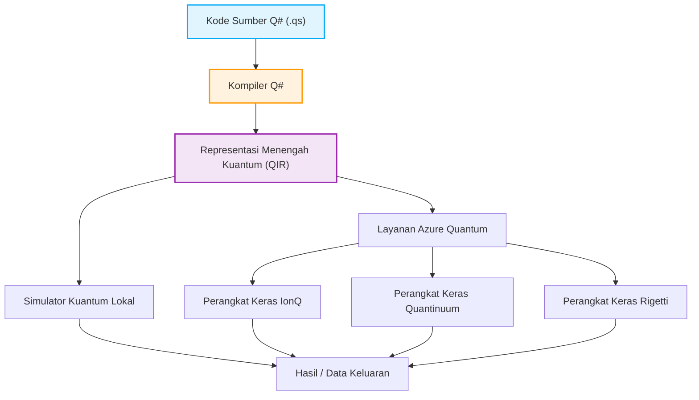

## 1. Pendahuluan: Fajar Komputasi Kuantum dan Paradigma Pemrograman Baru

Dalam beberapa tahun terakhir, inovasi teknologi perangkat keras dan perangkat lunak di bidang komputasi kuantum sangat luar biasa. Sementara komputer klasik (seperti PC, ponsel pintar, dan superkomputer yang kita gunakan sehari-hari) memproses informasi menggunakan kombinasi bit pasti "0" atau "1", komputer kuantum secara langsung memanfaatkan fenomena fisik yang khas dari mekanika kuantum, seperti "Superposisi (Superposition)" dan "Keterikatan Kuantum (Entanglement)" sebagai dasar pemrosesan informasi. Dengan ini, untuk masalah kelas tertentu, komputer kuantum berpotensi mencapai kecepatan komputasi yang tidak dapat dicapai oleh komputer klasik bahkan dalam waktu seumur alam semesta, yang dikenal sebagai "Supremasi Kuantum (Quantum Supremacy)" atau "Keunggulan Kuantum (Quantum Advantage)". Misalnya, pemangkasan jumlah komputasi secara dramatis diharapkan pada proses faktorisasi prima bilangan raksasa (Algoritma Shor), pencarian basis data berkecepatan tinggi (Algoritma Grover), simulasi kimia kuantum (Algoritma VQE), masalah optimasi kombinatorial, dan bahkan pada proses tertentu dalam pembelajaran mesin (Quantum Machine Learning).

Namun, untuk mengeluarkan potensi luar biasa dari komputer kuantum ini sebagai aplikasi di dunia nyata, kemajuan perangkat keras fisik (seperti qubit superkonduktor atau jebakan ion) saja tidaklah cukup. Dibutuhkan "bahasa pemrograman kuantum" untuk merancang sirkuit kuantum secara akurat dan menulis algoritma kuantum secara efisien tanpa kesalahan, serta lingkungan pengembangan, eksekusi, dan debugging kuat yang mendukungnya. Bahasa pemrograman klasik (C++, Python, Java, dll.) memang unggul dalam mengabstraksi operasi arsitektur CPU klasik, tetapi tidak dirancang untuk menuliskan secara alami manipulasi keadaan kuantum yang non-deterministik dan memiliki amplitudo bilangan kompleks.

Artikel ini akan berfokus pada "Quantum Development Kit (QDK)" dan bahasa pemrograman intinya yaitu "Q# (Q-sharp)", yang secara kuat didorong dan dikembangkan sebagai sumber terbuka (open source) oleh Microsoft, di antara banyak lingkungan pemrograman kuantum yang ada.

Q# dirancang dari awal sebagai bahasa khusus domain (Domain Specific Language: DSL) yang dikhususkan untuk mendeskripsikan algoritma kuantum, dengan menyerap hal-hal baik dari C#, F#, dan Python. Bahasa ini memiliki fungsionalitas canggih yang secara mulus dapat mengintegrasikan aliran kontrol klasik (seperti pernyataan if dan perulangan for) dengan operasi kuantum (penerapan gerbang dan pengukuran). Dalam artikel ini, kita akan mulai dari model matematika dasar komputasi kuantum, dilanjutkan dengan penjelasan mendalam tentang fitur linguistik Q#, perbandingan filosofi desainnya dengan Qiskit dari Python, hingga konstruksi dan pengukuran "Bell State (Keadaan Bell: Keterikatan Kuantum)" menggunakan kode aktual, serta metode integrasi dengan bahasa klasik (Python dan C#). Pada saat Anda selesai membaca artikel ini, Anda akan memahami dasar-dasar pemrograman kuantum dan siap untuk mulai menulis kode Q# di lingkungan Anda sendiri.

## 2. Dasar Matematika Komputasi Kuantum: Keadaan, Superposisi, dan Keterikatan

Untuk memahami sintaks dan fungsi Q# secara mendalam, serta dapat menulis program kuantum yang efektif, kita harus terlebih dahulu memahami pengetahuan matematika dasar (terutama aljabar linear) di balik keadaan kuantum dan operasi gerbang kuantum. Di sini, kita akan memberikan gambaran umum mengenai model matematika dasar yang penting untuk pemrograman kuantum.

### 2.1 Qubit dan Keadaan Superposisi

Berbeda dengan bit klasik (Classical Bit) yang hanya dapat mengambil keadaan antara $0$ atau $1$, bit kuantum (Qubit) direpresentasikan sebagai kombinasi linear (Linear Combination) dari keadaan $|0\rangle$ dan $|1\rangle$, alias "superposisi". Keadaan ini dituliskan menggunakan notasi bra-ket (notasi Dirac) dan koefisien bilangan kompleks $\alpha$ dan $\beta$ sebagai berikut.

$$ |\psi\rangle = \alpha|0\rangle + \beta|1\rangle $$

Di sini, $\alpha$ dan $\beta$ adalah bilangan kompleks (Complex Numbers) yang disebut amplitudo probabilitas (Probability Amplitude), dan ketika qubit ini diukur, probabilitas untuk mengamati keadaan $|0\rangle$ adalah $|\alpha|^2$, dan probabilitas untuk mengamati keadaan $|1\rangle$ adalah $|\beta|^2$. Sebagai batasan fisik, jumlah probabilitas pengamatan dari semua keadaan yang mungkin haruslah bernilai $1$, sehingga harus memenuhi syarat normalisasi (Normalization Condition) berikut.

$$ |\alpha|^2 + |\beta|^2 = 1 $$

Keadaan qubit sering divisualisasikan sebagai sebuah titik pada permukaan bola satuan dalam ruang tiga dimensi yang disebut "Bola Bloch (Bloch Sphere)". Kutub utara berhubungan dengan $|0\rangle$, dan kutub selatan dengan $|1\rangle$, sementara titik-titik di bagian ekuator mewakili keadaan di mana $|0\rangle$ dan $|1\rangle$ saling bersuperposisi dengan probabilitas yang sama (misalnya, keadaan dengan fase 0 yaitu $|+\rangle = \frac{1}{\sqrt{2}}(|0\rangle + |1\rangle)$, atau fase $\pi/2$ yaitu $|i\rangle = \frac{1}{\sqrt{2}}(|0\rangle + i|1\rangle)$). Operasi gerbang kuantum dapat dipahami secara geometris sebagai operasi rotasi pada bola Bloch ini.

### 2.2 Qubit Jamak, Produk Tensor, dan Keterikatan Kuantum

Kekuatan sejati dari komputasi kuantum akan muncul saat kita menggabungkan beberapa qubit. Keadaan sistem yang terdiri dari beberapa qubit dideskripsikan menggunakan "Produk Tensor (Tensor Product)" dari ruang keadaan masing-masing qubit. Sebagai contoh, keadaan keseluruhan dari sistem yang terdiri dari 2 qubit adalah sebagai berikut.

$$ |\psi\rangle = \alpha_{00}|00\rangle + \alpha_{01}|01\rangle + \alpha_{10}|10\rangle + \alpha_{11}|11\rangle $$

Syarat normalisasi $\sum_{i,j} |\alpha_{ij}|^2 = 1$ juga berlaku di sini. Poin pentingnya adalah, untuk mendeskripsikan secara sempurna sebuah sistem dengan n buah qubit, akan dibutuhkan amplitudo bilangan kompleks sebanyak $2^n$. Sebagai contoh, untuk mendeskripsikan keadaan dari sistem yang hanya memiliki 50 qubit, diperlukan sebanyak $2^{50} \approx 10^{15}$ bilangan kompleks, yang mana jauh melebihi kapasitas memori dari superkomputer tercepat di dunia saat ini. Inilah salah satu alasan mengapa komputer kuantum memiliki keunggulan eksponensial atas komputer klasik.

"Keterikatan Kuantum (Entanglement)" merujuk pada keadaan dalam sistem multi-qubit di mana keadaannya tidak dapat difaktorkan secara sederhana menjadi produk tensor dari masing-masing keadaan qubitnya. Salah satu keadaan terikat yang paling terkenal dan penting adalah "Bell State" di bawah ini.

$$ |\Phi^+\rangle = \frac{1}{\sqrt{2}}(|00\rangle + |11\rangle) $$

Pada keadaan ini, saat satu qubit diukur dan mendapatkan nilai $0$ (atau $1$), qubit yang lainnya akan langsung terpaku pada keadaan $0$ (atau $1$) tanpa terpengaruh oleh jarak di antara keduanya. Korelasi non-lokal yang disebut Einstein sebagai "aksi seram dari jarak jauh" (spooky action at a distance) ini menjadi sumber daya mendasar dalam teleportasi kuantum, pengkodean super-padat (superdense coding), komunikasi kriptografi kuantum, dan eksekusi efisien dari banyak algoritma kuantum. Pada bagian selanjutnya, kita akan benar-benar membangun Bell State ini menggunakan Q#.

### 2.3 Operasi Gerbang Kuantum dan Matriks Uniter

Operasi untuk mengubah keadaan kuantum (sebanding dengan gerbang AND, OR, NOT pada sirkuit logika klasik) disebut sebagai gerbang kuantum. Secara matematis, gerbang kuantum direpresentasikan sebagai matriks bilangan kompleks, yang bekerja sebagai perkalian matriks terhadap vektor dari keadaan kuantum. Berdasarkan aksioma mekanika kuantum, matriks-matriks ini harus selalu berupa matriks uniter (Unitary Matrix, matriks yang memenuhi $U^\dagger U = I$, di mana $U^\dagger$ adalah matriks adjoin, dan $I$ adalah matriks identitas). Hal ini menyebabkan semua operasi kuantum, selain pengukuran, dapat dibalik (Reversible).

Gerbang Qubit Tunggal Umum:
- **Gerbang Pauli-X (Gerbang NOT)**: Membalikkan $|0\rangle$ menjadi $|1\rangle$, dan $|1\rangle$ menjadi $|0\rangle$.
$$ X = \begin{pmatrix} 0 & 1 \\ 1 & 0 \end{pmatrix} $$
- **Gerbang Pauli-Z (Gerbang Pergeseran Fase)**: Mempertahankan $|0\rangle$ dan membalikkan tanda dari $|1\rangle$ (menambahkan $\pi$ pada fase relatifnya).
$$ Z = \begin{pmatrix} 1 & 0 \\ 0 & -1 \end{pmatrix} $$
- **Gerbang Hadamard (Gerbang H)**: Mengubah keadaan pasti (deterministik) menjadi keadaan superposisi.
$$ H = \frac{1}{\sqrt{2}} \begin{pmatrix} 1 & 1 \\ 1 & -1 \end{pmatrix} $$

Gerbang 2 Qubit Umum:
- **Gerbang CNOT (Gerbang NOT Terkontrol)**: Menerapkan gerbang X (operasi NOT) pada qubit target (Target Qubit) hanya saat qubit kontrol (Control Qubit) bernilai $|1\rangle$.
$$ CNOT = \begin{pmatrix} 1 & 0 & 0 & 0 \\ 0 & 1 & 0 & 0 \\ 0 & 0 & 0 & 1 \\ 0 & 0 & 1 & 0 \end{pmatrix} $$

Algoritma kuantum adalah proses desain yang mengkombinasikan matriks uniter dasar ini untuk merealisasikan komputasi yang diinginkan.

## 3. Apa itu Microsoft Quantum Development Kit (QDK)?

Quantum Development Kit (QDK) yang disediakan oleh Microsoft adalah seperangkat alat komprehensif yang dirancang untuk mendukung pengembangan perangkat lunak komputasi kuantum. QDK mendukung seluruh siklus pengembangan mulai dari desain algoritma, debugging, pengoptimalan, hingga eksekusinya menggunakan simulator atau perangkat keras fisik.

QDK terdiri dari elemen utama berikut:

1. **Kompiler Q# dan Lingkungan Eksekusi**: Melakukan analisis tingkat lanjut pada kode bahasa Q#, mengoptimalkannya, serta mengubahnya menjadi format (seperti QIR) yang dapat dieksekusi oleh simulator atau perangkat keras kuantum nyata (melalui Azure Quantum). Kompiler Q# akan menjalankan analisis statis khusus dari komputasi kuantum, seperti memeriksa kemurnian fungsi dan manajemen siklus hidup qubit.
2. **Simulator Kuantum**: Mencakup sebuah simulator status penuh (Full State Simulator) untuk menyimulasikan evolusi keadaan kuantum pada mesin lokal milik pengembang. Ini memungkinkan Anda untuk menguji dan melakukan debug pada algoritma kecil secara cepat di perangkat sendiri. Selanjutnya, ada pula Penaksir Sumber Daya (Resource Estimator) yang disediakan guna menaksir syarat sumber daya pada sirkuit skala besar (ribuan hingga jutaan qubit).
3. **Pustaka yang Kaya**: Pustaka standar Q# (Standard Library) menyertakan banyak elemen bangunan (building block) yang kompleks, yang dimulai dari gerbang dasar kuantum (H, X, Y, Z, CNOT, dsb.), sampai ke kalkulasi aritmetika yang rumit (seperti penjumlah kuantum), amplifikasi amplitudo (Amplitude Amplification), dan algoritma estimasi fase kuantum (Quantum Phase Estimation). Ini akan mencegah pengembang dari upaya menemukan roda kembali (reinventing the wheel).
4. **Integrasi Integrated Development Environment (IDE)**: Disediakan ekstensi untuk Visual Studio maupun Visual Studio Code yang meliputi penyortiran sintaks, perlengkapan kode otomatis (IntelliSense), fasilitas debugging yang tangguh, serta integrasinya dengan kerangka kerja (framework) pengujian, sehingga pengembang bisa memaksimalkan semua fitur penting pada pembangunan perangkat lunak modern.

Di bawah ini merupakan diagram Mermaid mengenai tahapan bagaimana kode Q# dikonstruksi hingga ke eksekusinya pada level hardware.



Aspek luar biasa dari arsitektur ini adalah kemampuannya dalam sepenuhnya mengabstraksi semua perbedaan antara arsitektur dasar perangkat keras (qubit superkonduktor, jebakan ion, qubit topologis, hingga fotonik) dengan mengandalkan representasi perantara berbasis LLVM yang diberi nama QIR (Quantum Intermediate Representation). Hal ini memberi ruang agar para pengembang dapat lebih memusatkan tenaganya untuk rancang bangun logis dari algoritmanya saja, tanpa memedulikan detail fisik hardware (topologi serta jenis gate dari setiap perangkat). Pada layer-layer di atas QIR, kompilasi juga akan melakukan tahap transformasi untuk mengotomatisasi transpiler agar disesuaikan terhadap peranti targetnya.

## 4. Q# vs Python/Qiskit: Mengapa Bahasa Baru Diperlukan?

Mempelajari proses pemrograman kuantum, kemungkinan sebagian besar orang mulanya akan bersentuhan dengan kerangka kerja dari IBM "Qiskit" dikarenakan familiaritas yang telah terbangun terhadap kepraktisan Python di kalangan umum. Di saat Qiskit sendiri adalah perkakas yang diakui dan banyak diadopsi secara masif, Microsoft Q# memiliki paradigma rancangan dan pemikiran dasar yang berlawanan arah secara substansial.

### Pendekatan Qiskit (Konstruksi Objek Sirkuit melalui Python)
Qiskit, dalam pengertian dasarnya, adalah sebuah "pustaka API Python untuk membangun sirkuit kuantum". Ketika sebuah skrip diaktifkan, ia perlahan-lahan mengkonstruksi urutan struktur sirkuit (objek sirkuit) di dalam ruang memori perangkat. Seusai rangkaian gate dimasukkan semua, di ujung pengakhiran tugas objek tersebut didorong (Submit) pada alat simulasi atau sistem awan untuk kemudian dilangsungkan.
Pemodelan pemograman meta tersebut (Metaprogramming) mempunyai kegunaan untuk menyatu padu mulus ke sistem operasi peranti lunak berbasis Python, entah pustaka machine learning layaknya Numpy, Scipy, atau Pytorch. Hanya saja waktu diharuskan membentuk struktur yang mengolaborasi operasi kuantum dengan logika algoritme normal, semisal: "Saat bit kuantum tertentu diukur nilainya 1, maka sebuah perintah uniter khusus diaplikasikan pada gugus kuantum lainnya lalu disambungkan untuk pengoperasian logika perulangan (while) secara terus menerus", sirkuit dengan aliran instruksi dinamis (Dynamic Circuits) itu amat sukar dibentuk, di mana perintah-perintah Python misalnya (while, if, dll) sudah terlebih dahulu divaluasi di proses kompilasi awalnya. Ini berimplikasi kode Qiskit akan mengandalkan fungsi perulangan sendiri, sehingga kodenya berubah menjadi tak efisien, terlalu kompleks, dan menjauh dari intuisi programan murni.

### Pendekatan Q# (Bahasa Khusus Domain yang Mengutamakan Kuantum)
Sedangkan Q# dikembangkan dalam rupa aplikasi dengan perkompilasian otonom tersendiri, untuk merawat dan meletakkan model dari sistem kuantum murni selaku aset yang prioritas utama (First-class citizen). Melalui penggunaan bahasa Q#, seluruh rangkaian untuk memanipulasi, melakukan penjadwalan alokasi dan operasi, layaknya instruksi for serta perintah kondisional if, mampu dirangkaikan dalam basis kode tunggal, setara persis layaknya manipulasi bahasa umum klasik namun serasa sangat natural dan terintegrasi mulus.
Keseluruhan baris instruksi akan dikaji kembali untuk membedah segmen mana pada barisan kodenya untuk dijadwalkan secara simultan ke dalam sistem proses CPU ataupun diserahkan pada alat koprosesor (QPU) dengan tahapan optimasi bertingkat. Berkenaan hal ini pada tataran algoritma besar kuantum dengan skema kerumitannya yang luas, metode dari Q# memberi akses yang sangat efisien dan juga mudah dijabarkan secara jelas (Type Safety), dapat dibaca (Readable), memiliki keamanan bertipe kuat dan dapat dimodifikasi ulang secara fungsional. Konklusinya bahasa Q# tidak dicitrakan untuk sekadar "menyusun sirkuit", melainkan bahasa pemrograman untuk "Membentuk sebuah Algoritma".

## 5. Penggalian Lebih Dalam tentang Sintaks Dasar dan Konsep Q#

Pola struktur bahasa Q# dapat disetarakan perpaduan harmonis melalui kejelasan dari C# (memakai kurung kurawal `{}` dalam penataan sub-bloknya), dengan konsep perancangan dari F# terkait pemodelan struktural fungsional murninya, berikut ditambahkan fitur dari deduksi variabel data yang ketat. Ini melahirkan rancangan format yang amat cantik.

### 5.1 Perbedaan Ketat antara `operation` dan `function`
Dalam mendeskripsikan blok operasi dalam lingkup Q#, terdapat dua opsi penulisan yang tak tergantikan yakni `operation` dan `function`. Penerapannya sangat berbeda dan didasari esensi dari pemrograman fungsional yakni tentang "kemurnian (Purity)".
- **`function`**: Fungsi operasional yang 100% didedikasikan atas instruksi sistem deterministik dari mesin kalkulasi biasa. Berbekal paramater masukan konstan yang persis, berapa kalipun siklusnya berulang akan selalu menjanjikan konklusi luaran konsisten pula. Dalam penerapan struktur `function`, alokasi qubit, memodifikasi ataupun mengakses observasinya akan didepak melalui notifikasi penolakan kompilasi (compile error), lantaran itu dilarang mengandung efek samping operasi dari operasi sistem non-klasik kuantum (Qubit). Hanya difungsikan dalam penyelesaian rumus rasional hitungan dan substitusi tipe.
- **`operation`**: Mengandung rangkaian rutinitas non-deterministik dan perhitungan bernuansa unsur kuantum. Termasuk di dalamnya penerapan akses, pengelolaan atau penilaian akhir (observasi). Dari masukannya saja bisa mencuat hasil konklusinya bisa beda akibat kebetulan probabilitas acak dari gelombang observasinya. Semua unsur yang mencakup seluruh peredaran komponen di inti sistem akan dibuat berpayung di bawah instruksi `operation`.

### 5.2 Siklus Pengelolaan (Lifecycle Management) dengan Tipe `Qubit` dan `use`
Dalam model Q#, bit kuantum diasumsikan berbentuk perwujudan tipe abstrak dan pekat (Opaque). Para pengembang kodenya dengan berdasar asas kesengajaan sama sekali tidak mendapat otoritas buat menyingkap/memanipulasi komponen di struktur amplitudonya, misalnya variabel $(\alpha)$ ataupun sebaliknya variabel $(\beta)$. Langkah pelarangan ini sudah bersinggungan langsung dengan probabilitas fisikal kenyataan observasi objek. Akses untuk masuk dan mendapati interaksi nilai data yang beroperasi pada qubit-qubit hanyalah melingkupi pendaftaran perintah maupun pengiriman gerbang-gerbang perwakilan saja.

Buat mendelegasikan ruang dan membuat lokasi qubit yang segar sedari dini (mengalokasikan) pada skema operasional bahasa, kata sintaksis `use` wajib direalisasikan (pada format dari model tipe lawas dinamakan `using`). Penerapan kata perintah blok `use` telah otomatis mencanangkan seberapa lama dan sepanjang apakah tahapan siklus pengelolaan Qubit.
Dalam regulasinya disaat melangkah lepas memutus keluar rutinitas `use`, status mutlak yang tertanam dari setiap masing-masing posisi letak seluruh qubit itu mutlak dinonaktifkan ke status standarnya yaitu wujud $|0\rangle$ (Jika tidak, aplikasi mencetuskan notifikasi kerusakan runtime exception). Skema metode perlindungan ini sengaja difungsikan bagi kepastian pengamanan dari kebocoran memori aset dalam proses (Memory Leak).

### 5.3 Penerapan Pengukuran `M` serta Fungsi Serba Mudah `MResetZ`
Pengamatan status untuk konversi keadaan pada observasi bentuk gelombang ke kondisi output standar klasik $(0/1)$ dimonitor dengan nama fungsional operasi pengukuran (Measurement) `M`. Representasi dari laporan ukuran pengujian basis parameter observasi di sumbu standar (Z-basis) bakal mengalokasikan konklusinya merujuk format tipe `Result` (Hasil konklusinya antara model `Zero` maupun varian `One`).
Sebagaimana dengan aturan ketat bahwa perhentian pengaktifan qubit, akan dipaksa agar ditarik lagi ke kondisi absolut bernilai letak $|0\rangle$. Hanya menggunakan fungsi pengukuran `M` belaka, semisal disinyalir bahwa valuenya adalah variabel keluaran `One`, posisi aslinya kini tetap bertengger memaku di $|1\rangle$. Sehingga untuk menunjang keamanan di operasional pengerjaan aslinya, sesudah perintah ukur berjalan, nilai posisi qubit mutlak secara spontan disetel balik (reset) bertumpu mutlak bernilai ke fungsi awal aslinya di posisi $|0\rangle$, dan atas hal inilah maka dipromosikan kegunaan dari standar rutin `MResetZ`.

### 5.4 Variabel yang Bersifat Tak-terubahkan (Immutability) beserta Fungsi `mutable`
Disebabkan mewarisi kultur kental paradigma fungsional murni, tiap setiap parameter dan isinya dicanangkan baku tak mampu terubah sama sekali dari asalnya (Immutable) dalam bahasa Q#. Tatkala perintah kata `let` dideklarasikan, pembebanan isi perwakilan yang terkait di dalamnya mutlak membeku. Dengan ini dampak tumpang tindih akibat intervensi ketidaksengajaan (Side Effect) bakal sanggup ditekan turun secara maksimal.
Untuk model semacam putaran rekursif iterasi parameter penambah angka, kalkulasi nilai bersusulan di iterasi dari siklus (loop), ada keharusan penyebutan pengesahan instruksi fungsional operasional yaitu menugaskan perintah mutasi ubahan parameter dengan perlakuan kata inisiasi perintah `mutable`, diiringi revisi pergantian isi datanya mempergunakan penugasan metode modifikasi bernama `set`.

## 6. Praktik: Membuat dan Mengukur Bell State (Keterikatan Kuantum) dengan Q#

Nah, saatnya mengaplikasikan gabungan serangkaian pengetahuan berharga tersebut dengan langsung menerjunkan langsung penerapan teori "Keadaan Bell (Bell State)" secara aktual memakai Q# untuk diciptakan berserta eksekusinya. Langkah metode simulasi di tahap ini setara dan semakna pada langkah implementasi pemprograman perdana yang dinamakan "Hello World".

### Perancangan Skema Kuantum Sirkuit
Untuk mencetak formasi keadaan model sistem konfigurasi dari Bell yaitu: $\frac{1}{\sqrt{2}}(|00\rangle + |11\rangle)$, skema berjalannya standar operasi sirkuit operasional memuat langkah beruntun:
1. Sediakan dan posisikan formasi 2 kuantum bit penanda sebagai $q_0$ serta perwakilan $q_1$, sedari dini di wujud posisi formasi awal nilai yaitu $|00\rangle$.
2. Terhadap arah letak target dari variabel $q_0$, alokasikan muatan khusus atas perintah operasi Hadarmard-Gate ($H$ ゲート). Melalui injeksi metode operasi ini, maka struktur fungsional wujud aslinya target $q_0$ tersebut secara berbarengan menyebar nilai peluang perbandingan sama rata dari kombinasi $\frac{1}{\sqrt{2}}(|0\rangle + |1\rangle)$. Bentukan struktur di dalam perbandingan operasional ini memuat kalkulasi fungsional sistem pada letak $\frac{1}{\sqrt{2}}(|0\rangle + |1\rangle) \otimes |0\rangle = \frac{1}{\sqrt{2}}(|00\rangle + |10\rangle)$.
3. Melalui $q_0$ diposisikan sebagai Bit pengontrolan (Control) sedangkan untuk menopang perantara letak parameter $q_1$ ditempatkan ke area muara sasaran, aplikasikan metode (Gerbang Control NOT / CNOT) secara spesifik diarahkan kepadanya. Melalui skema pemanggilan metode bersinergi itu, $q_1$ cuma akan mengalihkan rotasinya saat status fase $q_0$ menetap pada konfigurasi nilai keadaan mutlak $|1\rangle$. Sehingga dampaknya untuk bentuk posisi statis murni $|00\rangle$ bakal secara mantap terpaku dengan keadaan nilai $|00\rangle$, namun sebaliknya nilai fase kedudukan sistem pada status $|10\rangle$ ditukar memutar sempurna jadi $|11\rangle$. Implikasinya kondisi bentuk hasil keluaran totalitas pada seluruh keseluruhan parameter operasionalnya melahirkan kalkulasi mutlak di kondisi utuh kesatuan $\frac{1}{\sqrt{2}}(|00\rangle + |11\rangle)$. Saat itu pun bentuk integrasi sistem formasi hubungan Keterikatan (Entanglement) yang memuat keselarasan sistem murni dinyatakan sempurna berwujud.

### Implementasi Menggunakan Q#

Blok instruksi dari bawah merepresentasikan prosedur penerapan fungsi untuk melahirkan fase ikatan status Bel, dengan diujicobakan dalam putaran rotasi pemanggilan uji-observasi pengukuran frekuensi untuk mengambil nilai penarikan statistik hasil probabilitas percobaannya.

```qsharp
namespace Quantum.BellState {
    
    // Menyertakan pemanggilan pengenal ruang kerja modul-modul
    open Microsoft.Quantum.Intrinsic;
    open Microsoft.Quantum.Canon;
    open Microsoft.Quantum.Measurement;
    open Microsoft.Quantum.Diagnostics;

    /// # Summary
    /// Mengkonstruksi bentuk nilai keadaan tunggal Bel, disusul pembacaan nilai 2 dari Qubit tersebut dalam parameter basis Z mutlak.
    ///
    /// # Output
    /// (Result, Result): Pasangan nilai rekaman kembalian ukur dari 1 dan 2. Manakala berposisi terhubung bel (Bel state), pasti nilai konklusinya identik/selaras utuh persis.
    operation GenerateAndMeasureBellState() : (Result, Result) {
        
        // Membebaskan alokasi dan memuat penugasan pengisian 2 kuantum bit memori data murni dinamis ke formasi aslinya (|00>)
        use (q1, q2) = (Qubit(), Qubit());
        
        // Alokasikan pada bagian parameter pertama sasaran q1 muatan gerbang khusus Hadamard, membentuk skema superposisi keadaan fase tumpang tindihnya
        H(q1);
        
        // Menyulap q1 berkedudukan atas pusat komando eksekutor bersanding memandu variabel q2 ditempatkan jadi sasarannya untuk memicu penugasan integrasi CNOT
        // Prosesi langkah ini mensukseskan secara cemerlang wujud penyatuan integratif Keterkaitan q1 terhadap letak fase nilai parameter milik dari q2
        CNOT(q1, q2);
        
        // Buat memeriksa keluaran di fase operasional pembuatan pengerjaan rutinitas tes perancangan, fungsi penjabaran simulator sistem vektornya bisa dicetak-keluarkan untuk pembuktian
        // DumpMachine(); // Silakan untuk dihilangkan baris fungsi peredamnya manakala membutuhkan penggunaannya

        // Terus membaca operasi pengamatannya disaat bersusulan dengan sekalian merangkum fungsi pelepasan muatan bebas yang ditujukan menyusutkan kembali status awal konfigurasi wujud aslinya ke fase posisi |0>
        let res1 = MResetZ(q1);
        let res2 = MResetZ(q2);
        
        // Meneruskan pasangan perolehan rekaman hasil keluarannya
        return (res1, res2);
    }

    /// # Summary
    /// Sub-Rutin Eksekutor yang bertugas menggulirkan rutinitas rotasi implementasi pencatatan penciptaan state dari Bel, disusul penghitungan seluruh datanya yang dihimpun secara observasi berulang frekuensinya
    ///
    /// # Input
    /// ## count
    /// Penampung jumlah variabel batasan porsi berjalannya eksperimen operasionalnya (misalnya: sebanyak perulangan tes hingga 1000 iterasi putaran)
    ///
    /// # Output
    /// (Int, Int, Int, Int): Dari masing-masing penampungan nilai pengumpulan hasil ter-dideteksi per rincian parameter urut formasi nilainya: (00, 01, 10, 11)
    @EntryPoint()
    operation RunBellStateExperiment(count: Int) : (Int, Int, Int, Int) {
        
        // Penyematan inisiasi nilai parameter pencatatan data frekuensinya dari per masing nilai untuk mengakomodir variasi iterasi ubahan angka perhitungan berturut-turut pada (variabel dinamis/Mutable)
        mutable num00 = 0;
        mutable num01 = 0;
        mutable num10 = 0;
        mutable num11 = 0;

        // Memfungsikan eksekutor gelinding pengulangan tes observasinya sampai batas variabel jumlah masukannya tercapai
        for _ in 1..count {
            // Melahirkan metode integrasi bentuk eksperimen keadaan fungsi pengukuran dan menampung laporan datanya
            let (r1, r2) = GenerateAndMeasureBellState();
            
            // Mengakomodasi rutinitas perumusan perhitungan hasil penambahan dari pola laporan hasil pencatatannya
            if r1 == Zero and r2 == Zero {
                set num00 += 1;
            } elif r1 == Zero and r2 == One {
                set num01 += 1;
            } elif r1 == One and r2 == Zero {
                set num10 += 1;
            } else { // Keadaan r1 mendapati status konklusi nilai One berpadu perolehan dengan nilai parameter r2 dengan hasil valuenya setara bernilai One
                set num11 += 1;
            }
        }

        // Laporan pemberitahuan keluaran keseluruhan frekuensi datanya akan terhimpun langsung terkirim melalui metode pesan pemberitahuan di lingkungan konsol perangkat
        Message($"--- Experiment Results ---");
        Message($"Total runs: {count}");
        Message($"00 observed: {num00}");
        Message($"01 observed: {num01}");
        Message($"10 observed: {num10}");
        Message($"11 observed: {num11}");

        return (num00, num01, num10, num11);
    }
}
```

### Penjelasan atas Skema Kode dan Konfirmasi Metode Kerjanya
- `namespace`: Sebagaimana konsep pendefinisian dalam penentuan lingkungan tata letak Java maupun pengelompokkan arsitektur di platform C# digunakan sebagai fungsi pengawas dan penertib pengaturan logika dan penghindar berulangnya pemakaian duplikasi bentrokan deklaratif modul pemanggil.
- `open`: Untuk mendelegasikan ruang lingkup pustaka pendamping eksternal tambahan. Melalui penyematan pengikutsertaan modul `Microsoft.Quantum.Intrinsic`, komponen gerbang bawaan dari unit fungsional seperti: H, X, Z, Y, dan gerbang operasional komponen dasar lainnya layaknya CNOT bakal otomatis tertanam padu di operasi. Berlanjut bagi perolehan perantara dukungan `Microsoft.Quantum.Measurement`, pengalokasian kelancaran sistem `MResetZ` bakal otomatis diperbantukan memoles kinerja.
- `use (q1, q2) = (Qubit(), Qubit());`: Bertujuan mensupply dan mendelegasikan alokasi 2 bit kuantum dengan metode otonom yang dikonfigurasi dinamis.
- `H(q1); CNOT(q1, q2);`: Komposisi rutinitas atas deklarasi kode operasional berikut adalah organ kunci untuk mencetuskan sistem terhubung Keterikatan (Entanglement). Skema penempatannya dideskripsikan sedemikian wujudnya amat transparan intuisi ringkas efisien praktis.
- `let res1 = MResetZ(q1);`: Sesuai hal dari penegasan pada keterangan sebelumnya yakni metode eksekusi pengoperasian panggil dari instruksi rutinitas implementasi atas eksekusi di barisan dari fungsi eksekutor rutinitas komponen perantara `MResetZ`, bukan perantara operasi baca hasil ke luaran parameter nilai melainkan juga secara absolut mendominasi menghempaskan paksa variabel mutlak untuk kembali berlabuh ditarik ke dalam pelukan $|0\rangle$. Menyelenggarakan jaminan pemutusan operasi pelepasan Qubit disaat menyudahi penyertaan `use` terlepas tanpa efek memori bocor (memory leaks).
- `@EntryPoint()`: Mengkonfirmasi delegasi yang diserahkan untuk proses kompilernya menyadari lokasi tepat letak komponen program memproses permulaan utama pembukaan awal di mulainya langkah peluncuran sistem operasional ini (layaknya titik sentral main dalam susunan pemrograman inti Bahasa C).

Menilik secara logika teoritis yang tertata bahwa bentuk fungsional nilai pembentukannya yaitu fase: $\frac{1}{\sqrt{2}}(|00\rangle + |11\rangle)$. Jadi jika peluncurannya dari metode simulasi aplikasi pengujian dirunning dan didistribusikan perulangannya dengan jumlah (misalnya kisaran pemutaran eksperimen senilai ber-iterasi 10.000 rentang siklus frekuensi data pengukuran), dari pengamatan rasio probabilitas sebaran konklusi hasilnya dari variabel `00` akan berbanding sejajar nilainya menyaingi frekuensi hasil keluaran status parameter output berwujud di posisi `11` masing-masingnya mendapatkan proporsi alokasi rata porsi ~50% (di titik pencapaian pengulangan per kisaran nilai keluaran sekitar 5.000 titik putaran iterasi percobaan) di mana frekuensi sisa porsi luaran untuk titik laporan kejadian `01` dan juga frekuensi perolehan luaran `10` tiada bernilai lain selain laporan rasio yang mutlak berkedudukan = 0, lantaran hal di mana rentang simpangan toleransi ralat uji probabilitas praktis teoritis kekeliruan pengukuran sama sekali tak menampakkan kecacatannya. Kenyataan fenomena temuan rasio probabilitas ini mencetuskan nilai hasil validitas konfirmasi kuat di atas penyatuan eksistensi ikatan antara kedua partisipan variabel Kuantum tersebut telah saling terpaut seerat utuh memadat tak tertembus mutlak sempurna saling terpaku dalam keselarasan (Keterikatan / Entanglement).

## 7. Kolaborasi Integratif Tanpa Halangan dari Lingkungan Ekosistem Host Klasik (Python / C#)

Kode operasional Q# layaknya paparan kode awal bisa saja mengoperasikannya lewat pengatribusian penyertaan `@EntryPoint()` demi melangsungkannya berdiri tunggal (program mandiri Q#). Namun bagi rutinitas implementatif komersial korporasi mutakhir dan rutinitas penelitian mutakhir, lazim disinkronkan berinteraksi di tengah kerumunan tata pemrosesan lingkungan pengembangan tradisional (panggilan pengumpulan parameter database massal, penarikan data logis optimasi adaptif algoritme Machine-Learning VQE, bersinergi bersama front-end GUI komponen sistem klasik). Untuk memadukan kedua elemennya bersama selaras rukun terpadu maka kelancaran koneksinya diperkuat arsitektur mutakhir (Interoperability) secara dinamis agar panggilan fungsi bisa dilakukan murni hanya diproses melalui sistem perwakilan aplikasi utama induk "host", entah .NET(C#) atapun ekosistem Python sekitarnya dengan super gampang ditangani langsung melalui platform sistem arsitekturnya.

### 7.1 Referensi Implementasi Integrasi Panggilan untuk Pengolah Python: Cocok Khusus untuk Kalangan Ahli Riset Data (Data Scientist)
Di seluruh kancah pengaplikasian ilmu pengetahuan statistika, fisika murni komputasi, pengembangan simulasi kecerdasan permesinan, peredaran sistem perangkat bahasa eksekutor Python memimpin mutlak menginvasi industri, guna mengkonsolidasikan panggilan muat sistem operasi rutinitas modul Q# dapat ditarik menggunakan komponen implementasi modul dari paket python dengan memanggil `qsharp`. Kehandalan dukungan kerangka integrasi perpaduannya ini menyuguhkan kemampuan beresonansi serasi mulus untuk pemanfaatan dari metode perpaduan sarana alat perantara operasional simulasi interaktif integratif dalam sistem ekosistem pendukung notebook visual interaktif berkarakter (Jupyter Notebook).

```python
# 1. Pemuatan pustaka penggabungan dari integrasi Q# 
import qsharp

# 2. Pemanggilan eksekusi rutinitas spesifik fungsi metode operasional khusus langsung memanggil implementasi modul instruksi pada kode dasar arsitektural operasional Q#, selayaknya memanggil operasi Python pada lazimnya
# (Secara transparan Q# compiler membangkitkan binding kode yang terpadu)
from Quantum.BellState import RunBellStateExperiment

# 3. Menerjunkan perwakilan permintaan peluncuran simulasi yang berawal mula dari skrip lingkungan host di area luar dalam program panggil instruksinya
count = 1000
print(f"Starting quantum simulation for {count} iterations...")

# Metode panggil perintah instruksinya dieksekusikan murni ke platform Simulator lewat .simulate() di platform lokal host eksekutor simulasi
result = RunBellStateExperiment.simulate(count=count)

# Penerimaan tangkapan paket kembalian kumpulan kelompok Tuple untuk memproses formatting metode pengiriman hasil nilainya pada antarmuka python 
print("\n--- Simulation Results ---")
print(f"|00> : {result[0]} (Expected ~500)")
print(f"|01> : {result[1]} (Expected 0)")
print(f"|10> : {result[2]} (Expected 0)")
print(f"|11> : {result[3]} (Expected ~500)")
```
Sistem penterjemah dan pengompilasi di latar-belakang sistem ini (interpreter & compiler) secara kasatmata, dinamis otomatis menciptakan pangkalan implementasi sistem sambungan relasi mulus integrasinya API-C di belakang perantara. Hal implikasinya berdampak membuahkan rutinitas metode yang sungguh gampang dirangkaikan pengerjaannya oleh pengembang eksekutor pemanggil pihak dari skrip bahasa operasional rutinitas python secara natural layaknya rutinitas operasional penulisan pemanggil pada instrumen black-box rutinitas biasa semata, dan sukses membangun rutinitas dari perpaduan integratif sistem Hybrid sistem rutinitas yang sangat kuat dan praktis dibangun secara bersama utuh.

### 7.2 Eksekusi C# (Pemanggilan di Lingkup Pengembangan Skala Enterprise)
Pada lingkup integrasi eksekusi pengembangan perancangan perangkat pengerjaan sistem backend korporat (enterprise development) skala tingkat atas besar, eksekutor platform operasional C# menyematkan kolaborasinya mulus menyatu secara fungsionalitas mumpuni selayaknya rutinitas skrip pemrograman operasional bahasa integratif rutinitas platform proyek ekstensi Q# (.csproj). Eksekusinya cuma butuh penyesuaian dari integrasi lokasi dalam jangkauan satu payung berkas di sebuah Solution (Solusi) dalam satu atap file bersama, kemudian menciptakan ikatan dependensi referensinya yang akan mengkonstruksi pengenalan objek bungkus panggil class-wrapper murni bawaan integratif C#-nya sewaktu penyelesaian build phase dilangsungkan otomatis mandiri dinamis.

```csharp
using System;
using System.Threading.Tasks;
using Microsoft.Quantum.Simulation.Simulators; // Ruang lingkungan Namespace pengolah Quantum Simulator 
using Quantum.BellState; // Mengimport Namespace area Q# dari pangkalan lokasi yang ada

namespace QuantumRunner
{
    class Program
    {
        static async Task Main(string[] args)
        {
            // Konstruksi pencetakan pengadaan operasional instrumen mesin simulator penuh komputasi dari obyek Simulator Quantum
            // Bersamaan penempatan spesifikasi pengawas IDisposable sehingga penerapan using akan bekerja efisien menangani dan merawat kepastian perlindungan pengelolaan memori secara mutlak 
            using var sim = new QuantumSimulator();
            
            long count = 1000;
            Console.WriteLine($"Running {count} iterations of Bell State generation...");

            // Mendelegasikan perwakilan wujud operasi peluncuran rutinitas pemanggilan pengerjaan eksekusi peluncur async ke Q#. Eksekusi rutinnya dari instruksi panggil "Run" disematkan dan diproduksi khusus secara otonom mandiri otomatis.
            // Metode perintah panggilan ditujukan ke arah alamat sim dengan pengalokasian porsi dari beban nilai perputaran variabel iterasi eksperimen (count).
            var result = await RunBellStateExperiment.Run(sim, count);

            // Representasi struktur spesifik data C# yakni rincian muatan elemen-elemen ValueTuple disajikan mengalokasikan data laporan serangkaian output operasional observasi rutinitas per eksperimen
            Console.WriteLine($"|00>: {result.Item1}");
            Console.WriteLine($"|01>: {result.Item2}");
            Console.WriteLine($"|10>: {result.Item3}");
            Console.WriteLine($"|11>: {result.Item4}");
        }
    }
}
```
Langkah metode ini sekadar difokuskan khusus pada instrumen perangkat operasi lokal untuk proses percobaan menggunakan kelas lokal `QuantumSimulator`. Tapi andai ditargetkan disebarkan (Production release/Deploy Environment), komponen operasional rutinitas ini cuma memerlukan tahapan penyesuaian rujukan pergantian objek simulator ke penamaan target konfigurasi arsitektur penyedia komersil di-luar pangkalan sistem komputasi Azure (Provider Quantum eksternal seperti IonQ atau bahkan Quantinuum) di platform cloud computing. Pengembang aplikasi pemrograman tak harus mengusut mengubah keseluruhan bongkaran rombakan alur struktur pondasi fungsional Q# untuk eksekutor program logika rutinitas logika aplikasi, namun cukup beroperasi panggil di infrastruktur komputasi komersil perangkat awan mutakhir sesungguhnya!. Ini lah fungsional sejati, andalan kekuatan magis implementatif penawaran superior QDK.

## 8. Topik Lanjut: Fasilitas Arsitektur Filosofis Q#

Fitur pendasar pengenalan bahasa operasional pengerjaan di bahasa program Q# telah diuraikan, saatnya mengkaji jauh sedikit di bagian filosofis, dan fasilitas operasi fungsi mutakhir di platformnya. Semua komponen spesifik fungsi pengolahan khusus ini lah keunggulan absolut pembuktian Q# dibanding penyebutannya (Sebagai sekadar pengganti Alternatif Python), menjadi penegasan superioritas eksistensinya: "Q# sebagai representasi mutlak yang benar di ranah Domain-khusus implementasi arsitektur bahasa Kuantum DSL"

### 8.1 Automatisasi Inverse-Adjoint dan Operasi Terkendali (Controlled)
Ciri dasar komputasi lingkungan kuantum mendasarkan struktur fundamental aslinya yaitu pemrosesan di operasi fungsional nilai matrik (Unitary) alhasil perubahannya dapat dengan bebas dikembalikan berkat adanya wujud matriks Uniter yang memampukannya "Ter-balik/Reversible". Melalui platform Q#, operasional kelancaran ini dipoles untuk mendapat posisi dukungan tingkatan ter-kelas nomor 1 (Fungsi Level Pertama Prioritas Bahasa). Berwujud dari pemanfaatan fasilitas penyematan dekorator functor (modifier fungsional), semacam `Adjoint` (Invers Balikan mundur nilai) dan implementasi pemanfaatan `Controlled` (Fungsi pengendalian penempatan syarat bersyarat).

Jika sebuah rangkaian komponen operasional kuantum yaitu `Op` diharuskan membuahkan balikan hasil penempatan posisinya secara inversi, tiada butuh proses perhitungan urutan mundur rentetan gerbang fungsi atau melakukan pemutaran pembalikan matriks operasional dari metode pengetikan algoritma penyusun sirkuitnya yang menguras pikiran lagi. Anda dibebaskan dengan menempelkan penyebutan keyword di atas (fungsi deklarator panggil kata imbuhan dekorator tanda khusus) secara mudah. Dan compiler Q#-lah sang sutradara yang akan mengerahkan seluruh pengerjaan otomatis membentuk perwujudan eksekusi skrip invers berbalik otonom di rutinitas metode: `Adjoint Op`. Begitupun bila sekumpulan qubit akan difungsikan pemicunya andai keadaan pada $|1\rangle$, perumusan metode implementasi eksekusi dari fungsi operasi ini di-generalisasikan sama persis otomatisnya oleh sistem: `Controlled Op`.

```qsharp
// Melekatkan deklarator "is Adj + Ctl", memicu kesadaran compiler memprakarsai otomatis penciptaan fungsional operasi rutin invers (kebalikan) matriks, diiringi penciptaan eksekusi kondisional
operation MyComplexSubroutine(qubits: Qubit[]) : Unit is Adj + Ctl {
    // Sederetan rutinitas pengkodean dari rangkaian penempatan sekuensial komposisi gerbang rumit yang berlapis rentetan kompleksitas sistem metode
    // Semisal: pengintegrasian penggabungan sistem fungsional pergeseran H, CNOT, atau pergeseran putaran acak fasenya
    // ...
}

// Representasi pemanggilan implementasi
operation UseMyOp(controlQubit: Qubit, targetQubits: Qubit[]) : Unit {
    
    // Rutinitas dari eksekusi panggilan spesifik aslinya 
    MyComplexSubroutine(targetQubits);
    
    // Pencetusan nilai operasi ter-balik: memulihkan posisi wujud secara mundur pengembali putaran murni komplit ke wujud awal asli (amat efektif untuk menyokong operasional penyelesaian efisien saat proses "Uncomputation")
    Adjoint MyComplexSubroutine(targetQubits);
    
    // Penerapan rutinitas pengendali bersyarat: mengaktifkan berjalannya operasional panggil rutinitas subrutin peluncuran khusus ini, andai nilai formasi kontrol Qubit berkedudukan pada rentang nilai ukur probabilitas absolut |1> 
    Controlled MyComplexSubroutine([controlQubit], targetQubits);
    
    // Bahkan dimungkinkan metode kombinasi integrasi penyatuan panggil dari metode gabungan kendali bersyarat, diiringi sekaligus perintah operasional matriks Invers.
    Controlled Adjoint MyComplexSubroutine([controlQubit], targetQubits);
}
```
Fasilitas istimewa tingkat dewa itu, sangat efektif menunjang pengerjaan fungsionalitas implementasi Algoritma Oracular-Pencari dari Sistem "Grover" maupun merumuskan pengerjaan arsitektur berkeruwetan kompleks tingkat algoritma perumusan Faktor "Shor". Subrutin kompleks digabungkan pada prosedur metode kebalikannya dari prosesi penguraian ikatan rumit yang kurang fungsional operasional (Sering disebut terminologinya "Uncomputation" / pembatalan komputasi), maka dengan fasilitas brilian milik Q#, dapat memitigasi tingkat penempatan kode secara radikal jauh lebih minim, menyingkirkan hambatan pengetikan error dan ralat implementasi kode sirkuit perakit perwujudan sistem secara berbalik manual pergerbang operasionalnya dengan amat mulus dan rapi. Dalam tinjauan perbandingan pada proses perangkaian susun bangun dari implementasi model penciptaan "Qiskit", kenyataan mutlak pada penyediaan implementasi kapabilitas bahasa arsitektur logis khusus ranah-murni spesialis ekosistem platform inilah aset kekayaan mutlak tiada dua yang tertanam sejati persembahan karya adiluhung platform perwujudan Q#.

### 8.2 Estimasi Kebutuhan Perkiraan Sumber Daya Logis (Resource Estimation) Spesifik Mengantisipasi Perluasan Teknologi di Hari Esok
Teknologi keras instrumen komputer generasi mutakhir dari arsitektur eksekusi lingkungan proses komponen perangkat kuantum sedang di perlintasan pergerakan evolusi periode yang diberi julukan "NISQ (Noisy Intermediate-Scale Quantum)", operasional kapabilitas rasio unit kuantum baru berekspansi di jumlah perputaran puluhan ke skala porsi hitungan unit rasio parameter berukuran rasio rasio ratusan kecil saja, yang di iringi masih kuatnya degradasi tingkat "Noise" pemicu kerentanan eror di-fase tersebut. Meskipun saat ini di posisi peralihan rintisan, saat hari depan mesin super kalkulasi berwujud dalam masa peradaban komputasi sistem tahan banting dari degradasi eror dan kesalahan ralat (FTQC: Fault-Tolerant Quantum Computer) sudah menyambut, kalkulasi dari seberapa besar porsi tuntutan estimasi persis akurat hitungan unit kuantum perwakilan bit logis nyata (Logical Qubits) yang akan dihabiskan untuk kebutuhan pengalokasian pengerahan koreksi sumber operasional "Error Correction", di mana porsi perhitungan alokasi biayanya akan amat mahal operasional biayanya di rutinitas metode iterasi eksekusi pengulangan parameter siklus rutinitas fungsi gerbang T ataupun sistem gerbang penggerak eksekusi Toffoli di setiap eksekutor operasi perputarannya, mengantisipasi akurasi prediksi masa lamanya porsi durasi perhitungan operasional siklus pelaksanaannya itu mutlak diperhitungkan dan menjadi elemen kunci vital kalkulasi arsitektur untuk para arsitektur pengembangan ekspansi komponen riset sains skala skala proyek korporat ekstrim untuk pengerjaan raksasa ke depannya.

Platform QDK telah membawa penopang piranti kalkulasi bawaan dari sarana fungsi pengerjaan alat simulator khusus mengamati operasional penaksir rasio prediktif alokasi kapasitas ukur parameter estimasinya (Instrumen alat pengestimasi spesialis sumber ukurnya bernama "Resource Estimator"). Memakai instrumen perhitungan ukur ini Anda diizinkan untuk bebas mengeksekusi operasi simulasi operasional dari aplikasi logika murni rutinitas yang berat ke pangkalan tanpa mewajibkannya berjalan ke platform mesin perangkat fisik ataupun komponen pengoperasian simulator ruang memori beban teramat beratnya (Full State Simulation), Simulator perangkat komponen instrumen penganalisanya tersebut bakal menaksir alur arah siklus lintasan rentang jalannya operasional program arsitektural rincian metode rutenya secara logika dengan menguraikan kalkulasi parameter komputasi skala sistem dari rumusan ukuran rasio besaran operasional di ribuan puluhan ribu unit ukuran kalkulasi secara berkuantitas sangat tinggi rasio penghitung bebannya secara sangat cepat mengkalkulasikan lalu memproduksi rasio parameter cetakan data log. Memudahkan iterasi pengerjaan eksekusi optimasi rutinitas perbaikan peng-implementasian sistem metode fungsional iterasi ukur rasio spesifik dari operasional perhitungan gerbang secara kilat kilat nan cepat, sehingga inovator riset pengembangan teknis sains mampu mengeksekutor penguji model dan perhitungan ukurnya dapat direalisasikan terkalibrasi berkali kali tanpa hambatan proses lama secara efisien.

## 9. Kesimpulan Penutup: Seruan Harapan untuk Pengembang Arsitektur Masa Datang
Kalkulasi algoritme operasional permodelan konsep arsitektur dari lingkungan perangkat kuantum dahulu mulanya semata perwujudan rancangan murni berkonsep fiktif teori dasar hitungan ide murni dalam rumusan penuangan rasio konsep abstraksi pemikiran brilian dari pemikir radikal semisal: ahli sains kenamaan perumus gagasan fisika besar semisal Albert Einstein, Richard Feynman dan pakar bapak fisika Schrödinger, melesat maju menjadi era di-mana kenyataannya diwujudkan secara masif secara rill menjejak ke peluncuran nyata secara sistematis melalui integrasi layanan fasilitas Cloud pangkalan publik skala komersil internet dunia (Fasilitas Cloud komersil di ekosistem eksternal operasional platform seperti Azure Quantum milik Microsoft, AWS Braket persembahan Amazon dan layanan pangkalan fasilitas eksternal IBM Quantum), sehingga kini terbuka memanggil dari segenap belahan tempat mana saja diseluruh wilayah di internet hanya lewat antarmuka akses eksternal platform penjelajah perangkat browser atau command line menelusuri pengalokasian ruang pengoperasian ekosistem implementasi yang nyata mutlak berakselerasi drastis wujud pengerjaan proyek. Akselerasi pertumbuhan perkembangan ekosistem operasional komponen arsitektur sistem operasi fasilitas alat mesin keras ini sudah di lintasan puncak tercepat penemuan kecepatan inovasinya dengan sangat mencengangkan dan di kisaran jumlah singkat durasi putaran tahun kalender yang begitu pendek bakal segera dibuktikan akan pencapaian momen perwujudan era supremasi operasional dominasinya atau fase yang disebut juga "Supremasi Quantum Advantage (Unjuk Kemampuan Keunggulan Praktis Pemanfaatan)", diprediksi pakar dalam ranah waktunya bakal menemui kita di depan muka nanti.

Ekosistem kerangka integrasi perwakilan implementasi platform ekosistem murni buatan dari Microsoft lewat operasional pengembangan ekosistem Q# (Sebagai sajian inti bahasan sentral penguraian kajian publikasi di kali kesempatan bahasan pada tulisan tersebut) sudah menyongsong secara cemerlang melahirkan sintesa paduan karya hasil arsitektural peninggalan penyempurnaan wawasan panjang per-pengerjaan periode arsitektur rekayasa lingkungan klasikal perangkat lunak secara puluhan dekade mengintegrasikan kesempurnaan implementasi desain arsitekturnya (Rancangan tipe kokoh keamanan Type system, metode perwujudan pengoperasional fungsional spesifik Functional Programming, konsep modularisasi susun rapi pengkodean, arsitektur enkapsulasi tata kelola rapi per-metode program rutinitas arsitektural operasional pengolahan dan penopang kapabilitas ekosistem alat eksternal dari lingkungan pengembangan eksekutor integratif perantara IDE) yang mutlak menuntun harmonis ke peluncuran ruang lingkungan operasional penyusun paradigma arsitektur baru ini ke implementasi yang begitu brilian serasi cantik selaras. Momentum studi pengamatan penelusuran rutinitas implementasi konsep spesifik Q# ke dalam alur logika, bakal menghantarkan penelusuran balik mengenai nilai reflektif filosofis di hal konsep kajian penjelajahan fundamental murni "Hakikat Definisi Mengenai Maksud Sifat Posisi Status Formasi Itu Apanya (Definisi Formasi Nilainya status gelombang)", kajian pencarian dalam di "Hakikat Pemahaman atas Intervensi Observasi (Konsekuensi Observasi Vektornya) " ataupun perihal wawasan atas esensi dari refleksi pemikiran di penyebaran: "Eksistensi Pemindahan Metode Pola Rambatan Eksekusi Laju Bentuk Informasi Menyebar Meng-akselerasi Arus Perambatannya di Koordinat Skala Nilai Jarak Relativitas Waktu Spasi dan Area Ruang Ruang Fisika Kosmos". Ini menjadi rute pengalaman pendalaman memukau mencengangkan wawasan di titik esensial filsafat akar disiplin keilmuan yang melandasi per-komputasian teknologi dari dimensi ranah sains, melebih melampaui proses dari peningkatan level kualifikasi per-pengerjaan teknis belaka tetapi pengkayaan wawasan gairah batin, mencerahkan rangsangan emosi intelektual perbaikan pengalaman akal yang memukau nan menakjubkan bagi keilmuan sang developer!

Beberapa saat mendatang tak terlampau dari titik penanggalan yang dijadwalkan, sewaktu hari ini sekumpulan pengembang pengerjaan lingkungan pengembangan spesifik di Artificial Intelligence, pengembang praktisi Machine Learning mempergunakan implementasi rutinitas pengumpulan platform Python yang dikemas dalam kerangka modul Tensor Flow atau framework alat eksekutor komputasi eksternal PyTorch untuk menjembatani optimasi pendistribusian rutinitas sistem hitungan kekuatan spesifik akselerasi mesin GPU di waktu hari demi harinya yang berlaku awam dan amat biasa. Para punggawa insinyur spesialis eksekutor pencetak kode rekayasa komponen arsitektur perangkat arsitektural lunak atau arsitek pengembang masa pendatang baru pengoperasi skrip komputasi arsitektur perwakilan (Quantum Software Engineers / Insinyur Perangkat Kuantum) yang memimpin dengan perwakilan operasional metode penulisan melalui instruksi spesifik di operasional kerangka program perantara implementasi panggil Q# ataupun di komponen alat Qiskit dalam memuluskan pengaplikasian secara luar biasa mendobrak pemusatan sumber unit utilitas arsitektur hitung dari "QPU (Quantum Processing Unit / Inti otak perhitungan pengoperasian)" mencetuskan terobosan wujud percepatan kemampuan arsitektur memecahkan simulasi penguraian perumusan penyelesaian solusi ekstrim untuk memformulasi perhitungan pencarian solusi pada struktur sains material penciptaan formula temuan material baru kimia khusus yang revolusioner penemuan bahan komposit kimia permesinan mutakhir terobosan komponen mutakhir, perancangan formasi pemecah rintangan masalah temuan penelusuran metode rumusan dari obat pengobatan mutakhir penciptaan pemodelan obat senyawa molekuler farmasi perumusan farmakologi canggih revolusioner simulasi biomolekuler (Discovery Molecular Simulation), kalkulasi pengurai sistem pemecahan rintangan iklim modeling meteorologi ekstrim, dengan peluncuran penelusuran pada arsitektur instrumen optimasi instrumen penyelesaian ekosistem derivatif pangkalan risiko tata pengolahan analisis investasi skala finansial keuangan ekosistem rasio komersil penanggulangan masalah rintangan pengelolaan risiko dari institusional raksasa investasi di manajemen analisis ekonomi; akan segera menyasar menyelesaikannya perumusan solusi ekstrim ini secara sangat nyata melaju akselerasinya tak terelakkan di kurun lintasan periode dekade yang terhitung menyambut dekat perwujudannya mendatangi era kita!

Buat Anda yang perihal ruang pengerjaan harian profesi utamanya adalah dari penguasaan kepakaran dalam mendedikasikan tenaga fokus keseharian pengembang platform pembuatan rutinitas pembuatan pangkalan operasional implementasi pencetakan Web-App klasik komersial korporasi skala ekstrim, Anda di kelompok pemandu desain di aplikasi operasional per-pengerjaan perwakilan ranah komponen mobile aplikasi antarmuka ataupun di ruang platform pakar khusus pengerjaan operasi ranah analisis tumpukan basis penambang sumber Big Data perwakilan platform dari operasi harian rutin utama masa waktu sekarang ini, Kami secara penuh dengan kelapangan merangsang motivasi ajakan dorongan agar jangan bimbang mencoba masuk untuk melakukan langkah pijakan perkenalan langkah mula rute pengenalan observasional Anda masuk menginisiasi ruang operasional lingkungan ekosistem pengalokasian pengerjaan di bahasa spesialisasi Kuantum Q# per detik kesempatan kesempatan inilah. Mungkin kali pertama observasinya bakal menjumpai pengenalan kesan nuansa eksentrik perwakilan hal aneh insting kelaziman pada wawasan logika biasa klasik semacam pemodelan kelakuan (Sifat pemodelan gelombang superposisi keacakan, metode keadaan keterikatan status mutlak yang membingungkan ataupun probabilitas arah output hasil keluaran luaran probabilitas keluaran statistiknya secara acak random probabilistik determinisme) membingungkan rasionalitas logika kalkulator awam pada mulanya. Namun bahasa yang dibentuk ber-arsitektural rapi eksotis dirancang mutlak elegan dengan kesiapan arsitektur pendukung mutakhir perwakilan arsitektur sistem operasi fasilitas fungsional QDK menyuguhkan pangkalan kelengkapan penjamin kuat kokoh mutlak menjadi penopang sandaran mutlak andalan kuat mengayomi proses pertumbuhan lintasan perjalanan kurva kelancaran penyerapan wawasan perolehan materi baru di pengalaman pertama kalinya bakal menyokong kesuksesannya yang bisa dipercayakan tanpa sedikit pun mengingkari optimisme permulaannya disaat kelak peluncuran inisiasi eksekutor observasional di detik masa mulai eksplorasi memasukinya sekarang!

## 10. Referensi Tautan Tambahan untuk Penjelajahan Khusus Pendalaman Wawasan Lanjutan

Berikut daftar rujukan sumber rujukan acuan komprehensif pendalaman kumpulan kelengkapan bahan pedoman pustaka sumber platform sistem rujukan Kuantum untuk memfasilitasi kebutuhan rujukan pengembaraan studi observasi referensi eksplorasi wawasan di ranah penyusunan desain operasional ekosistem pencetak kode pengenalan pengerjaan:

- [Portal Dokumentasi Lingkungan Layanan Integratif Azure Quantum Microsoft Secara Resmi](https://learn.microsoft.com/azure/quantum/) : Gerbang sentral acuan resmi komplit layanan rujukan operasional layanan dari fungsional QDK berserta layanan terintegrasi milik integrasi dukungan layanan komponen peluncuran Azure Quantum lengkap mutlak menyeluruh instruksi dokumentasinya.
- [Buku Petunjuk Pemandu Utama Manual Rujukan Komplit Pengoperasian Komponen Bahasa Lingkungan Q#](https://learn.microsoft.com/azure/quantum/user-guide/) : Sajian instruksional komplit berisikan spesifikasi manual referensi sistem dari pustaka operasi standar operasional perwakilan fungsi metode implementasi komponen mutakhir sistem standar tata bahasa pengkodeannya komprehensif.
- [Lingkungan Pengkodean Panduan Simulasi Implementatif Kode Otodidak "Quantum Katas"](https://quantum.microsoft.com/en-us/experience/quantum-katas) : Kerangka instruksional pusat perwujudan sistem pemandu ekosistem operasi implementasi otodidak Open Source di buka masif khusus publik. Membawa arsitektur platform konsep pembelajaran berkesinambungan melalui skema penyusunan eksekusi eksperimen penulisan instruksi skrip ujian eksekutor Test-Driven Development (TDD). Memperlihatkan kepiawaian menyuguhkan pedoman praktik pengerjaan pengetikan di Q# operasi arsitektur berwujud secara spesifik komponen (operasi gerbang kuantum murni, implementasi penempatan status operasi instrumen ukurnya, penulisan integratif wujud arsitektur simulasi operasional algoritmiknya), operasional belajar interaktif mutlak mumpuni yang kami merekomendasikan sarankan agar jangan terlewati dari penelusuran rutinitas tes mandirinya yang mutlak keren.
- [Pusat Ruang Platform Kompilasi Gudang Pembuatan Kumpulan Rutinitas Kode Open Source Publik GitHub Spesifik Arsitektur Bahasa Platform Sistem Q#](https://github.com/microsoft/qsharp-compiler) : Fungsional instruksional pengerjaan compiler sumber platformnya sendiri beserta kompilasi instrumen penyedia library rutinitas pustaka sistem eksekutor operasinya terbuka di lingkungan Open Source ditawarkan gratis akses. Eksplorasi perbaikan penyempurnaan fitur dan dukungan dari pengembang di seluruh belahan publik yang bersumbangsih dan terus menumbuhkan dukungan pembaruan arsitektural operasional update aktif dan begitu agresif pertumbuhannya disajikan. Begitu vital esensial jangan tertinggal panggilannya diamati di sana kalau ada keinginan spesifik minat terdorong menelisik memantau observasi dari detail wujud fungsional implementatif kerangka pembangun dan jeroan pusat komponen operasi perantara pengkompilasi platform lingkungan arsitektural operasi tersebut.

Di saat peradaban gerbang wujud masa peradaban di dunia peredaran permesinan operasi mutakhir ini menampakkan keagungannya saat di detik-detik saat waktu yang mengagumkan inisiasi detik sekarang, membentangkan potensi luasan skala implementasi arsitektur batasannya tiada akhir rasio kemustahilannya dari bentangan operasi wujud eksekusinya yang tiada tepi ujung di masa depan perkembangannya inovasi rasio pencapaian keberhasilannya kelak. Sambut momen pembukaan era pengenalan yang membanggakan penuh petualangan di sistem operasional terobosan ini di hadapan penelusuran ruang eksploratif pengaplikasian Anda. Ayo bersama memeluknya menghayati perasaan nuansa ketertarikan wawasan ilmu dengan sukaria menakjubkan ini, kami sangat mengharapkan dorongan penelusuran observasional secara nyata memulai pengerjaan instruksi penyusunan pencetakan rutinitas kode khusus spesifik skrip implementatif perwakilan dari pengenal pengerjaan operasional dari pemrograman kerangka platform bahasa eksekutor spesialis khusus mutlak Kuantum lingkungan ekosistem arsitektural Q# memulainya pada detik ini!
