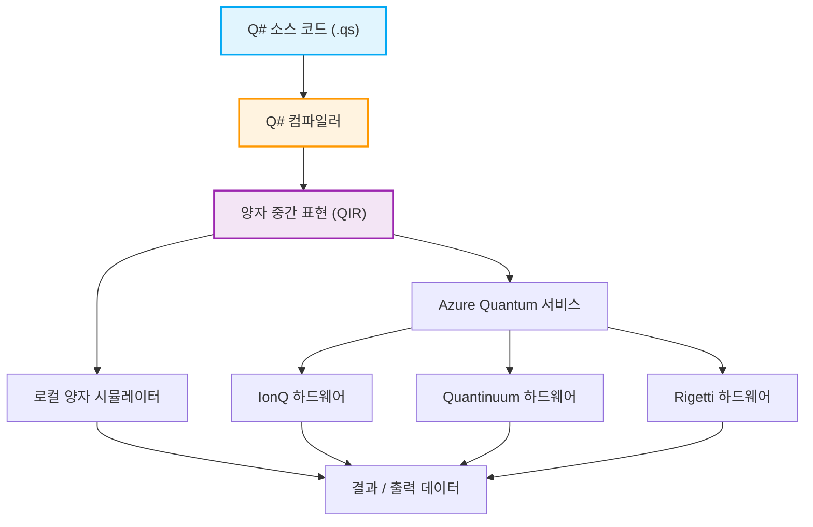

## 1. 시작하며: 양자 컴퓨팅의 새벽과 프로그래밍의 새로운 패러다임

최근 양자 컴퓨팅 분야에서 하드웨어 및 소프트웨어의 기술 혁신은 눈부실 정도입니다. 고전적인 컴퓨터(현재 우리가 일상적으로 사용하는 PC, 스마트폰, 슈퍼컴퓨터 등)가 "0" 또는 "1"이라는 확정된 비트의 조합으로 정보를 처리하는 반면, 양자 컴퓨터는 양자 역학 특유의 '중첩(Superposition)'이나 '양자 얽힘(Entanglement)'과 같은 물리 현상을 정보 처리의 기반으로 직접 활용합니다. 이로 인해 특정 클래스의 문제에 대해 고전 컴퓨터로는 우주의 수명만큼의 시간을 들여도 도달할 수 없는 수준의 계산 속도, 즉 '양자 우월성(Quantum Supremacy)'이나 '양자 이점(Quantum Advantage)'을 실현할 가능성이 제시되고 있습니다. 예를 들어 거대한 수의 소인수분해(Shor의 알고리즘), 데이터베이스의 고속 검색(Grover의 알고리즘), 양자 화학 시뮬레이션(VQE 알고리즘), 조합 최적화 문제, 나아가 기계 학습의 특정 프로세스(Quantum Machine Learning) 등에서 극적인 계산량의 감소가 기대됩니다.

그러나 양자 컴퓨터가 가진 이 경이로운 잠재력을 현실의 애플리케이션으로 끌어내기 위해서는 물리적인 하드웨어(초전도 양자 비트나 이온 트랩 등)의 진보만으로는 불충분합니다. 양자 회로를 정확하게 설계하고, 양자 알고리즘을 오류 없이 효율적으로 작성하기 위한 '양자 프로그래밍 언어'와 이를 뒷받침하는 강력한 개발·실행·디버그 환경이 필수적입니다. 고전적인 프로그래밍 언어(C++, Python, Java 등)는 고전적인 CPU 아키텍처의 동작을 추상화하는 데는 능숙하지만, 비결정론적이고 복소수 진폭을 가지는 양자 상태의 조작을 자연스럽게 기술하도록 설계되어 있지 않습니다.

본 기사에서는 수많은 양자 프로그래밍 환경 중에서도 Microsoft 사가 강력하게 추진하며 오픈 소스로 개발을 진행하고 있는 양자 개발 키트 'Quantum Development Kit(QDK)'와 그 핵심을 이루는 전용 프로그래밍 언어 'Q#(큐샵)'에 초점을 맞춥니다.

Q#은 양자 알고리즘 기술에 특화된 도메인 특화 언어(Domain Specific Language: DSL)로서 C#이나 F#, Python의 장점을 흡수하며 처음부터 설계되었습니다. 고전적인 제어 흐름(if 문이나 for 루프 등)과 양자 조작(게이트 적용이나 측정)을 매끄럽게 통합할 수 있는 강력한 기능을 갖추고 있습니다. 이 기사에서는 양자 컴퓨팅의 기초적인 수학 모델에서 출발하여 Q#의 언어적 특징, Python의 Qiskit 등과의 설계 사상 비교, 실제 코드를 통한 '벨 상태(Bell State: 양자 얽힘 상태)'의 구축과 측정, 나아가 고전 언어(Python이나 C#)와의 통합 기법에 이르기까지 철저하고 매우 상세하게 해설합니다. 이 기사를 다 읽을 무렵에는 양자 프로그래밍의 기초를 이해하고 자신의 환경에서 Q# 코드를 작성하기 시작할 준비가 되어 있을 것입니다.

## 2. 양자 컴퓨팅의 수학적 기초: 상태, 중첩, 그리고 얽힘

Q#의 구문과 기능을 깊이 이해하고 효과적인 양자 프로그램을 작성하기 위해서는 먼저 양자 상태나 양자 게이트 조작 이면에 있는 수학적인 기초 지식(특히 선형 대수)을 정리해 둘 필요가 있습니다. 여기서는 양자 프로그래밍에 필수적인 기본적인 수학 모델을 개괄합니다.

### 2.1 양자 비트(Qubit)와 중첩 상태

고전적인 비트(Classical Bit)가 $0$ 또는 $1$ 중 하나의 상태만 취할 수 있는 반면, 양자 비트(Qubit)는 상태 $|0\rangle$ 과 $|1\rangle$ 의 선형 결합(Linear Combination), 즉 '중첩'으로 표현됩니다. 이 상태는 브라-켓 표기법(디랙 표기법)과 복소수 계수 $\alpha$ 및 $\beta$ 를 사용하여 다음과 같이 기술됩니다.

$$ |\psi\rangle = \alpha|0\rangle + \beta|1\rangle $$

여기서 $\alpha$ 와 $\beta$ 는 확률 진폭(Probability Amplitude)이라 불리는 복소수(Complex Numbers)이며, 이 양자 비트를 측정했을 때 상태 $|0\rangle$ 을 관측할 확률은 $|\alpha|^2$, 상태 $|1\rangle$ 을 관측할 확률은 $|\beta|^2$ 가 됩니다. 물리적인 제약으로서 모든 가능한 상태를 관측할 확률의 합은 반드시 $1$ 이 되어야 하므로 다음의 규격화 조건(Normalization Condition)을 만족해야 합니다.

$$ |\alpha|^2 + |\beta|^2 = 1 $$

양자 비트의 상태는 종종 '블로흐 구면(Bloch Sphere)'이라 불리는 3차원 공간상의 단위 구 표면의 점으로 시각화됩니다. 북극이 $|0\rangle$, 남극이 $|1\rangle$ 에 대응하며 적도상의 점은 $|0\rangle$ 과 $|1\rangle$ 이 동일한 확률로 중첩된 상태(예를 들어 위상이 0인 상태인 $|+\rangle = \frac{1}{\sqrt{2}}(|0\rangle + |1\rangle)$ 이나 위상이 $\pi/2$ 인 $|i\rangle = \frac{1}{\sqrt{2}}(|0\rangle + i|1\rangle)$ 등)를 나타냅니다. 양자 게이트의 조작은 이 블로흐 구면 위에서의 회전 조작으로 기하학적으로 이해할 수 있습니다.

### 2.2 다중 양자 비트와 텐서곱, 그리고 양자 얽힘

양자 컴퓨팅의 진정한 힘은 여러 양자 비트를 결합했을 때 발휘됩니다. 여러 양자 비트로 이루어진 시스템의 상태는 개별 양자 비트의 상태 공간의 '텐서곱(Tensor Product)'으로 기술됩니다. 예를 들어 2개의 양자 비트로 이루어진 시스템 전체의 상태는 다음과 같습니다.

$$ |\psi\rangle = \alpha_{00}|00\rangle + \alpha_{01}|01\rangle + \alpha_{10}|10\rangle + \alpha_{11}|11\rangle $$

여기서도 규격화 조건 $\sum_{i,j} |\alpha_{ij}|^2 = 1$ 이 성립합니다. 중요한 점은 n개의 양자 비트 시스템을 완전히 기술하기 위해서는 $2^n$ 개의 복소수 진폭이 필요하다는 것입니다. 예를 들어 불과 50 양자 비트의 시스템이더라도 그 상태를 표현하려면 $2^{50} \approx 10^{15}$ 개나 되는 복소수가 필요하며, 이는 현재 세계에서 가장 빠른 슈퍼컴퓨터의 메모리 용량을 훨씬 초과합니다. 이것이 양자 컴퓨터가 고전 컴퓨터에 대해 지수 함수적인 우위성을 가지는 이유 중 하나입니다.

'양자 얽힘(Entanglement)'이란 이러한 다중 양자 비트 상태에서 개별 양자 비트 상태의 텐서곱으로 단순하게 분해할 수 없는(인수분해할 수 없는) 상태를 가리킵니다. 가장 유명하고 중요한 얽힘 상태 중 하나가 다음의 '벨 상태(Bell State)'입니다.

$$ |\Phi^+\rangle = \frac{1}{\sqrt{2}}(|00\rangle + |11\rangle) $$

이 상태에서는 한쪽 양자 비트를 측정하여 $0$ (또는 $1$)을 얻은 순간, 다른 쪽 양자 비트의 상태도 거리와 무관하게 즉시 $0$ (또는 $1$)으로 확정됩니다. 아인슈타인이 '유령 같은 원격 작용'이라 불렀던 이 비국소적인 상관관계는 양자 텔레포테이션, 초고밀도 부호화, 양자 암호 통신, 나아가 많은 양자 알고리즘의 효율적인 실행에 있어서 근본적인 자원이 됩니다. 이후 섹션에서는 실제로 Q#을 사용하여 이 벨 상태를 만들어냅니다.

### 2.3 양자 게이트 조작과 유니터리 행렬

양자 상태를 변화시키는 조작(고전적인 논리 회로의 AND, OR, NOT 게이트에 해당)은 양자 게이트라고 불립니다. 수학적으로 양자 게이트는 복소수 행렬로 표현되며 양자 상태 벡터에 대한 행렬 곱셈으로 작용합니다. 양자 역학의 공리에 따라 이들 행렬은 반드시 유니터리 행렬(Unitary Matrix, $U^\dagger U = I$ 를 만족하는 행렬, 여기서 $U^\dagger$ 는 수반 행렬, $I$ 는 단위 행렬)이어야 합니다. 이로 인해 측정을 제외한 모든 양자 조작은 가역적(Reversible)이게 됩니다.

대표적인 단일 양자 비트 게이트:
- **Pauli-X 게이트 (NOT 게이트)**: $|0\rangle$ 을 $|1\rangle$ 로, $|1\rangle$ 을 $|0\rangle$ 로 반전시킵니다.
$$ X = \begin{pmatrix} 0 & 1 \\ 1 & 0 \end{pmatrix} $$
- **Pauli-Z 게이트 (위상 시프트 게이트)**: $|0\rangle$ 은 그대로 두고 $|1\rangle$ 의 부호를 반전시킵니다(상대 위상에 $\pi$ 를 더함).
$$ Z = \begin{pmatrix} 1 & 0 \\ 0 & -1 \end{pmatrix} $$
- **Hadamard 게이트 (H 게이트)**: 확정적 상태를 중첩 상태로 변환합니다.
$$ H = \frac{1}{\sqrt{2}} \begin{pmatrix} 1 & 1 \\ 1 & -1 \end{pmatrix} $$

대표적인 2 양자 비트 게이트:
- **CNOT 게이트 (제어 NOT 게이트)**: 제어 비트(Control Qubit)가 $|1\rangle$ 일 때만 표적 비트(Target Qubit)에 X 게이트(NOT 연산)를 적용합니다.
$$ CNOT = \begin{pmatrix} 1 & 0 & 0 & 0 \\ 0 & 1 & 0 & 0 \\ 0 & 0 & 0 & 1 \\ 0 & 0 & 1 & 0 \end{pmatrix} $$

양자 알고리즘은 이러한 기본적인 유니터리 행렬을 조합하여 목적하는 연산을 실현하는 프로세스의 설계라고 할 수 있습니다.

## 3. Microsoft Quantum Development Kit (QDK) 란

Microsoft가 제공하는 Quantum Development Kit (QDK)는 양자 컴퓨팅 소프트웨어 개발을 지원하기 위한 포괄적인 툴셋입니다. 양자 알고리즘의 설계부터 디버그, 최적화, 그리고 시뮬레이터나 실제 하드웨어에서의 실행에 이르기까지 개발 수명 주기 전체를 지원합니다.

QDK에는 다음과 같은 주요 요소가 포함되어 있습니다.

1. **Q# 컴파일러와 실행 환경**: Q# 언어로 작성된 코드를 고도로 분석, 최적화하여 시뮬레이터 또는 실제 양자 하드웨어(Azure Quantum 경유)에서 실행 가능한 형식(QIR 등)으로 변환합니다. Q# 컴파일러는 함수의 순수성 검사나 양자 비트의 수명 주기 관리 등 양자 계산 특유의 정적 분석을 수행합니다.
2. **양자 시뮬레이터**: 개발자의 로컬 머신에서 양자 상태의 진화를 시뮬레이트하는 풀 스테이트 시뮬레이터(Full State Simulator)가 포함되어 있습니다. 이를 통해 수십 양자 비트 규모의 소규모 알고리즘을 로컬에서 고속으로 테스트하고 디버깅할 수 있습니다. 또한 대규모 회로(수천~수백만 양자 비트)의 자원 요구 사항을 추정하기 위한 자원 추정기(Resource Estimator)도 제공됩니다.
3. **풍부한 라이브러리**: Q# 표준 라이브러리(Standard Library)에는 기본적인 양자 게이트(H, X, Y, Z, CNOT 등)부터 복잡한 산술 연산(양자 가산기 등), 진폭 증폭(Amplitude Amplification), 양자 위상 추정 알고리즘(Quantum Phase Estimation)에 이르기까지 다양한 고급 빌딩 블록이 준비되어 있습니다. 이를 통해 개발자는 바퀴를 다시 발명하는 수고를 덜 수 있습니다.
4. **통합 개발 환경(IDE) 연동**: Visual Studio나 Visual Studio Code용 확장 기능이 제공되어 구문 강조, 코드 자동 완성(IntelliSense), 강력한 디버그 기능, 테스트 프레임워크와의 통합 등 현대적인 소프트웨어 개발에 필수적인 기능을 이용할 수 있습니다.

다음은 Q# 프로그램이 작성된 후 하드웨어에서 실행되기까지의 워크플로를 보여주는 Mermaid 다이어그램입니다.



이 아키텍처의 매우 뛰어난 점은 QIR (Quantum Intermediate Representation) 이라는 LLVM 기반의 중간 표현을 거침으로써, 기반이 되는 하드웨어 아키텍처(초전도 양자 비트, 이온 트랩, 위상 양자 비트, 광양자 등)의 차이를 완전히 추상화했다는 점입니다. 개발자는 하드웨어의 물리적인 세부 사항(각 하드웨어 특유의 네이티브 게이트 세트나 토폴로지)을 신경 쓰지 않고 알고리즘의 순수한 논리적 설계에만 집중할 수 있습니다. QIR 계층 이후의 컴파일러 패스가 대상 하드웨어에 최적화된 게이트 변환(Transpile)을 자동으로 수행합니다.

## 4. Q# vs Python/Qiskit: 왜 새로운 언어가 필요한가?

양자 프로그래밍을 배울 때 많은 사람이 가장 먼저 접하는 것은 그 간편함과 Python의 보급률 덕분에 IBM이 개발한 Python 기반 프레임워크 'Qiskit'일 것입니다. Qiskit 역시 매우 강력하고 널리 사용되는 도구지만, Microsoft의 Q#과는 근본적인 설계 사상(패러다임)이 크게 다릅니다.

### Qiskit 접근 방식 (Python에 의한 회로 객체 구축)
Qiskit은 본질적으로 '양자 회로를 구축하기 위한 Python API 라이브러리'입니다. 개발자가 Python 스크립트를 실행하면 메모리상에 양자 게이트의 시퀀스(회로 객체)가 점진적으로 조립됩니다. 모든 게이트를 추가한 후 마지막에 그 거대한 회로 객체를 백엔드(로컬 시뮬레이터나 클라우드 상의 실제 기기)로 전송(Submit)하여 실행합니다.
이 메타 프로그래밍적인 접근 방식은 기존 Python 생태계(NumPy, SciPy, PyTorch 등의 머신러닝 라이브러리나 시각화 도구)와의 통합이 매우 쉽다는 큰 장점이 있습니다. 그러나 고전과 양자가 뒤섞인 복잡한 제어 흐름, 예를 들어 '어떤 양자 비트를 측정하여 그 결과가 1일 때만 다른 양자 비트 그룹에 특정한 복잡한 유니터리 조작을 적용하고 추가로 while 루프를 돈다'와 같은 동적 회로(Dynamic Circuits)를 표현할 때 Python의 네이티브 if 문이나 for 문을 사용할 수 없고(왜냐하면 그것은 '회로 구축 시'에 평가되기 때문입니다) Qiskit 고유의 특수한 제어 명령을 사용해야 하므로 코드가 매우 복잡하고 직관적이지 않게 되기 쉽습니다.

### Q# 접근 방식 (양자 우선 도메인 특화 언어)
반면 Q#은 양자 계산 자체를 일급 시민(First-class citizen)으로 다루기 위해 처음부터 설계된 독립적인 컴파일 언어입니다. Q# 내에서는 양자 비트의 할당이나 게이트 조작, 측정과 같은 처리를 고전적인 변수 조작이나 if 문, 루프 처리와 완전히 같은 감각으로 하나의 코드 베이스 안에 자연스럽고 매끄럽게 기술할 수 있습니다.
Q# 컴파일러는 코드 전체를 정적으로 분석하여 어느 부분이 고전적인 계산 장치(호스트 CPU나 제어 전자 장치)에서 실행되고 어느 부분이 양자 보조 프로세서(QPU)에서 실행되어야 하는지를 판단하여 고도의 최적화를 수행합니다. 이를 통해 대규모의 복잡한 양자 알고리즘 구현에 있어 더 높은 모듈성, 가독성, 유지보수성, 그리고 타입 안정성(Type Safety)을 실현하고 있습니다. Q#은 '회로를 작성하는' 것이 아니라 '알고리즘을 작성하는' 언어인 것입니다.

## 5. Q#의 기본 구문과 특징적인 개념 심층 탐구

Q#의 구문은 C#의 중괄호 `{}` 를 사용한 블록 구조, F#의 함수형 프로그래밍 요소, 그리고 강력한 타입 추론을 결합한 듯한 매우 세련된 디자인으로 되어 있습니다. 여기서는 Q#을 깊이 이해하기 위한 중요한 키워드와 개념을 상세하게 설명합니다.

### 5.1 `operation`과 `function`의 엄격한 구별
Q#에서는 처리 단위(서브루틴)를 정의하기 위해 `operation`과 `function`의 두 가지를 엄밀하게 구분하여 사용합니다. 이는 함수형 프로그래밍의 '순수성(Purity)' 개념에서 유래했습니다.
- **`function`**: 결정론적(Deterministic)인 고전 계산만을 수행하는 순수 함수입니다. 같은 입력 매개변수를 주면 몇 번을 실행하더라도 반드시 같은 출력 결과를 반환합니다. `function` 내부에서는 양자 비트의 할당, 게이트 적용, 측정과 같은 양자적인 조작(부작용을 수반하는 조작)은 컴파일 오류가 됩니다. 수학적인 함수 계산이나 데이터 변환 등에 사용됩니다.
- **`operation`**: 양자 계산을 포함하는 비결정론적(Non-deterministic)인 루틴입니다. 양자 비트 조작이나 측정을 포함하며 같은 입력이더라도 양자 역학적인 확률적 성질(측정에 의한 파동 함수의 붕괴 등)에 의해 결과가 달라질 수 있습니다. 양자 알고리즘의 핵심이 되는 부분은 모두 `operation`으로 정의됩니다.

### 5.2 `Qubit` 타입과 `use` 키워드에 의한 수명 주기 관리
Q#에서 양자 비트는 `Qubit` 타입의 '불투명한(Opaque)' 객체로 취급됩니다. 개발자가 프로그램 내에서 직접 그 내부 상태의 확률 진폭(예: $\alpha$ 나 $\beta$ 의 값)을 읽거나 수정하는 것은 의도적으로 금지되어 있습니다(이는 물리적인 실제 양자 시스템에서의 '관측 문제'와 일치합니다). 양자 비트와 상호 작용하는 유일한 방법은 제공되는 양자 게이트 조작이나 측정 함수를 호출하는 것뿐입니다.

양자 비트를 프로그램 내에서 새로 할당(Allocate)하려면 `use` 키워드(이전 버전의 Q#에서는 `using`이라고 불렸습니다)를 사용합니다. `use` 블록은 양자 비트의 범위(Scope)와 수명 주기를 명확하게 정의합니다.
중요한 규칙으로서 `use` 블록을 벗어날 때, 그 안에서 할당된 모든 양자 비트는 반드시 완전히 $|0\rangle$ 상태로 돌아가 있어야 합니다(그렇지 않으면 런타임 예외가 발생합니다). 이는 양자 비트의 재사용과 메모리 누수 방지를 확실하게 하기 위한 Q#의 강력한 안전 메커니즘입니다.

### 5.3 측정 `M`과 유용한 `MResetZ`
양자 상태를 고전 정보(0 또는 1)로 변환하기 위한 측정(Measurement) 조작은 `M`이라는 기본 오퍼레이션으로 수행합니다. Z 기저(표준 기저)에서의 측정 결과는 열거형인 `Result` 타입(값은 `Zero` 또는 `One`)으로 반환됩니다.
그러나 앞서 언급했듯이 양자 비트를 해제할 때는 $|0\rangle$ 상태일 것이 요구됩니다. 단순히 측정 `M`만 수행했을 경우 만약 결과가 `One`이었다면 양자 비트는 $|1\rangle$ 상태로 붕괴되어 버린 상태입니다. 따라서 실용적인 코드에서는 측정을 수행한 직후에 양자 비트의 상태를 확실하게 $|0\rangle$ 로 재설정하는 `MResetZ`라는 유용한 표준 오퍼레이션이 매우 빈번하게 사용됩니다.

### 5.4 변수의 불변성 (Immutability) 과 `mutable`
함수형 프로그래밍의 영향을 강하게 받은 Q#에서는 기본적으로 모든 변수가 불변(Immutable)입니다. 한 번 `let` 키워드로 바인딩된 변수는 이후에 값을 변경할 수 없습니다. 이를 통해 병렬 처리나 양자 알고리즘에서의 의도치 않은 부작용을 줄일 수 있습니다.
만약 루프 카운터나 누적 계산처럼 값을 갱신해야 하는 변수를 선언할 경우에는 명시적으로 `mutable` 키워드를 사용하며, 값의 갱신에는 `set` 키워드를 사용합니다.

## 6. 실전: Q#으로 Bell 상태(양자 얽힘)를 만들고 측정하기

그러면 지금까지 배운 지식을 총동원하여 실제로 Q#을 사용하여 앞서 수학 섹션에서 설명한 '벨 상태(Bell State)'를 만들어 내고 이를 측정하는 프로그램을 작성해 봅시다. 이는 양자 프로그래밍에서 'Hello World'라고도 할 수 있는 매우 중요한 단계입니다.

### 양자 회로의 설계와 해설
벨 상태 $\frac{1}{\sqrt{2}}(|00\rangle + |11\rangle)$ 를 만들기 위한 표준적인 양자 회로 절차는 다음과 같습니다.
1. 2개의 양자 비트 $q_0$ 와 $q_1$ 을 초기 상태 $|00\rangle$ 로 준비합니다.
2. $q_0$ 에 하다마르 게이트($H$ 게이트)를 적용합니다. 이로써 $q_0$ 는 $|0\rangle$ 과 $|1\rangle$ 이 동일한 확률로 중첩된 상태 $\frac{1}{\sqrt{2}}(|0\rangle + |1\rangle)$ 가 됩니다. 이 시점에서 전체 시스템의 상태는 $\frac{1}{\sqrt{2}}(|0\rangle + |1\rangle) \otimes |0\rangle = \frac{1}{\sqrt{2}}(|00\rangle + |10\rangle)$ 입니다.
3. $q_0$ 를 제어 비트(Control), $q_1$ 을 표적 비트(Target)로 하여 CNOT(제어 NOT) 게이트를 적용합니다. 이를 통해 $q_0$ 가 $|1\rangle$ 일 때만 $q_1$ 이 반전됩니다. 결과적으로 상태 $|00\rangle$ 은 그대로 $|00\rangle$ 로, 상태 $|10\rangle$ 은 $|11\rangle$ 로 변화하며 최종적인 시스템 전체의 상태는 $\frac{1}{\sqrt{2}}(|00\rangle + |11\rangle)$ 이 됩니다. 이것이 완전한 상관관계를 가지는 얽힘 상태의 완성입니다.

### Q# 을 이용한 구현 코드

다음 코드는 Q#을 이용하여 벨 상태를 생성하고 지정된 횟수만큼 측정 실험을 반복하여 그 통계(확률 분포)를 얻는 실전적인 구현 예입니다.

```qsharp
namespace Quantum.BellState {
    
    // 필요한 네임스페이스를 가져옵니다
    open Microsoft.Quantum.Intrinsic;
    open Microsoft.Quantum.Canon;
    open Microsoft.Quantum.Measurement;
    open Microsoft.Quantum.Diagnostics;

    /// # Summary
    /// 단일 벨 상태를 생성하고 두 개의 양자 비트를 Z 기저로 측정합니다.
    ///
    /// # Output
    /// (Result, Result): qubit1과 qubit2의 측정 결과. 벨 상태라면 반드시 일치합니다.
    operation GenerateAndMeasureBellState() : (Result, Result) {
        
        // 2개의 양자 비트를 할당합니다 (초기 상태는 자동으로 |00> 이 됩니다)
        use (q1, q2) = (Qubit(), Qubit());
        
        // q1 에 하다마르 게이트를 적용하여 중첩 상태를 만듭니다
        H(q1);
        
        // q1을 제어 비트, q2를 표적 비트로 CNOT 게이트를 적용합니다
        // 이를 통해 q1과 q2 사이에 양자 얽힘(인탱글먼트)이 생성됩니다
        CNOT(q1, q2);
        
        // 개발 시의 디버그로서, 시뮬레이터 내부의 상태 벡터를 덤프하여 확인할 수 있습니다
        // DumpMachine(); // 필요시 주석 처리를 해제합니다

        // 측정을 수행하고, 동시에 양자 비트를 안전하게 해제하기 위해 상태를 |0>으로 리셋합니다
        let res1 = MResetZ(q1);
        let res2 = MResetZ(q2);
        
        // 측정 결과 쌍을 반환합니다
        return (res1, res2);
    }

    /// # Summary
    /// 벨 상태 생성 및 측정 실험을 여러 번 실행하고 결과 통계를 수집하는 메인 루틴.
    ///
    /// # Input
    /// ## count
    /// 실험을 반복할 횟수 (예: 1000회)
    ///
    /// # Output
    /// (Int, Int, Int, Int): 각각 (00, 01, 10, 11) 이 관측된 횟수
    @EntryPoint()
    operation RunBellStateExperiment(count: Int) : (Int, Int, Int, Int) {
        
        // 관측 횟수를 세기 위한 가변(변경 가능) 변수를 초기화합니다
        mutable num00 = 0;
        mutable num01 = 0;
        mutable num10 = 0;
        mutable num11 = 0;

        // 지정된 횟수만큼 실험 루프를 돕니다
        for _ in 1..count {
            // 벨 상태를 생성하고 측정 결과를 받습니다
            let (r1, r2) = GenerateAndMeasureBellState();
            
            // 결과 패턴을 카운트업합니다
            if r1 == Zero and r2 == Zero {
                set num00 += 1;
            } elif r1 == Zero and r2 == One {
                set num01 += 1;
            } elif r1 == One and r2 == Zero {
                set num10 += 1;
            } else { // r1 == One and r2 == One 인 경우
                set num11 += 1;
            }
        }

        // 수집한 통계 정보를 콘솔에 메시지로 출력합니다
        Message($"--- Experiment Results ---");
        Message($"Total runs: {count}");
        Message($"00 observed: {num00}");
        Message($"01 observed: {num01}");
        Message($"10 observed: {num10}");
        Message($"11 observed: {num11}");

        return (num00, num01, num10, num11);
    }
}
```

### 코드 해설 및 동작 확인
- `namespace`: Java나 C#과 마찬가지로 프로그램을 논리적으로 정리하고 이름 충돌을 방지하기 위한 네임스페이스 선언입니다.
- `open`: 필요한 라이브러리(모듈)를 임포트합니다. `Microsoft.Quantum.Intrinsic` 에는 H, X, Y, Z, CNOT 등의 기본 양자 게이트가 포함되어 있으며 `Microsoft.Quantum.Measurement` 에는 `MResetZ` 와 같은 유용한 측정 관련 기능이 포함되어 있습니다.
- `use (q1, q2) = (Qubit(), Qubit());`: 2개의 양자 비트를 동적으로 할당하고 있습니다.
- `H(q1); CNOT(q1, q2);`: 이 2줄이 바로 양자 얽힘을 생성하는 핵심 부분입니다. 매우 간단하고 직관적으로 기술할 수 있습니다.
- `let res1 = MResetZ(q1);`: 앞서 언급했듯이 `MResetZ` 는 측정 결과를 변수에 바인딩하는 동시에 양자 비트의 상태를 강제로 $|0\rangle$ 로 재설정합니다. 이로써 `use` 블록 종료 시 안전하게 양자 비트를 해제할 수 있습니다.
- `@EntryPoint()`: 이 속성을 부여함으로써 컴파일러에게 이 오퍼레이션이 프로그램 실행의 기점(C 언어의 main 함수와 같은 것)임을 나타냅니다.

이론상 생성된 상태는 벨 상태 $\frac{1}{\sqrt{2}}(|00\rangle + |11\rangle)$ 이므로 이 프로그램을 충분한 횟수 실행(예: 10,000회)하면 `00` 과 `11` 이 각각 약 50%(5,000회 내외)씩 관측되고 `01` 과 `10` 은 0회(이론적 오차가 없다면 전혀 관측되지 않음)가 되어야 합니다. 이것이 두 양자 비트가 강한 상관관계를 가지고 있다(얽혀 있다)는 증명이 됩니다.

## 7. 호스트 언어(Python / C#)와의 원활한 연동

Q#은 방금 전 예시처럼 `@EntryPoint()` 를 지정하여 단독으로 실행하는 것도 가능하지만(Q# 독립 실행형 애플리케이션), 실제 엔터프라이즈 개발이나 연구의 활용 사례에서는 프론트엔드의 GUI, 거대한 데이터베이스로부터의 데이터 수집, 머신러닝의 최적화 루프(예: VQE의 매개변수 갱신 등) 등 고전적인 처리와 밀접하게 조합하여 사용됩니다. 따라서 Q#은 호스트 언어인 Python이나 C#(.NET)에서 직접 호출하여 실행하는 것을 매우 쉽게 할 수 있도록 세련된 상호 운용성(Interoperability)을 제공합니다.

### 7.1 Python에서의 호출 예시: 데이터 과학자용
데이터 과학, 머신러닝, 물리학 연구의 세계에서 압도적인 점유율을 자랑하는 Python에서 Q#을 호출하려면 `qsharp` Python 패키지를 사용합니다. Jupyter Notebook과의 친화성도 높아 인터랙티브한 개발이나 데이터 시각화와 결합하기에 최적입니다.

```python
# 1. 필요한 Q# 연동 모듈 임포트
import qsharp

# 2. Q#의 오퍼레이션을 마치 Python의 함수인 것처럼 직접 임포트
# (컴파일러가 백그라운드에서 자동으로 바인딩 및 컴파일을 수행해 줍니다)
from Quantum.BellState import RunBellStateExperiment

# 3. Python 스크립트에서 호출하여 실행 (시뮬레이터 사용)
count = 1000
print(f"Starting quantum simulation for {count} iterations...")

# simulate() 메서드를 호출하여 로컬 시뮬레이터 상에서 실행합니다
result = RunBellStateExperiment.simulate(count=count)

# 결과 튜플을 받아 Python 측에서 형태를 갖추어 출력
print("\n--- Simulation Results ---")
print(f"|00> : {result[0]} (Expected ~500)")
print(f"|01> : {result[1]} (Expected 0)")
print(f"|10> : {result[2]} (Expected 0)")
print(f"|11> : {result[3]} (Expected ~500)")
```
이처럼 Q# 컴파일러와 인터프리터가 백그라운드에서 투명하게 C API를 통한 바인딩을 동적으로 생성해 주기 때문에 Python 코드 측에서는 양자 알고리즘을 단순한 하나의 블랙박스 함수처럼 다루어 고전과 양자의 하이브리드 알고리즘을 매우 쉽게 구축할 수 있습니다.

### 7.2 C#에서의 호출 예시: 엔터프라이즈 개발용
대규모 백엔드 시스템이나 엔터프라이즈 애플리케이션 개발에 있어 강력한 C#에서도 완전히 동일하게 Q# 코드를 통합할 수 있습니다. Q# 프로젝트(.csproj)와 C# 프로젝트를 동일한 솔루션 내에 배치하고 참조 관계를 가지게 함으로써 빌드 시에 자동으로 C#용 클래스 래퍼가 생성됩니다.

```csharp
using System;
using System.Threading.Tasks;
using Microsoft.Quantum.Simulation.Simulators; // 양자 시뮬레이터의 네임스페이스
using Quantum.BellState; // Q#에서 정의한 네임스페이스

namespace QuantumRunner
{
    class Program
    {
        static async Task Main(string[] args)
        {
            // 풀 스테이트 양자 시뮬레이터 인스턴스 생성
            // IDisposable을 구현하고 있으므로 using 구문으로 적절히 자원 관리
            using var sim = new QuantumSimulator();
            
            long count = 1000;
            Console.WriteLine($"Running {count} iterations of Bell State generation...");

            // Q#의 오퍼레이션을 비동기로 실행합니다. Run 메서드가 자동 생성되어 있습니다.
            // 실행 타겟으로 sim을 전달하고 인수로 count를 전달합니다.
            var result = await RunBellStateExperiment.Run(sim, count);

            // C#의 ValueTuple로 결과가 반환됩니다
            Console.WriteLine($"|00>: {result.Item1}");
            Console.WriteLine($"|01>: {result.Item2}");
            Console.WriteLine($"|10>: {result.Item3}");
            Console.WriteLine($"|11>: {result.Item4}");
        }
    }
}
```
여기에서는 개발 목적으로 로컬의 `QuantumSimulator` 클래스를 사용하고 있지만, 운영 환경으로 이행할 때는 이 시뮬레이터 인스턴스 생성 부분을 Azure Quantum 작업 영역을 가리키는 클라우드 타겟 제공자(예: IonQ나 Quantinuum 머신 객체)로 교체하기만 하면 됩니다. Q# 측 코드나 비즈니스 로직을 전혀 변경하지 않고도 클라우드 상의 실제 양자 하드웨어 위에서 알고리즘을 실행할 수 있게 되는 것입니다. 이것이 QDK의 진면목입니다.

## 8. 고급 주제: Q#의 설계 철학을 구현하는 기능들

Q#의 기본적인 사용법을 살펴보았는데 여기서 Q#이 가진 더 고급 기능과 그 설계 철학에 대해 조금 깊게 파고들어 봅시다. 이러한 기능들이야말로 Q#을 단순한 'Python의 대체재'를 넘어선 진정한 양자 도메인 특화 언어로 만드는 요소입니다.

### 8.1 자동 역연산(Adjoint)과 제어 연산(Controlled)의 자동 생성
양자 계산의 큰 특징 중 하나로 유니터리성(Unitarity)에서 유래하는 '가역성(Reversibility)'이 있습니다. 측정을 제외한 모든 기본 연산은 유니터리 행렬이며 따라서 반드시 역행렬(역연산)이 존재하여 원래대로 되돌릴 수 있습니다. Q#에서는 이를 언어 수준의 일급 기능으로 지원하는 `Adjoint`(수반·역연산) 및 `Controlled`(제어 연산)라는 강력한 펑터(Functor) 수식자가 제공됩니다.

어떤 양자 조작 `Op` 에 대해 그 역조작(원래대로 되돌리는 조작)을 수작업으로 행렬을 계산하거나 게이트 순서를 거꾸로 하여 구현하지 않아도 함수 시그니처에 특정 키워드를 추가하는 것만으로 Q# 컴파일러가 자동으로 `Adjoint Op` 를 생성해 줍니다. 또한 특정 양자 비트 그룹이 모두 $|1\rangle$ 일 때만 `Op` 를 실행하는 조건부 조작 `Controlled Op` 도 동일하게 자동 생성 가능합니다.

```qsharp
// is Adj + Ctl 을 부여함으로써 컴파일러에 역연산 및 제어 연산의 자동 생성을 지시합니다
operation MyComplexSubroutine(qubits: Qubit[]) : Unit is Adj + Ctl {
    // 여기에 매우 복잡한 양자 게이트 시퀀스를 기술
    // 예: H, T, CNOT, 임의의 위상 시프트 등의 조합
    // ...
}

// 호출 측의 예
operation UseMyOp(controlQubit: Qubit, targetQubits: Qubit[]) : Unit {
    
    // 일반적인 호출
    MyComplexSubroutine(targetQubits);
    
    // 역연산 실행: 원래 상태로 완전히 되감음 (언컴퓨테이션에 매우 유용)
    Adjoint MyComplexSubroutine(targetQubits);
    
    // 제어 연산 실행: controlQubit가 |1>일 때만 복잡한 서브루틴을 실행
    Controlled MyComplexSubroutine([controlQubit], targetQubits);
    
    // 심지어 제어 연산의 역연산과 같은 조합도 가능!
    Controlled Adjoint MyComplexSubroutine([controlQubit], targetQubits);
}
```
이 기능으로 인해 그로버의 검색 알고리즘의 오라클 구현이나 쇼어의 소인수분해 알고리즘 등, 복잡한 서브루틴과 그 역연산(불필요한 얽힘을 풀기 위한 언컴퓨테이션: Uncomputation)을 빈번하게 이용하는 고급 알고리즘의 구현이 극적으로 간소화되며 사람에 의한 오류나 버그가 개입될 여지를 크게 줄일 수 있습니다. 이는 회로 구축 모델인 Qiskit 등과 비교할 때 알고리즘 기술 언어인 Q#이 가지는 가장 큰 강점 중 하나라고 할 수 있습니다.

### 8.2 자원 추정(Resource Estimation)과 미래를 위한 대비
현재의 양자 컴퓨터는 'NISQ (Noisy Intermediate-Scale Quantum)'라 불리는 발전 도상의 단계에 있으며, 이용 가능한 양자 비트 수도 수십에서 수백 개 정도로 적고 오류율도 높은 상태입니다. 그러나 미래의 결함 허용 양자 컴퓨터(FTQC: Fault-Tolerant Quantum Computer) 시대를 내다볼 때, 어떤 새로운 알고리즘을 실행하는 데 "도대체 어느 정도의 논리 양자 비트가 필요한가", "오류 정정에서 비용이 매우 높은 T 게이트나 토폴리 게이트가 몇 번 사용되는가", "실행 시간은 얼마나 되는가"를 사전에 정확히 견적 내는 것이 매우 중요해집니다.

QDK에는 실행 환경 대상 중 하나로 '자원 추정기(Resource Estimator)'가 내장되어 있습니다. 이를 이용하면 코드를 실제 기기나 무거운 풀 상태 시뮬레이터에서 구동하지 않고도 코드의 논리적인 흐름을 분석하여 순식간에 대규모 알고리즘의 요구 자원을 계산·출력할 수 있습니다. 이를 통해 알고리즘 설계자나 연구자는 수천·수만 양자 비트를 필요로 하는 미래의 알고리즘이더라도 이론상의 계산량뿐만 아니라 구체적인 게이트 수 수준에서의 최적화를 신속하게 반복하는 것이 가능해집니다.

## 9. 마치며: 차세대 소프트웨어 엔지니어에 대한 기대

양자 컴퓨팅은 과거 아인슈타인, 슈뢰딩거, 파인만 같은 물리학자들의 머릿속에 있던 순수한 이론상의 개념에서 이제 클라우드 인프라(Azure Quantum, AWS Braket, IBM Quantum 등)를 통해 전 세계 누구나 브라우저나 커맨드 라인에서 접근할 수 있는 구체적인 엔지니어링 구현 영역으로 빠르게 이행하고 있습니다. 하드웨어의 진화 속도는 경이로우며 수년 내에 '유용한' 양자 이점이 증명될 날이 올 것이라고 많은 전문가들이 예상하고 있습니다.

본 기사에서 소개한 Microsoft의 Q# 언어는 고전 프로그래밍 세계에서 수십 년에 걸쳐 축적된 우수한 프랙티스(강력한 타입 지정, 함수형 프로그래밍 요소, 모듈화, 캡슐화, IDE에 의한 고도 지원)를 양자 프로그래밍이라는 완전히 새로운 세계에 아름답게 도입했습니다. Q#을 배우고 양자 알고리즘을 구현하는 과정에서 우리는 '상태란 무엇인가', '관측이란 무엇인가', '정보는 공간을 어떻게 전파하는가'와 같은 컴퓨터 과학과 물리학의 근본으로 되돌아가는 듯한 깊은 통찰을 얻을 수 있습니다. 이는 단순한 기술 향상을 넘어서는 매우 지적인 흥분을 수반하는 경험입니다.

가까운 미래, 현재의 머신러닝 엔지니어가 PyTorch나 TensorFlow를 사용하여 GPU의 병렬 계산 능력을 당연한 듯이 끌어내고 있듯이, 차세대 '양자 소프트웨어 엔지니어'가 Q#이나 Qiskit을 사용하여 QPU(Quantum Processing Unit)의 초월적인 계산 능력을 이끌어내어 재료 과학에 의한 신소재 발견, 신약 개발에서의 분자 시뮬레이션, 기후 변화 모델링, 그리고 금융에서의 리스크 최적화 등 인류 규모의 거대한 과제에 도전하는 시대가 확실하게 도래할 것입니다.

현재 고전적인 웹 애플리케이션, 모바일 앱 또는 데이터 분석을 주로 다루고 있는 소프트웨어 개발자분들도 부디 이번 기회에 양자 프로그래밍의 세계에 발을 들여놓아 보시기 바랍니다. 처음에는 직관에 어긋나는 양자 역학 특유의 현상(중첩이나 얽힘, 확률적인 동작)에 당혹스러울지도 모릅니다. 하지만 Q#이라는 세련된 전용 언어와 QDK라는 강력한 툴체인이 여러분의 학습 곡선을 확실하고 강력하게 지원해 줄 것입니다.

## 10. 더 깊이 배우기 위한 참고 링크 모음

양자 프로그래밍의 여정을 계속하기 위한 훌륭한 자료를 몇 가지 소개합니다.

- [Microsoft Azure Quantum 공식 문서](https://learn.microsoft.com/azure/quantum/) : QDK와 Azure Quantum의 포괄적인 문서 포털.
- [Q# 사용자 가이드 및 참조](https://learn.microsoft.com/azure/quantum/user-guide/) : Q#의 문법, 타입 시스템, 표준 라이브러리에 대한 완벽한 레퍼런스.
- [Quantum Katas](https://quantum.microsoft.com/en-us/experience/quantum-katas) : Microsoft가 제공하는 오픈 소스 튜토리얼 모음. 테스트 주도 개발(TDD) 형식으로 실제로 Q# 코드를 작성하면서 양자 컴퓨팅의 기본 개념(양자 게이트, 측정, 알고리즘 구축)을 인터랙티브하게 자습할 수 있는 훌륭한 자료입니다.
- [Q# GitHub 리포지토리](https://github.com/microsoft/qsharp-compiler) : Q# 언어 컴파일러나 표준 라이브러리 자체도 오픈 소스로 활발하게 개발되고 있습니다. 컴파일러의 내부 구조에 관심 있는 분들은 필견입니다.

양자 컴퓨팅의 미래는 아직 막 시작되었을 뿐이며 무한한 가능성으로 가득 차 있습니다. 새로운 프로그래밍 패러다임을 즐기는 마음을 가지고 꼭 Q#을 이용한 프로그래밍에 도전해 보시기 바랍니다!
